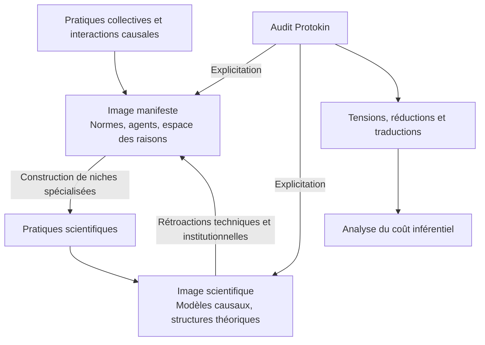

# L'image manifeste et l'image scientifique dans Protokin

## Introduction

L'une des questions centrales de toute enquête sur les descriptions consiste à comprendre comment plusieurs manières de décrire une même situation peuvent coexister sans être nécessairement incompatibles.

Une personne peut être décrite comme un locuteur responsable, comme un organisme biologique, comme un ensemble de processus neuronaux ou comme une position juridique. Ces descriptions ne mobilisent pas les mêmes concepts, ne poursuivent pas les mêmes finalités et n'engagent pas les mêmes critères d'évaluation au sein de leurs pratiques respectives.

Wilfrid Sellars a proposé de distinguer deux grandes formes d'intelligibilité :

- l'image manifeste (*manifest image*) ;
- l'image scientifique (*scientific image*).

Cette distinction occupe une place importante dans Protokin car elle permet de comprendre que les conflits descriptifs proviennent souvent d'une confusion ou d'un transfert illégitime entre des régimes de description hétérogènes plutôt que d'une opposition ontologique entre vérité et erreur.

Dans Protokin, l'image manifeste et l'image scientifique ne sont pas conçues comme deux mondes distincts ni comme deux strates de l'être en concurrence. Elles sont analysées comme deux trajectoires de stabilisation descriptive possédant leurs propres réseaux d'engagements, d'incompatibilités matérielles et de critères de correction.

---

# 1. Définition générale

## L'image manifeste

L'image manifeste désigne le cadre descriptif fondamental à partir duquel les locuteurs apprennent initialement à se situer et à s'évaluer les uns les autres au sein de l'espace des raisons.

Elle comprend notamment :

- les objets perceptibles ordinaires ;
- les personnes reconnues comme agents normatifs ;
- les attributions d'intentions, de croyances et d'engagements ;
- les responsabilités ;
- les institutions ;
- les pratiques collectives de justification.

C'est dans ce cadre que prennent sens des affirmations telles que :

- « cette table est solide » ;
- « ce locuteur est engagé par son affirmation » ;
- « cette promesse doit être tenue ».

L'image manifeste ne constitue ni une illusion subjective ni un simple sens commun préscientifique. Elle constitue le milieu même de l'intentionnalité collective et des pratiques prédicatives sans lesquelles aucune description — y compris scientifique — ne pourrait être articulée, transmise ou justifiée.

---

## L'image scientifique

L'image scientifique désigne l'ensemble des configurations descriptives générées par les sciences lorsqu'elles élaborent des postulats théoriques et des modèles explicatifs qui complexifient ou réorganisent l'expérience immédiate.

Elle mobilise notamment :

- des entités postulées non directement observables ;
- des inscriptions matérielles complexes ;
- des instruments de mesure ;
- des environnements de laboratoire ;
- des critères rigoureux de conséquence et d'incompatibilité matérielle.

Elle introduit des descriptions telles que :

- les structures moléculaires ;
- les processus neurobiologiques ;
- les interactions de champs physiques ;
- les mécanismes génétiques ;
- les modèles cosmologiques.

Ces descriptions se stabilisent à travers des niches de pratiques spécialisées où le coût inférentiel d'une révision est soutenu par un réseau d'instruments techniques, de procédures de validation et d'engagements collectifs spécifiques.

L'image scientifique est principalement orientée vers la modélisation des relations causales et des structures de constitution matérielle.

---

# 2. Le problème théorique auquel répond cette distinction

La distinction sellarsienne répond à une difficulté récurrente de l'histoire des savoirs, marquée par deux réductions symétriques.

---

## Première erreur : le réalisme scientifique naïf ou l'éliminativisme

Cette position décrète que seule l'image scientifique décrit ce qui existe « en réalité », reléguant l'image manifeste au rang d'illusion ou d'approximation commode.

Selon cette conception, les intentions, les engagements ou les responsabilités ne seraient « en réalité » que des trajectoires neurobiologiques ou des phénomènes physiques.

Cette réduction commet une erreur de catégorie.

Elle tente d'évaluer des descriptions appartenant à l'image manifeste à l'aide des critères de correction propres à l'image scientifique.

Elle détruit ainsi la structure même de l'espace des raisons, puisque des notions comme la responsabilité, la justification ou l'obligation ne possèdent pas d'équivalent direct dans le vocabulaire des sciences physiques.

---

## Deuxième erreur : l'anti-scientisme

À l'inverse, certaines approches considèrent que seules les descriptions ordinaires possèdent une véritable légitimité et traitent les descriptions scientifiques comme de simples constructions abstraites sans rapport avec le monde.

Cette position empêche de comprendre la puissance descriptive propre aux sciences ainsi que leur capacité à réorganiser durablement les pratiques collectives.

---

## L'intégration synoptique de Protokin

Protokin refuse ces deux réductions.

Dans une perspective proche de Sellars, Brandom, Rouse et Hacking, les deux images ne décrivent pas des réalités concurrentes.

Elles organisent des types différents de pratiques descriptives et de rapports à l'environnement.

L'objectif de l'audit n'est donc pas de choisir entre elles mais d'expliciter les conditions de leur articulation.

---

# 3. Traduction dans l'architecture Protokin

Dans Protokin, la distinction est retraduite sous la forme d'une analyse des régimes descriptifs et de leurs conditions de stabilisation.

L'image manifeste et l'image scientifique ne se distinguent pas par une différence de nature entre leurs objets.

Elles se distinguent par :

- les engagements descriptifs qu'elles autorisent ;
- les réseaux d'inférences qu'elles mobilisent ;
- les pratiques qui les stabilisent ;
- les institutions qui les maintiennent ;
- les coûts inférentiels associés à la transformation de leurs catégories.

Une même situation peut être décrite simultanément au sein de plusieurs régimes.

Les tensions apparaissent lorsque des locuteurs transfèrent des inférences d'un régime à un autre sans expliciter les conditions de cette traduction.

---

# 4. Modèle analytique

Dans l'architecture Protokin, la coévolution des deux images peut être représentée selon le schéma suivant :

L'objectif de l'audit n'est pas de mesurer un écart par rapport à un réel indépendant.

Il consiste à cartographier :

- la puissance descriptive spécifique de chaque régime ;
- ce qu'une description rend visible ;
- ce qu'elle laisse hors champ ;
- les conditions de traduction entre différents régimes ;
- le coût inférentiel des révisions descriptives.

---

# 5. Exemple : l'analyse de la responsabilité

Considérons l'affirmation :

> « Ce locuteur est engagé par sa signature. »

Dans l'image manifeste, cette description mobilise :

- des obligations ;
- des droits ;
- des justifications ;
- des critères de reconnaissance mutuelle ;
- des responsabilités collectives.

Sa fonction est de situer le locuteur dans un réseau d'engagements normatifs.

---

La même situation peut être décrite dans l'image scientifique à travers :

- l'activité neuronale ;
- les processus cognitifs ;
- les contraintes biologiques ;
- les mécanismes moteurs impliqués dans l'action.

Sa fonction est alors d'expliciter des régularités causales.

---

L'erreur consiste à vouloir remplacer une description par l'autre.

Décrire les mécanismes neuronaux d'une signature n'établit pas directement la validité d'un contrat.

Décrire la validité d'un contrat n'explique pas directement les mécanismes neuronaux impliqués dans l'acte de signer.

Les deux descriptions répondent à des questions différentes et s'appuient sur des critères de correction distincts.

---

# 6. L'image scientifique comme produit de l'image manifeste

Une idée fondamentale de Sellars, reprise par Brandom, Rouse et Protokin, consiste à rappeler que l'image scientifique n'existe jamais indépendamment des pratiques ordinaires.

Les scientifiques demeurent des locuteurs engagés dans des communautés de justification.

Ils doivent :

- discuter ;
- argumenter ;
- enseigner ;
- critiquer ;
- publier ;
- former des novices ;
- construire des instruments ;
- maintenir des institutions.

Autrement dit :

Image manifeste  
→ pratiques scientifiques  
→ image scientifique

L'image scientifique constitue une extension spécialisée de pratiques déjà ancrées dans l'espace des raisons.

Elle ne flotte jamais dans un vide conceptuel ou social.

---

# 7. Relations avec les autres dimensions de Protokin

## Causes et raisons

L'image manifeste constitue le milieu principal de l'espace des raisons :

- attribution d'engagements ;
- justification ;
- responsabilité ;
- normativité.

L'image scientifique est principalement orientée vers l'explicitation des relations causales et des structures de constitution matérielle.

Cependant, l'activité scientifique elle-même demeure une pratique de l'espace des raisons puisqu'elle implique :

- des justifications ;
- des critiques ;
- des engagements ;
- des procédures collectives d'évaluation.

La distinction entre causes et raisons ne recoupe donc pas exactement la distinction entre image manifeste et image scientifique.

---

## Ontologie historique

Les catégories de l'image scientifique comme celles de l'image manifeste possèdent une histoire.

L'ontologie historique étudie la manière dont certaines configurations descriptives émergent, se stabilisent, acquièrent un effet cliquet et finissent par transformer durablement les possibilités descriptives disponibles pour les locuteurs.

---

## Stabilisation et effet cliquet

L'image scientifique ne s'impose pas parce qu'elle révélerait une essence cachée du réel.

Elle se stabilise lorsqu'un ensemble de pratiques, d'instruments, d'institutions et de communautés de locuteurs rendent certaines descriptions plus facilement mobilisables que d'autres.

---

## Réductions et éclectisme

L'audit identifie deux tensions fréquentes :

- la réduction, qui cherche à dissoudre un régime dans un autre ;
- l'éclectisme, qui mélange des concepts issus de régimes distincts sans expliciter leurs conditions de compatibilité.

---

# 8. Limites et vigilance protokinienne

L'audit protokinien maintient une attention stricte sur la portée des descriptions.

Il refuse :

- le scientisme qui oublie les conditions normatives de possibilité de la science ;
- l'anti-scientisme qui ignore la puissance descriptive acquise par les pratiques scientifiques.

Aucune description n'est évaluée dans l'absolu.

Elle est toujours examinée relativement :

- au régime auquel elle appartient ;
- aux pratiques qui la stabilisent ;
- aux engagements qu'elle implique ;
- aux problèmes qu'elle permet ou non de résoudre.

---

# Conclusion

La distinction entre image manifeste et image scientifique permet de comprendre que les conflits descriptifs ne sont pas nécessairement des conflits entre le vrai et le faux.

Ils sont souvent des conflits entre des régimes d'intelligibilité distincts.

Son apport à Protokin est de fournir un cadre permettant d'analyser simultanément :

- les pratiques ordinaires ;
- les pratiques scientifiques ;
- leurs articulations ;
- leurs tensions ;
- leurs possibilités de traduction.

L'objectif n'est pas de choisir entre les deux images mais de comprendre comment elles participent ensemble à la constitution historique des espaces descriptifs dans lesquels les locuteurs agissent, justifient leurs engagements, transforment leurs pratiques et reconfigurent progressivement les conditions mêmes de ce qui peut être décrit.