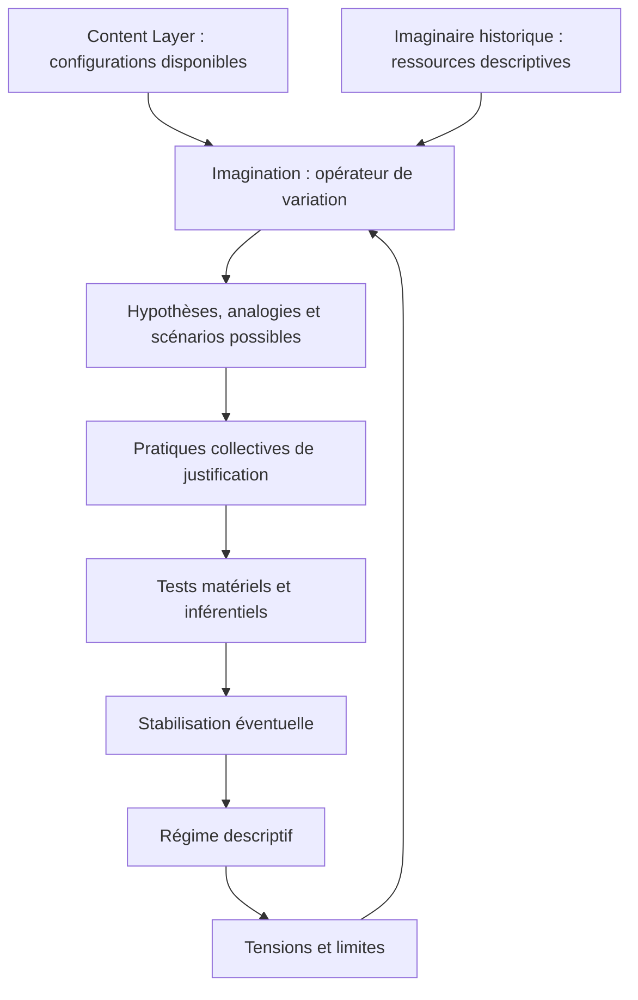

# Imagination et imaginaire dans Protokin

## Introduction

L'analyse des descriptions ne peut se limiter à l'étude des régimes déjà stabilisés. Toute pratique descriptive est également traversée par une capacité d'exploration, de variation et de projection qui permet d'envisager ce qui n'est pas encore établi, ce qui pourrait être autrement ou ce qui demeure seulement possible au sein d'un espace de raisons en transformation.

Cette capacité d'exploration conceptuelle est désignée sous le terme d'**imagination**, tandis que l'ensemble plus vaste des représentations, récits, symboles, analogies et configurations discursives collectivement disponibles à une époque donnée constitue l'**imaginaire**.

Dans de nombreuses traditions philosophiques, l'imagination est comprise comme une faculté psychologique individuelle, tandis que l'imaginaire est considéré comme un ensemble de représentations culturelles. Protokin évite ces conceptions réifiées : l'imagination et l'imaginaire ne sont pas des objets mentaux autonomes ni des domaines séparés du réel.

Ils sont analysés comme des dimensions internes aux pratiques descriptives par lesquelles les locuteurs explorent, testent, transforment ou stabilisent de nouvelles manières de décrire une configuration.

Dans Protokin :

- l'**imagination** désigne une fonction d'exploration et de variation descriptive ;
- l'**imaginaire** désigne l'ensemble historiquement constitué des ressources symboliques, narratives et conceptuelles disponibles pour produire ces variations.

---

# 1. Définition générale

## L'image

Une image est une configuration descriptive permettant de rendre présent, perceptible ou intelligible un aspect d'une situation.

Elle ne doit pas être comprise comme une copie passive d'un objet indépendant, mais comme une organisation sélective de l'expérience.

Une image peut être :

- perceptive ;
- graphique ;
- narrative ;
- scientifique ;
- technique ;
- symbolique.

Dans Protokin, une image constitue toujours une opération descriptive :

- elle sélectionne certains aspects d'une configuration ;
- elle organise un réseau d'inférences ;
- elle rend certaines propriétés visibles ;
- elle laisse nécessairement d'autres dimensions hors champ.

Une image possède donc une puissance descriptive relative à un régime donné.

---

## L'imagination

L'imagination désigne la capacité à produire, modifier, combiner ou explorer des configurations descriptives possibles qui ne sont pas encore stabilisées dans un régime établi.

Elle n'est pas une production arbitraire détachée des contraintes du monde.

Elle constitue un opérateur de variation qui travaille à partir :

- de descriptions existantes ;
- de tensions internes ;
- d'analogies disponibles ;
- de problèmes non résolus.

L'imagination permet notamment :

- d'anticiper des trajectoires possibles ;
- d'élaborer des hypothèses ;
- de produire des expériences de pensée ;
- de construire des modèles provisoires ;
- d'explorer des alternatives conceptuelles.

---

## L'imaginaire

L'imaginaire désigne l'ensemble des ressources descriptives historiquement disponibles dans une communauté de locuteurs.

Il comprend notamment :

- les récits ;
- les mythes ;
- les symboles ;
- les métaphores ;
- les modèles scientifiques ;
- les scénarios techniques ;
- les catégories héritées.

L'imaginaire n'est pas une réalité abstraite flottante.

Il est matérialisé par :

- des textes ;
- des institutions ;
- des œuvres ;
- des dispositifs techniques ;
- des pratiques collectives.

Il constitue l'arrière-plan historique à partir duquel certaines possibilités descriptives deviennent pensables.

---

# 2. Le problème théorique auquel répond ce concept

L'intégration de l'imagination et de l'imaginaire dans Protokin permet d'éviter deux réductions opposées.

## Première erreur : le fixisme descriptif

Cette position considère que seules les descriptions déjà stabilisées possèdent une valeur cognitive.

L'imagination est alors réduite à une activité secondaire, sans rôle réel dans la production des connaissances.

Une telle conception devient incapable d'expliquer :

- l'apparition de nouveaux concepts ;
- les innovations scientifiques ;
- les changements de paradigmes ;
- les transformations historiques des catégories.

Elle considère les régimes descriptifs comme des structures fixes plutôt que comme des processus historiques.

---

## Deuxième erreur : le constructivisme radical

À l'inverse, une conception excessive de l'imaginaire pourrait considérer que les descriptions produisent librement leurs propres objets indépendamment de toute contrainte.

Cette position oublie :

- les résistances matérielles ;
- les contraintes biologiques ;
- les institutions ;
- les pratiques techniques ;
- les exigences de justification.

Elle confond la possibilité d'imaginer une configuration avec sa capacité réelle à devenir un régime descriptif stabilisé.

---

## La position de Protokin

Protokin considère l'imagination comme une puissance d'exploration sous contraintes.

Elle ouvre des possibilités descriptives nouvelles, mais celles-ci doivent encore :

- rencontrer des pratiques collectives ;
- supporter des tests ;
- produire des inférences cohérentes ;
- s'inscrire dans des dispositifs matériels.

L'imaginaire fournit les ressources historiques ; l'imagination produit les variations ; les pratiques collectives décident des stabilisations possibles.

---

# 3. Traduction dans l'architecture Protokin

Dans Protokin, l'imagination n'est pas une faculté psychologique isolée.

Elle fonctionne comme un **opérateur de transition descriptive**.

Elle intervient lorsque les régimes existants rencontrent :

- des anomalies ;
- des tensions ;
- des incompatibilités ;
- des limites explicatives.

Elle permet alors :

- d'explorer de nouvelles configurations ;
- de reformuler un problème ;
- de modifier les engagements descriptifs ;
- de préparer une éventuelle transition de régime.

L'imaginaire constitue le fond historique à partir duquel cette exploration devient possible.

Les nouveaux régimes descriptifs ne surgissent jamais ex nihilo : ils héritent toujours de ressources symboliques, conceptuelles et techniques déjà disponibles.

---

# 4. Modèle analytique

Ce modèle montre que l'imagination participe à une boucle dynamique :

les régimes produisent des tensions ;

les tensions stimulent l'exploration imaginative ;

certaines variations deviennent stabilisées ;

ces stabilisations transforment l'espace des possibilités futures.

---

5. Exemple d'application : l'astronautique et le voyage spatial

Le passage du voyage spatial de la fiction à une pratique scientifique et technique illustre cette dynamique.

Phase 1 : ressource imaginaire

Pendant plusieurs siècles, le voyage vers la Lune appartient principalement à l'imaginaire collectif.

Les récits de Lucien de Samosate, Cyrano de Bergerac ou Jules Verne proposent des configurations descriptives qui explorent une possibilité sans disposer encore des conditions matérielles nécessaires à sa réalisation.

---

Phase 2 : variation imaginative

Avec Tsiolkovski ou Goddard, l'imagination transforme cette possibilité narrative en problème scientifique.

Elle combine :

des concepts physiques ;

des modèles mathématiques ;

des hypothèses techniques.

La possibilité imaginaire devient alors une configuration susceptible d'entrer dans un espace de justification scientifique.

---

Phase 3 : stabilisation descriptive

Avec le développement :

des laboratoires ;

des instruments ;

des institutions scientifiques ;

des programmes spatiaux ;

certaines descriptions acquièrent une stabilité technique et deviennent un régime descriptif autonome.

L'enjeu protokinien n'est pas de dire qu'une fiction était simplement « fausse » et qu'une théorie scientifique est simplement « vraie ».

L'analyse porte sur la transformation des engagements, des pratiques et des conditions matérielles qui permettent à une description de changer de statut.

---

6. Imagination, innovation et transition

L'imagination joue un rôle essentiel dans les transitions descriptives.

Lorsqu'un régime rencontre des difficultés persistantes, les ressources internes du système peuvent devenir insuffisantes.

Les locuteurs mobilisent alors :

des analogies ;

des métaphores ;

des expériences de pensée ;

des modèles provisoires.

L'histoire des sciences montre que de nombreuses innovations reposent sur cette capacité :

Maxwell utilisant une expérience de pensée avec son démon ;

Einstein imaginant courir à côté d'un rayon lumineux ;

Darwin construisant de nouvelles relations conceptuelles entre variation et sélection.

L'imagination constitue ainsi un espace d'essai permettant d'explorer des conséquences avant leur stabilisation matérielle.

---

7. Relations avec les autres dimensions de Protokin

Content Layer

Il fournit les configurations initiales à partir desquelles l'imagination opère ses variations.

Individuation

L'imagination participe aux phases de transformation où une nouvelle organisation descriptive émerge à partir d'une tension.

Ontologie historique

L'imaginaire possède une histoire.

Les ressources disponibles à une époque déterminent partiellement les possibilités descriptives accessibles aux locuteurs.

Image manifeste et image scientifique

L'imagination traverse les deux images :

dans l'image manifeste, elle produit des récits, des figures normatives et des représentations sociales ;

dans l'image scientifique, elle produit des modèles, des hypothèses et des constructions théoriques.

Transitions

Toute transition descriptive implique une capacité collective à envisager une autre organisation possible des engagements.

---

8. Limites et vigilance protokinienne : l'audit modal

L'audit protokinien maintient deux distinctions essentielles.

Une possibilité imaginée n'est pas encore une description stabilisée

Une hypothèse, une fiction ou un scénario ne possède pas automatiquement une validité.

Elle doit encore être confrontée :

aux contraintes matérielles ;

aux pratiques collectives ;

aux critères d'inférence ;

aux exigences de justification.

Une description stabilisée n'épuise pas toutes les possibilités

Un régime descriptif établi ne doit pas être confondu avec une clôture définitive.

L'imagination demeure nécessaire pour identifier ses limites et explorer ses transformations possibles.

L'imagination est donc comprise comme un opérateur modal : elle ouvre des possibilités sans garantir leur actualisation.

---

Conclusion

L'imagination et l'imaginaire occupent une fonction essentielle dans Protokin car ils permettent d'analyser la dimension dynamique des descriptions.

L'image correspond à une configuration descriptive stabilisée.

L'imagination correspond au mouvement de variation et d'exploration.

L'imaginaire correspond au fond historique de ressources dans lequel cette exploration puise.