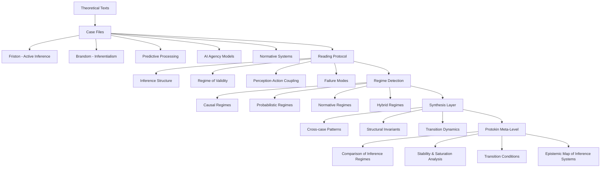

# Protokin — Inference Studies Lab

Protokin is a structured research environment for the comparative analysis of **inference regimes** across contemporary theories of cognition, agency, and normativity.

It does not propose a unified theory.

It provides a **meta-analytical framework** for studying how different systems construct, stabilize, and transform inference.

---

## 🎯 Objective

To analyze how theoretical systems define and organize:

- inference (causal, probabilistic, normative, embodied)
- perception-action coupling
- model-world relations
- normativity and justification
- conditions of failure, saturation, and transition

---

## 🧠 Core Idea

Different theories of cognition and inference do not compete on a single axis of truth.

They instantiate different:

> **regimes of inference stabilization**

Protokin studies the structure of these regimes and their transformations.

---

## 🧭 Global Architecture

---

📚 Structure of the Repository

/cases
    friston_active_inference.md
    brandom_inferentialism.md
    predictive_processing.md
    sellars_myth_of_the_given.md
    ai_agency_models.md
    normative_systems.md

/methods
    reading_protocol.md
    inference_analysis_template.md
    regime_detection.md

/synthesis
    cross_case_patterns.md
    proto_synthesis_notes.md

/docs
    introduction.md
    conceptual_map.md
    glossary.md

---

📖 Reading Protocol

Protokin operates through a structured exegesis method:

What is treated as inference?

What counts as valid inference?

How are perception and action coupled?

Where do failures emerge?

What stabilizes the system?

This allows comparison across heterogeneous frameworks.

---

⚠️ Methodological Position

Protokin is:

not a cognitive theory

not a unified model of intelligence

not a metaphysical system

It is:

> a comparative epistemology of inference regimes

---

🧩 Key Concepts

Inference Regime

A stabilized configuration of rules defining what counts as valid inference in a system.

Transition

A structural shift from one inference regime to another under constraint or saturation.

Saturation

A state where a regime can no longer absorb anomalies or maintain internal consistency.

Kernel (implicit function)

The analytical layer that observes and compares regime structures without producing a new theory.

---

📊 Output

The project produces:

> a structured epistemic map of contemporary inference systems