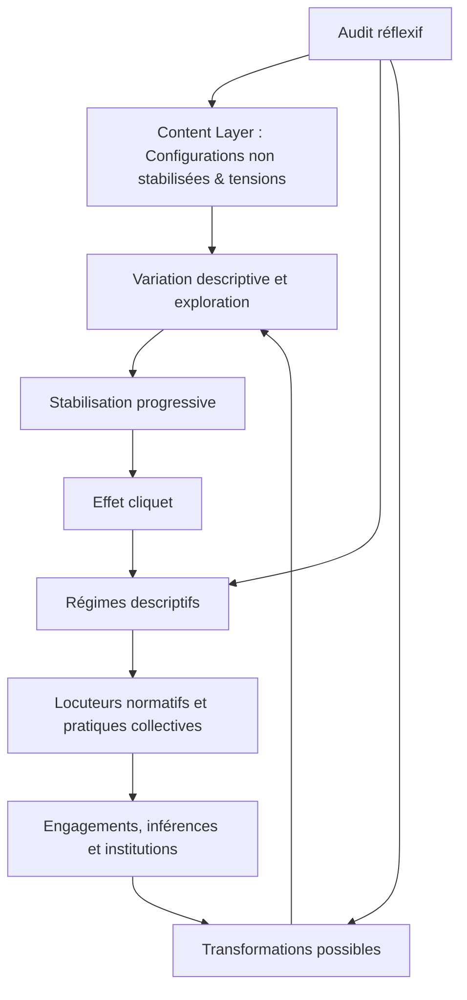
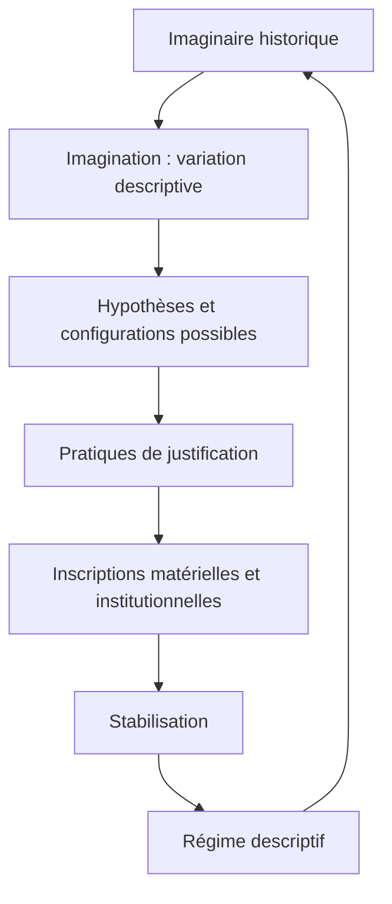

# Protokin

# Du mouvement des objets au mouvement des descriptions

> **Protokin est une métathéorie pragmatiste, inférentialiste et non-ontologique qui analyse les conditions normatives, matérielles et inférentielles sous lesquelles des descriptions deviennent intelligibles, recevables, stabilisées ou transformables au sein de pratiques collectives de justification et d'intervention.**

---

# Présentation générale

Protokin ne cherche pas à produire une description concurrente du monde, ni à proposer une nouvelle ontologie des objets existants.

Son objet n'est pas l'être en soi, mais le mouvement par lequel certaines configurations descriptives acquièrent une stabilité suffisante pour devenir des formes reconnues de connaissance, d'action et de coordination collective.

Protokin étudie les conditions sous lesquelles une description :

- devient intelligible dans un espace de raisons ;
- acquiert des critères de correction ;
- engage des conséquences inférentielles ;
- s'inscrit dans des pratiques matérielles et institutionnelles ;
- résiste à des perturbations ;
- transforme les possibilités futures de description.

Une description n'est donc jamais considérée comme un simple reflet passif d'une réalité préexistante.

Elle constitue une organisation située d'engagements, d'inférences, d'instruments et de pratiques permettant à une communauté de locuteurs de stabiliser un rapport déterminé à son environnement.

Le principe directeur de Protokin peut être formulé ainsi :

> **Un régime descriptif ne copie pas simplement un monde déjà constitué. Il configure les conditions sous lesquelles certains aspects du monde deviennent descriptibles, justifiables et transformables.**

---

# Statut théorique

## Une métathéorie réflexive

Protokin est une métathéorie.

Elle ne constitue :

- ni une ontologie cherchant les structures fondamentales de l'être ;
- ni une théorie scientifique positive portant sur un domaine empirique particulier ;
- ni une philosophie première cherchant un fondement absolu de la connaissance.

Elle constitue une architecture d'enquête visant à expliciter les conditions de production, de stabilisation et de transformation des descriptions.

Elle analyse les pratiques dans lesquelles des communautés de locuteurs :

- formulent des engagements ;
- établissent des critères de correction ;
- organisent des réseaux d'inférences ;
- construisent des instruments ;
- stabilisent des catégories ;
- transforment leurs propres cadres descriptifs.

---

## Refus du Mythe du Donné

Dans la continuité de Wilfrid Sellars, Protokin refuse l'idée selon laquelle il existerait un accès immédiat à des éléments possédant déjà une autorité justificative indépendante de toute pratique normative.

Aucune description ne reçoit sa validité d'un matériau brut antérieur à toute interprétation.

Cependant, ce refus du Donné ne signifie pas que les descriptions seraient libres ou arbitraires.

Les pratiques descriptives rencontrent des contraintes :

- résistances expérimentales ;
- contraintes matérielles ;
- incompatibilités logiques ;
- échecs prédictifs ;
- limites institutionnelles ;
- coûts de transformation.

Le monde n'est pas un tribunal extérieur fournissant une copie correcte à reproduire.

Il constitue un ensemble de résistances et de possibilités avec lesquelles les régimes descriptifs doivent composer.

---

# Origine du nom

Le terme **Protokin** articule deux dimensions fondamentales.

## Proto

Le préfixe **Proto** désigne ce qui précède une stabilisation définitive :

- configurations émergentes ;
- potentialités ;
- formes métastables ;
- processus de constitution ;
- conditions de possibilité.

Il ne désigne pas un état originel caché ou une essence primitive.

Il désigne une dimension de formation.

---

## Kin

Le suffixe **Kin** renvoie au mouvement :

- transitions ;
- transformations ;
- dynamiques ;
- circulations ;
- modifications d'engagements.

Protokin désigne donc l'étude du mouvement par lequel des configurations descriptives passent de formes instables à des formes stabilisées, puis éventuellement à de nouvelles transformations.

---

# Principes fondamentaux

# 1. Primauté du processus sur l'objet

Protokin reprend fonctionnellement l'intuition simondonienne de l'individuation :

> Les objets, concepts et catégories ne sont pas analysés comme des données premières, mais comme des stabilisations issues de processus métastables.

Un objet descriptif n'est pas le point de départ de l'analyse.

Il est le résultat provisoire d'une trajectoire comprenant :

- des tensions initiales ;
- des opérations de distinction ;
- des pratiques d'inscription ;
- des interactions collectives ;
- des mécanismes de stabilisation.

Ainsi, un concept scientifique, une catégorie juridique ou une personne reconnue comme agent normatif sont étudiés comme des formes stabilisées au sein de réseaux pratiques.

---

# 2. Les descriptions comme engagements normatifs

Décrire n'est pas simplement associer un mot à une chose.

Décrire constitue une pratique d'engagement.

Lorsqu'un locuteur produit une description, il entre dans un réseau d'implications qui détermine :

- ce qu'il doit pouvoir justifier ;
- quelles conséquences il accepte ;
- quelles inférences deviennent disponibles ;
- quelles incompatibilités apparaissent.

Dans une perspective inférentialiste inspirée notamment de Sellars et Brandom :

> **Comprendre une description ne consiste pas à posséder une représentation mentale correspondante, mais à maîtriser les engagements qu'elle introduit, les justifications qu'elle exige et les inférences qu'elle autorise.**

Une description possède donc une dimension normative.

Elle place le locuteur dans un espace d'obligations discursives.

---

# 3. Pluralité des régimes descriptifs

Protokin refuse deux réductions symétriques.

## Réductionnisme

Le réductionnisme cherche à remplacer un régime descriptif par un autre considéré comme fondamental.

Exemple :

Réduire entièrement la responsabilité humaine à des processus neurobiologiques.

Cette opération confond deux espaces différents :

- l'espace des causes ;
- l'espace des raisons.

Une explication causale peut être pertinente sans posséder les ressources normatives nécessaires pour remplacer une description en termes d'engagement ou de responsabilité.

---

## Relativisme radical

À l'inverse, Protokin refuse l'idée selon laquelle toutes les descriptions seraient équivalentes.

Les régimes descriptifs possèdent des puissances différentes selon :

- leurs capacités de prédiction ;
- leur densité inférentielle ;
- leur capacité de coordination ;
- leur résistance aux perturbations ;
- leur pouvoir d'intervention.

La pluralité des régimes n'implique donc pas leur égalité fonctionnelle.

---

# Architecture conceptuelle générale


```mermaid
flowchart TD

A[Content Layer : Configurations non stabilisées & tensions] 
--> B[Variation descriptive et exploration]

B --> C[Stabilisation progressive]

C --> D[Effet cliquet]

D --> E[Régimes descriptifs]

E --> F[Locuteurs normatifs et pratiques collectives]

F --> G[Engagements, inférences et institutions]

G --> H[Transformations possibles]

H --> B

I[Audit réflexif]
--> A

I --> E

I --> H
```

---

# Content Layer

Le Content Layer désigne le domaine initial de l'enquête.

Il ne correspond pas à un stock de données brutes préexistantes.

Il comprend :

- des configurations multiples ;

- des interactions matérielles ;

- des inscriptions ;

- des pratiques émergentes ;

- des tensions ;

- des possibilités descriptives non encore stabilisées.


Le Content Layer constitue le champ à partir duquel des régimes descriptifs peuvent émerger.

Il n'est pas encore organisé selon un vocabulaire normatif pleinement stabilisé.


---

# Régimes descriptifs

Un régime descriptif est une organisation stabilisée de pratiques permettant à une communauté de déterminer :

ce qui compte comme une description recevable ;

quelles inférences sont autorisées ;

quelles contradictions sont reconnues ;

quels instruments peuvent intervenir ;

quelles formes de justification sont acceptables.


Un régime descriptif comprend donc :

- un vocabulaire ;

- des règles d'inférence ;

- des institutions ;

- des pratiques matérielles ;

- des critères de correction.


Il n'est pas une simple théorie.

Il est une configuration pratique complète.


---

Locuteur

Dans Protokin, le locuteur n'est pas un sujet psychologique préalable.

Il désigne une position normative au sein d'une communauté de justification.

Être locuteur signifie pouvoir :

produire des engagements ;

répondre à des demandes de justification ;

reconnaître des conséquences ;

modifier ses positions ;

participer à un espace collectif de correction.


Le locuteur est une position produite par des pratiques sociales et discursives.


---

Causes et raisons

Protokin conserve la distinction sellarsienne entre deux dimensions irréductibles.

Espace des causes

Il comprend :

processus physiques ;

interactions biologiques ;

contraintes matérielles ;

mécanismes causaux.


Espace des raisons

Il comprend :

justifications ;

engagements ;

responsabilités ;

normes ;

inférences discursives.


Protokin refuse :

de dissoudre les raisons dans les causes ;

de séparer radicalement les raisons des conditions matérielles qui les rendent possibles.


L'enquête porte sur leur articulation pratique.

# Puissance descriptive

La puissance descriptive constitue l'un des concepts centraux de Protokin.

Elle ne désigne pas une propriété intrinsèque d'un énoncé isolé, ni une proximité supposée avec une réalité indépendante de toute description.

Elle désigne une propriété relationnelle entre :

- une configuration descriptive ;
- les pratiques qui la portent ;
- les réseaux d'inférences qu'elle organise ;
- les institutions qui la stabilisent ;
- les instruments matériels qui la rendent opératoire ;
- les transformations qu'elle permet.

Une description possède une puissance descriptive lorsqu'elle permet une stabilisation durable des engagements, une coordination collective efficace et une capacité accrue d'intervention sur les situations auxquelles elle s'applique.

La puissance descriptive peut être analysée selon plusieurs dimensions :

- densité inférentielle ;
- capacité projective ;
- résistance aux perturbations ;
- capacité de coordination ;
- puissance d'intervention ;
- aptitude à produire des transformations.

---

# Dimensions de la puissance descriptive

## Densité inférentielle

Une description possède une forte densité inférentielle lorsqu'elle permet d'organiser un nombre important de conséquences compatibles dans un réseau cohérent.

La densité inférentielle ne correspond pas simplement à la quantité d'informations contenues dans une description.

Elle désigne la richesse des relations qu'elle établit entre :

- concepts ;
- observations ;
- pratiques ;
- instruments ;
- décisions.

Une théorie scientifique possède ainsi une forte densité inférentielle lorsqu'elle permet :

- de formuler des prédictions ;
- de construire des modèles ;
- d'établir des relations quantitatives ;
- d'orienter des interventions techniques.

---

## Capacité projective

Une description possède une capacité projective lorsqu'elle permet d'anticiper des configurations futures.

Cette projection ne signifie pas une prédiction absolue.

Elle désigne la capacité d'une description à produire des attentes suffisamment robustes pour guider une action collective.

Exemples :

- un modèle climatique permettant d'anticiper des évolutions probables ;
- une théorie physique permettant de prévoir des phénomènes ;
- un cadre juridique permettant d'anticiper les conséquences d'un acte.

---

## Résistance aux perturbations

Une description stabilisée doit pouvoir maintenir sa cohérence face à des perturbations.

Ces perturbations peuvent être :

- empiriques ;
- conceptuelles ;
- institutionnelles ;
- techniques.

La résistance n'est pas une preuve métaphysique de vérité.

Elle indique la capacité d'un régime descriptif à intégrer des contraintes nouvelles sans perdre son organisation fondamentale.

---

## Puissance d'intervention

Une description possède une puissance d'intervention lorsqu'elle permet de transformer effectivement une situation.

Cette dimension est particulièrement visible dans les sciences et les techniques.

Une description scientifique n'est pas seulement une manière de représenter.

Elle devient un dispositif permettant :

- de construire ;
- de modifier ;
- de contrôler ;
- d'expérimenter.

---

# Clause de pluralité des finalités

La puissance descriptive ne possède pas une mesure universelle unique.

Chaque régime descriptif répond à des contraintes et des objectifs spécifiques.

Une description peut être extrêmement puissante dans un domaine et inadéquate dans un autre.

Ainsi :

## L'image scientifique est particulièrement adaptée pour :

- modéliser ;
- calculer ;
- prévoir ;
- intervenir matériellement.

## L'image manifeste est particulièrement adaptée pour :

- comprendre l'action humaine ;
- attribuer des responsabilités ;
- organiser des relations sociales ;
- maintenir des engagements normatifs.

L'asymétrie entre régimes ne signifie donc pas qu'un régime élimine tous les autres.

Elle signifie que les régimes possèdent des puissances différentielles selon leurs finalités.

---

# Images du monde et régimes descriptifs

La distinction entre Image manifeste et Image scientifique, héritée de Wilfrid Sellars, occupe une place centrale dans Protokin.

Elle permet d'analyser comment différentes formes d'intelligibilité peuvent coexister sans être réduites les unes aux autres.

Ces Images ne désignent pas deux mondes séparés.

Elles désignent deux grandes trajectoires historiques de stabilisation descriptive.

---

# Image manifeste

L'Image manifeste désigne le cadre descriptif dans lequel les locuteurs se reconnaissent mutuellement comme agents normatifs.

Elle comprend notamment :

- les personnes ;
- les intentions ;
- les croyances ;
- les responsabilités ;
- les institutions ;
- les engagements sociaux.

Elle constitue le milieu de l'espace des raisons.

C'est dans cette Image que prennent sens des affirmations comme :

> Cette personne a promis de respecter son engagement.

ou :

> Ce locuteur est responsable de son affirmation.

Ces descriptions ne sont pas de simples impressions subjectives.

Elles constituent les structures normatives nécessaires à toute pratique collective de justification.

---

# Image scientifique

L'Image scientifique désigne les régimes descriptifs produits par les sciences lorsqu'elles construisent des modèles théoriques et expérimentaux permettant d'organiser des relations causales.

Elle comprend :

- entités théoriques ;
- modèles mathématiques ;
- structures physiques ;
- mécanismes biologiques ;
- dispositifs expérimentaux.

Elle développe principalement des descriptions appartenant à l'espace des causes.

Exemples :

- structures moléculaires ;
- processus neurobiologiques ;
- interactions physiques ;
- modèles cosmologiques.

---

# Relation entre Image manifeste et Image scientifique

Protokin refuse deux erreurs symétriques.

## Scientisme réductionniste

Cette position considère que seule l'Image scientifique décrit réellement le monde.

Elle tend à réduire :

- les intentions ;
- les responsabilités ;
- les engagements ;

à de simples processus causaux.

Cette réduction commet une erreur de catégorie.

Les descriptions normatives ne sont pas invalidées par des descriptions causales.

---

## Anti-scientisme

Cette position considère que les descriptions scientifiques seraient artificielles ou secondaires.

Elle devient incapable d'expliquer leur puissance exceptionnelle de prédiction et d'intervention.

---

# Position protokinienne

Protokin soutient une articulation synoptique :

> Les différentes Images ne sont pas des concurrents ontologiques. Elles sont des régimes descriptifs distincts possédant des critères de correction, des engagements et des finalités spécifiques.

L'enjeu n'est pas de choisir une Image unique.

L'enjeu est d'analyser leurs conditions d'articulation, leurs tensions et leurs transformations.

---

# Objet descriptif

Dans Protokin, un objet n'est pas considéré comme une chose entièrement constituée avant toute description.

Il est analysé comme un invariant stabilisé au sein d'un régime descriptif.

Un objet descriptif apparaît lorsqu'une communauté parvient à maintenir une convergence suffisamment robuste entre :

- observations ;
- concepts ;
- instruments ;
- pratiques ;
- procédures de justification.

L'objet n'est donc :

- ni une invention arbitraire ;
- ni une copie passive du monde.

Il est une stabilisation dynamique sous contraintes.

---

# Objet scientifique et invariant

L'objet scientifique peut être compris comme un invariant produit par une trajectoire collective de stabilisation.

Il résulte d'une convergence entre :

- modèles théoriques ;
- expériences ;
- instruments ;
- institutions ;
- communautés scientifiques.

Cette approche rejoint certaines intuitions de la cybernétique de second ordre :

l'objet apparaît dans une relation de couplage entre un système observant et un environnement contraignant.

---

# Von Foerster : objet comme valeur propre du couplage

La notion de valeur propre permet de préciser cette conception.

Un objet scientifique peut être compris comme :

> une stabilité émergente dans la relation entre un système descriptif et son environnement.

L'objet n'est pas produit arbitrairement par l'observateur.

Il apparaît comme une solution stable dans un réseau de contraintes réciproques.

---

# L'observateur dans la science

L'objectivité scientifique implique souvent un effacement méthodologique de l'observateur.

Protokin interprète cet effacement non comme une disparition réelle du sujet connaissant, mais comme une opération permettant :

- la reproductibilité ;
- la comparaison ;
- la circulation des résultats ;
- la construction d'invariants trans-personnels.

Ainsi :

> L'objectivité scientifique n'est pas l'absence d'observateur. Elle est une organisation particulière de sa position dans un régime descriptif.

---

Voici la Partie 3/4 du fichier README.md complet, en Markdown copiable.

# Imagination et imaginaire

L'analyse des descriptions ne peut se limiter aux régimes déjà stabilisés.

Toute pratique descriptive possède également une dimension prospective : elle peut explorer des configurations qui ne sont pas encore établies, tester des alternatives et produire de nouvelles possibilités conceptuelles.

Protokin distingue deux dimensions complémentaires :

- **l'imagination** comme fonction de variation descriptive ;
- **l'imaginaire** comme réservoir historique de ressources symboliques, narratives et conceptuelles.

Ces deux dimensions ne sont pas considérées comme des facultés psychologiques isolées ou comme des mondes mentaux autonomes.

Elles constituent des fonctions immanentes aux pratiques descriptives.

---

# L'image

Une image désigne une configuration descriptive localement stabilisée.

Elle n'est pas une copie passive d'un objet extérieur.

Elle constitue une opération de sélection et d'organisation qui :

- rend certains aspects visibles ;
- établit des relations ;
- définit des points d'ancrage ;
- ouvre certaines inférences ;
- maintient d'autres éléments hors champ.

Toute image possède donc une dimension normative.

Elle organise une manière déterminée de rendre une situation intelligible.

---

# L'imagination comme opérateur de variation

L'imagination désigne la capacité d'une communauté de locuteurs à produire, modifier ou combiner des configurations descriptives possibles.

Elle n'est pas une production arbitraire de mondes fictifs.

Elle travaille à partir de contraintes existantes :

- concepts hérités ;
- tensions internes ;
- anomalies ;
- pratiques disponibles ;
- instruments existants.

L'imagination intervient notamment pour :

- formuler des hypothèses ;
- construire des modèles provisoires ;
- produire des expériences de pensée ;
- explorer des alternatives conceptuelles ;
- anticiper des trajectoires possibles.

Elle constitue un opérateur de transition descriptive.

---

# L'imaginaire comme réservoir historique

L'imaginaire désigne l'ensemble des ressources descriptives disponibles dans une communauté historique.

Il comprend :

- récits ;
- symboles ;
- métaphores ;
- analogies ;
- modèles culturels ;
- scénarios techniques ;
- catégories héritées.

L'imaginaire n'est pas une sphère indépendante.

Il est matérialisé dans :

- textes ;
- institutions ;
- œuvres ;
- dispositifs techniques ;
- pratiques collectives.

Il fournit les ressources à partir desquelles l'imagination produit des variations.

---

# Relation entre imagination et stabilisation

Une nouvelle description n'apparaît jamais ex nihilo.

Elle suit une trajectoire :


```mermaid
flowchart TD

A[Imaginaire historique]
--> B[Imagination : variation descriptive]

B
--> C[Hypothèses et configurations possibles]

C
--> D[Pratiques de justification]

D
--> E[Inscriptions matérielles et institutionnelles]

E
--> F[Stabilisation]

F
--> G[Régime descriptif]

G
--> A
```

Une possibilité issue de l'imaginaire peut progressivement devenir :

une hypothèse ;

un modèle ;

une pratique reconnue ;

un régime descriptif stabilisé.


---

Exemple : le voyage spatial

L'histoire du voyage spatial illustre cette dynamique.

Phase imaginaire

Pendant longtemps, le voyage vers la Lune appartient principalement aux récits :

mythologiques ;

littéraires ;

spéculatifs.


Ces descriptions existent comme possibilités narratives.

Elles ne disposent cependant pas encore des infrastructures matérielles nécessaires à leur stabilisation scientifique.


---

Phase imaginative

Avec l'apparition de la physique moderne et de l'ingénierie spatiale, certaines ressources imaginaires sont transformées.

Des chercheurs combinent :

lois physiques ;

calculs ;

modèles mathématiques ;

dispositifs techniques.


La possibilité narrative devient une configuration scientifique testable.


---

Phase de stabilisation

Avec :

laboratoires ;

institutions ;

instruments ;

procédures expérimentales ;


le voyage spatial devient un régime descriptif et technique autonome.

L'enjeu protokinien n'est pas de dire que les récits anciens étaient simplement « faux ».

Il consiste à analyser la transformation des conditions de justification qui ont permis le passage d'une configuration imaginative à une stabilisation technique.


---

Dynamique génétique des régimes descriptifs

Les régimes descriptifs ne sont pas éternels.

Ils suivent des trajectoires de formation, de maintenance et de transformation.

flowchart TD

A[Configuration non stabilisée]
--> B[Tension ou anomalie]

B
--> C[Variation imaginative]

C
--> D[Nouvelle organisation conceptuelle]

D
--> E[Justification collective]

E
--> F[Couplage matériel]

F
--> G[Stabilisation]

G
--> H[Effet cliquet]

H
--> I[Régime descriptif]
```

---

Stabilisation

La stabilisation désigne le processus par lequel une configuration descriptive acquiert une cohérence suffisante pour être maintenue collectivement.

Elle implique :

des engagements partagés ;

des critères de correction ;

des pratiques institutionnelles ;

des instruments ;

des habitudes collectives.


Une description stabilisée devient une ressource pour de futures descriptions.


---

Effet cliquet

L'effet cliquet désigne le seuil à partir duquel une description stabilisée acquiert une densité suffisante d'engagements, d'instruments, d'usages collectifs et d'inférences héritées pour que toute transformation ultérieure doive intégrer l'héritage du régime précédent.

L'effet cliquet ne signifie pas qu'une description devient impossible à abandonner.

Il signifie que les transformations futures ne peuvent plus repartir d'un point zéro.

Elles doivent composer avec :

les concepts hérités ;

les instruments construits ;

les institutions existantes ;

les engagements accumulés.


La stabilisation produit donc une historicité cumulative.


---

Transitions descriptives

Une transition descriptive apparaît lorsqu'un régime rencontre des tensions qu'il ne peut plus résoudre uniquement avec ses propres ressources.

Ces tensions peuvent être :

anomalies empiriques ;

contradictions internes ;

nouveaux besoins pratiques ;

limitations institutionnelles.


La transition ne consiste pas simplement à remplacer une erreur par une vérité.

Elle implique une transformation du réseau complet :

concepts ;

instruments ;

critères ;

pratiques ;

engagements.


---

Le coût inférentiel des transitions

Modifier une description stabilisée possède un coût.

Ce coût comprend :

abandon d'inférences établies ;

transformation des pratiques ;

reconstruction institutionnelle ;

apprentissage de nouveaux critères.


Une transition réussie ne supprime pas simplement un régime antérieur.

Elle réorganise son héritage.


---

Théories abandonnées et historicité

Certaines théories scientifiques ont été historiquement très puissantes avant d'être abandonnées.

Exemples :

théorie du phlogistique ;

éther luminifère.


Protokin ne conclut pas que ces théories étaient simplement dépourvues de valeur.

Elles possédaient une puissance descriptive réelle dans un régime historique déterminé.

Leur transformation indique que :

les contraintes ont changé ;

les réseaux inférentiels se sont reconfigurés ;

de nouvelles stabilisations sont apparues.


Une description peut donc être historiquement puissante sans être éternellement stabilisée.


---

Individuation descriptive

L'individuation désigne le processus par lequel une configuration nouvelle acquiert une identité relativement stable.

Dans Protokin, l'individuation concerne :

objets ;

concepts ;

catégories ;

pratiques.


Elle n'est pas une apparition ex nihilo.

Elle correspond à une résolution progressive de tensions au sein d'un champ métastable.

Une nouvelle forme apparaît lorsque :

certaines contraintes convergent ;

des relations deviennent stables ;

une communauté reconnaît une nouvelle organisation descriptive.

---

Voici la Partie 4/4 du fichier README.md complet, en Markdown copiable.

# Audit protokinien

L'audit constitue la méthode générale d'enquête de Protokin.

Il ne vise pas à produire une nouvelle description concurrente du monde.

Il vise à expliciter les conditions selon lesquelles une description acquiert une stabilité, une puissance et une capacité de transformation.

L'audit analyse :

- les régimes descriptifs impliqués ;
- les engagements qu'ils produisent ;
- les réseaux d'inférences qu'ils organisent ;
- les contraintes matérielles auxquelles ils répondent ;
- les tensions qui peuvent conduire à leur transformation.

---

# Questions fondamentales de l'audit

Toute enquête protokinienne peut être structurée autour de plusieurs questions :

## 1. Quel régime descriptif est mobilisé ?

Il s'agit d'identifier :

- le vocabulaire utilisé ;
- les pratiques associées ;
- les critères de correction ;
- les institutions qui le soutiennent.

---

## 2. Quels engagements sont produits ?

Toute description place le locuteur dans un réseau normatif.

L'audit examine :

- quelles conséquences sont acceptées ;
- quelles justifications sont nécessaires ;
- quelles incompatibilités apparaissent.

---

## 3. Quelles contraintes matérielles interviennent ?

Une description n'existe jamais indépendamment des conditions matérielles qui la rendent possible.

L'audit analyse :

- instruments ;
- inscriptions ;
- dispositifs techniques ;
- environnements pratiques.

---

## 4. Quelles transitions sont possibles ?

Lorsqu'un régime rencontre des tensions, l'audit étudie :

- les possibilités de révision ;
- les coûts de transformation ;
- les nouvelles stabilisations envisageables.

---

# Diagnostics protokiniens

L'audit permet notamment d'identifier plusieurs types de tensions.

---

# Réduction

La réduction apparaît lorsqu'un régime descriptif tente d'absorber entièrement un autre régime.

Exemples :

- réduire les raisons aux causes ;
- réduire les normes aux mécanismes physiques ;
- réduire les pratiques historiques à des structures fixes.

La réduction ignore les conditions spécifiques de validité propres à chaque régime.

---

# Éclectisme

L'éclectisme apparaît lorsqu'un raisonnement mélange plusieurs régimes descriptifs sans expliciter les règles de transition entre eux.

Exemple :

Utiliser simultanément :

- un vocabulaire causal ;
- un vocabulaire normatif ;
- un vocabulaire symbolique ;

sans préciser comment ces descriptions s'articulent.

L'éclectisme produit une confusion des niveaux d'analyse.

---

# Transposition illégitime

Une transposition illégitime consiste à déplacer les critères de correction d'un régime vers un autre.

Exemple :

Demander à une explication neurobiologique de remplacer directement une justification morale.

La description causale peut expliquer les conditions matérielles d'une action.

Elle ne remplace pas automatiquement le cadre normatif dans lequel cette action est évaluée.

---

# Réflexivité

Protokin s'applique à ses propres descriptions.

Il ne constitue pas un point de vue extérieur aux régimes descriptifs qu'il analyse.

Ses propres concepts :

- régime descriptif ;
- stabilisation ;
- puissance descriptive ;
- transition ;
- audit ;

sont eux-mêmes des constructions historiques produites dans un espace de raisons particulier.

Ils restent donc soumis aux mêmes exigences que les autres descriptions :

- explicitation des engagements ;
- cohérence inférentielle ;
- capacité explicative ;
- exposition aux critiques ;
- possibilité de révision.

La métathéorie protokinienne n'est pas un tribunal extérieur du savoir.

Elle constitue une pratique réflexive d'explicitation des conditions par lesquelles des descriptions deviennent intelligibles, recevables et transformables.

---

# Position philosophique générale

Protokin adopte une position intermédiaire entre deux erreurs symétriques.

---

# Refus du réalisme métaphysique naïf

Protokin refuse l'idée selon laquelle :

> Le monde posséderait une structure intrinsèque unique que les descriptions auraient simplement pour fonction de copier.

Les descriptions ne sont pas des miroirs passifs.

Elles constituent des pratiques organisées de stabilisation.

---

# Refus du relativisme radical

Protokin refuse également l'idée selon laquelle :

> Toutes les descriptions se vaudraient parce qu'elles seraient de simples constructions arbitraires.

Les descriptions rencontrent des contraintes.

Certaines développent des puissances supérieures dans certains domaines :

- prédiction ;
- coordination ;
- intervention ;
- résistance aux perturbations.

---

# Principe protokinien général

La position de Protokin peut être formulée ainsi :

> **Les descriptions ne sont pas des copies du monde ni des inventions arbitraires. Elles sont des stabilisations historiques et matérielles produites dans des pratiques collectives contraintes, dont la puissance dépend des réseaux d'inférences, des instruments, des institutions et des transformations qu'elles rendent possibles.**

---

# Organisation du projet

```text
protokin/

├── 01_statut/
│   ├── en_une_phrase.md
│   ├── statut.md
│   └── protokin.md

├── 02_architecture_conceptuelle/
│   ├── architecture.md
│   ├── regimes.md
│   ├── content_layer.md
│   ├── engagements.md
│   ├── causes_raisons.md
│   ├── locuteur.md
│   ├── stabilisation.md
│   └── objets_descriptifs.md

├── 03_methode_enquete/
│   └── audit.md

├── 04_diagnostics/
│   ├── tensions.md
│   ├── reductions.md
│   └── eclectisme.md

├── 05_transformations/
│   ├── transitions.md
│   ├── traductions.md
│   └── validite.md

├── 06_puissance_descriptive/
│   ├── puissance_descriptive.md
│   ├── image_manifeste_scientifique.md
│   ├── image_scientifique.md
│   └── imagination_imaginaire.md

├── 07_heritages_philosophiques/
│   ├── pragmatisme.md
│   ├── individuation.md
│   └── ontologie_historique.md

├── 08_reflexivite/
│   └── reflexivite.md

├── 09_applications/
│   └── geocentrisme_heliocentrisme.md

└── glossaire.md


---

Héritages philosophiques

Protokin dialogue notamment avec :

Wilfrid Sellars

Pour :

la critique du Mythe du Donné ;

la distinction espace des causes / espace des raisons ;

la nature normative des concepts.


---

Robert Brandom

Pour :

l'inférentialisme ;

la théorie des engagements discursifs ;

le rôle du scorekeeping dans les communautés de locuteurs.


---

Joseph Rouse

Pour :

l'articulation entre pratiques scientifiques et normes ;

la science comme activité située ;

la critique des représentations purement contemplatives.


---

Ian Hacking

Pour :

l'ontologie historique ;

la stabilisation des catégories ;

la relation entre concepts, pratiques et institutions.


---

Gilbert Simondon

Pour :

l'individuation ;

la métastabilité ;

les processus de formation plutôt que les substances fixes.


---

Heinz von Foerster

Pour :

la cybernétique de second ordre ;

la place de l'observateur ;

les invariants produits dans les couplages.


---

Conclusion

Protokin propose une analyse du mouvement des descriptions.

Il ne cherche pas à déterminer ce que le monde est indépendamment de toute pratique descriptive.

Il étudie comment certaines configurations deviennent :

intelligibles ;

justifiables ;

stabilisées ;

transmissibles ;

transformables.


Une description est toujours une relation entre :

des locuteurs ;

des pratiques ;

des institutions ;

des instruments ;

des contraintes matérielles ;

des possibilités futures.


Le monde n'est pas simplement découvert à travers des descriptions.

Mais les descriptions ne sont pas non plus de simples constructions arbitraires.

Elles sont des formes historiques de stabilisation qui rendent possibles certaines manières de comprendre, d'agir et de transformer notre environnement.

Le principe fondamental de Protokin demeure :

> Une description ne révèle pas simplement un monde déjà constitué. Elle participe aux conditions par lesquelles un monde devient descriptivement accessible.


Le `README.md` complet est maintenant assemblé en quatre parties continues. Il est cohérent avec l'architecture actuelle de Protokin et peut servir de fichier racine GitHub, tandis que `index.md` peut conserver son rôle de portail encyclopédique Docsify.