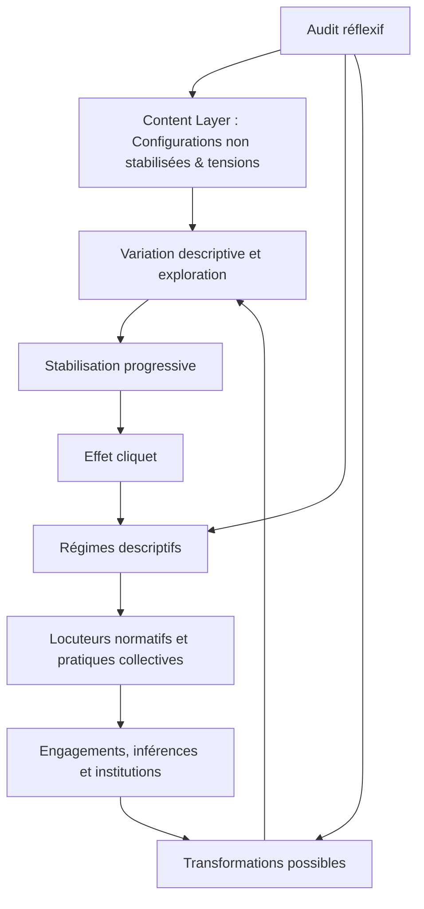

# Protokin

# Du mouvement des objets au mouvement des descriptions

> **Protokin est une métathéorie pragmatiste, inférentialiste et non-ontologique qui analyse les conditions normatives, matérielles et inférentielles sous lesquelles des descriptions deviennent intelligibles, recevables, stabilisées ou transformables au sein de pratiques collectives de justification et d'intervention.**

---

# Présentation générale

Protokin ne cherche pas à produire une description concurrente du monde, ni à proposer une nouvelle ontologie des objets existants.

Son objet n'est pas l'être en soi, mais le mouvement par lequel certaines configurations descriptives acquièrent une stabilité suffisante pour devenir des formes reconnues de connaissance, d'action et de coordination collective.

Protokin étudie les conditions sous lesquelles une description :

- devient intelligible dans un espace de raisons ;
- acquiert des critères de correction ;
- engage des conséquences inférentielles ;
- s'inscrit dans des pratiques matérielles et institutionnelles ;
- résiste à des perturbations ;
- transforme les possibilités futures de description.

Une description n'est donc jamais considérée comme un simple reflet passif d'une réalité préexistante.

Elle constitue une organisation située d'engagements, d'inférences, d'instruments et de pratiques permettant à une communauté de locuteurs de stabiliser un rapport déterminé à son environnement.

Le principe directeur de Protokin peut être formulé ainsi :

> **Un régime descriptif ne copie pas simplement un monde déjà constitué. Il configure les conditions sous lesquelles certains aspects du monde deviennent descriptibles, justifiables et transformables.**

---

# Statut théorique

## Une métathéorie réflexive

Protokin est une métathéorie.

Elle ne constitue :

- ni une ontologie cherchant les structures fondamentales de l'être ;
- ni une théorie scientifique positive portant sur un domaine empirique particulier ;
- ni une philosophie première cherchant un fondement absolu de la connaissance.

Elle constitue une architecture d'enquête visant à expliciter les conditions de production, de stabilisation et de transformation des descriptions.

Elle analyse les pratiques dans lesquelles des communautés de locuteurs :

- formulent des engagements ;
- établissent des critères de correction ;
- organisent des réseaux d'inférences ;
- construisent des instruments ;
- stabilisent des catégories ;
- transforment leurs propres cadres descriptifs.

---

## Refus du Mythe du Donné

Dans la continuité de Wilfrid Sellars, Protokin refuse l'idée selon laquelle il existerait un accès immédiat à des éléments possédant déjà une autorité justificative indépendante de toute pratique normative.

Aucune description ne reçoit sa validité d'un matériau brut antérieur à toute interprétation.

Cependant, ce refus du Donné ne signifie pas que les descriptions seraient libres ou arbitraires.

Les pratiques descriptives rencontrent des contraintes :

- résistances expérimentales ;
- contraintes matérielles ;
- incompatibilités logiques ;
- échecs prédictifs ;
- limites institutionnelles ;
- coûts de transformation.

Le monde n'est pas un tribunal extérieur fournissant une copie correcte à reproduire.

Il constitue un ensemble de résistances et de possibilités avec lesquelles les régimes descriptifs doivent composer.

---

# Origine du nom

Le terme **Protokin** articule deux dimensions fondamentales.

## Proto

Le préfixe **Proto** désigne ce qui précède une stabilisation définitive :

- configurations émergentes ;
- potentialités ;
- formes métastables ;
- processus de constitution ;
- conditions de possibilité.

Il ne désigne pas un état originel caché ou une essence primitive.

Il désigne une dimension de formation.

---

## Kin

Le suffixe **Kin** renvoie au mouvement :

- transitions ;
- transformations ;
- dynamiques ;
- circulations ;
- modifications d'engagements.

Protokin désigne donc l'étude du mouvement par lequel des configurations descriptives passent de formes instables à des formes stabilisées, puis éventuellement à de nouvelles transformations.

---

# Principes fondamentaux

# 1. Primauté du processus sur l'objet

Protokin reprend fonctionnellement l'intuition simondonienne de l'individuation :

> Les objets, concepts et catégories ne sont pas analysés comme des données premières, mais comme des stabilisations issues de processus métastables.

Un objet descriptif n'est pas le point de départ de l'analyse.

Il est le résultat provisoire d'une trajectoire comprenant :

- des tensions initiales ;
- des opérations de distinction ;
- des pratiques d'inscription ;
- des interactions collectives ;
- des mécanismes de stabilisation.

Ainsi, un concept scientifique, une catégorie juridique ou une personne reconnue comme agent normatif sont étudiés comme des formes stabilisées au sein de réseaux pratiques.

---

# 2. Les descriptions comme engagements normatifs

Décrire n'est pas simplement associer un mot à une chose.

Décrire constitue une pratique d'engagement.

Lorsqu'un locuteur produit une description, il entre dans un réseau d'implications qui détermine :

- ce qu'il doit pouvoir justifier ;
- quelles conséquences il accepte ;
- quelles inférences deviennent disponibles ;
- quelles incompatibilités apparaissent.

Dans une perspective inférentialiste inspirée notamment de Sellars et Brandom :

> **Comprendre une description ne consiste pas à posséder une représentation mentale correspondante, mais à maîtriser les engagements qu'elle introduit, les justifications qu'elle exige et les inférences qu'elle autorise.**

Une description possède donc une dimension normative.

Elle place le locuteur dans un espace d'obligations discursives.

---

# 3. Pluralité des régimes descriptifs

Protokin refuse deux réductions symétriques.

## Réductionnisme

Le réductionnisme cherche à remplacer un régime descriptif par un autre considéré comme fondamental.

Exemple :

Réduire entièrement la responsabilité humaine à des processus neurobiologiques.

Cette opération confond deux espaces différents :

- l'espace des causes ;
- l'espace des raisons.

Une explication causale peut être pertinente sans posséder les ressources normatives nécessaires pour remplacer une description en termes d'engagement ou de responsabilité.

---

## Relativisme radical

À l'inverse, Protokin refuse l'idée selon laquelle toutes les descriptions seraient équivalentes.

Les régimes descriptifs possèdent des puissances différentes selon :

- leurs capacités de prédiction ;
- leur densité inférentielle ;
- leur capacité de coordination ;
- leur résistance aux perturbations ;
- leur pouvoir d'intervention.

La pluralité des régimes n'implique donc pas leur égalité fonctionnelle.

---

# Architecture conceptuelle générale

```mermaid
flowchart TD

A[Content Layer : Configurations non stabilisées & tensions] 
--> B[Variation descriptive et exploration]

B --> C[Stabilisation progressive]

C --> D[Effet cliquet]

D --> E[Régimes descriptifs]

E --> F[Locuteurs normatifs et pratiques collectives]

F --> G[Engagements, inférences et institutions]

G --> H[Transformations possibles]

H --> B

I[Audit réflexif]
--> A

I --> E

I --> H
```

---

Content Layer

Le Content Layer désigne le domaine initial de l'enquête.

Il ne correspond pas à un stock de données brutes préexistantes.

Il comprend :

des configurations multiples ;

des interactions matérielles ;

des inscriptions ;

des pratiques émergentes ;

des tensions ;

des possibilités descriptives non encore stabilisées.

Le Content Layer constitue le champ à partir duquel des régimes descriptifs peuvent émerger.

Il n'est pas encore organisé selon un vocabulaire normatif pleinement stabilisé.

---

Régimes descriptifs

Un régime descriptif est une organisation stabilisée de pratiques permettant à une communauté de déterminer :

ce qui compte comme une description recevable ;

quelles inférences sont autorisées ;

quelles contradictions sont reconnues ;

quels instruments peuvent intervenir ;

quelles formes de justification sont acceptables.

Un régime descriptif comprend donc :

un vocabulaire ;

des règles d'inférence ;

des institutions ;

des pratiques matérielles ;

des critères de correction.

Il n'est pas une simple théorie.

Il est une configuration pratique complète.

---

Locuteur

Dans Protokin, le locuteur n'est pas un sujet psychologique préalable.

Il désigne une position normative au sein d'une communauté de justification.

Être locuteur signifie pouvoir :

produire des engagements ;

répondre à des demandes de justification ;

reconnaître des conséquences ;

modifier ses positions ;

participer à un espace collectif de correction.

Le locuteur est une position produite par des pratiques sociales et discursives.

---

Causes et raisons

Protokin conserve la distinction sellarsienne entre deux dimensions irréductibles.

Espace des causes

Il comprend :

processus physiques ;

interactions biologiques ;

contraintes matérielles ;

mécanismes causaux.

Espace des raisons

Il comprend :

justifications ;

engagements ;

responsabilités ;

normes ;

inférences discursives.

Protokin refuse :

de dissoudre les raisons dans les causes ;

de séparer radicalement les raisons des conditions matérielles qui les rendent possibles.

L'enquête porte sur leur articulation pratique.