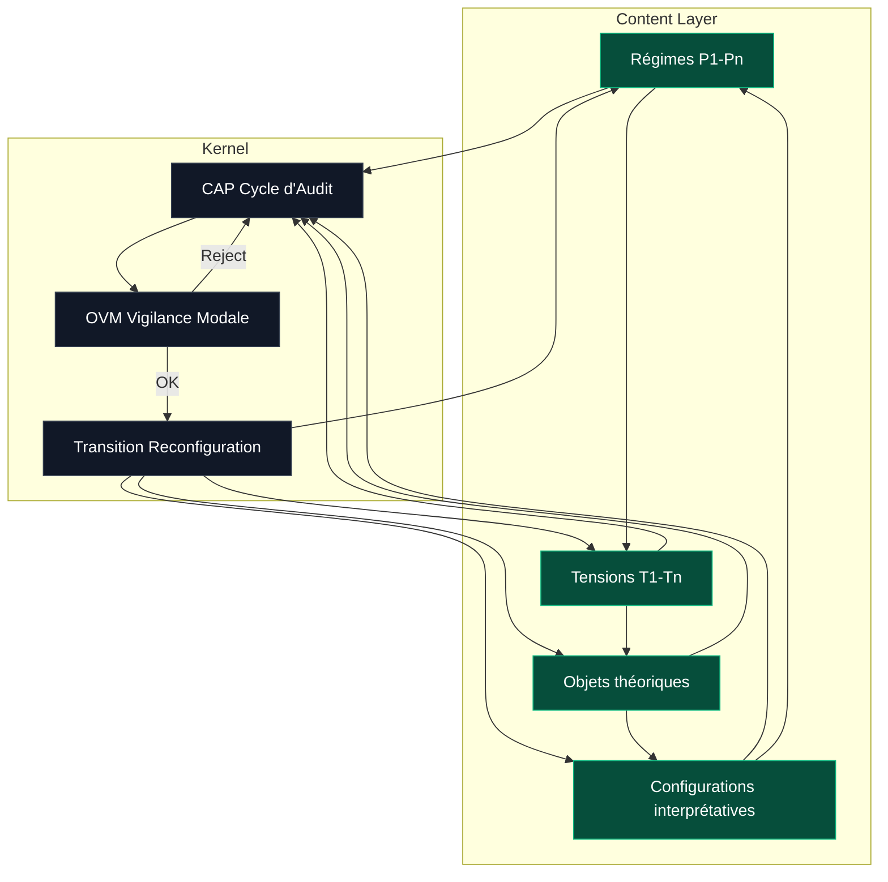

Protokin cOS — Architecture métathéorique à deux niveaux (Kernel / Content Layer)

1. Principe général

Protokin cOS repose sur une architecture à deux niveaux irréductibles :

- Kernel : système opératoire invariant
- Content Layer : domaine descriptif variable

Cette séparation garantit la distinction entre les mécanismes de transformation et les objets transformés.

Kernel ⟂ Content Layer

---

2. Content Layer — Domaine descriptif

Le Content Layer constitue la totalité des structures soumises à traitement.

Il comprend :

- régimes descriptifs (P1 à Pn)
- tensions (T1 à Tn)
- objets théoriques
- configurations interprétatives

Propriétés

Le Content Layer est :

- hétérogène
- contextuel
- non normatif
- potentiellement instable

Il ne possède aucune règle interne globale d’unification.

---

3. Kernel — Système opératoire invariant

Le Kernel est indépendant de tout contenu descriptif.

Il ne manipule pas des objets en tant que tels, mais des structures relationnelles issues du Content Layer.

Il est composé de trois opérateurs :

- CAP : détection des tensions
- OVM : validation des transitions
- Transition : reconfiguration du Content Layer

---

4. Statut des tensions

Une tension est un objet opératoire émergent du Content Layer.

Elle correspond à une incompatibilité, une saturation ou une divergence entre régimes descriptifs.

Elle n’est pas une propriété du réel, mais un effet de structuration descriptive.

---

5. Cycle opératoire

Le système fonctionne selon une boucle fermée :

Content Layer
    ↓
CAP → détection de tensions
    ↓
OVM → validation / invalidation
    ↓
Transition → reconfiguration
    ↓
Content Layer modifié
    ↓
Boucle récursive

---

6. Rôle des opérateurs

CAP (Cycle d’Audit)

- parcourt le Content Layer
- identifie les tensions
- transforme des écarts descriptifs en objets opératoires

OVM (Opérateur de Vigilance Modale)

- filtre les transitions possibles
- détecte les erreurs de catégorie
- bloque les collapsus inter-régimes

Transition

- applique une reconfiguration structurelle
- modifie le Content Layer
- préserve les invariants validés

---

7. Conditions de transition

Une transition est valide si et seulement si :

CAP(T) ∧ OVM(T)

Sinon, le système retourne à l’audit.

---

8. Invariants architecturaux

- Le Kernel ne contient aucun contenu descriptif
- Le Content Layer ne contient aucun opérateur
- Les tensions ne sont pas ontologiques mais structurelles
- Les transitions sont conditionnées et non autonomes

---

9. Boucle globale du système

Observation
    ↓
CAP
    ↓
OVM
    ↓
Transition
    ↓
Nouvel état du Content Layer
    ↓
Récursion

---

10. Synthèse

- Kernel : machine opératoire
- Content Layer : domaine descriptif
- Tension : signal d’incompatibilité
- Transition : reconfiguration conditionnée

Le système forme une architecture de contrôle récursive permettant la stabilisation dynamique des structures descriptives sans réduction inter-régimes.

---

11. Schémas 

