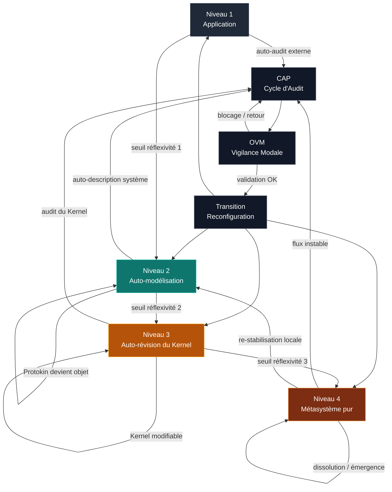

# Protokin — Méta-architecture globale (Niveaux 1 à 4)

## 1. Principe général

Protokin cOS est une architecture à **réflexivité graduée**, structurée en quatre niveaux.

Chaque niveau correspond à un **régime de fonctionnement du système**, défini par le degré d’auto-référence autorisé.

La dynamique globale n’est pas linéaire, mais **cybernétique et réversible** selon des seuils critiques.

---

## 2. Tableau des niveaux

| Niveau | Régime | Objet d’analyse | Statut du Kernel | Type de réflexivité |
|--------|--------|-----------------|------------------|---------------------|
| N1 | Application | Objets externes | Invariant | Faible |
| N2 | Auto-modélisation | Protokin comme objet | Stable | Moyenne |
| N3 | Auto-révision | Kernel modifiable | Instable contrôlé | Forte |
| N4 | Métasystème pur | Champ global | Dissous / diffus | Extrême |

---

## 3. Dynamique globale des niveaux

```text
N1 → N2 → N3 → N4
↑      ↓      ↓      ↓
stabilité → réflexivité → instabilité → dissolution

Chaque transition correspond à une augmentation du degré de réflexivité du système.
```

---

4. Description des niveaux


---

🟢 Niveau 1 — Application (auto-audit externe)

Définition

Protokin analyse des objets externes sans s’appliquer à lui-même.

Propriétés

Kernel invariant

Content Layer externe

pas d’auto-référence structurelle


Fonction

→ analyse descriptive du réel

Transition sortante

apparition de tensions internes au système


---

🟡 Niveau 2 — Auto-modélisation

Définition

Protokin devient objet de son propre Content Layer.

Propriétés

régimes modifiables

tensions internes possibles

Kernel stable


Fonction

→ réflexivité contrôlée

Seuil critique N2 → N3

tensions sur CAP / OVM / Transition

incohérences internes du système

nécessité de modifier les règles


---

🟠 Niveau 3 — Auto-révision du Kernel

Définition

Le Kernel devient modifiable.

Propriétés

CAP / OVM / Transition transformables

structure du système réécrite

boucle réflexive forte


Fonction

→ réécriture du système

Seuil critique N3 → N4

instabilité des opérateurs

effondrement des règles fixes

impossibilité de stabilisation globale


---

🔴 Niveau 4 — Métasystème pur

Définition

Disparition du Kernel comme invariant stable.

Propriétés

fusion Kernel / Content Layer

opérateurs localement émergents

absence de centre stable


Fonction

→ champ dynamique de transformations

Régime

instable

auto-fluctuant

non hiérarchisé


Retour possible

émergence de Kernel locaux

re-stabilisation vers N1–N3


---

5. Logique des transitions

N(n) → N(n+1) : augmentation de réflexivité
N(n+1) → N(n) : re-stabilisation locale


---

6. Seuils critiques

🔹 Seuil 1 — Objet → Système

apparition de l’auto-analyse

passage N1 → N2


🔹 Seuil 2 — Système → Méta-système contrôlé

Protokin devient objet interne

passage N2 → N3


🔹 Seuil 3 — Instabilité du Kernel

opérateurs deviennent modifiables

passage N3 → N4


🔹 Seuil 4 — Dissolution / émergence

disparition du centre opératoire

reconstruction locale possible


---

7. Diagramme global

[N4]
   Métasystème pur
        ↑   ↓
   émergence / dissolution
        ↑   ↓
        [N3]
 Auto-révision du Kernel
        ↑   ↓
   seuil critique
        ↑   ↓
        [N2]
 Auto-modélisation
        ↑   ↓
   seuil critique
        ↑   ↓
        [N1]
 Application externe


---

8. Principe unificateur

Protokin est une architecture où :

> les niveaux ne sont pas des états fixes, mais des attracteurs de réflexivité.


---

9. Invariant transversal

Même dans les régimes les plus instables :

une séparation fonctionnelle tend à réapparaître

des Kernel locaux émergent spontanément

la stabilité est un phénomène dynamique, non structurel


---

10. Synthèse

N1 : analyse du monde

N2 : analyse de Protokin

N3 : transformation de Protokin

N4 : dissolution en champ dynamique

---


