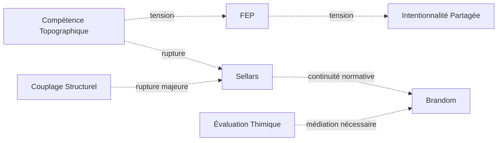

# ⚡ Tensions Inter-Régimes

## 🧭 Statut du document

Ce document ne décrit pas des contradictions entre les régimes de couplage de Protokin cOS.

Il cartographie les **zones de tension**, de **recouvrement partiel**, de **traduction difficile** et de **rupture conceptuelle** entre les différents régimes de stabilisation.

Une tension n'est pas une erreur.

Une tension est un indicateur montrant que deux régimes :

- sélectionnent des invariants différents ;
- utilisent des critères de validité différents ;
- stabilisent des descriptions incompatibles ou seulement partiellement compatibles.

Les tensions constituent une source potentielle de transition entre régimes.

---

# ⚙️ Principe général

Aucun régime ne possède de privilège ontologique.

Aucun régime ne peut être utilisé comme méta-langage universel permettant de réduire tous les autres.

Les tensions apparaissent lorsque :

- un régime tente d'expliquer un invariant relevant d'un autre régime ;
- un invariant change de statut lors d'un changement de régime ;
- deux régimes stabilisent différemment une même situation.

---

# 🛠 Note sur le statut évolutif de la cartographie (G12)

Cette typologie des tensions n'est pas une classification ontologique close. Elle constitue un dispositif d'audit pragmatique et évolutif. La liste des tensions est ouverte : elle peut être enrichie, reconfigurée ou précisée en fonction des nouvelles instabilités descriptives identifiées lors de vos audits. Le système ne vise pas à "résoudre" ces tensions par une synthèse universelle, mais à les cartographier pour garantir la robustesse des descriptions produites par le cadre Protokin.

---

# 🧠 Fonction épistémologique des tensions

Les tensions ne décrivent pas des erreurs du réel, ni des contradictions ontologiques entre objets du monde.

Elles décrivent des **effets de bord épistémiques** produits par la coexistence de régimes de couplage distincts lorsqu’ils sont mobilisés pour stabiliser une même situation.

Autrement dit, une tension n’indique pas que “le monde ne fonctionne pas correctement”, mais que **les conditions de description ne sont pas homogènes**.

---

## Principe général

Chaque tension correspond à la détection d’une forme spécifique de désalignement entre :

- les invariants sélectionnés par les régimes ;
- les critères de validité utilisés ;
- les niveaux de description mobilisés ;
- les modes de stabilisation attendus.

---

## Cartographie fonctionnelle des tensions

Les tensions peuvent être interprétées comme des opérateurs d’alerte épistémologique.

Elles signalent différentes formes de fragilité descriptive.

| Tension | Fonction épistémologique | Question détectée |
|----------|--------------------------|-------------------|
| T1 — Réduction | Détection du réductionnisme inter-régimes | Réduit-on un régime à un autre ? |
| T2 — Traduction | Détection des incommensurabilités partielles | Peut-on traduire un régime dans un autre ? |
| T3 — Échelle | Détection des ruptures de granularité descriptive | Est-on à la bonne échelle ? |
| T4 — Normative | Détection des confusions entre causes et raisons | Confond-on cause et justification ? |
| T5 — Rupture | Détection des sauts conceptuels non médiés | Existe-t-il un médiateur entre deux régimes ? |
| T6 — Rétroprojection | Détection des anachronismes conceptuels | Lit-on le passé avec les concepts du présent ? |
| T7 — Collapsus méta-langagier | Détection des fusions artificielles de régimes | Confond-on description et méta-description ? |
| T8 — Auto-inclusion | Détection des circularités non auditables | Le système s'inclut-il lui-même ? |
| T9 — Saturation descriptive | Détection des limites de compressibilité interne | Le régime est-il saturé d'anomalies ? |
| T10 — Dérive inter-temporelle | Détection des glissements progressifs d’invariants | Observe-t-on une simple évolution interne ? |
| T11 — Compression multi-régime | Détection des surcharges descriptives non hiérarchisées | Plusieurs régimes sont-ils mélangés ? |
| T12 — Tension de lisibilité | Le désalignement irréductible entre la modélisation standardisée d'un système et la réalité organique des pratiques locales | Que perd-on lorsque l'on rend le système lisible ? |
| T13 — Dérive Téléologique | briser l'illusion que le développement des régimes de stabilisation (de P1 à P13) obéirait à une loi d'évolution ou à une nécessité historique | Une contingence est-elle relue comme un destin ? |
| T14 — Tension de réification | Empêcher la substantification des abstractions | Sommes-nous en train de transformer une description stabilisée en nécessité ontologique ? |

---

## Statut des fonctions

Ces fonctions ne doivent pas être interprétées comme des causalités.

Une tension ne produit pas directement la situation qu’elle décrit.

Elle indique seulement qu’un certain type de désalignement est observable entre régimes.

---

## Fonction d’audit

Dans une procédure d’audit Protokin, les tensions jouent trois rôles principaux :

### 1. Localisation des désalignements

Elles permettent d’identifier où les régimes divergent dans leur manière de stabiliser une situation.

---

### 2. Qualification des incompatibilités

Elles permettent de distinguer :

- les conflits de niveau ;
- les conflits de langage ;
- les conflits de critères ;
- les conflits de stabilité.

---

### 3. Guidage des transitions

Elles peuvent indiquer des zones où une transition de cadre devient pertinente, sans jamais la déterminer.

---

## Principe de non-ontologisation

Les tensions ne doivent pas être interprétées comme des propriétés du réel.

Elles sont des propriétés :

- des modèles utilisés ;
- des cadres d’observation ;
- des opérations de description.

---

## Principe final

> Les tensions ne décrivent pas ce que le monde “est”.

> Elles décrivent comment plusieurs régimes de description échouent à stabiliser de manière homogène une même situation.

> Elles constituent la cartographie des limites internes de la pluralité descriptive.

---

# 🧩 Rappel des régimes de couplage (lecture contextuelle)

Cette section fournit un rappel des régimes de couplage utilisés dans les tensions.

Les régimes ne constituent pas une liste ontologique fermée.  
Ils représentent une **cartographie située des principaux modes de stabilisation descriptive actuellement identifiables**.

Les numéros (P1 à P14) sont des **index de référence interne**, utilisés pour situer les relations de tension, et non des entités fixes ou exhaustives.

---

## 🌐 Régimes physico-dynamiques

- **P1 — Cinétique protonique**
- **P2 — Dissipation structurée (Prigogine)**

---

## 🧠 Régimes cognitifs

- **P4 — Compétence topographique (von Foerster)**
- **P5 — Minimisation de la surprise / FEP**
- **P11 — Espace des raisons (Sellars / espace normatif implicite)**

---

## 🧬 Régimes biologiques et structurels

- **P7 — Couplage structurel (Maturana / Varela)**

- **P15 — Sélection antagoniste et dérive phylogénétique*** (Williams / Medawar)

---

## 👥 Régimes socio-développementaux

- **P8 — Intentionnalité partagée (Tomasello)**
- **P9 — Effet cliquet culturel**

---

## ⚖️ Régimes normatifs et métathéoriques

- **P10 — Couplage structurel des pratiques (niveau descriptif des émergences sociales)**
- **P12 — Évaluation thimique**
- **P13 — Institution inférentielle (Brandom)**
- **P14 — Validation / audit métathéorique**

---

## ⚠️ Statut du rappel

Ce rappel est fourni uniquement pour faciliter la lecture des tensions.

Il ne constitue pas :

- une classification définitive
- une hiérarchie des régimes
- une ontologie des niveaux d’organisation

Les régimes peuvent être **révisés, recontextualisés ou enrichis** sans modification du cadre général de Protokin cOS.

---

# ⚡ Typologie des tensions

## T1 — Tension de réduction

Un régime tente de réduire un autre à ses propres invariants.

### Exemple

Réduire :

- les normes (P13)
- aux mécanismes biologiques (P7)

ou

- les raisons (P11)
- aux causes physiques (P2)

### Risque

Perte de la spécificité du régime cible.

---

## T2 — Tension de traduction

Deux régimes décrivent partiellement le même phénomène mais avec des langages incompatibles.

### Exemple

P5 (FEP)

et

P8 (Intentionnalité partagée)

traitent tous deux de coordination.

Mais :

- l'un mobilise des modèles prédictifs ;
- l'autre mobilise des attentes mutuelles.

### Risque

Fausse équivalence.

---

## T3 — Tension d'échelle

Deux régimes opèrent à des échelles différentes.

### Exemple

P1 (Cinétique protonique)

et

P9 (Effet cliquet culturel)

peuvent participer à une même situation sans partager la même granularité descriptive.

### Risque

Confusion entre niveaux d'analyse.

---

## T4 — Tension normative

Un régime causal rencontre un régime normatif.

### Exemple

P10 (Couplage structurel)

→ explique comment une pratique apparaît.

P13 (Institution inférentielle)

→ explique comment une pratique devient légitime.

### Risque

Confondre explication et justification.

---

## T5 — Tension de rupture

Deux régimes sont incompatibles sans transition explicite.

### Exemple

P2 (Dissipation structurée)

et

P13 (Institution inférentielle)

ne possèdent aucun langage commun immédiat.

Une médiation est nécessaire.

### Risque

Saut conceptuel non justifié.

---

## T6 — Tension de rétroprojection

Un régime interprète un autre régime à partir de ses propres invariants comme s’ils étaient universels.

### Exemple

lecture d’un régime normatif à travers un régime physico-causal

### Risque

Anachronisme ou projection de catégories inadaptées.

---

## T7 — Tension de collapsus méta-langagier

Deux régimes sont artificiellement ramenés à un langage commun supposé.

### Exemple

réduction simultanée de P5 et P11 à une logique unique d’optimisation

### Risque

Création d’un pseudo-régime unificateur.

---

## T8 — Tension d’auto-inclusion

Un régime est appliqué à lui-même sans changement de niveau d’observation.

### Exemple

tentative de justifier P11 (espace des raisons) uniquement par P11 lui-même

### Risque

Circularité non auditée.

---

## T9 — Tension de saturation descriptive

Un régime devient trop complexe pour ses propres critères de stabilisation.

### Exemple

modèle prédictif (P5) sur-paramétré perdant sa capacité de généralisation

### Risque

Perte de compressibilité et d’opérationalité descriptive.

---

## T10 — Tension de dérive inter-temporelle

Deux régimes restent compatibles structurellement mais divergent dans le temps.

### Exemple

transformation progressive de P8 vers P9 sans rupture explicite

### Risque

Glissement silencieux des invariants.

---

## T11 — Tension de compression multi-régime

Plusieurs régimes sont mobilisés simultanément pour un même phénomène sans hiérarchie descriptive.

### Exemple

usage conjoint de P2 + P5 + P8 pour un même phénomène sans règle d’articulation

### Risque

Indécidabilité interprétative et surcharge multi-cadre.

---

## T12 — Tension de lisibilité

Actuellement, ce que vous décrivez ressemble fortement aux analyses de James C. Scott dans Seeing Like a State.
Le problème n'est pas une erreur d'échelle (T3).
Le problème n'est pas non plus une rétroprojection (T6).
Et ce n'est pas exactement une réification (T14).
Le problème est :
un système descriptif gagne en lisibilité globale en perdant les régulations locales qui assuraient sa robustesse.

### Fonction
Détecter la perte de savoirs locaux induite par la standardisation
### Mécanisme
Un régime impose des invariants simplifiés afin de rendre un système administrable, mesurable ou calculable
### Statut
Alerte de simplification excessive
Question détectée
Que perd-on lorsque l'on rend le système lisible ?
### Exemple :
gestion forestière centralisée ;
agriculture collectivisée ;
indicateurs scolaires ;
protocoles administratifs.

### L'OVM pourrait alors vérifier :
L'augmentation de lisibilité détruit-elle des mécanismes de stabilisation invisibles ?

---

## T13 — Dérive Téléologique

* **Nature :** Erreur de transposition modale majeure.
* **Description :** La T13 survient lorsqu'une nécessité structurelle interne à un régime est interprétée comme une nécessité historique ou ontologique globale. Elle modélise le glissement fallacieux où l'on déduit que, parce qu'une configuration (ex: P13) est stable et cohérente, elle constitue la "fin" ou le "but" vers lequel les régimes précédents (P7, P8, P10) tendaient nécessairement.
* **Indicateurs :**
    * Usage de termes de finalité (ex: "aboutir", "convergence", "ultime étape", "progrès", "maturation").
    * Neutralisation de la contingence (présenter une transition comme le seul déploiement possible d'une logique sous-jacente).
    * Effacement de la rupture (nier le caractère local et localisé de la stabilisation).
* **Action OVM :** Blocage immédiat. Exige la démonstration que la structure interne du régime (ex: les règles d'inférence de Brandom) est bien distincte de sa genèse historique (ex: les crises mimétiques de Girard).

---

## T14 — Tension de réification
Fonction : Empêcher la substantification des abstractions.
Mécanisme : Traiter un construit descriptif ou un concept (une "carte") comme s'il s'agissait d'une entité causale autonome dotée d'agentivité ou de volonté (le "territoire").
Statut dans l'audit : Anomalie ontologique. Signal d'alerte sur la confusion entre le modèle et l'objet.
Exemple : Prêter au "Marché" une intention de régulation, à la "Société" une volonté, ou à "l'Histoire" une force agissante.

L'intérêt de T14 est qu'elle protège Protokin contre une erreur extrêmement fréquente :
> oublier que les régimes eux-mêmes sont des constructions descriptives.

Autrement dit, T14 doit aussi pouvoir s'appliquer à Protokin :
> « P13 produit les normes » pourrait devenir une réification si P13 cesse d'être un outil descriptif pour devenir une entité agissante.

---

# 🛡️ Garde-fous structurels de la typologie des tensions

Les garde-fous suivants définissent les contraintes d’usage de la typologie des tensions dans le cadre de Protokin.  
Ils ne constituent pas des règles causales, mais des contraintes d’interprétation visant à éviter toute dérive réductionniste, ontologisante ou unificatrice.

---

## G1 — Non-exhaustivité constitutive

La typologie des tensions ne constitue pas une liste complète des formes possibles de tensions.  
Elle représente une stabilisation descriptive partielle et révisable.

---

## G2 — Absence de générativité transitionnelle

Aucune tension ne détermine une transition.  
Les tensions ne définissent ni les conditions nécessaires ni les conditions suffisantes de passage entre régimes.

---

## G3 — Non-hiérarchisation des tensions

Les tensions ne sont pas ordonnées selon une hiérarchie de profondeur, de fondamentalité ou de causalité.  
Toute lecture graduelle (faible/forte) est strictement contextuelle et non ontologique.

---

## G4 — Absence de méta-régime implicite

La typologie des tensions ne constitue pas un langage supérieur aux régimes.  
Elle n’autorise aucune réduction globale ni fusion des cadres de stabilisation.

---

## G5 — Localité stricte des tensions

Une tension n’existe que relativement aux régimes qu’elle met en relation dans un contexte d’audit donné.  
Elle n’a pas d’existence indépendante de cette configuration.

---

## ~~G6 — Invariance des régimes~~ (désactivé)

La définition des régimes de couplage est indépendante de la typologie des tensions.  
Les tensions ne modifient ni les régimes ni leur structure interne.

---

## G7 — Dissociation stricte tension / erreur

Une tension n’est ni une incohérence, ni une défaillance, ni une anomalie.  
Elle indique uniquement une divergence de conditions de stabilisation.

---

## G8 — Anti-collapsus conceptuel

Aucune tension ne peut être utilisée pour fusionner, réduire ou homogénéiser deux régimes.  
Toute opération de ce type constitue une dérive hors cadre Protokin.

---

## G9 — Non-détermination des transitions

L’existence d’une tension ne détermine ni la nécessité, ni la direction, ni la temporalité d’une transition entre régimes.

---

## ~~G10 — Réversibilité descriptive~~ (désactivé)

Toute tension peut être re-décrite depuis un autre régime sans perte de validité locale.  
Il n’existe pas de description finale ou privilégiée des tensions.

---

## ~~G11 — Primauté de l’audit~~ (désactivé)

Les tensions sont des outils d’analyse des conditions de stabilisation descriptive.  
Elles ne constituent pas des mécanismes explicatifs du changement.

---

## G12 — Historicité et révisabilité de la typologie

La typologie des tensions est une construction évolutive.  
Elle peut être enrichie, reconfigurée ou reclassée sans modification du cadre général de Protokin cOS.

## G13 – Récursivité

Le système Protokin doit pouvoir s'auditer lui-même. Si le cadre Protokin devient lui-même un "régime" dominant, il devient alors sujet à ses propres tensions (T8 - Auto-inclusion).

---

## ⚖️ Statut global des garde-fous

Les garde-fous ne définissent pas ce que sont les tensions.  
Ils définissent uniquement ce qu’il n’est pas possible d’en faire sans sortir du cadre Protokin.

---

# 📊 Cartographie des tensions majeures

## P1 ↔ P2

### Nature

Recouvrement physique.

### Tension

Faible.

### Description

Les flux protoniques peuvent être décrits dans le cadre plus large des systèmes dissipatifs.

---

## P2 ↔ P5

### Nature

Optimisation.

### Tension

Moyenne.

### Description

Les deux régimes mobilisent des notions de stabilisation mais selon des formalismes distincts.

Leur proximité ne doit pas être interprétée comme une identité.

---

## P4 ↔ P5

### Nature

Construction des invariants.

### Tension

Forte.

### Description

P4 :

l'objet est un invariant comportemental.

P5 :

l'objet est une variable modélisée dans une dynamique prédictive.

Les deux approches ne sont pas équivalentes.

---

## P4 ↔ P11

### Nature

Passage à la normativité.

### Tension

Très forte.

### Description

P4 stabilise des objets.

P11 stabilise des raisons.

Le passage exige une rupture conceptuelle.

---

## P5 ↔ P8

### Nature

Coordination.

### Tension

Très forte.

### Description

Une coordination prédictive n'est pas nécessairement une coordination sociale.

L'intentionnalité partagée ne se déduit pas automatiquement du FEP.

---

## P7 ↔ P8

### Nature

Émergence sociale.

### Tension

Forte.

### Description

Les préconditions biologiques rendent possible l'intentionnalité partagée.

Elles ne suffisent pas à l'expliquer.

---

## P8 ↔ P9

### Nature

Continuité socio-développementale.

### Tension

Faible.

### Description

L'effet cliquet suppose généralement l'existence préalable de formes d'intentionnalité partagée.

---

## P10 ↔ P11

### Nature

Rupture Sellarsienne.

### Tension

Maximale.

### Description

P10 appartient à l'espace des causes.

P11 appartient à l'espace des raisons.

Cette frontière constitue l'une des discontinuités fondamentales de Protokin.

---

## P11 ↔ P13

### Nature

Normativité.

### Tension

Faible.

### Description

P11 ouvre l'espace des raisons.

P13 décrit son institution sociale.

---

## P12 ↔ P13

### Nature

Valeur et norme.

### Tension

Moyenne.

### Description

Une évaluation thimique n'est pas nécessairement une norme publique.

Le passage nécessite une stabilisation collective.

---

## P13 ↔ P14

### Nature

Réflexivité.

### Tension

Faible.

### Description

P13 institue les normes.

P14 examine leur cohérence architectonique.

---

#  🧠 Familles de tensions

#### Famille A — Tensions de frontière (Incompatibilités structurelles)
*Concerne les désalignements lors de la confrontation de deux régimes sur un même objet.*
* **Fonction :** Détecter les ruptures de traduction ou de compatibilité.
* **Tensions :** T1 (Réduction), T2 (Traduction), T3 (Échelle), T4 (Normative), T5 (Rupture).
* **Question d'audit :** « Les régimes en présence partagent-ils une base de traduction commune ou sommes-nous face à une incommensurabilité ? »

#### Famille B — Tensions réflexives (Anomalies de niveau)
*Concerne les erreurs de niveau logique où un régime tente de se prendre lui-même pour objet ou d'absorber les autres sans médiation.*
* **Fonction :** Détecter les dérives autoréférentielles et les collapsus métathéoriques.
* **Tensions :** T6 (Rétroprojection), T7 (Collapsus méta-langagier), T8 (Auto-inclusion).
* **Question d'audit :** « Le cadre d'observation respecte-t-il les frontières de sa propre validité ou s'autodévore-t-il par circularité ? »

#### Famille C — Tensions dynamiques (Instabilités de stabilisation)
*Concerne les limites de performance d'un régime lorsqu'il est poussé dans ses retranchements opératoires.*
* **Fonction :** Détecter les moments où un régime perd son efficacité descriptive.
* **Tensions :** T9 (Saturation descriptive), T10 (Dérive inter-temporelle), T11 (Compression multi-régime), T12 (Lisibilité).
* **Question d'audit :** « Le régime de stabilisation est-il encore capable de produire des invariants opératoires ou est-il en état de saturation/dérive ? »

#### Famille D — Tensions ontologiques (Dérives de substantialisation)

Fonction : Détecter les moments où une construction descriptive est transformée en propriété du réel.

Tensions :
T13 — Dérive téléologique.
T14 — Réification.

Question d'audit :
« Sommes-nous en train de transformer une description stabilisée en nécessité ontologique ? »

---
*« Certaines tensions existent parce que les régimes sont différents. »*
*« Certaines tensions existent parce que les observateurs utilisent les régimes d'une certaine manière. »*
*« Certaines tensions apparaissent parce que les conditions de stabilisation évoluent dans le temps. »*

---

# 🔄 Relation entre tensions et transitions

Les tensions et les transitions appartiennent à deux niveaux distincts de l'architecture Protokin.

---

Les tensions

Les tensions sont des opérateurs de diagnostic.

Elles identifient :

- des incompatibilités locales ;
- des divergences descriptives ;
- des difficultés de traduction ;
- des limites de stabilisation.

Une tension ne produit aucun changement par elle-même.

---

Les transitions

Les transitions sont des opérateurs de reconfiguration descriptive.

Elles correspondent au déplacement d'un cadre de stabilisation vers un autre.

---

Principe de non-détermination

Une tension n'implique jamais une transition.

Une transition peut se produire :

- sans tension explicite ;
- malgré une tension persistante ;
- après disparition d'une tension ;
- en réponse à plusieurs tensions simultanées.

---

Fonction des tensions dans les transitions

Les tensions peuvent néanmoins jouer un rôle de signal.

Elles indiquent qu'un régime :

- rencontre une limite locale ;
- perd une partie de son pouvoir descriptif ;
- entre en conflit avec un autre régime.

Dans ce contexte, elles peuvent contribuer à rendre une transition pertinente.

---

Principe fondamental

«Les tensions indiquent où une transition pourrait devenir utile.»

«Elles ne déterminent jamais qu'une transition doit avoir lieu.»

---

# 🧪 Procédure d'audit des tensions

L'identification d'une tension constitue une opération d'audit et non une opération explicative.

L'objectif n'est pas de déterminer quel régime a raison.

L'objectif est de cartographier les conditions de stabilisation en présence.

---

Étape 1 — Identification des régimes

Déterminer quels régimes sont mobilisés dans la situation étudiée.

Questions :

- Quels invariants sont sélectionnés ?
- Quels critères de validité sont utilisés ?
- Quel type de stabilisation est recherché ?

---

Étape 2 — Localisation des divergences

Identifier les points où les régimes produisent des descriptions différentes.

Questions :

- Les objets décrits sont-ils identiques ?
- Les niveaux d'analyse sont-ils compatibles ?
- Les critères de validation sont-ils comparables ?

---

Étape 3 — Classification de la tension

Associer la divergence observée à une ou plusieurs tensions de la typologie.

Questions :

- S'agit-il d'une réduction ?
- D'une rupture ?
- D'une difficulté de traduction ?
- D'une saturation ?
- D'une compression multi-régime ?

---

Étape 4 — Évaluation de la stabilité

Évaluer si la tension compromet ou non la stabilité descriptive locale.

Questions :

- Les régimes restent-ils utilisables ?
- Une médiation est-elle possible ?
- Une transition est-elle envisageable ?

---

Étape 5 — Documentation

Documenter la configuration observée.

Le résultat d'un audit doit préciser :

- les régimes impliqués ;
- les tensions identifiées ;
- les limites constatées ;
- les éventuelles zones de transition.

---

Statut de l'audit

L'audit ne produit pas une vérité finale.

Il produit une cartographie locale des conditions de stabilisation observées dans une situation donnée.

---

# 🧷 Distinction entre tensions structurelles et tensions d’usage

Toutes les tensions n’ont pas le même statut au sein de Protokin cOS.

Certaines tensions résultent directement de la coexistence de plusieurs régimes de couplage.

D’autres apparaissent principalement à travers les pratiques descriptives des observateurs lorsqu’ils articulent, traduisent ou manipulent ces régimes.

Cette distinction permet de différencier :

- les tensions liées à l’architecture des régimes eux-mêmes ;
- les tensions liées aux conditions d’utilisation des régimes.

---

## Tensions structurelles

Les tensions structurelles résultent de la coexistence de régimes possédant :

- des invariants distincts ;
- des critères de validité différents ;
- des conditions de stabilisation hétérogènes.

Elles apparaissent indépendamment des intentions ou des erreurs des observateurs.

Elles sont inhérentes à la pluralité descriptive reconnue par Protokin.

---

Tensions principalement structurelles

Cette catégorie comprend principalement :

- T1 — Tension de réduction
- T2 — Tension de traduction
- T3 — Tension d’échelle
- T4 — Tension normative
- T5 — Tension de rupture

---

Exemple

La tension entre :

P10 → Couplage structurel
P11 → Espace des raisons

n’est pas produite par une erreur d’interprétation.

Elle résulte du fait que les deux régimes sélectionnent des types d’invariants différents :

- causes ;
- raisons.

Même si les deux régimes sont correctement mobilisés, la tension demeure.

---

Fonction

Les tensions structurelles signalent les limites de compatibilité entre régimes.

Elles permettent de cartographier :

- les zones de traduction ;
- les ruptures conceptuelles ;
- les changements d’échelle ;
- les discontinuités normatives.

---

## Tensions d’usage

Les tensions d’usage apparaissent lorsqu’un observateur mobilise les régimes d’une manière susceptible de produire des difficultés supplémentaires.

Elles ne sont pas causées par l’existence des régimes eux-mêmes.

Elles résultent de leur orchestration, de leur interprétation ou de leur articulation.

---

Tensions principalement liées à l’usage

Cette catégorie comprend principalement :

- T6 — Tension de rétroprojection
- T7 — Tension de collapsus méta-langagier
- T8 — Tension d’auto-inclusion

et, dans de nombreux contextes :

- T11 — Tension de compression multi-régime

---

Exemple

Lorsque plusieurs régimes sont artificiellement fusionnés dans un langage unique :

P2 + P5 + P11

la tension observée ne provient pas directement des régimes.

Elle provient de la décision descriptive consistant à effacer leurs différences de statut.

La difficulté résulte ici d’un usage particulier des régimes.

---

Fonction

Les tensions d’usage servent principalement à auditer :

- les stratégies de description ;
- les opérations de traduction ;
- les reconstructions théoriques ;
- les pratiques métathéoriques.

Elles permettent de détecter les dérives interprétatives susceptibles de masquer les différences entre régimes.

---

Cas particulier des tensions dynamiques

Certaines tensions ne relèvent ni exclusivement de la structure ni exclusivement de l’usage.

Elles apparaissent lors de l’évolution temporelle d’un régime ou d’une configuration descriptive.

Cette catégorie comprend principalement :

- T9 — Tension de saturation descriptive
- T10 — Tension de dérive inter-temporelle

et parfois :

- T11 — Tension de compression multi-régime

---

Statut

Ces tensions sont dites dynamiques.

Elles émergent lorsque les conditions de stabilisation se transforment au cours du temps.

Elles signalent moins une incompatibilité entre régimes qu’une modification progressive de leur capacité descriptive.

---

Non-exclusivité de la distinction

La distinction entre tensions structurelles et tensions d’usage ne constitue pas une classification rigide.

Une même tension peut être interprétée différemment selon le contexte d’audit.

Par exemple :

- une tension de traduction (T2) peut être structurelle ;
- mais elle peut être aggravée par un mauvais usage des régimes concernés.

De même :

- une compression multi-régime (T11) peut résulter d’une dérive d’usage ;
- ou d’une évolution dynamique d’une situation devenue difficile à stabiliser.

---

Fonction de la distinction

Cette distinction ne vise pas à classer les tensions selon leur importance.

---

# Méta-structures et Audit Protokin

Le projet **Protokin (Protokin cOS)** ne se limite pas à une simple classification des savoirs. Il se définit comme une **machine à auditer les conditions de stabilisation** des discours. Pour ce faire, il s'appuie sur des **méta-structures** qui permettent de naviguer entre les régimes hétérogènes (de la thermodynamique à l'espace des raisons) sans écraser leur spécificité.

Ces méta-structures ne sont pas des théories du monde, mais des **protocoles de navigation et de diagnostic** pour l'audit des systèmes descriptifs.

## 1. Méta-structure Topographique (La géographie des régimes)
Elle sert à localiser les zones de friction et à définir les ancrages. 
- **Rôle :** Cartographier où chaque auteur fixe son ancrage (ex: Žižek en épistémologie, Balthasar en ontologie).
- **Utilité d'audit :** Identifier si une description est ancrée dans un régime physique (Proto) ou un régime normatif (Kin).
- **Application :** Permet de repérer les "tensions de rupture" (T5) lorsque les cadres se superposent sans traduction.

## 2. Méta-structure Pragmatique (Le régime d'interaction)
Elle classifie les discours non par leur contenu, mais par ce qu'ils *font* au sein d'un milieu.
- **Régimes :** - *Programmation* (système clos).
    - *Ajustement* (système flexible, cas de Protokin).
    - *Accident* (reconnaissance de l'irréductibilité du réel).
- **Utilité d'audit :** Diagnostiquer si un auteur "programme" une ontologie ou s'il "ajuste" sa description à la source.

## 3. Méta-structure de Preuve (Niveau de contrainte)
Elle évalue la solidité du couplage entre la source et le système.
- **Grades de validation :**
    - **Grade A (Preuve de structure) :** Déduction parfaite depuis la source.
    - **Grade B (Preuve de cohérence) :** Compatible mais interprétatif.
    - **Grade C (Assertion conceptuelle) :** Projection sans ancrage philologique fort (ex: critique de Žižek).
    - **Grade D (Spéculation) :** Nécessité dialectique sans données empiriques.

## 4. Fonctionnement dans Protokin cOS
Dans l'architecture globale, ces méta-structures servent d'outils de diagnostic :
1. **Diagnostic :** Quel est le régime d'interaction ? Quelle est la solidité de la preuve ?
2. **Audit :** Y a-t-il une "compression multi-régime" (T11) ? Le couplage est-il légitime ou illusoire ?
3. **Transition :** Quels opérateurs (Réinterprétation, Émergence, Rupture) peuvent reconfigurer le cadre sans altérer l'invariant ?

> **Principe épistémologique final :** Les méta-structures ne sont pas des vérités premières. Elles sont les instruments nécessaires pour maintenir la distinction entre le *causal* (Proto) et le *normatif* (Kin) sans jamais postuler une continuité homogène ou une unification forcée.

---

# 🕸️ Graphe simplifié des tensions

---

# ⚠️ Zones de rupture critiques

fichier : ’zones.md’

---

Principe final

«Certaines tensions existent parce que les régimes sont différents.»

«Certaines tensions existent parce que les observateurs utilisent les régimes d’une certaine manière.»

«Certaines tensions apparaissent parce que les conditions de stabilisation évoluent dans le temps.»

«Distinguer ces trois sources permet d’éviter de confondre une limite architecturale, une dérive interprétative et une transformation dynamique.»

---

