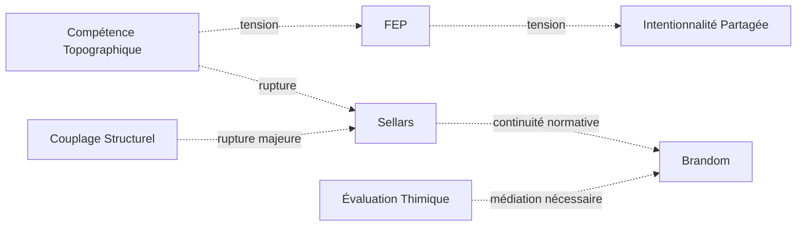

# ⚡ Tensions Inter-Régimes

## Statut du document

Ce document ne décrit pas des contradictions entre les régimes de couplage de Protokin cOS.

Il cartographie les **zones de tension**, de **recouvrement partiel**, de **traduction difficile** et de **rupture conceptuelle** entre les différents régimes de stabilisation.

Une tension n'est pas une erreur.

Une tension est un indicateur montrant que deux régimes :

- sélectionnent des invariants différents ;
- utilisent des critères de validité différents ;
- stabilisent des descriptions incompatibles ou seulement partiellement compatibles.

Les tensions constituent une source potentielle de transition entre régimes.

---

# Principe général

Aucun régime ne possède de privilège ontologique.

Aucun régime ne peut être utilisé comme méta-langage universel permettant de réduire tous les autres.

Les tensions apparaissent lorsque :

- un régime tente d'expliquer un invariant relevant d'un autre régime ;
- un invariant change de statut lors d'un changement de régime ;
- deux régimes stabilisent différemment une même situation.

---

# Typologie des tensions

## T1 — Tension de réduction

Un régime tente de réduire un autre à ses propres invariants.

### Exemple

Réduire :

- les normes (P13)
- aux mécanismes biologiques (P7)

ou

- les raisons (P11)
- aux causes physiques (P2)

### Risque

Perte de la spécificité du régime cible.

---

## T2 — Tension de traduction

Deux régimes décrivent partiellement le même phénomène mais avec des langages incompatibles.

### Exemple

P5 (FEP)

et

P8 (Intentionnalité partagée)

traitent tous deux de coordination.

Mais :

- l'un mobilise des modèles prédictifs ;
- l'autre mobilise des attentes mutuelles.

### Risque

Fausse équivalence.

---

## T3 — Tension d'échelle

Deux régimes opèrent à des échelles différentes.

### Exemple

P1 (Cinétique protonique)

et

P9 (Effet cliquet culturel)

peuvent participer à une même situation sans partager la même granularité descriptive.

### Risque

Confusion entre niveaux d'analyse.

---

## T4 — Tension normative

Un régime causal rencontre un régime normatif.

### Exemple

P10 (Couplage structurel)

→ explique comment une pratique apparaît.

P13 (Institution inférentielle)

→ explique comment une pratique devient légitime.

### Risque

Confondre explication et justification.

---

## T5 — Tension de rupture

Deux régimes sont incompatibles sans transition explicite.

### Exemple

P2 (Dissipation structurée)

et

P13 (Institution inférentielle)

ne possèdent aucun langage commun immédiat.

Une médiation est nécessaire.

### Risque

Saut conceptuel non justifié.

---

## T6 — Tension de rétroprojection

Un régime interprète un autre régime à partir de ses propres invariants comme s’ils étaient universels.

### Exemple

lecture d’un régime normatif à travers un régime physico-causal


### Risque

Anachronisme ou projection de catégories inadaptées.

---

## T7 — Tension de collapsus méta-langagier

Deux régimes sont artificiellement ramenés à un langage commun supposé.

### Exemple

réduction simultanée de P5 et P11 à une logique unique d’optimisation

### Risque

Création d’un pseudo-régime unificateur.

---

## T8 — Tension d’auto-inclusion

Un régime est appliqué à lui-même sans changement de niveau d’observation.

### Exemple

tentative de justifier P11 (espace des raisons) uniquement par P11 lui-même

### Risque

Circularité non auditée.

---

# Cartographie des tensions majeures

## P1 ↔ P2

### Nature

Recouvrement physique.

### Tension

Faible.

### Description

Les flux protoniques peuvent être décrits dans le cadre plus large des systèmes dissipatifs.

---

## P2 ↔ P5

### Nature

Optimisation.

### Tension

Moyenne.

### Description

Les deux régimes mobilisent des notions de stabilisation mais selon des formalismes distincts.

Leur proximité ne doit pas être interprétée comme une identité.

---

## P4 ↔ P5

### Nature

Construction des invariants.

### Tension

Forte.

### Description

P4 :

l'objet est un invariant comportemental.

P5 :

l'objet est une variable modélisée dans une dynamique prédictive.

Les deux approches ne sont pas équivalentes.

---

## P4 ↔ P11

### Nature

Passage à la normativité.

### Tension

Très forte.

### Description

P4 stabilise des objets.

P11 stabilise des raisons.

Le passage exige une rupture conceptuelle.

---

## P5 ↔ P8

### Nature

Coordination.

### Tension

Très forte.

### Description

Une coordination prédictive n'est pas nécessairement une coordination sociale.

L'intentionnalité partagée ne se déduit pas automatiquement du FEP.

---

## P7 ↔ P8

### Nature

Émergence sociale.

### Tension

Forte.

### Description

Les préconditions biologiques rendent possible l'intentionnalité partagée.

Elles ne suffisent pas à l'expliquer.

---

## P8 ↔ P9

### Nature

Continuité socio-développementale.

### Tension

Faible.

### Description

L'effet cliquet suppose généralement l'existence préalable de formes d'intentionnalité partagée.

---

## P10 ↔ P11

### Nature

Rupture Sellarsienne.

### Tension

Maximale.

### Description

P10 appartient à l'espace des causes.

P11 appartient à l'espace des raisons.

Cette frontière constitue l'une des discontinuités fondamentales de Protokin.

---

## P11 ↔ P13

### Nature

Normativité.

### Tension

Faible.

### Description

P11 ouvre l'espace des raisons.

P13 décrit son institution sociale.

---

## P12 ↔ P13

### Nature

Valeur et norme.

### Tension

Moyenne.

### Description

Une évaluation thimique n'est pas nécessairement une norme publique.

Le passage nécessite une stabilisation collective.

---

## P13 ↔ P14

### Nature

Réflexivité.

### Tension

Faible.

### Description

P13 institue les normes.

P14 examine leur cohérence architectonique.

---

# Zones de rupture critiques

Les zones suivantes doivent être surveillées dans tout audit Protokin.

## Zone R1

Préconditions biologiques → Intentionnalité partagée

```text
P7 → P8
```

Question :

Comment passe-t-on du comportement biologique à la coordination sociale ?

---

## Zone R2

Compétence topographique → Espace des raisons

```text
P4 → P11
```

Question :

Comment passe-t-on des objets stabilisés aux justifications ?

---

## Zone R3

Couplage structurel → Normativité

```text
P10 → P11
```

Question :

Comment passe-t-on des causes aux raisons ?

---

## Zone R4

Évaluation thimique → Institution inférentielle

```text
P12 → P13
```

Question :

Comment une valeur devient-elle une norme ?

---

# Graphe simplifié des tensions



---

# Fonction du document

Ce document sert à :

- détecter les glissements réductionnistes ;
- identifier les zones nécessitant une transition ;
- préserver l'autonomie des régimes ;
- documenter les incompatibilités locales ;
- guider les audits de viabilité conceptuelle.

---

# Principe final

> Une tension n'est pas un défaut du système.

> Une tension est l'indice qu'au moins deux régimes stabilisent différemment une même situation.

> Les tensions constituent la géographie vivante de Protokin.