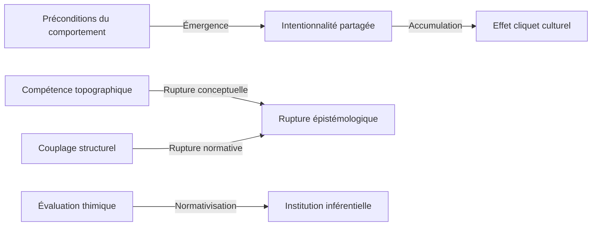

# 🔄 Transitions de Cadre

## Statut du document

Ce document définit la théorie des transitions au sein de Protokin cOS.

Les transitions constituent le mécanisme fondamental permettant de comprendre comment un régime de couplage atteint ses limites de stabilisation et comment un autre régime devient nécessaire pour poursuivre l'activité descriptive.

Une transition ne décrit jamais une transformation du réel lui-même.

Elle décrit une transformation du cadre de lecture utilisé par un observateur pour maintenir la cohérence, l'intelligibilité et l'opérativité de ses descriptions.

Dans cette perspective, les transitions sont des événements épistémiques avant d'être des événements théoriques.

Elles concernent les conditions de possibilité de la connaissance et non la structure ultime du monde.

---

# Principe fondamental

Protokin cOS repose sur l'hypothèse qu'aucun régime de couplage ne possède une validité universelle.

Chaque régime est :

- localement cohérent ;
- partiellement aveugle ;
- limité par ses propres critères de stabilisation.

Tant qu'un régime demeure capable de sélectionner, maintenir et interpréter ses invariants, aucune transition n'est nécessaire.

Lorsque cette capacité se dégrade ou disparaît, une transition peut devenir indispensable.

Une transition apparaît donc lorsque l'intelligibilité locale cesse d'être suffisante.

---

# Définition générale

Une transition de cadre est définie comme :

> Le passage d'un régime de stabilisation descriptive à un autre lorsque les conditions locales de cohérence, de prédiction ou d'interprétation ne peuvent plus être maintenues dans le régime initial.

La transition ne remplace pas un régime faux par un régime vrai.

Elle remplace un régime devenu insuffisant par un régime mieux adapté à la stabilisation d'un nouvel ensemble d'invariants.

---

# Pourquoi les transitions existent-elles ?

Si les régimes sont irréductibles, pourquoi existe-t-il des transitions ?

Parce que les invariants eux-mêmes peuvent évoluer.

Certains invariants demeurent stables à l'intérieur d'un même régime.

D'autres révèlent progressivement des propriétés qui deviennent inaccessibles à ce régime.

L'apparition de nouvelles contraintes descriptives oblige alors l'observateur à mobiliser un autre mode de stabilisation.

Les transitions constituent ainsi la dynamique interne de la constellation des régimes.

---

# Les trois formes fondamentales de transition

## 1. Réinterprétation

### Définition

La réinterprétation intervient lorsqu'un invariant demeure relativement stable mais reçoit une nouvelle signification à travers un autre régime.

L'objet observé ne change pas.

Le cadre d'interprétation change.

### Exemple

Un geste observable peut être interprété comme :

- un déplacement physique ;
- un comportement biologique ;
- une action intentionnelle ;
- un engagement normatif.

Le phénomène demeure identique.

Les critères de lecture changent.

### Fonction

La réinterprétation permet :

- l'enrichissement descriptif ;
- la pluralité des lectures ;
- la coexistence de plusieurs niveaux d'intelligibilité.

### Schéma

```text
Invariant stable
       ↓
Changement d'interprétation
       ↓
Nouveau régime
```

---

## 2. Émergence

### Définition

L'émergence intervient lorsqu'un invariant nouveau apparaît.

Cet invariant ne peut pas être stabilisé par les ressources conceptuelles du régime initial.

Un nouveau régime devient alors nécessaire.

### Exemple

La coordination sociale ne peut pas être décrite uniquement par les mécanismes biologiques.

L'intentionnalité partagée nécessite l'apparition d'un régime spécifique.

```text
Préconditions biologiques
           ↓
Intentionnalité partagée
```

### Fonction

L'émergence permet :

- l'apparition de nouveaux espaces descriptifs ;
- l'extension des capacités d'observation ;
- la stabilisation de phénomènes auparavant invisibles.

### Schéma

```text
Nouvel invariant
        ↓
Instabilité du régime actuel
        ↓
Activation d'un nouveau régime
```

---

## 3. Rupture normative

### Définition

La rupture normative constitue la transition la plus importante de Protokin.

Elle correspond au passage :

- de l'espace des causes ;
- vers l'espace des raisons.

Cette rupture est principalement associée au pilier sellarsien.

### Exemple

Une action peut être :

- expliquée par des mécanismes causaux ;
- justifiée par des raisons.

Ces deux descriptions ne répondent pas à la même question.

### Avant la rupture

Question :

> Pourquoi cela s'est-il produit ?

### Après la rupture

Question :

> Pourquoi cela est-il justifié ?

### Fonction

La rupture normative rend possibles :

- la critique ;
- la justification ;
- la responsabilité ;
- l'institution des normes ;
- l'argumentation rationnelle.

### Schéma

```text
Causes
   ↓
Limites explicatives
   ↓
Raisons
```

---

# Conditions de déclenchement

Une transition n'est jamais automatique.

Elle apparaît lorsqu'une instabilité devient suffisamment importante.

## Perte de stabilité

Le régime ne parvient plus à maintenir ses invariants.

## Contradictions internes

Des descriptions incompatibles apparaissent au sein du même cadre.

## Saturation descriptive

Le nombre de correctifs nécessaires augmente continuellement.

## Apparition d'un nouvel invariant

Un phénomène stable devient visible mais reste inintelligible dans le régime actuel.

## Perte de pouvoir prédictif

Le régime cesse de produire des anticipations opératoires.

---

# Cartographie des transitions majeures

## Transition A

### P7 → P8

Préconditions biologiques → Intentionnalité partagée

**Type :** Émergence

**Question :**

Comment un comportement devient-il une coordination sociale ?

---

## Transition B

### P8 → P9

Intentionnalité partagée → Effet cliquet culturel

**Type :** Accumulation historique

**Question :**

Comment une coordination devient-elle transmissible ?

---

## Transition C

### P4 → P11

Compétence topographique → Rupture épistémologique

**Type :** Rupture conceptuelle

**Question :**

Comment passe-t-on des objets aux raisons ?

---

## Transition D

### P10 → P11

Couplage structurel → Espace des raisons

**Type :** Rupture normative

**Question :**

Comment passe-t-on des causes aux justifications ?

---

## Transition E

### P12 → P13

Évaluation thimique → Institution inférentielle

**Type :** Normativisation

**Question :**

Comment une valeur devient-elle une norme ?

---

# Graphe général des transitions



---

# Utilisation dans un audit Protokin

Lorsqu'une instabilité est détectée, l'audit doit déterminer :

1. Quel régime est actuellement mobilisé.
2. Quel invariant devient instable.
3. Quelle forme de transition est impliquée.
4. Quel régime pourrait restaurer la stabilité descriptive.
5. Si cette transition introduit de nouvelles tensions.

Une transition ne constitue pas une solution définitive.

Elle déplace simplement le problème vers un autre espace de stabilisation.

---

# Principe épistémologique final

> Les transitions ne décrivent pas des changements du réel.

> Elles décrivent les transformations nécessaires des cadres de stabilisation lorsqu'un régime atteint les limites de sa capacité descriptive.

Ainsi :

- les régimes constituent la géographie de Protokin cOS ;
- les transitions constituent sa dynamique ;
- les tensions constituent sa topologie critique.