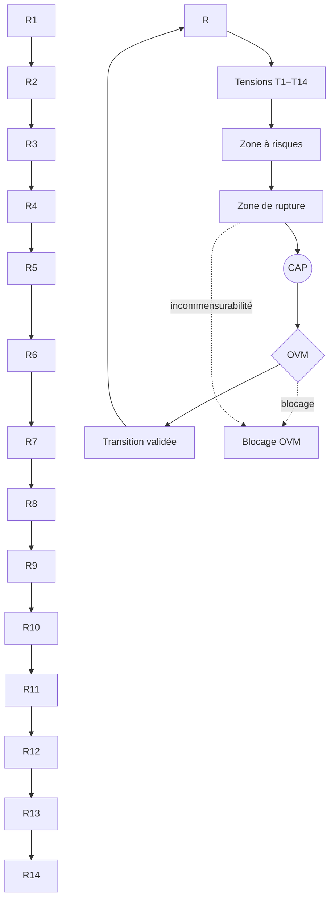

📌 Nom recommandé du fichier

👉 PROTOKIN_cOS_Schema_Global_ContentLayer_Kernel.md

Options alternatives (plus “système”) :

Protokin_cOS_Macroarchitecture.md

Protokin_Global_Architecture_P1-P14_Kernel.md

cOS_ContentLayer_Kernel_FullSchema.md

👉 Le plus propre et extensible :
PROTOKIN_cOS_Schema_Global_ContentLayer_Kernel.md

---

📄 MARKDOWN INTÉGRAL COPIABLE

# 🧭 SCHÉMA GLOBAL PROTOKIN cOS

## Architecture complète des régimes, audits et transitions

---

# 0. Vue d’ensemble (principe global)

Protokin cOS est une architecture à **quatre niveaux emboîtés non hiérarchiques ontologiquement**, mais strictement distincts opératoirement :

[ P1–P14 ] → Couche des régimes (Content Layer) [ T / ZAR / ZR ] → Couche des instabilités descriptives [ CAP / OVM ] → Kernel opératoire (audit + validation) [ Transition ] → Opérateur de reconfiguration inter-régimes

---

# 1. COUCHE I — LES RÉGIMES (R1–Rn)

## 🌐 Fonction

Les régimes sont des **modes stables de sélection d’invariants**.

Ils ne décrivent pas le réel :
ils décrivent des manières différentes de stabiliser le réel.

---

## 🧩 Organisation des régimes

### ⚙️ Physico-dynamique

- R1 — Cinétique protonique  
- R2 — Dissipation structurée  
- R3 — Allostasie  

---

### 🧠 Cognitif / biologique

- R4 — Compétence topographique  
- R5 — Minimisation de la surprise  
- R6 — Récursion prospective  
- R7 — Couplage structurel  

---

### 👥 Socio-développemental

- R8 — Intentionnalité partagée  
- R9 — Effet cliquet culturel  

---

### ⚖️ Normatif / métathéorique

- R10 — Couplage des pratiques  
- R11 — Espace des raisons  
- R12 — Évaluation thimique  
- R13 — Institution inférentielle  
- R14 — Validation axiomatique
- Rn...

---

## 🔑 Principe structurel

Chaque régime = un mode de couplage observateur–système

---

# 2. COUCHE II — INSTABILITÉS DESCRIPTIVES

---

## ⚡ 2.1 Tensions (T1–Tn)

### Fonction

Signal local de désalignement inter-régimes.

### Rôle

- détecter incompatibilités  
- signaler erreurs de traduction  
- marquer différences d’échelle  

---

## ⚠️ 2.2 Zones à risques (ZAR)

### Définition

Ensemble stabilisé de tensions persistantes sans rupture effective.

### Propriétés

- multi-tensions actives  
- traductibilité encore possible  
- instabilité structurelle durable  

### Fonction

👉 indiquer une **pré-transition active**

---

## 💥 2.3 Zones de rupture (ZR)

### Définition

Incommensurabilité effective entre régimes.

### Propriétés

- perte de traduction stable  
- rupture des invariants communs  
- nécessité d’un opérateur externe (CAP)  

### Fonction

👉 déclencher ou rendre nécessaire une transition

---

# 3. COUCHE III — KERNEL OPÉRATOIRE

---

## 🧠 3.1 CAP (Cycle d’Audit Protokin)

### Fonction

Moteur dynamique de reconfiguration.

### Opérations

1. Détection (Tensions / ZAR / ZR)  
2. Isolation des invariants  
3. Analyse des incompatibilités  
4. Proposition de transition  

---

## 🛡 3.2 OVM (Opérateur de Vigilance Modale)

### Fonction

Filtre de cohérence structurelle.

### Interdictions :

- fusion illégitime de régimes (T11)  
- réification des régimes ou zones (T14)  
- réduction inter-régime (T1)  
- confusion ZAR ↔ ZR  

---

## ⚖️ Principe Kernel

CAP propose une reconfiguration.  
OVM valide la cohérence de cette reconfiguration.

---

# 4. COUCHE IV — FLUX DE TRANSITION

---

# 🔁 4.1 Typologie des transitions

## (1) Réinterprétation

- même phénomène  
- changement de lecture  
- faible friction  

---

## (2) Émergence

- nouveau régime devient pertinent  
- invariants se reconfigurent  
- continuité partielle  

---

## (3) Rupture

- passage via ZR  
- incommensurabilité forte  
- médiation nécessaire  

---

## (4) Blocage OVM

- violation structurelle  
- fusion interdite  
- arrêt du passage  

---

# 5. DYNAMIQUE GLOBALE DU SYSTÈME

---

## 🔄 Cycle complet

R-régimes (stabilisation) ↓ Tensions (désalignement local) ↓ ZAR (instabilité persistante) ↓ ZR (rupture de commensurabilité) ↓ CAP (diagnostic + reconfiguration) ↓ OVM (validation structurelle) ↓ Transition (R → R)

---

# 6. ARCHITECTURE INTÉGRÉE (SCHÉMA GLOBAL)

---

7. INTERPRÉTATION STRUCTURELLE

---

🧩 7.1 Lecture des régimes

Les régimes sont :

des lentilles de stabilisation

pas des niveaux du réel

pas des couches ontologiques

---

⚡ 7.2 Lecture des tensions

Les tensions sont :

des signaux de friction descriptive

non des contradictions du monde

---

⚠️ 7.3 Lecture des ZAR

Les ZAR sont :

des zones de métastabilité descriptive

où plusieurs lectures coexistent encore

---

💥 7.4 Lecture des ZR

Les ZR sont :

des discontinuités de commensurabilité

nécessitant un changement de cadre

---

🧠 7.5 Lecture du Kernel

Le Kernel est :

un système d’audit récursif

non une autorité ontologique

mais un filtre de stabilité descriptive

---

8. PRINCIPES FONDAMENTAUX

---

P1 — Anti-réification

Aucun élément du système n’est une entité du monde.

---

P2 — Localité des régimes

Chaque régime est valide uniquement dans son couplage.

---

P3 — Non-hiérarchie

Aucun régime n’est supérieur à un autre.

---

P4 — Tensions comme conditions de transition

Les tensions ne causent pas les transitions :
elles les rendent détectables.

---

P5 — Rupture comme opération, pas comme événement

Une rupture est une reconfiguration de cadre, pas un fait brut.

---

9. FORMULE KERNEL FINALE

Les régimes stabilisent le monde comme description.
Les tensions détectent les désalignements.
Les ZAR prolongent l’instabilité.
Les ZR marquent l’incommensurabilité.
Le CAP reconfigure.
L’OVM garantit la cohérence.
Les transitions déplacent les régimes sans jamais les hiérarchiser.

---

10. SYNTHÈSE FINALE

Protokin cOS n’est pas :

une théorie du monde

une hiérarchie des niveaux

une ontologie stratifiée

Mais :

une architecture récursive de stabilisation, d’audit et de transition entre modes de description.

