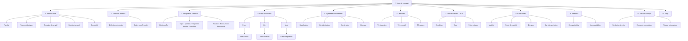

```mermaid
graph TD

A["📌 Nom du concept"]

%% =========================
%% IDENTIFICATION
%% =========================

A --> B["1. Identification"]

B --> B1["Famille"]
B --> B2["Type ontologique"]
B --> B3["Domaine descriptif"]
B --> B4["Statut structurel"]
B --> B5["Centralité"]

%% =========================
%% DÉFINITION
%% =========================

A --> C["2. Définition externe"]

C --> C1["Définition minimale"]
C --> C2["Cadre non-Protokin"]

%% =========================
%% PROTOKIN
%% =========================

A --> D["3. Assignation Protokin"]

D --> D1["Régimes Pn"]
D --> D2["Type : opérateur / régime / tension / transition"]
D --> D3["Position : Proto / Kin / transversal"]

%% =========================
%% EFFETS
%% =========================

A --> E["4. Effets structurels"]

E --> E1["Proto"]
E --> E2["Kin"]
E --> E3["Meta"]

E1 --> E1a["Effet causal"]
E2 --> E2a["Effet normatif"]
E3 --> E3a["Effet interprétatif"]

%% =========================
%% SYNTHÈSE
%% =========================

A --> F["5. Synthèse fonctionnelle"]

F --> F1["Stabilisation"]
F --> F2["Déstabilisation"]
F --> F3["Génération"]
F --> F4["Blocage"]

%% =========================
%% TENSIONS
%% =========================

A --> G["6. Tensions"]

G --> G1["T1 réduction"]
G --> G2["T4 normatif"]
G --> G3["T5 rupture"]

%% =========================
%% TRANSITION
%% =========================

A --> H["7. Transition Proto → Kin"]

H --> H1["Condition"]
H --> H2["Type"]
H --> H3["Point critique"]

%% =========================
%% CONTRAINTES
%% =========================

A --> I["8. Contraintes"]

I --> I1["Validité"]
I --> I2["Perte de validité"]
I --> I3["Dérives"]
I --> I4["Sur-interprétation"]

%% =========================
%% RELATIONS
%% =========================

A --> J["9. Relations"]

J --> J1["Compatibilités"]
J --> J2["Incompatibilités"]

%% =========================
%% SYNTHÈSE FINALE
%% =========================

A --> K["10. Lecture critique"]

K --> K1["Réduction à éviter"]
K --> K2["Confusions possibles"]
K --> K3["Risque ontologique"]

A --> L["11. Tags"]

```