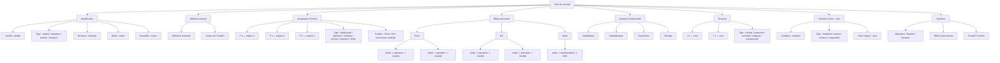

```mermaid

flowchart TD

A["Nom du concept"]

%% =========================
%% IDENTIFICATION
%% =========================

A --> B["Identification"]

B --> B1["Famille : famille"]
B --> B2["Type : regime / operateur / tension / transition"]
B --> B3["Domaine : domaine"]
B --> B4["Statut : statut"]
B --> B5["Centralité : niveau"]

%% =========================
%% DÉFINITION EXTERNE
%% =========================

A --> C["Définition externe"]

C --> C1["Definition minimale"]
C --> C2["Cadre non-Protokin"]

%% =========================
%% ASSIGNATION PROTOKIN
%% =========================

A --> D["Assignation Protokin"]

D --> D1["P n — regime 1"]
D --> D2["P n — regime 2"]
D --> D3["P n — regime 3"]

D --> D4["Type : stabilisation / operateur / interface / tension / transition / limite"]
D --> D5["Position : Proto / Kin / transversal / hybride"]

%% =========================
%% EFFETS STRUCTURELS
%% =========================

A --> E["Effets structurels"]

E --> E1["Proto"]
E1 --> E1a["entite -> operation -> resultat"]
E1 --> E1b["entite -> operation -> resultat"]

E --> E2["Kin"]
E2 --> E2a["entite -> operation -> resultat"]
E2 --> E2b["entite -> operation -> resultat"]

E --> E3["Meta"]
E3 --> E3a["entite -> transformation -> effet"]

%% =========================
%% SYNTHÈSE
%% =========================

A --> F["Synthèse fonctionnelle"]

F --> F1["Stabilisation"]
F --> F2["Déstabilisation"]
F --> F3["Generation"]
F --> F4["Blocage"]

%% =========================
%% TENSIONS
%% =========================

A --> G["Tensions"]

G --> G1["T n — nom"]
G --> G2["T n — nom"]
G --> G3["Type : echelle / traduction / normatif / collapsus / compression"]

%% =========================
%% TRANSITION
%% =========================

A --> H["Transition Proto -> Kin"]

H --> H1["Condition : condition"]
H --> H2["Type : mediation / rupture / continue / impossible"]
H --> H3["Point critique : seuil"]

%% =========================
%% SYNTHÈSE GLOBALE
%% =========================

A --> I["Synthèse"]

I --> I1["Operateur / Regime / Interface"]
I --> I2["Effets multi-niveaux"]
I --> I3["Position Protokin"]
```