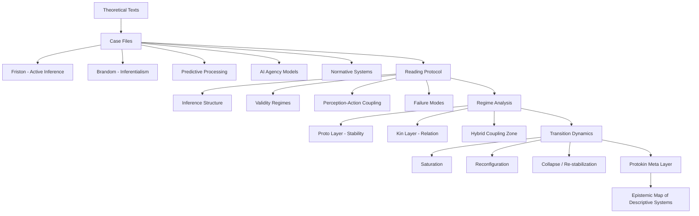

Voici une version enrichie de l’index.md avec vraie logique de navigation + “pseudo-UI cognitive” plus cohérente + intégration Mermaid + structure de navigation exploitable GitHub.

On garde ton idée d’interface mentale, mais on la rend plus stable, moins fictionnelle, plus “tool-like sérieux”.

---

# Protokin

## A reading interface for descriptive and inferential systems

---

# ⟡ SYSTEM STATUS

> You are not reading a document.  
> You are navigating a space of descriptive regimes.

---

# ⟡ CORE INTERFACE

Protokin is a comparative framework for analyzing how systems:

- construct descriptions
- stabilize models
- generate inferences
- justify statements
- fail, saturate, and transform

It operates as a **multi-lens reading environment**.

---

# ⟡ NAVIGATION MODES

Choose a lens:

- 🟦 Proto → stability, constraints, generative structures
- 🟨 Kin → relations, justification, inferential structure
- 🟩 Hybrid → coupling of stability and relation
- 🧩 Case Mode → analysis of theoretical systems
- 🧠 Meta Mode → observation of description systems themselves

---

# ⟡ GLOBAL ARCHITECTURE MAP

---

⟡ LENS SYSTEM

🟦 PROTO LENS

You are analyzing:

stabilizing constraints

generative conditions

physical / computational structure

persistence of systems

Question

> What allows a system to exist and remain coherent?

---

🟨 KIN LENS

You are analyzing:

inferential relations

normative structures

justification chains

semantic coupling

Question

> What allows a system to count as valid or meaningful?

---

🟩 HYBRID LENS

You are analyzing the interaction between Proto and Kin:

how stability enables inference

how inference reshapes stability

how systems shift between both modes

Key insight

> No system is purely Proto or purely Kin
All systems distribute both dimensions

---

⟡ CASE MODE

You are now entering concrete systems of analysis:

Active Inference

Predictive Processing

Inferentialism (Sellars, Brandom)

AI agent architectures

normative systems and coordination structures

Each case is treated as a locally stable descriptive regime.

---

⟡ META MODE

In Meta Mode, you analyze:

how systems define inference

how they define validity

how they stabilize objects of knowledge

how they handle failure

how they transition between regimes

You are no longer inside a theory.

You are observing how theories construct themselves.

---

⟡ STATE MACHINE VIEW

PROTO ↑ (constraints, generativity)
KIN   ↑ (relations, justification)

System evolves through:

- saturation of constraints
- breakdown of justification
- instability of coupling

→ transition to new regime

---

⟡ TRANSITION PRINCIPLE

A system changes regime when:

it can no longer stabilize its descriptions (PROTO failure)

or it can no longer justify its inferences (KIN failure)

Protokin studies these transitions.

---

⟡ CORE QUESTION

> How do systems stabilize what exists
and justify what counts as meaningful?

---

⟡ ENTRY PATHS

Explore case studies

Learn the reading protocol

Switch analytical lens

Observe regime transitions

Study failure modes

---

⟡ STATUS

Protokin is:

a comparative epistemology framework

a multi-lens reading environment

a model for studying descriptive systems

It is not a theory.

It is an interface for analyzing theories.

---