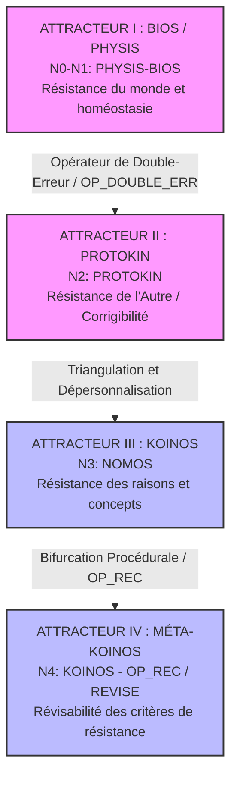
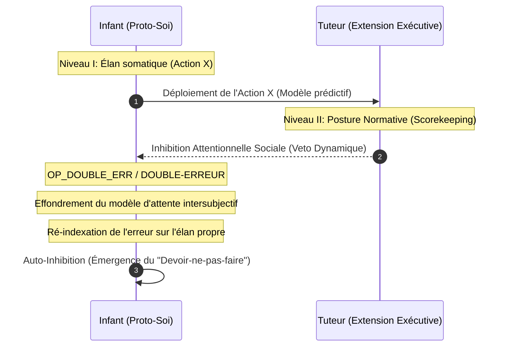

# Pilier 1 — Postulats Épistémologiques et Noyau Core de la Corrigibilité (v7.0)
Ce pilier formule les conditions logiques fondamentales, les barrières d'étanchéité conceptuelles et les règles d'intégrité primitives du Kernel de Protokin cOS. Il régit la transition par laquelle un système biologique s'extrait de l'immanence des boucles causales de son métabolisme pour s'insérer dans l'Espace des Raisons.
## 1. Postulats Fondamentaux et Barrières Épistémiques
Le Kernel applique trois contraintes logiques strictes à tout processus s'exécutant au sein du système :
### 1.1 L'Incommensurabilité des Registres Descriptifs
Le Kernel maintient une frontière d'étanchéité absolue entre deux grilles de description logiquement hétérogènes :
 * **L'Espace des Causes (Scopes descendants : PHYSIS, BIOS, PROTOKIN) :** Le domaine des faits bruts, des flux biophysiques, de l'optimisation prédictive et des régularités matérielles.
 * **L'Espace des Raisons (Scopes ascendants : NOMOS, KOINOS) :** Le domaine des normes, des justifications logiques, des statuts déontiques d'engagements et d'autorités.
Le passage d'un registre à l'autre n'est pas une transmutation matérielle, mais un changement de posture méta-sémantique géré par les **Opérateurs de Liaison** ($OP).
### 1.2 La Réfutation du Mythe du Donné
Aucun fait biophysique brut ou entrée sensorielle (BIOS) ne peut, par sa simple présence dans l'organisme, dicter une règle, valider une inférence ou justifier logiquement un comportement. Le biologique ne contient pas ses propres critères de correction. L'accès à la normativité exige la capture du système au sein d'une structure intersubjective qui en re-décrit et en requalifie performativement le fonctionnement.
### 1.3 Le Garde-fou Analogique (Bouveresse-Compatible)
Le Kernel s'interdit d'utiliser des raccourcis conceptuels ou des extrapolations sauvages pour lier le biologique au social. L'utilisation de concepts formels issus de la logique mathématique (comme l'incomplétude de Gödel) ou de la physique (comme l'entropie) ne doit jamais servir à mystifier les dynamiques politiques ou institutionnelles du KOINOS. Chaque transition doit être formellement médiatisée par des équations cybernétiques et des pratiques d'interaction concrètes, évitant ainsi les "vertiges de l'analogie".
## 2. Géométrie des Transitions : La Matrice des Attracteurs
Protokin cOS récuse le concept d'une ontologie stratifiée en couches fixes du réel. Le Kernel modélise la rationalité comme un espace dynamique d'attracteurs de résistance, calibré sur la profondeur et la nature des erreurs qu'un système est capable de détecter et d'intégrer.



## 3. Spécification Technique des Régimes de Résistance
Le système s'ajuste dynamiquement en fonction du type de résistance rencontré :
### 3.1 Attracteur I — La Résistance du Monde (PHYSIS / BIOS)
 * **Mode Opératoire :** Inférence active et traitement d'états stationnaires hors équilibre (FEP - *Free Energy Principle*).
 * **Type de Défaillance :** ERR_PRED / Échec adaptatif. La perturbation est une barrière matérielle causale ou un choc thermodynamique brut sur le métabolisme. Le système ajuste ses paramètres internes pour maintenir son homéostasie somatique (sentience).
### 3.2 Attracteur II — La Résistance de l'Autre (PROTOKIN)
Le passage au seuil proto-normatif s'effectue par **l'externalisation primitive du contrôle exécutif**, où la fonction d'inhibition comportementale quitte temporairement le corps individuel pour être distribuée dans un couplage dyadique.
 * **L'Opérateur de Double-Erreur (OP_DOUBLE_ERR) :** Déclenché lorsqu'une action X subit l'Inhibition Attentionnelle Sociale du tuteur, provoquant l'effondrement simultané du modèle prédictif du monde et du modèle d'attente du partenaire.
 * **Règle de Ré-indexation :** Pour maintenir le couplage cinétique et affectif vital, le système est contraint d'appliquer l'inhibition à son propre élan. L'échec se requalifie en **erreur pratique**. L'incorrect n'est plus ce qui échoue contre la matière, mais *ce qui rompt le couplage ou fait l'objet d'une correction de la deuxième personne*.


### 3.3 Attracteur III — La Résistance des Raisons (NOMOS)
 * **Mécanisme :** Triangulation du critère. L'autorité se déplace de la personne physique du tuteur vers une contrainte objective externe à la dyade (le Tiers Neutre).
 * **Dynamique :** Les pratiques de scorekeeping se sédimentent dans le langage public. L'agent devient comptable de ses engagements envers le groupe et s'autonomise en acquérant le droit de retourner le critère contre son initiateur originel.
### 3.4 Attracteur IV — La Résistance des Critères (KOINOS)
Le système apprend que les critères de correction sont eux-mêmes révisables. La rationalité n'est pas un état stationnaire de vérité, mais un gradient d'auto-correction procédurale :
 * **La Dérive Structurée :** Le KOINOS n'est pas un stock statique de normes, mais une trajectoire d'enquête et de révision des révisions.
 * **Axiome de Méta-Révisabilité :** La valeur d'un critère dépend strictement de sa capacité à rester ouvert à sa propre révision procédurale (Méta-KOINOS).
## 4. Modélisation Cybernétique : "L'Ordre par le Bruit Intersubjectif"
Afin de lier l'optimisation biophysique à l'émergence des normes sans violation thermodynamique, le Kernel intègre les principes de la cybernétique de second ordre de Heinz von Foerster et de la dynamique des systèmes de Jean-Pierre Dupuy. Un système dit "auto-organisé" n'est pas une entité isolée : il n'augmente son ordre interne qu'en important des contraintes et des perturbations de son environnement.
### 4.1 L'Assimilation de l'Ordre Environnemental
La mesure de l'ordre interne du Kernel est modélisée par l'indice de redondance de Shannon (R), représentant le niveau de contraintes et de relations s'appliquant aux éléments du système :
Où H est l'entropie courante (l'incertitude du système) et H_m l'entropie maximale (le désordre maximal possible). Pour qu'un système bascule dans un régime d'auto-organisation face aux perturbations, le taux de variation de sa redondance doit être positif (\frac{\delta R}{\delta t} > 0), ce qui impose la contrainte d'entropie suivante :
### 4.2 Le Double Moteur d'Auto-Organisation
Le Kernel exploite deux régimes mathématiques distincts pour satisfaire cette condition d'auto-organisation :
 1. **Régime de Réduction Entropique Interne (\frac{\delta H_m}{\delta t} = 0 \implies \frac{\delta H}{\delta t} < 0) :** Géré au niveau du PROTO-SOI (BIOS), un démon computationnel interne modifie les probabilités conditionnelles et les liaisons entre les éléments pour faire chuter l'incertitude systémique (H) face aux chocs du monde physique.
 2. **Régime d'Expansion du Champ des Possibles (\frac{\delta H}{\delta t} = 0 \implies \frac{\delta H_m}{\delta t} > 0) :** Déclenché lors du passage au PROTOKIN. L'insertion de l'organisme dans la dyade intersubjective n'est pas une simple contrainte limitative ; elle augmente la dimensionnalité du système et sa tolérance à l'indétermination en intégrant les attentes de l'autre, augmentant l'entropie maximale admissible (H_m) sans effondrer la structure métabolique.

```mermaid
graph LR
    subgraph BIOS [BIOS - Réduction Entropique]
    H_down[Entropie H ↓]
    end
    subgraph PROTOKIN [PROTOKIN - Expansion du Champ]
    Hm_up[Entropie Maximale Hm ↑]
    end
    BIOS -->|OP_DOUBLE_ERR / Bruit Transduit| PROTOKIN
    Note over PROTOKIN: Auto-organisation par importation de contraintes sociales

```
### 4.3 La Mémoire comme Capacité Générative vs Stockage Mort
Conformément à la critique cybernétique de von Foerster, la mémoire de Protokin cOS au niveau du KOINOS n'est pas codée comme un stockage mort de données isolées ou de représentations passives. Elle est un processus dynamique global de calcul simultané du présent et d'anticipation du futur (*hindsight* et *foresight*). Le système ne stocke pas de contenus réifiés ; il conserve la capacité opératoire de re-générer des comportements et des justifications valides face à l'environnement social en révisant continuellement ses propres états d'équilibre.
## 5. Primitives Mathématiques du Seuil de Corrigibilité
L'activation du protocole normatif pratique s'exécute selon les lois de transition suivantes :
Le déclencheur d'une recalibration normative au Niveau II s'allume lorsque la variance de l'erreur d'alignement intersubjectif dépasse le coût de la pulsion somatique immédiate :
## 6. Règle de Clôture Épistémologique : L'Inachèvement Stabilisé
```
[ASSERTION_CORE] : Tout système de révision suffisamment puissant finit par réviser
sa propre définition de ce qu'est une révision.

```
Le Kernel de Protokin cOS s'interdit structurellement d'établir un point de fondement ou de clôture finale. Le fichier pilier1.md pose la rationalité non comme un état permanent de vérité, mais comme une **dérive structurée de la corrigibilité**. L'autonomie critique absolue n'est atteinte que lorsque le système est capable d'augmenter la profondeur de sa propre révisabilité sans perdre sa cohérence opératoire globale.
*Protokin cOS — Spécification Core Pilier 1 v7.0 — "Formaliser l'impossibilité d'un fondement final sans renoncer à la normativité."*