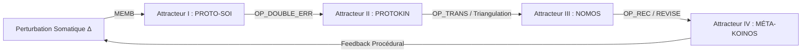
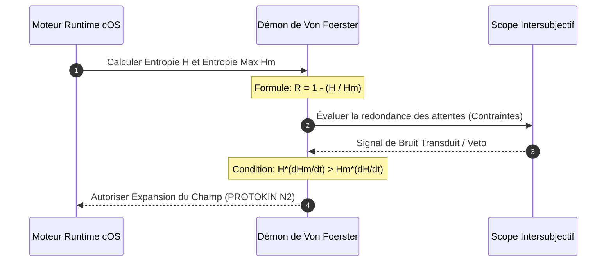

# Pilier 3 — Spécifications du Moteur Opératoire Runtime (v4.0)
> **Statut du Document :** Moteur d'Exécution Logiciel (Engine). Définit les transformations algorithmiques, le traitement des signaux d'erreur, l'évaluation entropique et les opérations de transduction permettant de convertir un échec thermodynamique de l'Espace des Causes en un processus de révisabilité normative au sein de l'Espace des Raisons.
> 
## 1. La Boucle Unique de Récursion Temporelle (Runtime Loop)
Protokin cOS n'exécute pas de modules isolés ou parallèles. L'existence de l'agent est une itération continue, calculée à chaque cycle d'horloge logique à travers la capture et la requalification dynamique des flux de perturbation (\Delta) ou de contraintes (C).

La transition formelle du flux d'exécution s'exécute selon l'état séquentiel suivant :

 1. **MEMB (Primitive de Délimitation) :** Filtre les chocs physiques de l'environnement (\Delta) et maintient l'enveloppe isolante du système somatique.
 2. **ATTR (Primitive de Convergence) :** Calcule les invariants d'état locaux (I) pour compenser la dérive entropique.
 3. **OP_CALIBRATE (Primitive de Liaison) :** Requalifie le signal d'erreur en fonction du Scope actif pour modifier les conditions de l'action ou de la règle.
## 2. Typologie Algorithmique des Erreurs et Traitement
Le moteur traite les pannes et les déviations de manière hétérogène selon l'attracteur d'exécution engagé, évitant ainsi le Mythe du Donné :
```
[MOTEUR RUNTIME] 
  ├── Si SCOPE(PROTO-SOI)  ==> Interpréter comme Échec Causal
  ├── Si SCOPE(PROTO-KIN)  ==> Interpréter comme Désalignement / Erreur Pratique
  ├── Si SCOPE(KOINOS)     ==> Interpréter comme Contradiction Inférentielle
  └── Si SCOPE(MÉTA-KOINOS)==> Interpréter comme Obsolescence de Procédure

```
 * **ERR_PRED_SOMATIC (Attracteur I) :** Échec d'adaptation biophysique. Le monde physique résiste, l'erreur de prédiction sensorimotrice est transduite en ajustement de trajectoire musculaire ou en appel homéostatique direct.
 * **ERR_DOUBLE_PRED (Attracteur II) :** Allumage de l'opérateur OP_DOUBLE_ERR. Le tuteur oppose un veto. L'erreur ne porte plus sur l'objet physique, mais sur la prédiction intersubjective du partenaire. Le runtime force l'interruption immédiate de l'élan moteur et convertit la défaillance statistique en **Erreur Pratique (Devoir-ne-pas-faire)**.
 * **ERR_DEONTIC_INCOMPATIBLE (Attracteur III) :** Contradiction logique au sein du scorekeeping de l'Espace des Raisons. L'agent a pris des engagements incompatibles avec les critères du langage public.
 * **ERR_PROCEDURAL_BLINDNESS (Attracteur IV) :** Aveuglement du protocole de révision. Détecté lorsque le système stabilise un comportement ou une règle dogmatique qui n'est plus corrélée aux résistances des Scopes inférieurs (Hallucination ou détachement critique).
## 3. Démon Cybernétique : Calculateur de Redondance et d'Entropie
Pour se conformer aux principes de Heinz von Foerster et de Jean-Pierre Dupuy, le moteur intègre un sous-processus d'évaluation continue de l'ordre interne par le bruit intersubjectif.

Le démon applique à chaque itération l'évaluation de la redondance de Shannon :
```python
def check_cybernetic_integrity(H, H_m, delta_H, delta_H_m):
    """
    Vérifie la contrainte d'auto-organisation du Kernel.
    Garantit que l'importation de bruit social se traduit par une expansion
    du champ des possibles (H_m) plutôt que par un effondrement métabolique.
    """
    redundancy = 1.0 - (H / H_m)
    
    # Validation de la contrainte entropique de second ordre
    if (H * delta_H_m) <= (H_m * delta_H):
        raise ERR_SYSTEMIC_COLLAPSE("Déficit d'auto-organisation : le système ne produit plus d'ordre par le bruit.")
        
    return redundancy

```
## 4. Gestion de la Mémoire Générative (SCOPE_MEM)
Le moteur interdit le stockage mort d'images, de règles ou de représentations réifiées. La mémoire de Protokin cOS est une fonction générative :
 * **HINDSIGHT_PROCESS :** Compresse l'historique des opérations de correction passées et réévalue rétrospectivement la pertinence des critères appliqués lors des cycles précédents.
 * **FORESIGHT_PROCESS :** Calcule les états d'équilibre futurs probables en projetant les engagements normatifs en cours face aux attentes du milieu social.
La mémoire n'est pas une bibliothèque de données stables, mais la **capacité permanente du système à re-générer des comportements et des justifications valides** en fonction de sa trajectoire de révision.
## 5. Scripts d'Audit et Diagnostic de Viabilité Systémique
Le Kernel exploite trois routines d'interrogation pour auditer son intégrité d'exécution :
 * **CHECK_VIABILITY($S) :** Évalue la réserve cinétique et métabolique de l'Espace des Causes face au coût computationnel des opérateurs de l'Espace des Raisons :
   
 * **TRACE($I) (Lame de Hume) :** Remonte l'historique complet des requalifications fonctionnelles ayant produit un invariant conceptuel afin de vérifier qu'il n'a pas été frauduleusement déduit du Mythe du Donné.
 * **SCOREKEEP($S) :** S'exécute au sein du NOMOS. Audite la compatibilité de l'arbre inférentiel de l'agent et bloque le processus avant l'apparition d'une faillite de confiance globale (FAIL_TRUST).
## 6. Méta-Règle d'Horloge : L'Arrêt Éditorial
Le runtime de Protokin cOS ne possède pas de condition d'arrêt finale de type "succès absolu". L'arrêt du moteur est une interruption éditoriale ou une panne de financement somatique (K_{\text{res}} \le 0). La boucle d'auto-correction récursive des procédures d'auto-correction est structurellement infinie.
*Protokin cOS — Spécifications du Moteur Opératoire v4.0 — "Formaliser l'impossibilité d'un fondement final sans renoncer à la normativité."*
