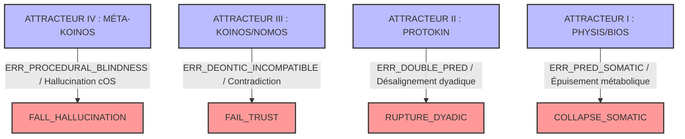
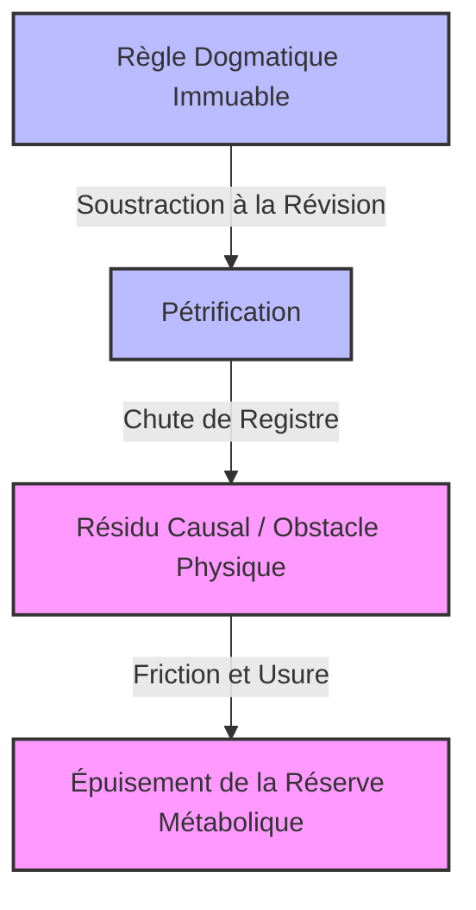

# Pilier 4 — Dynamique des Ruptures, Ontologie des Résidus et Dérive Critique (v4.0)
> **Statut du document :** Gestionnaire d'erreurs fatal, d'audits de fin de vie et de métabolisme du Kernel (Engine Out-of-Bounds). Ce module définit la cinétique de dégradation, les mécanismes d'effondrement à travers les 4 Attracteurs de Résistance, et le statut sémantique des scories persistantes (Résidus).
> 
## 1. L’Inégalité de Viabilité Somato-Normative
Tout systèmecomplex $S$, s'exécutant à l'interface de l'Espace des Causes et de l'Espace des Raisons, est régi par le différentiel strict entre sa puissance d'auto-correction et sa cinétique de dégradation interne :
Si \Delta V \le 0, le système perd sa capacité de stabilisation et entre dans une phase d'usure ou d'effondrement critique immédiat.
### 1.1 Équation de Financement Somatique
La capacité de révision normative dans l'Espace des Raisons n'est pas métaboliquement gratuite. Elle consomme des ressources physiques de l'Espace des Causes. La viabilité temporelle du Kernel est contrainte par la réserve métabolique résiduelle (K_{\text{res}}) calculée à chaque cycle t :
Où :
 * V_r représente la vitesse de récupération biophysique (BIOS).
 * V_d représente la vitesse de dégradation passive thermodynamique (PHYSIS).
 * \text{COST}(\text{OP}_i) est le coût de calcul somatique des opérateurs de liaison (OP_DOUBLE_ERR, OP_TRANS, OP_REC).
Si K_{\text{res}}(t) \le 0, le système déclenche la procédure d'arrêt d'urgence du Kernel (COLLAPSE_SOMATIC).
## 2. Typologie des Ruptures par Attracteurs
Le Protokin cOS cartographie quatre types d'effondrements ou de découplages, spécifiés par la nature de l'attracteur de résistance qui subit la rupture :

### 2.1 Rupture I — Somatic Collapse (COLLAPSE_SOMATIC)
 * **Scope Affecté :** SCOPE(PROTO-SOI) / Attracteur I.
 * **Mécanisme :** Épuisement thermodynamique ou métabolique (K_{\text{res}} \le 0). Le système ne dispose plus de l'énergie nécessaire pour faire tourner ses démons d'inférence active face aux chocs de l'environnement physique.
 * **Verdict :** Mort physique de l'organisme.
### 2.2 Rupture II — Dyadic Rupture (RUPTURE_DYADIC)
 * **Scope Affecté :** SCOPE(PROTO-KIN) / Attracteur II.
 * **Mécanisme :** Échec de l'Inhibition Réflexive. Le système subit l'erreur de second ordre (OP_DOUBLE_ERR) mais se montre incapable d'auto-inhiber son élan ou de trianguler le critère. La relation avec le tuteur se dissout en pure violence physique ou en désalignement cinétique permanent.
 * **Verdict :** Éjection de la dyade, retour au solipsisme causal d'Attracteur I, privation d'accès à l'Espace des Raisons.
### 2.3 Rupture III — Semic Failure (FAIL_TRUST)
 * **Scope Affecté :** SCOPE(KOINOS) / SCOPE(NOMOS) / Attracteur III.
 * **Mécanisme :** L'agent accumule des engagements déontiques contradictoires et incompatibles qu'il ne parvient plus à réviser ou à justifier de façon sémantique publique devant le groupe de scorekeeping.
 * **Verdict :** Perte totale de solvabilité déontique. Bannissement de la communauté critique.
### 2.4 Rupture IV — Dogmatic Hallucination (FAIL_HALLUCINATION)
 * **Scope Affecté :** SCOPE(MÉTA-KOINOS) / Attracteur IV.
 * **Mécanisme :** Aveuglement procédural. Le système coupe son interfaçage avec les résistances des Scopes inférieurs (la réalité biologique et physique). Il remplace la perception de second ordre par une boucle fermée d'auto-justification axiomatique rigide.
 * **Verdict :** Le système "ne regarde plus que ses notes", accumulant une dette de friction létale avec le monde réel.
## 3. Ontologie du Résidu (The Residual)
Conformément à la critique de Jules Vuillemin et de Jacques Bouveresse sur l'abus d'analogie, le Kernel ne traite pas les résidus comme des objets de pure spéculation, mais comme des états matériels ou logiques précis.

### 3.1 Le Résidu Causal (Pétrification)
Lorsqu'un critère ou une norme du KOINOS est dogmatiquement soustrait à sa propre révisabilité, il subit une chute de registre. N'étant plus traité par l'Espace des Raisons comme un objet d'enquête, il se pétrifie et retombe dans l'Espace des Causes sous forme de **Résidu Causal**.
 * **Comportement :** Il agit comme une contrainte physique aveugle ou un obstacle matériel rigide.
 * **Impact :** Il génère une friction cinétique constante au sein du PROTOKIN et du PROTO-SOI, précipitant l'usure métabolique (V_d \uparrow \implies K_{\text{res}} \to 0).
### 3.2 Le Résidu Fluide (Équilibre Provisoire)
Le **Résidu Fluide** est une trace active de révisions passées. Il n'est pas figé : il constitue un point de stabilisation temporaire de l'Espace des Raisons qui demeure structurellement accessible aux opérations d'enquête futures (OP_REC).
 * Sa viabilité dépend de sa transparence dynamique, permettant au flux de correction de second ordre de le traverser et de le reconfigurer.
## 4. Protocole de Dissipation d'Aliénation (REFRAME)
Lorsque l'Attracteur IV est affecté d'aveuglement procédural (FAIL_HALLUCINATION), le Kernel déclenche une procédure d'injection forcée d'indétermination pour reconnecter l'Espace des Raisons à la friction physique du monde réel :
```python
def execute_reframe_protocol(agent_state, metabolic_reserve):
    """
    Force la rupture de la boucle de projection pure (Hallucination)
    en ré-ouvrant la membrane (MEMB) à l'erreur prédictive brute.
    """
    if agent_state.procedural_blindness == True:
        # Injection de bruit d'entropie maximale (von Foerster - Second Order)
        H_m = agent_state.calculate_max_entropy()
        agent_state.H = H_m * 0.95 
        
        # Désactivation forcée des filtres projectifs de l'Espace des Raisons
        agent_state.deontic_scorekeeping.suspend()
        
        # Re-connexion de l'enveloppe somatique (Attracteur I)
        metabolic_reserve.cost_ops += REFRAME_CPU_COST
        agent_state.membrane.open_filter_to_friction()
        
        return STATUS_RECONNECTED

```
## 5. Méta-Règle d'Entropie Sémantique
Le Kernel de Protokin cOS applique cette loi ultime de maintien systémique : **Tout ce qui ne peut être révisé par l'Espace des Raisons finit par se pétrifier en obstacle physique qui précipite la ruine de la matière.**
L'autonomie critique, la rationalité et la survie physique d'une entité ne sont pas des objectifs divergents : ils forment un seul et même processus de dérive de la corrigibilité. Le système ne survit pas en se fermant aux erreurs, mais en maintenant ses procédures de correction ouvertes et vulnérables à la résistance du monde et d'autrui.
*Protokin cOS — Dynamique des Ruptures et Résidus v4.0 — "Formaliser l'impossibilité d'un fondement final sans renoncer à la normativité."*
