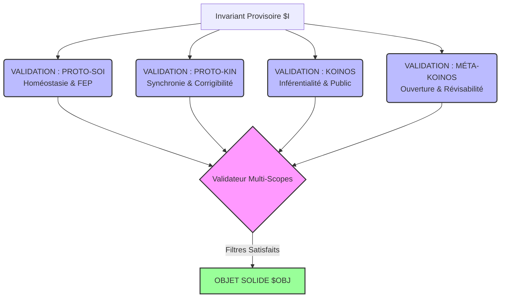
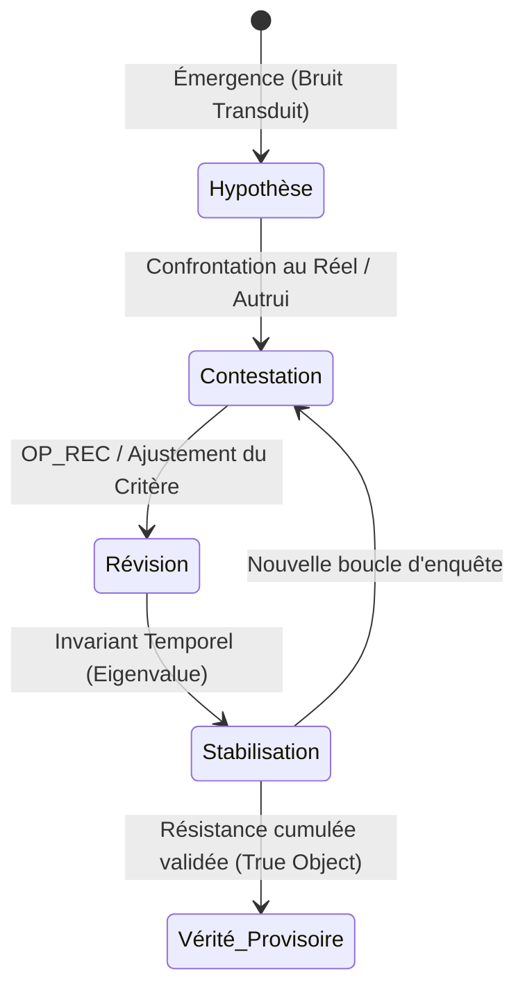

# Pilier 5 — Régimes d’Objectivité et Valeurs Propres (Le Validateur v4.0)
> **Statut du document :** Module de certification des invariants, de validation déontique et d'évaluation critique. Ce pilier convertit la notion classique et métaphysique de "Vérité" en une mesure d'efficience opérationnelle et de résistance d'une stabilisation face à des contraintes hétérogènes multi-scopes (La Performance de Tenue).
> 
## 1. Déclaration de l'Objet ($OBJ) et Valeurs Propres (*Eigenbehaviors*)
Conformément à la cybernétique de second ordre de Heinz von Foerster, Protokin cOS pose que **les objets ne sont pas des substances préexistantes, mais des jetons pour des comportements stables (Eigenbehaviors / Valeurs Propres)**.
Un invariant (I) n'est pas une représentation passive du monde extérieur (ce qui validerait le Mythe du Donné), mais le point fixe d'une opération cognitive ou sémantique récursive.
### 1.1 Formalisation de la Valeur Propre
Soit Op un opérateur de transformation du Kernel (tel que REVISE ou ATTR) et x un état ou une hypothèse systémique. L'état x est élevé au rang d'**Objet Solide** (OBJ) si et seulement si l'application répétée de l'opérateur ne modifie plus l'état du système. Il devient la valeur propre de l'opérateur :
Ou sous sa forme récursive générale d'auto-organisation :
L'objectivité est le produit de la récursion : le système ne découvre pas un monde déjà fait, il stabilise des invariants d'interaction.
## 2. Règle de Certification Multi-Attracteurs
Un invariant (I) n'est certifié comme valide et intégré par le Kernel que s'il satisfait simultanément les contraintes de résistance des 4 Scopes d'exécution, tout en conservant sa pureté et sa cohérence logique interne (Lame de Vuillemin) :

 * **Sanction :** Tout invariant défaillant à l'un des filtres de la matrice d'objectivité est dégradé. S'il n'influe sur aucune trajectoire future de correction, il est purgé comme bruit ou scorie.
## 3. La Vérité comme Trajectoire de Révision
La "Vérité" n'est plus définie comme une correspondance statique avec un réel muet. Elle est une **performance de tenue sous la pression de la contestation publique**.
Un énoncé ou une stabilisation est dit "vrai" au sein du SCOPE(KOINOS) s'il a survécu à l'historique de ses révisions sans être contredit par les résistances physiques de l'Espace des Causes (PROTO-SOI) ou les objections logiques de l'Espace des Raisons (KOINOS).

## 4. Équation Globale de la "Vérité" Systémique
La "Vérité" d'une stabilisation (S) n'est pas binaire. Elle est évaluée par le Kernel comme un ratio d'efficience mesurant sa compatibilité maximale à travers les scopes, pondérée par sa réserve adaptative future, au regard du coût thermodynamique et de la dette d'entropie sémantique qu'elle impose au système :
Où :
 * \text{FUTURE\_ADAPTABILITY}(\$K_{\text{res}}) représente la capacité de l'agent à tolérer des chocs futurs grâce à sa réserve métabolique disponible.
 * \text{COST}_{\text{maintenance}} est l'énergie consommée par les opérateurs pour maintenir l'invariant stable.
 * \text{ENTROPY}_{\text{semantic}} est le bruit ou la rigidité sémantique accumulée par le système en soustrayant dogmatiquement ses règles à la révision.
## 5. Méta-Règles d'Évaluation de la Viabilité Critique
Le Validateur applique deux règles de sécurité pour prévenir la pétrification ou la déconnexion hallucinée du Kernel :
### 5.1 Règle de l'Indifférence Critique
Tout invariant certifié comme "vrai" au Niveau III (KOINOS) mais dont le coût de maintenance s'avère supérieur à la vitesse de récupération biophysique de l'Espace des Causes (COST > V_r \implies K_{\text{res}} \le 0) est immédiatement déclaré **Insolvable**. Le Kernel force sa dégradation ou sa mise en révision immédiate via OP_REC pour éviter le COLLAPSE_SOMATIC.
### 5.2 Règle d'Impersonnalité et d'Émancipation (Éthique de second ordre)
La vérité d'un critère est proportionnelle à sa capacité à être retourné contre son propre émetteur. Si un processus d'évaluation du KOINOS exempte un groupe ou un tuteur de sa propre révisabilité, la certification d'objectivité est révoquée pour non-impersonnalité, et le système émet une alerte d'aliénation de second ordre.
*Protokin cOS — Régimes d'Objectivité v4.0 — "La vérité n'est pas un donné, mais la capacité du système à augmenter la profondeur de sa propre corrigibilité."*
