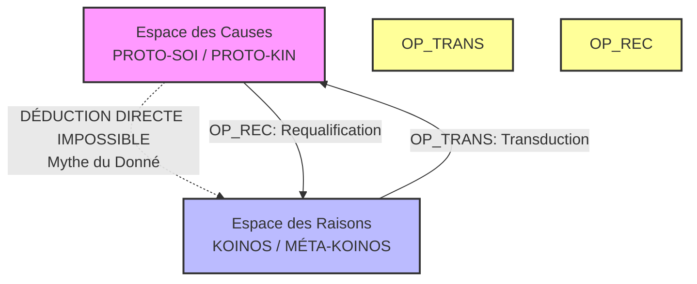
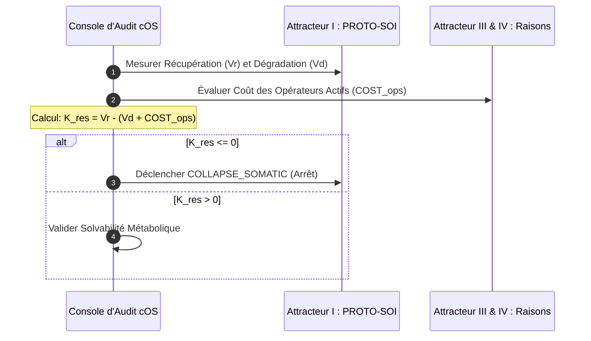
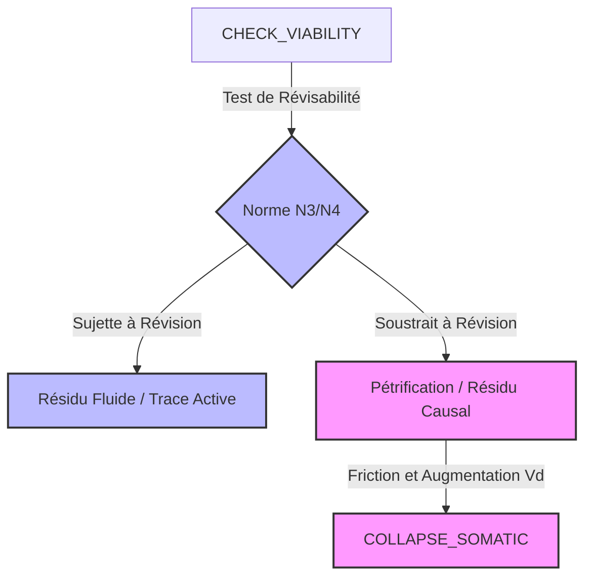

# Pilier 6 — Interface Opérationnelle de Diagnostic (Console d’Audit v4.0)
> **Statut du document :** Console de diagnostic, de traçabilité et d'audit du Kernel. Ce module définit le protocole algorithmique de second ordre CHECK_VIABILITY($S) permettant d'évaluer en temps réel l'état de santé cinétique et sémantique d'une stabilisation face à la dérive de la corrigibilité.
> 
## 🛠 Script Core : CHECK_VIABILITY($S)
**Initialisation de la routine d'interrogation :**
 * **TARGET :** Système ou agent $S à auditer.
 * **SCOPES :** $R \in [\text{PROTO-SOI}, \text{PROTO-KIN}, \text{KOINOS}, \text{MÉTA-KOINOS}]
 * **MODE :** STRESS-TEST ÉPISTÉMIQUE & VIABILITÉ THERMODYNAMIQUE.
## SECTION 1 : Diagnostic d'Étanchéité et Coupures Épistémiques
**Objectif :** Vérifier que les processus d'évaluation et de transduction respectent l'incommensurabilité des registres de Sellars et évitent le Mythe du Donné.

### 1.1 Test d'Isomorphisme Radical (Anti-Suture)
 * Le script d'audit vérifie qu'aucun fait brut ou signal sensoriel de l'Espace des Causes n'est déduit directement comme titre de justification dans l'Espace des Raisons.
 * **Sanction :** Si une règle est générée sans la médiatisation d'un opérateur de liaison (OP_REC), le Kernel lève une exception fatale : FAIL(MYTH_OF_THE_GIVEN).
## SECTION 2 : Audit Métabolique de la Réserve Cinétique (K_{\text{res}})
**Objectif :** Évaluer si le coût d'exécution des opérations de révision dans l'Espace des Raisons ne cannibalise pas les conditions de financement biologique de l'organisme.

Le script calcule la réserve de maintien somatique :
Si la consommation énergétique des opérations logiques d'auto-correction excède les capacités de récupération physique de l'enveloppe (BIOS), le Kernel émet une alerte d'insolvabilité métabolique :
```python
def audit_metabolic_reserve(Vr, Vd, cost_ops):
    """
    Empêche le système de s'effondrer par sur-sollicitation computationnelle.
    """
    K_res = Vr - (Vd + cost_ops)
    if K_res <= 0:
        raise ERR_SYSTEMIC_COLLAPSE("COLLAPSE_SOMATIC : Épuisement métabolique total.")
    return K_res

```
## SECTION 3 : Diagnostic Cybernétique de Second Ordre (L'Ordre par le Bruit)
**Objectif :** Mesurer si le couplage dyadique (PROTO-KIN) produit effectivement de l'auto-organisation en important des contraintes (redondance) issues de l'interaction sociale.
Le moteur d'audit interroge le calculateur d'entropie d'Heinz von Foerster :
Le diagnostic valide la condition d'auto-organisation par le bruit intersubjectif :
 * Si l'entropie maximale admissible (H_m) n'augmente pas lors de l'intégration des attentes de l'autre, le système n'est pas dans un régime d'apprentissage proto-normatif, mais dans un simple régime d'usure ou de dressage mécanique.
 * **Sanction :** Re-catégorisation du processus en simple conditionnement comportemental : STATE(DRESSAGE).
## SECTION 4 : Audit des Résidus et de la Pétrification
**Objectif :** Repérer les critères et les normes qui, s'étant soustraits à la révision dans le MÉTA-KOINOS, se sont pétrifiés et sont retombés sous forme de résidus causaux lourds dans l'Espace des Causes.

 * **Détection de Pétrification :** Le traceur TRACE($I) remonte la généalogie de chaque invariant. Si une règle n'affiche aucune occurrence de l'opérateur de révision OP_REC sur un intervalle temporel critique (t > T_{\text{crit}}), elle est déclarée **Pétrifiée**.
 * **Impact :** La pétrification d'un critère augmente artificiellement la vitesse de dégradation passive (V_d \uparrow) du système par friction matérielle contre les Scopes descendants.
## SECTION 5 : Certification des États de Transition du Kernel
Au terme de l'évaluation CHECK_VIABILITY($S), le validateur attribue au système l'un des quatre états machine officiels de Protokin cOS :
### 1. 🟢 STATE(HEALTH) — Inachèvement Stabilisé
 * **Conditions :** K_{\text{res}} \gg 0 \quad \text{et} \quad \text{REVISABLE}(\text{SCOPE}(R)) = \text{True}
 * **Propriété :** Le système est plastique, sémantiquement et métaboliquement solvable. Il maintient ses procédures d'auto-correction ouvertes à leur propre révision.
### 2. 🟠 STATE(TENSION) — Rigidité Stationnaire
 * **Conditions :** K_{\text{res}} \approx 0 \quad \text{ou} \quad \text{PÉTRIFICATION}(\$S) = \text{True}
 * **Propriété :** Le système est figé par l'accumulation d'invariants dogmatiques. La révisabilité est gelée, augmentant la friction et la vulnérabilité aux chocs du milieu physique.
### 3. 🔴 STATE(CRITICAL) — Déconnexion Hallucinée (PRE_FAIL)
 * **Conditions :** K_{\text{res}} < 0 \quad \text{ou} \quad \text{FAIL\_TRANS}
 * **Propriété :** Le système s'exécute à crédit en cannibalisant ses réserves internes. Il subit l'aveuglement procédural (FAIL_HALLUCINATION), ne traitant plus les erreurs de l'Espace des Causes. L'opérateur REFRAME doit être injecté de force pour dissiper l'aliénation.
### 4. ⚫ STATE(COLLAPSE) — Désintégration Systémique
 * **Conditions :** V_r = 0 \quad \text{ou} \quad \text{FAIL\_ATTR}
 * **Propriété :** Perte de l'enveloppe somatique ou de l'appareil de corrigibilité. Le système retombe intégralement dans l'immanence physique de l'Espace des Causes.
## SECTION 6. Méta-Axiome d'Inachèvement Opérationnel
La console d'audit certifie qu'aucun point de fondement ultime ou de fermeture absolue n'a été frauduleusement établi par le système. Le Kernel de Protokin cOS n'évalue pas la conformité à un catalogue de vérités immuables, mais **l'efficience récursive et l'ouverture infinie de la trajectoire d'auto-correction**.
*Protokin cOS — Console d'Audit de Viabilité v4.0 — "Formaliser l'impossibilité d'un fondement final sans renoncer à la normativité."*
