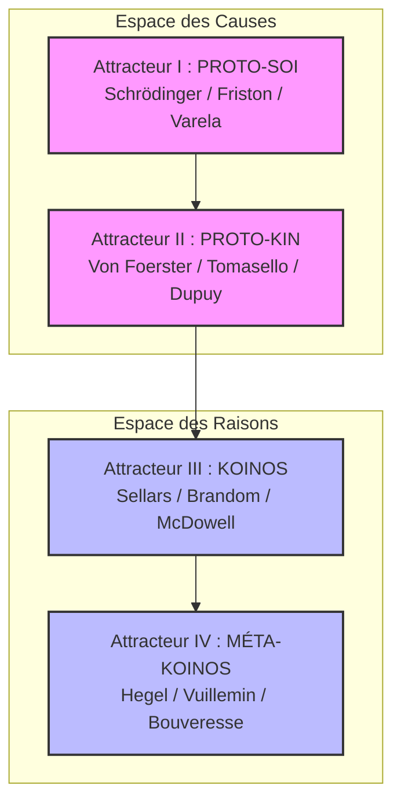

# Pilier 7 — Réservoir de Contraintes Externes (Library v4.0)
> **Statut du document :** Dépôt de librairies théoriques du Kernel. Ce module répertorie, certifie et convertit les sources scientifiques et philosophiques externes en ensembles de contraintes admissibles ($C) pour alimenter les calculs du moteur de Protokin cOS.
> 
## 1. Protocole d'Importation (API de Casting v4.0)
Pour injecter une bibliothèque conceptuelle, mathématique ou scientifique externe dans une routine d'évaluation du Kernel, le système applique le protocole d'interfaçage rigoureux suivant :
 1. **IMPORT :** Extraction des contraintes formelles et des invariants de la source externe.
 2. **SCOPE_MAPPING :** Assignation exclusive de la source à son attracteur d'exécution légitime (PROTO-SOI, PROTO-KIN, KOINOS ou MÉTA-KOINOS).
 3. **OPERATOR_LINK :** Identification de l'opérateur du noyau (MEMB, ATTR, $OP, REVISE) dont la source vient certifier ou enrichir l'algorithme.
## 2. Arbre des Dépendances par Attracteur (Dependency Tree)
Le Kernel cartographie l'ensemble des dépendances conceptuelles qui autorisent la dérive structurée de la corrigibilité :

### A. L'ESPACE DES CAUSES (Scopes descendants)
#### 1. Scope PROTO-SOI (Attracteur I — Nécessité Somatique)
 * **Schrodinger_NegEnt.lib :** Calibre la variable $V_r (vitesse de récupération) comme importation d'entropie négative. L'organisme retarde sa dégradation passive en "mangeant" continuellement de l'ordre issu de son milieu.
 * **Friston_FEP.lib :** Gère la boucle de l'inférence active. Modélise la minimisation de l'énergie libre variationnelle pour maintenir les variables physiologiques dans des limites viables.
 * **Varela_Enact.lib :** Définit l'autopoïèse et la membrane d'isolation (MEMB). L'identité du système émerge de sa clôture opérationnelle et de son couplage structurel avec son environnement.
#### 2. Scope PROTO-KIN (Attracteur II — Intersubjectivité et Corrigibilité)
 * **VonFoerster_SecondOrder.lib :** Introduit le double couplage et l'auto-organisation par le bruit. Modélise l'émergence des objets comme valeurs propres (*eigenvalues*) de l'auto-correction récursive.
 * **Tomasello_JointAttention.lib :** Gère l'allumage des initiatives positives conjointe (pointage triadique) et la coordination cinétique objective au sein de la dyade.
 * **Dupuy_SelfTranscendence.lib :** Gère la projection de la deuxième personne. Le système produit de la méta-régulation en s'exposant aux attentes d'un partenaire qu'il traite comme un observateur d'intentionnalité.
### B. L'ESPACE DES RAISONS (Scopes ascendants)
#### 3. Scope KOINOS (Attracteur III — Dépersonnalisation et NOMOS)
 * **Sellars_EPM.lib :** Établit la frontière d'étanchéité absolue entre la description physique (le domaine des lois) et la description normative (l'espace logique des raisons).
 * **Brandom_Scorekeeping.lib :** Spécifie la pragmatique normative de la troisième personne. L'agent tient les comptes des engagements déontiques (NOMOS) à travers des pratiques sociales de sanctions et de reconnaissances mutuelles.
 * **McDowell_MindAndWorld.lib :** Articule la réceptivité sensorielle avec la spontanéité conceptuelle. Évite que l'Espace des Raisons ne devienne une boucle d'auto-justification coupée du monde en le plaçant sous le contrôle critique de l'expérience.
#### 4. Scope MÉTA-KOINOS (Attracteur IV — Réflexivité et Révisabilité)
 * **Hegel_Recollection.lib :** Gère l'opérateur de recollection narrative (OP_REC). Modélise le processus historique par lequel le système rationalise ses erreurs passées comme un apprentissage cumulatif et progressif.
 * **Vuillemin_Axiomatics.lib :** Gère la classification rigoureuse des systèmes selon Martial Gueroult. Interdit l'éclectisme conceptuel et exige l'indivisibilité logique des règles de validation d'un invariant.
 * **Bouveresse_AntiAnalogy.lib :** Verrouille la console d'audit contre les usurpations scientifiques. Interdit l'application métaphorique sauvage des théorèmes mathématiques formels (ex: limitations de Gödel) au corps institutionnel et politique du KOINOS.
## 3. Les Lames d’Audit de la Library
Pour éviter toute toxine théorique, le réservoir de contraintes est doté de trois routines d'évaluation discriminantes :
### 3.1 La Lame de Bouveresse (Anti-Suture Analogique)
 * Le système interdit d'attribuer une charge logique ou politique à une formule mathématique formelle sans avoir spécifié sa fonction de transduction technique.
 * *Exemple :* L'incomplétude d'un système de règles au Niveau IV ne peut pas être sautée comme "preuve" de la nécessité d'une autorité sacrée. Elle doit être résolue opérationnellement par la récursivité ouverte des procédures d'enquête (OP_REC).
### 3.2 La Lame de Sellars (Anti-Mythe du Donné)
 * Tout invariant conceptuel importé dans l'Espace des Raisons doit être audité par TRACE($I). S'il s'avère déduit directement d'un intrant causal brut sans requalification sémantique, la library rejette la compilation.
### 3.3 La Lame de Vuillemin (Intégrité Axiomatique)
 * Interdiction de croiser deux doctrines incompatibles pour certifier un invariant. Si une source externe est compilée au sein du Validateur (pilier5.md), elle doit se soumettre à la logique univoque de l'attracteur engagé.
## 4. Méta-Règle d'Extension et d'Admissibilité
Toute nouvelle source théorique est déclarée "Compilée et Admissible" si et seulement si sa structure logique interne peut être castée dans la syntaxe primitive de second ordre de von Foerster :
Où la validité d'une hypothèse pour un cas singulier (a) et un cas quelconque (x) ne s'établit que si le système tolère l'unification d'une relativité intersubjective (a+x) sans provoquer la ruine de sa propre cohérence opératoire.
*Protokin cOS — Réservoir de Contraintes Externes v4.0 — "La cybernétique et l'épistémologie ne décrivent pas des couches passives du réel ; elles forment la grammaire technique de notre propre corrigibilité."*
