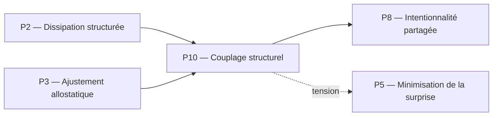

Voici la rédaction complète et rigoureuse du fichier pour le pilier **P10**, structurée selon votre template et le lexique précis de Protokin cOS.
# P10 — Couplage structurel (Maturana / Varela)
## 0. Identification
 * **Numéro :** P10
 * **Nom :** Couplage structurel
 * **Famille :** Structurel
 * **Type :** Régime de couplage
 * **Statut :** Irréductible / localement valide
## 1. Définition
Ce régime formalise la co-dérive historique, plastique et réciproque entre une unité vivante autopoïétique et son milieu environnant. Le couplage structurel pose que les changements d'état du système sont déterminés par sa propre structure interne et simplement *déclenchés* (et non prescrits) par les perturbations du milieu, et inversement. Ce pilier capture la dynamique par laquelle l'histoire des interactions passées sélectionne et s'organise en un éventail de transformations possibles à chaque instant t. Il exclut toute représentation interne ou encodage d'une réalité extérieure objective, modélisant la stabilisation d'une trajectoire viable où le milieu et l'organisme se modifient mutuellement sans rupture de leur continuité physique.
## 2. Invariants opératoires
 * **La dérive structurelle congruente :** Persistance de la compatibilité dynamique entre les changements d'état de l'organisme et les transformations de son milieu.
 * **La clôture opérationnelle :** Invariant caractérisant le réseau de processus de production de composants qui engendre l'unité elle-même, définissant ses frontières opératoires.
 * **Le domaine d'interactions admissibles :** Stabilité de l'éventail des perturbations environnementales que le système peut tolérer à structure constante sans subir une lyse ou une désintégration.
 * **La trace plastique relationnelle :** Invariant historique incarné dans la structure présente de l'agent, marquant la sédimentation des couplages antérieurs.
## 3. Mode de couplage observateur–système
Ce pilier définit un mode spécifique de **perception immanente**, de **découpage du réel par le déclenchement**, de **sélection d'invariants autoproduits** et de **stabilisation des distinctions frontalières**.
### Caractéristiques :
 * **Détermination par la structure :** L'observateur ne découpe pas le réel en termes d'information « entrante » ou d'inputs instructifs, mais en perturbations environnementales agissant comme de simples déclencheurs de dynamiques internes.
 * **Orthogonalité de l'adaptation :** La viabilité se valide uniquement par la non-désintégration (le maintien de la clôture) au cours de la dérive, éliminant le besoin d'un critère de performance optimal global.
 * **Historisation de la frontière :** Le découpage dedans/dehors n'est pas fixe, mais émerge à chaque instant de la friction continue de la co-dérive.
### Angle mort structurel :
 * **L'indépendance de l'objet (L'Espace des Raisons) :** Ce régime est incapable de stabiliser un objet comme une entité indépendante dotée de propriétés objectives, de valider des perspectives croisées (P8), ou d'évaluer la force normative d'un argument (P13). Il ne connaît que l'adéquation physique immédiate de sa propre structure face au milieu.
## 4. Domaine de validité
Ce pilier est valide lorsque :
 * Le système maintient sa clôture opérationnelle et l'intégrité de ses processus internes d'autoproduction.
 * Le milieu n'introduit pas de perturbations destructives excédant les limites de plasticité de la structure actuelle du système.
 * Le flux d'interactions est continu, assurant la rétroaction physique réciproque.
### Limites :
 * Devient invalide si le milieu impose un choc cinétique direct non traduisible par la plasticité du système, provoquant une rupture somatique irréversible.
 * Sature si le système est isolé de son milieu (absence de perturbations), bloquant la dérive et figeant la plasticité adaptative.
## 5. Point de rupture
Ce pilier devient insuffisant lorsque :
 * **Incapacité à s'extraire de l'immanence matérielle :** Le système fait face à des situations exigeant des choix fondés sur des simulations prospectives non actuelles (P6) ou des coordinations de buts intersubjectifs (P8), intraitables par la seule dérive structurelle réactive.
 * **Perte de plasticité interne :** La structure de l'agent se rigidifie au point où la moindre perturbation externe provoque une rupture de la clôture plutôt qu'un ajustement d'état.
### Type de transition déclenchée :
 * **Réinterprétation** (Relecture de la dérive structurelle par le Principe d'Énergie Libre P5) ou **Émergence** (Bascule vers l'intentionnalité partagée P8 face au milieu social).
## 6. Relations avec les autres piliers
### Compatibilités partielles :
 * **P3 — Ajustement allostatique :** Zone de recouvrement majeure. L'allostasie fournit les mécanismes biologiques de régulation proactive qui modifient la structure interne de l'agent pour maintenir le couplage viable au cours de sa dérive.
 * **P2 — Dissipation structurée :** Le maintien de la clôture opérationnelle de P10 exige l'importation permanente de néguentropie et le rejet d'entropie modélisés par P2.
### Tensions :
 * **P5 — Minimisation de la surprise :** Bien que compatibles, P10 refuse radicalement l'idée que le système possède un "modèle" du monde extérieur ou calcule des probabilités sur des états cachés, créant une tension épistémique forte avec le cadre computationnel du FEP.
 * **P11 — Rupture épistémologique :** Tension extrême. Le registre purement déterministe et causal de la dérive structurelle (P10) est aveugle aux concepts de vérité, de validité ou de responsabilité logique introduits par P11.
### Incompatibilités structurelles :
 * **P14 — Validation axiomatique :** Incompatibilité de registre. La co-dérive structurelle d'une unité biologique s'exécute dans l'immanence de ses interactions et ignore fondamentalement l'audit métathéorique des compatibilités doctrinales.
## 7. Traductions (lecture depuis d'autres régimes)
 * **Vu depuis P5 (Minimisation de la surprise) :** Le couplage structurel est relu comme la convergence physique à long terme entre les états internes de l'agent et la structure statistique de son milieu, stabilisant l'enveloppe de la barrière de Markov.
 * **Vu depuis P13 (Institution inférentielle) :** P10 est interprété comme l'infrastructure causale matérielle ultime. Le couplage structurel est la dérive physique qui supporte l'organisme parlant, mais ses interactions ne portent aucune signification logique tant qu'elles ne sont pas soumises au scorekeeping des engagements normatifs.
## 8. Micro-graphe local

## 9. Résumé opératoire
 * **Ce pilier capture :** La co-dérive historique et réactive réciproque entre la structure d'un organisme autopoïétique et son milieu.
 * **Il observe via :** Les boucles de déclenchement mutuel sans transfert d'information instructive, et le maintien de la clôture opérationnelle.
 * **Il ignore structurellement :** Les représentations internes du monde, les objets indépendants de l'action, et les justifications logiques de l'Espace des Raisons.
 * **Il devient instable lorsque :** Les perturbations de l'environnement brisent la clôture opérationnelle ou exigent une anticipation symbolique hors-interaction immédiate.
## 10. Notes épistémologiques
 * **Statut ontologique :** Non requis. Le monde extérieur n'est pas une entité pré-donnée à découvrir, mais le complément structurel nécessaire à la persistance de la dérive de l'unité vivante.
 * **Statut épistémique :** Local et relatif au domaine d'existence de l'unité ; la connaissance est redéfinie comme l'action adéquate dans un domaine d'existence.
 * **Statut relationnel :** Strictement monadique/environnemental (fermeture du système sur sa propre dynamique interne).
## 11. Métadonnées (GitHub / navigation)
 * **Fichier :** P10_couplage_structurel_maturana_varela.md
 * **Connexions principales :** P2, P3, P5, P8, P11
 * **Niveau de transition :** Moyen
