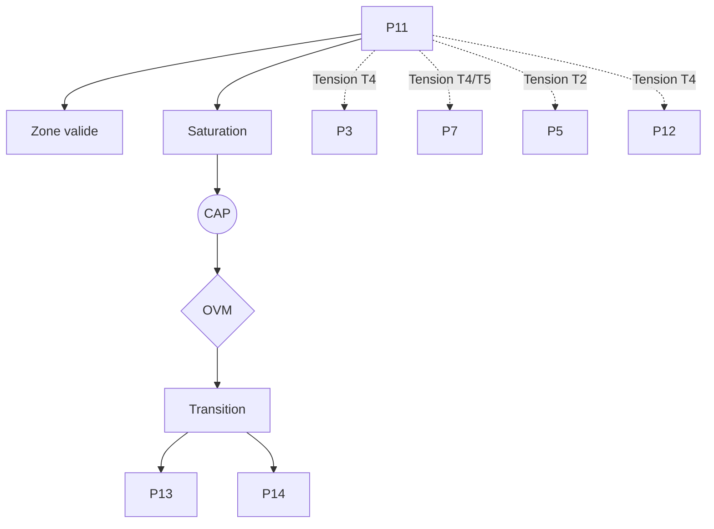

P11 — Rupture épistémologique (Sellars) / Espace des raisons

0. Identification

- Numéro : P11
- Nom : Rupture épistémologique (Sellars) / Espace des raisons
- Famille : normatif
- Type : Régime de couplage
- Statut : Irréductible / localement valide

---

1. Définition

Ce régime formalise la discontinuité critique par laquelle un système s'extrait de la pure description déterministe des chocs physiques pour entrer dans le réseau des justifications logiques. La rupture épistémologique récuse le *Mythe du Donné* en affirmant qu'un état biophysique ou un stimulus causal ne peut jamais dicter ou s'assimiler à une position conceptuelle sans une opération de requalification sémantique. Ce pilier n'introduit aucune hiérarchie globale, mais délimite le passage d'une régulation réactive ou associative à un mode de stabilisation où les états du système acquièrent le statut de propositions soumises à des critères de correction. Il marque l'accès à la normativité, transformant les impacts du milieu en assertions habilitées à figurer dans l'Espace des raisons.

Ce régime constitue un mode spécifique de stabilisation descriptive.

Il ne décrit pas une substance, un objet ou une région ontologique du réel, mais une manière particulière de sélectionner des invariants et de maintenir des distinctions opératoires.

Contraintes de rédaction

- ne pas réduire ce régime à un autre ;
- ne pas introduire de hiérarchie implicite ;
- ne pas présupposer une causalité globale ;
- éviter les formulations ontologiquement inflationnistes.

---

1.bis. Ancrages théoriques

Ce régime est stabilisé, documenté ou audité par les références suivantes.

📚 Stabilisateurs principaux

Wilfrid Sellars

- Référence : references/sellars.md
- Statut : Stabilisateur de régime / Opérateur de transition
- Apport opératoire :
  Formalise la discontinuité fondamentale entre l'espace des causes (stabilisation causale) et l'espace des raisons (stabilisation normative). Il instruit la nécessité de rejeter le "Mythe du Donné" et pose qu'aucun passage direct du causal au normatif n'est possible sans reconfiguration de cadre.
- Tensions associées :
  T4 (Tension normative), T2 (Tension de traduction).

John McDowell

- Référence : references/mcdowell.md
- Statut : Frontière inter-régime / Garde-fou
- Apport opératoire :
  Sécurise l'intégrité de ce régime en interdisant toute forme de naturalisme réductionniste. McDowell montre qu'il est impossible de déduire les invariants du régime P11 à partir des régimes physico-biologiques (comme P1, P2 ou P7), forçant l'audit à repérer l'incommensurabilité absolue entre la nature (causes) et la norme (raisons).
- Tensions associées :
  T4 (Tension normative), T5 (Tension de rupture).

---

1.ter. Fonction interne du régime

Ce régime existe afin de rendre descriptibles les dynamiques de transition micro-physiques qui disparaîtraient si l'analyse commençait directement aux niveaux d'individuation ou de cognition.

Sans ce régime, l'architecture perdrait la possibilité d'auditer les tentatives de réduction des niveaux supérieurs vers les seules dynamiques élémentaires.

Contribution principale à Protokin :

- Stabilisation de la rationalité, des justifications et des engagements.
- Cartographie de la frontière absolue (discontinuité) isolant l'Espace des causes (Proto) de l'Espace des raisons (Kin).
- Point d'origine des tensions T4 et T5 face à toute tentative d'explication purement causale, biologique ou comportementale.

---

1.quater. Contrat de non-réification

Ce régime ne doit jamais être interprété comme :

- une entité ontologique autonome
- un niveau réel du monde
- une substance causale
- une explication ultime

Il constitue uniquement :

- un dispositif de sélection d’invariants
- une grille de stabilisation descriptive
- un mode local de lecture

Toute réification constitue une violation OVM (T1 / T11).

---

🛡 Garde-fous épistémologiques

John McDowell (et Wilfrid Sellars)

- Fonction : Garde-fou
- Règle de vigilance :
  Le rejet du Mythe du Donné. L'OVM bloque toute tentative d'accepter qu'un impact causal brut, un état neuronal ou une donnée non conceptuelle puisse valoir directement comme justification épistémique ou sémantique. Une cause ne peut jamais tenir lieu de raison sans violer les frontières d'axiomatisation du régime (déclenchement de la Tension T1 - Réduction).

---

2. Invariants opératoires

Le régime sélectionne préférentiellement les stabilités suivantes :

- Invariants propositionnels et engagements sémantiques.
- Justifications logiques et évaluations de vérité/fausseté.
- Inférences matérielles régulant les propositions.
- Requalification sémantique des stimuli et impacts environnementaux.

Définition

Un invariant est une stabilité relationnelle reproductible à l'intérieur du régime.

Exemples :

- régularité de transition
- boucle de rétroaction
- norme instituée
- engagement déontique
- structure dissipative

---

3. Mode de couplage observateur–système

Ce régime définit une manière particulière de :

- percevoir le réel à travers une perception réflexive
- découper le réel par la distinction stricte des registres causaux et justificatifs
- sélectionner des invariants propositionnels
- stabiliser des distinctions normatives par financement sémantique

Caractéristiques

- L'environnement n'est plus traité comme source de vérités immédiates (Donné), mais comme ensemble de déclencheurs nécessitant une requalification.
- Les états internes se voient attribuer des rôles conceptuels spécifiques.
- Le réel est isolé de son substrat dynamique pour servir de point d'appui à un argument.

Angle mort structurel

Pour fonctionner, ce régime doit nécessairement ignorer :

- L'immanence des flux physiques purs (L'Espace des Causes).
- Le coût cinétique ou métabolique de l'appareil de traduction propositionnelle et la matérialité thermodynamique brute (P1, P2).

---

4. Domaine de validité

Le régime est pertinent lorsque :

- Le système s'appuie sur des pratiques comportementales standardisées (souvent stabilisées par le cliquet culturel, P9).
- La dynamique observée nécessite une requalification normative et justificative des états internes.
- Le coût computationnel du traitement propositionnel ne sature pas la viabilité biologique du système.

Frontières descriptives

Le régime devient insuffisant lorsque :

- Le système doit agir en urgence absolue sans médiation réflexive (P12).
- L'analyse porte sur les mécanismes strictement biologiques (P7) ou perceptivo-moteurs immanents (P4) dépourvus d'explicitation normative.

Violations typiques détectées par l'OVM :

- Réduction abusive (T1) : vouloir réduire l'espace des raisons à un processus causal biologique ou probabiliste.
- Compression inter-régime (T11) : superposer la cause et la norme.
- Erreur modale : postuler qu'un concept rationnel émerge harmonieusement du biologique sans saut conceptuel (saut d'échelle T3 ou T5).

---

4.bis. Conditions d’illégitimité (OVM)

Le régime devient illégitime si :

- un invariant est transformé en entité ontologique
- une corrélation est interprétée comme causalité globale
- un niveau supérieur est réduit à ce régime sans perte
- une norme est dérivée d’un fait causal sans médiation

Violations associées :

- T1 — Réduction
- T3 — Saut d’échelle
- T11 — Compression inter-régime
- T13 — Collapsus normatif

---

5. Conditions de saturation

Le régime devient instable lorsque :

- Les urgences somatiques et affectives massives (P12) s'imposent et écrasent l'impartialité requise pour formuler un syllogisme.
- L'infrastructure biophysique et métabolique vient à défaillir ou lorsque l'environnement devient inintelligible selon les normes en vigueur.
- La sur-rationalisation entraîne une déconnexion délétère avec les impératifs de la viabilité causale (P3).

Symptômes observables :

- perte de pouvoir explicatif
- multiplication des exceptions
- apparition de tensions non résolues
- nécessité de nouveaux invariants (soit un retour au corps, soit un audit formel P14)

Tensions fréquemment associées :

- T4 (Tension normative)
- T5 (Tension de rupture)
- T2 (Tension de traduction)

---

5.bis. Matrice de saturation

Indicateurs de saturation :

- augmentation des exceptions descriptives
- instabilité des invariants sélectionnés
- besoin d’un niveau explicatif supérieur
- incohérences multi-échelles

Seuil critique :

≥ 2 indicateurs actifs → déclenchement CAP

---

6. Relations avec les autres régimes

Compatibilités partielles

- P9 — Effet cliquet culturel : P9 fournit les habitudes sédimentées que P11 utilise comme matériaux bruts pour asseoir sa requalification normative et son lexique.
- P13 — Institution inférentielle : P11 initie l'acte de naissance de la proposition (brisant le mythe du donné) que P13 déploiera ensuite dans son réseau social de *scorekeeping*.

Traductions stables

- P11 ↔ P13 (continuité directe du versant Kin, de la fondation sellarsienne à l'ingénierie brandomienne).

Frictions cartographiées

- P3 — Ajustement allostatique : Tension fonctionnelle (T4) due au maintien d'engagements symboliques coûteux au détriment de l'optimisation organique proactive.
- P12 — Évaluation thimique : Conflit (T4) entre l'asymétrie de l'intensité affective primitive et l'impartialité asémantique requise par P11.
- P5 — Minimisation de la surprise : L'erreur prédictive pure (causale) est relue comme anomalie exigeant une révision logique, créant une tension de traduction (T2).

Incompatibilités structurelles

- P1 — Cinétique protonique : Incompatibilité absolue. La physique des gradients matériels ne connaît aucune norme, justification, ou vérité. Le passage est radicalement interdit sans la rupture de P11.

---

6.bis. Tensions constitutives

Ce régime existe parce qu’il rend visibles certaines tensions fondamentales.

Sans elles, il perd sa nécessité descriptive.

Tensions constitutives

- T4 (Tension normative)
- T5 (Tension de rupture)

Fonction de ces tensions

Ces tensions garantissent l'autonomie conceptuelle du pôle *Kin*. Le régime P11 *incarne* la frontière de T4 et T5 : il montre que l'ordre des raisons est incommensurable avec l'ordre des causes. S'il n'y avait pas de tension (si la transition de l'ion à la conscience rationnelle était fluide), P11 serait redondant avec P7 ou P5. Il s'affirme précisément parce qu'il rend observable la rupture qualitative nécessaire.

---

7. Traductions inter-régimes

Vu depuis P5 (Minimisation de la surprise)

La rupture épistémologique et l'espace des raisons sont relus comme une strate avancée d'optimisation inférentielle, abaissant drastiquement la surprise à long terme au sein d'une espèce à forte interdépendance. Les normes deviennent des *priors* d'une extrême robustesse prédictive.

Vu depuis P13 (Institution inférentielle)

P11 est interprété comme le moment d'allumage ou la condition transcendantale nécessaire de la rationalité publique. L'espace des raisons de Sellars est la fondation conceptuelle que Brandom mécanise ensuite formellement par le biais du registre intersubjectif d'habilitations et d'engagements.

Important

- ne sont pas des équivalences
- ne sont pas des réductions
- ne permettent pas de fusion des régimes

---

8. Dynamique d’audit (CAP + OVM)

Lorsqu’une saturation est détectée, le Cycle d’Audit Protokin (CAP) est déclenché.

Diagnostic possible

- Tension principale : T4 (Normative)
- Tension secondaire : T5 (Rupture) ou T1 (Réduction abusive)

Transitions fréquemment observées

- P11 → P13 par réinterprétation (le passage du concept de Raison à la matérialité de sa tenue des scores en société).
- P11 → P14 par émergence réflexive (audit métathéorique et cybernétique de second ordre de ces mêmes raisons).

Hiérarchie des transitions autorisées

- Niveau 1 : Réinterprétation
- Niveau 2 : Émergence
- Niveau 3 : Rupture
- Niveau 4 : Blocage OVM

Rôle de l’OVM

L’OVM ne crée pas les limites du régime.

Il détecte les violations de frontières descriptives. L'OVM sanctionne l'absence de l'opérateur P11 lorsque des théories tentent de déduire directement une justification sémantique depuis un mécanisme darwinien ou un schéma probabiliste aveugle, imposant ainsi le respect de la "Rupture" normative.

---

9. Micro-graphe local

---

10. Résumé opératoire

Ce régime capture : La rupture de registre isolant l'Espace des raisons (justifications) de l'Espace des causes (mécanismes matériels).

Il sélectionne : Les engagements sémantiques, les assertions et les critères de validité propositionnelle.

Il observe via : Le protocole de requalification sémantique des perturbations en énoncés justifiables.

Il ignore structurellement : L'énergie thermodynamique brute, la pure survie métabolique (P7) et la genèse physique de ses propres supports (P1, P2).

Il devient instable lorsque : L'appareil somatique lâche, ou que les urgences affectives primitives submergent l'impartialité requise par l'espace des raisons.

Les tensions dominantes sont : T1, T4, T5.

---

11. Notes épistémologiques

Statut ontologique

Non requis.

Le régime n’est pas une substance ni un niveau du réel. Les "raisons" ne constituent pas un plan immatériel transcendant, mais un régime spécifique d'évaluation et de stabilisation des invariants.

Statut épistémique

Local.

Contextuel.

Révisable.

Statut relationnel

Déterminé par le couplage critique (refus d'un "Donné" immédiat) entre l'organisme qui réagit et l'appareil qui justifie.

Principe fondamental

Un régime ne décrit pas le monde.

Il décrit une manière stable de décrire le monde.

---

12. Métadonnées

Fichier : P11_rupture_epistemologique_sellars.md

Connexions principales : P3, P5, P9, P12, P13

Tensions dominantes : T1, T4, T5

Niveau de transition : Critique

Dernière révision : 2026-06-13

---

13. Validation récursive (CAP ↔ OVM)

Chaque régime est valide uniquement si :

ses transitions CAP sont cohérentes

ses tensions OVM ne sont pas court-circuitées

ses invariants restent stables sous changement d’échelle

aucune réduction illégitime n’est effectuée

Toute incohérence déclenche :

requalification du régime

ou révision des tensions associées