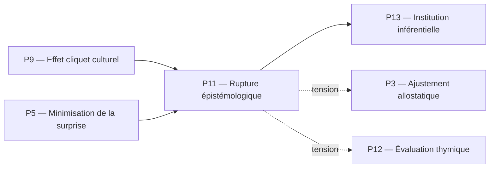

# P11 — Rupture épistémologique (Sellars)
## 0. Identification
 * **Numéro :** P11
 * **Nom :** Rupture épistémologique
 * **Famille :** Normatif
 * **Type :** Régime de couplage
 * **Statut :** Irréductible / localement valide
## 1. Définition
Ce régime formalise la discontinuité critique par laquelle un système s'extrait de la pure description déterministe des chocs physiques pour entrer dans le réseau des justifications logiques. La rupture épistémologique récuse le *Mythe du Donné* en affirmant qu'un état biophysique ou un stimulus causal ne peut jamais dicter ou s'assimiler à une position conceptuelle sans une opération de requalification sémantique. Ce pilier n'introduit aucune hiérarchie globale, mais délimite le passage d'une régulation réactive ou associative à un mode de stabilisation où les états du système acquièrent le statut de propositions soumises à des critères de correction. Il marque l'accès à la normativité, transformant les impacts du milieu en assertions habilitées à figurer dans l'Espace des Raisons.
## 2. Invariants opératoires
 * **Le saut sémantique non réductionniste :** Stabilité de l'opération de traduction qui convertit une perturbation biophysique (Espace des Causes) en une prémisse logique irréductible à ses composants matériels.
 * **L'énoncé comme position logique :** Persistance du statut d'une distinction interne stabilisée en tant qu'unité minimale susceptible d'entrer dans un réseau de justification.
 * **La démarcation des registres :** Invariant frontière maintenant la séparation stricte entre les explications par le mécanisme (facteurs causaux) et les explications par la légitimité (raisons normatives).
 * **Le critère d'infirmabilité pré-conceptuelle :** Stabilité du protocole interne qui évalue si une transition descriptive commet une erreur de catégorie sémantique.
## 3. Mode de couplage observateur–système
Ce pilier définit un mode spécifique de :
 * perception réflexive
 * découpage du réel par la distinction des registres
 * sélection d’invariants propositionnels
 * stabilisation des distinctions normatives
### Caractéristiques :
 * **Rejet du Donné matériel :** L'observateur et le système cessent de traiter les stimuli environnementaux comme des vérités immédiates ; les entrées sensorielles sont appréhendées comme des conditions de déclenchement nécessitant une requalification.
 * **Extraction des propriétés sémantiques :** Le réel est découpé selon sa capacité à servir de point d'appui à un argument ou à une règle, isolant les invariants logiques de leur substrat dynamique.
 * **Financement sémantique :** Stabilisation des distinctions par l'attribution de rôles conceptuels spécifiques aux états internes.
### Angle mort structurel :
 * **L'immanence des flux physiques (L'Espace des Causes) :** Ce régime est structurellement aveugle aux dynamiques énergétiques pures et à la matérialité thermodynamique brute (P1, P2). Il ne peut pas voir le coût cinétique ou métabolique réel requis pour soutenir l'appareil de traduction propositionnelle, traitant les chocs somatiques exclusivement après leur conversion sémantique.
## 4. Domaine de validité
Ce pilier est valide lorsque :
 * Le système s'appuie sur un répertoire de pratiques standardisées et stabilisées par l'effet cliquet culturel (P9).
 * Les processus de calcul d'erreur ou d'énergie libre variationnelle (P5) disposent d'assez de stabilité pour ne pas saturer le système sous l'effet de chocs environnementaux imprévisibles.
 * Le coût computationnel de la requalification propositionnelle reste inférieur au seuil d'instabilité somatique du système.
### Limites :
 * S'effondre immédiatement si l'infrastructure biophysique subit une crise de solvatique majeure (épuisement de la réserve cinétique K_{\text{res}}), ramenant le système à la pure réactivité mécanique.
 * Produit une instabilité descriptive radicale s'il tente d'appliquer ses critères de légitimité logique à des couplages ioniques ou moléculaires fondamentaux (P1).
## 5. Point de rupture
Ce pilier devient insuffisant lorsque :
 * **Absence de lois de cohérence globale :** L'Espace des Raisons accumule des positions logiques isolées sans parvenir à auditer leurs réseaux d'engagements réciproques, provoquant des contradictions internes insolubles.
 * **Saut d'échelle intersubjectif :** Le passage d'assertions individuelles à des normes de comportement publiques partagées excède la simple rupture de registre, exigeant des règles explicites d'attribution de droits et de devoirs discursifs.
### Type de transition déclenchée :
 * [ ] Réinterprétation
 * [ ] Émergence
 * [X] Rupture normative
## 6. Relations avec les autres piliers
### Compatibilités partielles :
 * **P9 — Effet cliquet culturel :** Zone de recouvrement majeure. P9 fournit les habitudes et les artefacts comportementaux stabilisés dans le temps, que P11 utilise comme matériaux bruts pour opérer sa requalification normative.
 * **P5 — Minimisation de la surprise :** L'erreur de prédiction biophysique de P5 est relue par P11 comme une anomalie descriptive, incitant le modèle interne à réviser ses cadres logiques.
### Tensions :
 * **P3 — Ajustement allostatique :** Tension fonctionnelle constante. Les exigences de cohérence logique de P11 peuvent pousser le système à maintenir des comportements symboliques au détriment de l'optimisation proactive de ses paramètres biologiques (P3).
 * **P12 — Évaluation thymique :** Les gradients affectifs et les intensités primitives de P12 peuvent entrer en conflit violent avec l'impartialité requise par l'Espace des Raisons de P11.
### Incompatibilités structurelles :
 * **P1 — Cinétique protonique :** Rupture absolue de registre. P1 opère dans l'immanence des lois de la physique ionique où la notion même de justification, de validité ou de Mythe du Donné n'a aucune existence opératoire.
## 7. Traductions (lecture depuis d’autres régimes)
### Vu depuis P5 (Minimisation de la surprise) :
La rupture épistémologique est interprétée comme une transition de phase critique dans la structure du modèle génératif. Elle correspond à l'émergence d'une barrière de Markov de second ordre séparent les variables de contraintes physiques des variables de codage symbolique, optimisant la réduction de la surprise variationnelle par le biais de catégories discrètes.
### Vu depuis P13 (Institution inférentielle) :
P11 est lu comme le moment d'allumage ou la condition nécessaire du réseau discursif. Il représente l'acte fondateur par lequel un choc est admis dans le jeu de donner et de demander des raisons, bien que P11 ne formalise pas encore le scorekeeping détaillé des engagements normatifs que P13 prend en charge.
## 8. Micro-graphe local

## 9. Résumé opératoire
 * **Ce pilier capture :** La rupture de registre isolant l'Espace des Raisons (justifications) de l'Espace des Causes (mécanismes matériels).
 * **Il observe via :** Un protocole de requalification sémantique des perturbations externes en énoncés propositionnels.
 * **Il ignore structurellement :** Les flux d'énergie cinétique brute, le métabolisme somatique de secours et la réalité physico-chimique sous-jacente aux signaux.
 * **Il devient instable lorsque :** La dérive logique du système se déconnecte des contraintes de viabilité biophysique ou que l'infrastructure matérielle s'effondre.
## 10. Notes épistémologiques
 * **Statut ontologique :** Non requis. Les raisons ne forment pas un plan d'existence substantiel, mais un régime d'évaluation descriptive des invariants.
 * **Statut épistémique :** Local et relatif au saut sémantique ; il marque le refus de fonder la connaissance sur l'illusion d'un donné brut.
 * **Statut relationnel :** Défini par le couplage critique entre la réactivité de l'organisme et l'autonomie de son appareil de description.
## 11. Métadonnées (GitHub / navigation)
 * **Fichier :** P11_rupture_epistemologique_sellars.md
 * **Connexions principales :** P3, P5, P9, P12, P13
 * **Niveau de transition :** Critique
