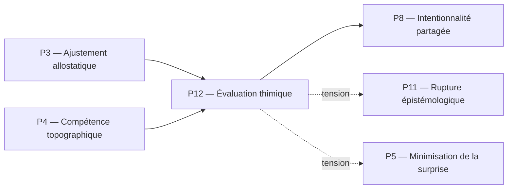

Voici le fichier complet pour le pilier **P12**, rédigé selon le template strict de Protokin cOS et intégrant vos choix étymologiques et conceptuels.
# P12 — Évaluation thimique
## 0. Identification
 * **Numéro :** P12
 * **Nom :** Évaluation thimique
 * **Famille :** Normatif
 * **Type :** Régime de couplage
 * **Statut :** Irréductible / localement valide
## 1. Définition
Ce régime formalise la génération de gradients internes de valeur, de priorités opératoires et d'intensités affectives primordiales au sein du système. Fidèle à sa racine étymologique grecque (*Timê* / *Thymos*), le terme est orthographié **thimique** afin d'insister sur l'évaluation de la valeur, de la dignité et de la reconnaissance des forces somatiques plutôt que sur une simple labilité de l'humeur psychologique. L'évaluation thimique agit comme la boussole affective et motivationnelle de la stabilisation, quantifiant la valence des couplages. Elle ne dérive d'aucune fonction globale de fitness, mais exécute une pondération immédiate des tensions internes, traduisant l'urgence biologique en pressions sémiotiques et en directions d'action avant toute médiation propositionnelle décontextualisée.
## 2. Invariants opératoires
 * **Le gradient de valence thimique :** Stabilité des polarités internes (attraction/répulsion, urgence/stase) qui surdéterminent l'allocation des ressources computationnelles.
 * **Le seuil d'assignation de valeur (*Timê*) :** Persistance du critère d'évaluation qui attribue un poids ou un degré d'importance somatique à une perturbation environnementale spécifique.
 * **La résonance somato-normative :** Invariant relationnel couplant un état de tension biophysique brut à une inclinaison motivationnelle stable.
 * **La signature thimique de l'invariant :** Encodage de la valeur affective d'un objet topographique (P4) ou d'un artefact (P9), fixant sa priorité dans les simulations prospectives.
## 3. Mode de couplage observateur–système
Ce pilier définit un mode spécifique de :
 * perception affective
 * découpage du réel par la saillance thimique
 * sélection d’invariants de valeur
 * stabilisation des distinctions pré-rationnelles
### Caractéristiques :
 * **Découpage par la saillance :** L'environnement n'est pas perçu comme une géométrie neutre, mais comme une topographie de potentiels thimiques (zones de menace, opportunités métaboliques).
 * **Asymétrie d'intensité :** Les distinctions sont stabilisées en fonction de leur intensité affective (*Timê*) plutôt qu'en vertu de leur cohérence purement logique ou formelle.
 * **Ancrage incarné :** Le couplage s'effectue par la lecture continue des variations d'états internes de l'organisme, transformant les chocs matériels en indices de viabilité.
### Angle mort structurel :
 * **L'impartialité logique (L'Espace des Raisons) :** Ce régime est structurellement incapable d'impartialité ou de traitement logique symétrique. Il ne peut ni formuler de syllogismes, ni auditer la validité d'une inférence propositionnelle (P13), car il est prisonnier de l'asymétrie de ses propres gradients de valeur et de ses urgences somatiques.
## 4. Domaine de validité
Ce pilier est valide lorsque :
 * Le système dispose d'un couplage structurel fonctionnel (P10) et de boucles allostatiques actives (P3).
 * Les fluctuations d'intensités somatiques restent à l'intérieur des limites de tolérance, sans basculer dans la rupture cinétique pure.
 * Les indices environnementaux sont corrélés à des conséquences adaptatives réelles pour le système.
### Limites :
 * S'effondre dans la neutralité descriptive ou l'apathie computationnelle si les mécanismes d'évaluation hormonaux ou ioniques de base sont détruits ou saturés.
 * Génère des hallucinations ou des dérives projectives intraitables (FAIL_HALLUCINATION) si le gradient thimique se détache totalement des contraintes de la dissipation structurée (P2).
## 5. Point de rupture
Ce pilier devient insuffisant lorsque :
 * **Conflit de valences de même intensité :** Le système fait face à des injonctions thimiques contradictoires et d'intensités strictement égales, bloquant l'action par indécision pré-rationnelle.
 * **Explosion de complexité normative :** La survie ou la stabilisation du système requiert des arbitrages collectifs ou des accords intersubjectifs abstraits (P8, P13) impossibles à résoudre par la seule boussole affective individuelle.
### Type de transition déclenchée :
 * [ ] Réinterprétation
 * [ ] Émergence
 * [X] Rupture normative
## 6. Relations avec les autres piliers
### Compatibilités partielles :
 * **P3 — Ajustement allostatique :** Recouvrement fonctionnel profond. L'allostasie fournit les paramètres somatiques dont P12 traduit les variations en gradients de valeur affective pour guider le comportement.
 * **P4 — Compétence topographique :** Compatibilité opérationnelle. P12 habille les invariants comportementaux de P4 d'une valence émotionnelle, transformant les jetons d'actions (*tokens*) en objets désirables ou évitables.
### Tensions :
 * **P11 — Rupture épistémologique :** Tension critique permanente. L'Espace des Raisons exige l'effacement ou la suspension des biais thimiques pour valider les assertions, tandis que P12 réinjecte constamment l'asymétrie de l'urgence somatique.
 * **P5 — Minimisation de la surprise :** La minimisation de l'erreur prédictive peut être entravée par une surcharge thimique qui force le système à surpondérer certaines hypothèses a priori en raison de leur valence affective.
### Incompatibilités structurelles :
 * **P14 — Validation axiomatique :** Incompatibilité absolue de niveau. L'audit métathéorique et formel des théories s'exécute dans un espace de non-contradiction logique pur, totalement étranger aux tiraillements et aux intensités de la force thimique primitive.
## 7. Traductions (lecture depuis d’autres régimes)
### Vu depuis P3 (Ajustement allostatique) :
L'évaluation thimique est relue comme la traduction neurobiologique et computationnelle des états de déviation ou d'adéquation des variables physiologiques par rapport à leurs trajectoires prédictives de viabilité.
### Vu depuis P11 (Rupture épistémologique) :
Le régime P12 est appréhendé comme une forme sophistiquée de l'Espace des Causes. Les valences thimiques sont des déterminismes biophysiques incarnés, des "chocs" motivationnels internes qui doivent être surmontés ou requalifiés en concepts logiques pour acquérir le statut de raisons légitimes.
## 8. Micro-graphe local

## 9. Résumé opératoire
 * **Ce pilier capture :** La pondération affective pré-rationnelle, l'attribution de valeur (*Timê*) et la hiérarchisation des urgences d'action du système.
 * **Il observe via :** Les gradients de saillance affective, la valence des stimuli internes/externes et l'intensité des tiraillements somatiques.
 * **Il ignore structurellement :** La cohérence propositionnelle formelle, les principes de non-contradiction logique et les règles d'inférence discursive.
 * **Il devient instable lorsque :** Les urgences affectives entrent en contradiction insoluble ou exigent une médiation par des normes intersubsidiaires publiques.
## 10. Notes épistémologiques
 * **Statut ontologique :** Non requis. La thimie n'est pas une substance psychique isolée, mais une propriété géométrique des asymétries de la stabilisation sous contraintes.
 * **Statut épistémique :** Local et relatif au régime somatique de l'organisme ; elle ancre la normativité dans le corps vivant avant son émancipation logique.
 * **Statut relationnel :** Défini par le couplage récursif entre l'état des réserves cinétiques (K_{\text{res}}) et la sélection des axes prioritaires d'interaction.
## 11. Métadonnées (GitHub / navigation)
 * **Fichier :** P12_evaluation_thymique.md  *(Note : Le nom du fichier préserve la nomenclature d'indexation standard pour GitHub, tandis que le corps du texte consacre l'orthographe conceptuelle "thimique")*
 * **Connexions principales :** P3, P4, P5, P8, P11
 * **Niveau de transition :** Moyen
