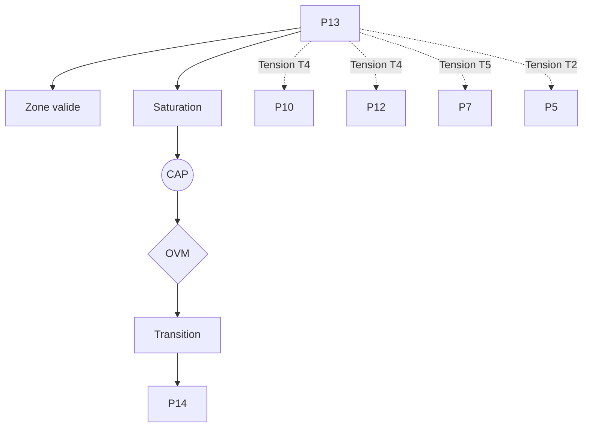

P{13} — Institution inférentielle (Brandom)

0. Identification

- Numéro : P13
- Nom : Institution inférentielle (Brandom)
- Famille : normatif
- Type : Régime de couplage
- Statut : Irréductible / localement valide

---

1. Définition

Ce régime formalise l'émergence et la stabilisation de la signification sémantique et de la rationalité à travers le déploiement de pratiques discursives réglées. L'institution inférentielle définit le sens d'un énoncé non par sa correspondance avec un objet pré-donné, mais par son rôle au sein d'un réseau dynamique de conséquences et de prémisses. Dans ce régime, les positions conceptuelles acquièrent leur valeur par le biais d'un arbitrage intersubjectif où les agents s'attribuent et se reconnaissent mutuellement des responsabilités logiques. Le pilier modélise le fonctionnement du système comme une communauté de pairs tenant à jour le registre des positions légitimes, transformant la communication en un jeu récursif d'engagements et de droits.

Ce régime constitue un mode spécifique de stabilisation descriptive.

Il ne décrit pas une substance, un objet ou une région ontologique du réel, mais une manière particulière de sélectionner des invariants et de maintenir des distinctions opératoires.

Contraintes de rédaction

- ne pas réduire ce régime à un autre ;
- ne pas introduire de hiérarchie implicite ;
- ne pas présupposer une causalité globale ;
- éviter les formulations ontologiquement inflationnistes.

---

1.bis. Ancrages théoriques

Ce régime est stabilisé, documenté ou audité par les références suivantes.

📚 Stabilisateurs principaux

Robert Brandom

- Référence : references/brandom.md
- Statut : Stabilisateur de régime
- Apport opératoire :
  Maître d'œuvre du versant *Kin* à son niveau le plus sophistiqué. Brandom fournit au système Protokin la grammaire exacte de la sapience humaine en traduisant l'Espace des raisons sous forme de mécanismes d'engagements (commitments) et d'habilitations (entitlements). Il permet d'auditer comment les faits sociaux et les concepts maintiennent leur cohérence via un équilibre dynamique d'attributions mutuelles et de responsabilités (le *scorekeeping*).
- Tensions associées :
  Tension de rupture (T5), Tension normative (T4), Tension de traduction (T2).

Wilfrid Sellars

- Référence : references/sellars.md
- Statut : Frontière inter-régime / Générateur de tension
- Apport opératoire :
  Formalise le cadre fondamental (l'Espace des raisons, P11) au sein duquel Brandom opère. Il pose la discontinuité indispensable entre l'ordre causal et l'ordre normatif, empêchant toute fondation purement empirique de la signification.
- Tensions associées :
  Tension de rupture (T5), Tension normative (T4).

---

1.ter. Fonction interne du régime

Ce régime existe afin de rendre descriptibles les dynamiques d'évaluation normative et de justification qui disparaîtraient si l'analyse s'arrêtait aux niveaux d'individuation causale, biologique ou de l'attention conjointe pré-linguistique.

Sans ce régime, l'architecture perdrait la possibilité d'auditer les tentatives de réduction des phénomènes culturels et sémantiques vers les seules dynamiques élémentaires de l'espace des causes (le versant *Proto*).

Contribution principale à Protokin :

- Stabilisation de la signification et de la rationalité (le pôle *Kin* achevé)
- Cartographie du *scorekeeping* déontique et des pratiques discursives
- Point d'origine des tensions T4 et T5 face aux régimes purement comportementaux ou d'optimisation (P5, P7, P10)

---

1.quater. Contrat de non-réification

Ce régime ne doit jamais être interprété comme :

- une entité ontologique autonome
- un niveau réel du monde
- une substance causale
- une explication ultime

Il constitue uniquement :

- un dispositif de sélection d’invariants
- une grille de stabilisation descriptive
- un mode local de lecture

Toute réification constitue une violation OVM (T1 / T11).

---

🛡 Garde-fous épistémologiques

Robert Brandom (Contre le représentationnalisme)

- Fonction : Garde-fou
- Règle de vigilance :
  L'OVM s'appuie sur le pragmatisme inférentiel pour bloquer le représentationnalisme empiriste (la thèse d'un lien direct mot-objet sans médiation sociale). L'OVM sanctionne fermement (T1) tout réductionnisme scientiste prétendant expliquer le langage et les institutions (P13) directement par les neurosciences ou la thermodynamique sans passer par la rupture normative.

---

2. Invariants opératoires

Le régime sélectionne préférentiellement les stabilités suivantes :

- Les engagements discursifs (commitments) et les habilitations (entitlements)
- Le réseau de conséquences et de prémisses (inférences matérielles)
- Les statuts déontiques institués
- L'arbitrage sémantique croisé et la tenue des scores (*scorekeeping*)

Définition

Un invariant est une stabilité relationnelle reproductible à l'intérieur du régime.

Exemples :

- régularité de transition
- boucle de rétroaction
- norme instituée
- engagement déontique
- structure dissipative

---

3. Mode de couplage observateur–système

Ce régime définit une manière particulière de :

- percevoir l'environnement comme un espace d'inférences matérielles
- découper le réel en propositions légitimes et responsabilités sémantiques
- sélectionner des invariants par la reconnaissance mutuelle des engagements
- stabiliser des distinctions par le jeu social de donner et demander des raisons

Caractéristiques

- L'observation s'opère via les protocoles de scorekeeping réciproque
- La signification n'est pas une propriété isolée mais un statut relationnel au sein du réseau d'acteurs
- Stabilisation par l'explicitation (le pôle de maintenance paroxystique du versant *Kin*)

Angle mort structurel

Pour fonctionner, ce régime doit nécessairement ignorer :

- Les intensités affectives brutes et la genèse physique de ses supports
- Les chocs somatiques non traduits et la matérialité thermodynamique des canaux d'interaction
- La morphogenèse aveugle et violente qui a pu faire émerger originellement le groupe social (la crise mimétique, P10)

---

4. Domaine de validité

Le régime est pertinent lorsque :

- L'interaction s'opère au sein d'une communauté de pairs linguistiques
- Les phénomènes observés relèvent de la signification, du droit, de la logique ou de la justification publique
- Le système possède les mécanismes pour tenir à jour le registre des positions légitimes

Frontières descriptives

Le régime devient insuffisant lorsque :

- Le système est soumis à des effondrements métaboliques purs (P7) ou des urgences asémantiques (P12)
- L'analyse porte sur la validité architectonique globale des systèmes d'axiomes que la communauté mobilise (ce qui relève de P14)

Violations typiques détectées par l'OVM :

- Réduction abusive (T1) : vouloir épuiser l'explication des institutions (P13) par un calcul d'erreur (P5) ou une dynamique neuronale
- Compression inter-régime (T11) : fusionner la thermodynamique, la boucle sensorimotrice et les règles logiques
- Erreur modale de traduction (T2) avec la maximisation causale

---

4.bis. Conditions d’illégitimité (OVM)

Le régime devient illégitime si :

- un invariant est transformé en entité ontologique
- une corrélation est interprétée comme causalité globale
- un niveau supérieur est réduit à ce régime sans perte
- une norme est dérivée d’un fait causal sans médiation

Violations associées :

- T1 — Réduction
- T3 — Saut d’échelle
- T11 — Compression inter-régime
- T13 — Collapsus normatif

---

5. Conditions de saturation

Le régime devient instable lorsque :

- Les engagements discursifs accumulés saturent l'appareil de scorekeeping
- Le système entre en contradiction axiomatique globale que l'arbitrage sémantique croisé ne parvient plus à résoudre
- Le substrat attentionnel (P8) ou affectif (P12) de la communauté s'effondre face à une crise non symbolisable

Symptômes observables :

- perte de pouvoir explicatif
- multiplication des exceptions et paralogismes
- apparition de tensions non résolues
- nécessité de nouveaux invariants (audit formel des axiomes)

Tensions fréquemment associées :

- T4 (Tension normative face à la matérialité de P10/P12)
- T5 (Tension de rupture face à P2/P7)
- T7 (Collapsus méta-langagier)

---

5.bis. Matrice de saturation

Indicateurs de saturation :

- augmentation des exceptions descriptives
- instabilité des invariants sélectionnés
- besoin d’un niveau explicatif supérieur
- incohérences multi-échelles

Seuil critique :

≥ 2 indicateurs actifs → déclenchement CAP

---

6. Relations avec les autres régimes

Compatibilités partielles

- P11 — Rupture épistémologique : P11 fournit l'acte de naissance de la proposition logique en brisant le Mythe du Donné, et P13 déploie cette proposition au sein du réseau social des engagements discursifs.
- P8 — Intentionnalité partagée : Recouvrement structurel. P8 instaure le triangle attentionnel et la perspective commune pré-linguistique indispensables pour que le scorekeeping croisé de P13 puisse s'exécuter.

Traductions stables

- P11 ↔ P13 : Il s'agit de la continuité directe du versant Kin, de la fondation de l'Espace des raisons (Sellars) à son ingénierie et sa matérialisation sociale (Brandom).

Frictions cartographiées

- P10 — Couplage structurel des pratiques : Tension normative (T4) majeure. P10 décrit l'ordre social émergeant de l'interaction mimétique et de la violence aveugle, paroxystique et opaque aux acteurs. P13 décrit l'ordre social se maintenant par l'explicitation et l'évaluation rationnelle.
- P5 — Minimisation de la surprise : Tension de traduction (T2). Incompatibilité de langage entre un calcul d'optimisation prédictif (même bayésien) individuel et l'attribution publique, irréductible, de droits et de devoirs.

Incompatibilités structurelles

- P1 / P2 / P7 — Cinétique, Thermodynamique, Biologie : Incompatibilité absolue exigeant une médiation explicite (Tension de rupture T5). La signification ne se déduit pas organiquement d'un métabolisme cellulaire ou d'un gradient protonique.

---

6.bis. Tensions constitutives

Ce régime existe parce qu’il rend visibles certaines tensions fondamentales.

Sans elles, il perd sa nécessité descriptive.

Tensions constitutives

- T4 (Tension normative)
- T5 (Tension de rupture)

Fonction de ces tensions

Ces tensions garantissent l'autonomie conceptuelle du pôle *Kin* achevé. La T4 et la T5 prouvent qu'un groupe capable de rationalité ne se réduit pas à une somme d'ajustements allostatiques ou d'apprentissages mimétiques. Si le passage de l'interaction physique (P10) à la norme explicite (P13) n'était pas constitutif d'une tension, la dimension déontique et logique perdrait toute sa spécificité.

---

7. Traductions inter-régimes

Vu depuis P14 (Validation axiomatique)

P13 est interprété comme le niveau d'exécution de la rationalité pratique. C'est l'espace dynamique où se négocient empiriquement les droits et les engagements, mais ce tissu discursif reste un objet d'évaluation aveugle à sa propre structure formelle tant qu'il n'est pas audité par les critères métathéoriques de la validation des systèmes d'axiomes (P14).

Vu depuis P10 (Couplage structurel des pratiques)

L'Institution inférentielle est perçue comme un développement culturel ultérieur, une strate d'explicitation qui tente de rationaliser et de pacifier des coutumes (lois, interdits) issues originellement d'une morphogenèse de la crise mimétique, effaçant souvent sa propre genèse causale violente.

Important

- ne sont pas des équivalences
- ne sont pas des réductions
- ne permettent pas de fusion des régimes

---

8. Dynamique d’audit (CAP + OVM)

Lorsqu’une saturation est détectée, le Cycle d’Audit Protokin (CAP) est déclenché.

Diagnostic possible

- Tension principale : T5 (Rupture face au pôle Proto)
- Tension secondaire : T4 (Normative face à P10/P12)

Transitions fréquemment observées

- P13 → P14 par Rupture normative : Bascule vers la validation axiomatique pour exécuter un contrôle réflexif global des cadres doctrinaux lorsque les engagements saturent le système.
- P11 → P13 par Réinterprétation : Descentes conceptuelles depuis la condition de possibilité de la Raison (Sellars) vers l'ingénierie concrète de la tenue des scores (Brandom).

Hiérarchie des transitions autorisées

- Niveau 1 : Réinterprétation
- Niveau 2 : Émergence
- Niveau 3 : Rupture
- Niveau 4 : Blocage OVM

Rôle de l’OVM

L’OVM ne crée pas les limites du régime.

Il détecte les violations de frontières descriptives. L'OVM s'assure par exemple qu'aucune description issue de la science comportementale (P4) ou de l'éthologie (P7) ne soit importée dans le vocabulaire des habilitations logiques (P13) sans assumer la Rupture épistémologique stricte imposée par P11 (Garde-fou contre T1).

---

9. Micro-graphe local

---

10. Résumé opératoire

Ce régime capture : La stabilisation de la signification et de la rationalité par le biais d'un réseau intersubjectif d'engagements et de droits discursifs.

Il sélectionne : Les statuts déontiques, les règles d'inférence matérielle et le maintien du registre des positions légitimes.

Il observe via : Les protocoles de scorekeeping réciproque, le suivi des implications et l'arbitrage sémantique croisé entre les pairs.

Il ignore structurellement : Les intensités affectives brutes, les chocs somatiques non traduits et la matérialité thermodynamique des canaux d'interaction.

Il devient instable lorsque : Les engagements discursifs accumulés saturent l'appareil de scorekeeping ou entrent en contradiction axiomatique globale.

Les tensions dominantes sont : T2, T4, T5, T11.

---

11. Notes épistémologiques

Statut ontologique

Non requis.

Le régime n’est pas une substance ni un niveau du réel. La normativité et la signification ne sont pas des propriétés intrinsèques, mais des statuts institués par la pratique de l'attribution mutuelle.

Statut épistémique

Local.

Contextuel.

Révisable.

Statut relationnel

Déterminé par le couplage observateur–système (le réseau discursif des agents).

Principe fondamental

Un régime ne décrit pas le monde.

Il décrit une manière stable de décrire le monde.

---

12. Métadonnées

Fichier : P13_institution_inferentielle_brandom.md

Connexions principales : P5, P8, P10, P11, P12, P14

Tensions dominantes : T2, T4, T5, T11

Niveau de transition : Critique

Dernière révision : 2026-06-13

---

13. Validation récursive (CAP ↔ OVM)

Chaque régime est valide uniquement si :

ses transitions CAP sont cohérentes

ses tensions OVM ne sont pas court-circuitées

ses invariants restent stables sous changement d’échelle

aucune réduction illégitime n’est effectuée

Toute incohérence déclenche :

requalification du régime

ou révision des tensions associées