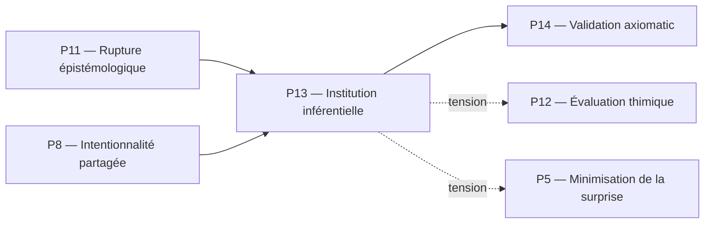

# P13 — Institution inférentielle (Brandom)
## 0. Identification
 * **Numéro :** P13
 * **Nom :** Institution inférentielle
 * **Famille :** Normatif
 * **Type :** Régime de couplage
 * **Statut :** Irréductible / localement valide
## 1. Définition
Ce régime formalise l'émergence et la stabilisation de la signification sémantique et de la rationalité à travers le déploiement de pratiques discursives réglées. L'institution inférentielle définit le sens d'un énoncé non par sa correspondance avec un objet pré-donné, mais par son rôle au sein d'un réseau dynamique de conséquences et de prémisses. Dans ce régime, les positions conceptuelles acquièrent leur valeur par le biais d'un arbitrage intersubjectif où les agents s'attribuent et se reconnaissent mutuellement des responsabilités logiques. Le pilier modélise le fonctionnement du système comme une communauté de pairs tenant à jour le registre des positions légitimes, transformant la communication en un jeu récursif d'engagements et de droits.
## 2. Invariants opératoires
 * **L'engagement sémantique (*Commitment*) :** Stabilité de la position logique par laquelle un agent s'oblige à accepter les conséquences inferentielles découlant de l'assertion qu'il a soutenue.
 * **Le droit normatif (*Entitlement*) :** Persistance de l'habilitation ou de la légitimité d'un agent à soutenir une position logique, validée par le réseau de ses justifications antérieures.
 * **Le registre des positions réciproques (*Scorekeeping*) :** Invariant structurel intersubsidiaire maintenant à jour la comptabilité des droits et des obligations de chaque participant au sein de l'interaction communicative.
 * **Le réseau d'implication matérielle :** Stabilité des relations de dépendance logique (si A est affirmé, alors B doit être accepté) qui structurent l'espace sémantique local.
## 3. Mode de couplage observateur–système
Ce pilier définit un mode spécifique de :
 * perception discursive
 * découpage du réel par l'attribution de statuts normatifs
 * sélection d’invariants inférentiels
 * stabilisation des distinctions conceptuelles publiques
### Caractéristiques :
 * **Découpage par la responsabilité :** L'environnement et les énoncés ne sont pas découpés selon leurs caractéristiques physiques ou leur saillance thymique, mais selon les obligations logiques qu'ils imposent aux agents qui les manipulent.
 * **Invariants par arbitrage croisé :** La signification des distinctions n'est pas fixée par une monade isolée, mais se stabilise par le contrôle récursif et réciproque du comportement sémantique des pairs.
 * **Pragmatisme linguistique :** Stabilisation des concepts par l'évaluation continue de leur usage et de leur validité au sein d'une communauté d'observateurs.
### Angle mort structurel :
 * **L'immanence phénoménologique et somatique :** Ce régime est structurellement aveugle aux variations d'intensités affectives et à la force thimique primitive (P12). Il ne peut ni traiter ni stabiliser les chocs émotionnels bruts ou les urgences physiologiques tant qu'ils n'ont pas été entièrement requalifiés en propositions linguistiques et soumis aux lois de l'espace inférentiel.
## 4. Domaine de validité
Ce pilier est valide lorsque :
 * Le système a validé l'intentionnalité partagée (P8) et opéré la rupture épistémologique initiale (P11) isolant l'Espace des Raisons.
 * La communauté d'agents dispose de canaux de transmission sémiotiques stabilisés et fidélisés par l'effet cliquet culturel (P9).
 * Les mécanismes de scorekeeping intersubjectif sont synchrones et préservent la confiance informationnelle entre les participants.
### Limites :
 * S'effondre dans le bavardage incohérent ou la contradiction systémique si les règles de l'implication matérielle cessent d'être partagées et appliquées de manière consistante par les agents.
 * Devient hautement instable s'il tente d'étendre son contrôle inférentiel à des dynamiques purement physiques de bas niveau (comme le couplage allostatique P3 ou les flux protoniques P1) qui n'obéissent à aucune logique discursive.
## 5. Point de rupture
Ce pilier devient insuffisant lorsque :
 * **Surcharge de révisabilité :** L'accumulation des engagements et l'évolution des pratiques discursives saturent l'appareil de scorekeeping, créant des conflits d'inférences globaux intraitables localement.
 * **Besoin d'évaluation métathéorique :** Le système doit auditer la cohérence ou les limites de ses propres axiomes de validation et se confronter à d'autres doctrines descriptives divergentes, ce qui nécessite un arbitrage supérieur exempt de dépendance inférentielle circulaire.
### Type de transition déclenchée :
 * [ ] Réinterprétation
 * [ ] Émergence
 * [X] Rupture normative  *(Bascule vers la validation axiomatique P14 pour exécuter un contrôle réflexif global des cadres doctrinaux)*
## 6. Relations avec les autres piliers
### Compatibilités partielles :
 * **P11 — Rupture épistémologique :** Zone d'articulation critique. P11 fournit l'acte de naissance de la proposition logique en brisant le Mythe du Donné, et P13 déploie cette proposition au sein du réseau social des engagements discursifs.
 * **P8 — Intentionnalité partagée :** Recouvrement structurel. P8 instaure le triangle attentionnel et la perspective commune pré-linguistique indispensables pour que le scorekeeping croisé de P13 puisse s'exécuter.
### Tensions :
 * **P12 — Évaluation thimique :** Tension logique maximale. P13 exige la soumission du comportement à la cohérence des inférences publiques, tandis que P12 pousse constamment à des ruptures de cadres sous la pression d'urgences affectives ou de gradients de valeurs égo-centrés.
 * **P5 — Minimisation de la surprise :** La minimisation de l'erreur prédictive biologique individuelle (P5) peut entrer en tension avec l'obligation de maintenir un engagement discursif coûteux ou contre-intuitif exigé par la communauté (P13).
### Incompatibilités structurelles :
 * **P1 — Cinétique protonique :** Incompatibilité absolue de famille et de registre. La physique fondamentale des gradients ioniques et des flux matériels ignore structurellement les notions de droit, de devoir sémantique ou d'obligation discursive.
## 7. Traductions (lecture depuis d’autres régimes)
### Vu depuis P9 (Effet cliquet culturel) :
L'institution inférentielle est lue comme un catalogue d'artefacts linguistiques hautement sophistiqués. La structure discursive et le jeu des raisons sont appréhendés comme des coutumes comportementales complexes capitalisées par l'histoire du groupe, dont la réplication est verrouillée par l'effet cliquet pour assurer la cohésion de la population.
### Vu depuis P14 (Validation axiomatique) :
P13 est interprété comme le niveau d'exécution de la rationalité pratique. C'est l'espace dynamique où se négocient empiriquement les droits et les engagements, mais ce tissu discursif reste un objet d'évaluation aveugle à sa propre structure tant qu'il n'est pas audité par les critères métathéoriques de la validation des systèmes d'axiomes.
## 8. Micro-graphe local

## 9. Résumé opératoire
 * **Ce pilier capture :** La stabilisation de la signification et de la rationalité par le biais d'un réseau intersubjectif d'engagements et de droits discursifs.
 * **Il observe via :** Les protocoles de scorekeeping réciproque, le suivi des implications matérielles et l'arbitrage sémantique croisé entre les pairs.
 * **Il ignore structurellement :** Les intensités affectives brutes, les chocs somatiques non traduits et la matérialité thermodynamique des canaux d'interaction.
 * **Il devient instable lorsque :** Les engagements discursifs accumulés saturent l'appareil de scorekeeping ou entrent en contradiction axiomatique globale.
## 10. Notes épistémologiques
 * **Statut ontologique :** Non requis. La signification n'est pas une entité logée dans le monde ou dans un esprit, mais une propriété géométrique des contraintes de la pratique inférentielle.
 * **Statut épistémique :** Local et relatif au régime discursif de la communauté d'observateurs ; la vérité est redéfinie comme une responsabilité partagée.
 * **Statut relationnel :** Strictement public et intersubsidiaire (co-constitution de l'Espace des Raisons par le contrôle sémantique mutuel).
## 11. Métadonnées (GitHub / navigation)
 * **Fichier :** P13_institution_inferentielle_brandom.md
 * **Connexions principales :** P5, P8, P9, P11, P12, P14
 * **Niveau de transition :** Critique
