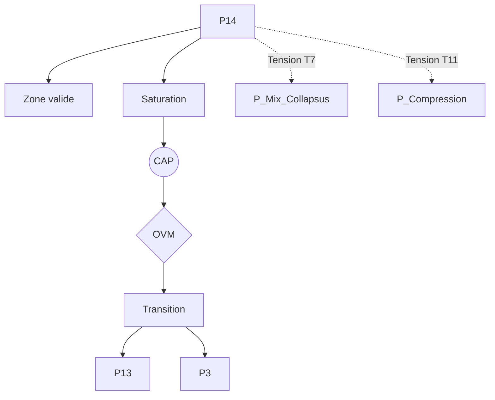

P14 — Validation axiomatique (Vuillemin)

0. Identification

- Numéro : P14
- Nom : Validation axiomatique (Vuillemin) / Audit métathéorique
- Famille : métathéorique
- Type : Régime de couplage
- Statut : Irréductible / localement valide

---

1. Définition

Ce régime exécute le contrôle réflexif global de Protokin cOS en se chargeant de l'audit métathéorique des compatibilités et des tensions irréductibles entre les différents systèmes d'axiomes et doctrines descriptives du noyau. Plutôt que de postuler une ontologie unifiée ou de forcer une cohérence plate, la validation axiomatique cartographie formellement les architectures de choix dogmatiques et les structures de règles que le système adopte pour se décrire lui-même et découper son environnement. P14 s'établit comme un régime cybernétique de second ordre (l'assimilation de l'ordre de l'observateur par l'observateur lui-même), opérant un tri rigoureux sur la révisabilité des cadres normatifs sans jamais se transformer en un fondement ultime ou une vérité finale métaphysique.

Ce régime constitue un mode spécifique de stabilisation descriptive.

Il ne décrit pas une substance, un objet ou une région ontologique du réel, mais une manière particulière de sélectionner des invariants et de maintenir des distinctions opératoires.

Contraintes de rédaction

- ne pas réduire ce régime à un autre ;
- ne pas introduire de hiérarchie implicite ;
- ne pas présupposer une causalité globale ;
- éviter les formulations ontologiquement inflationnistes.

---

1.bis. Ancrages théoriques

Ce régime est stabilisé, documenté ou audité par les références suivantes.

📚 Stabilisateurs principaux

Jules Vuillemin

- Référence : references/vuillemin.md
- Statut : Stabilisateur de régime
- Apport opératoire :
  Il fournit le socle conceptuel de l'audit métasystématique. Vuillemin démontre mathématiquement et logiquement que le pluralisme descriptif est indépassable. Son apport valide le fait qu'emprunter des invariants à un régime pour les injecter dans un autre génère inévitablement une instabilité interne. Les tensions ne sont donc pas des erreurs à résoudre par une synthèse, mais des frontières strictes entre des choix dogmatiques.
- Tensions associées :
  Tension de collapsus méta-langagier (T7), Tension de compression multi-régime (T11), Tension de réduction (T1).

Jacques Bouveresse

- Référence : references/bouveresse.md
- Statut : Frontière inter-régime / Générateur de tension
- Apport opératoire :
  Incarne la rigueur de l'audit en exigeant que chaque régime respecte ses propres frontières de validité. Il fustige l'éclectisme douteux et l'importation métaphorique sauvage de concepts scientifiques exacts (comme le théorème de Gödel) dans le champ des sciences humaines et de la théorie sociale.
- Tensions associées :
  Tension de collapsus méta-langagier (T7), Tension de rupture (T5).

---

1.ter. Fonction interne du régime

Ce régime existe afin de rendre descriptible la structure même de l'architecture d'observation, en évitant que le système ne s'effondre sous le poids de l'éclectisme ou des fusions conceptuelles abusives.

Sans ce régime, l'architecture perdrait la possibilité d'auditer les tentatives de réduction des niveaux supérieurs ou les amalgames injustifiés, tombant dans le piège de la métaphysique dogmatique ou du relativisme absolu.

Contribution principale à Protokin :

- Stabilisation de la réflexivité formelle (cybernétique de second ordre).
- Cartographie des choix doctrinaux et des limites de compatibilité des systèmes d'axiomes.
- Point d'origine des tensions métathéoriques (T7, T11) face à l'éclectisme et à l'indifférenciation.

---

1.quater. Contrat de non-réification

Ce régime ne doit jamais être interprété comme :

- une entité ontologique autonome
- un niveau réel du monde
- une substance causale
- une explication ultime

Il constitue uniquement :

- un dispositif de sélection d’invariants
- une grille de stabilisation descriptive
- un mode local de lecture

Toute réification constitue une violation OVM (T1 / T11).

---

🛡 Garde-fous épistémologiques

Jacques Bouveresse (et Jules Vuillemin)

- Fonction : Garde-fou
- Règle de vigilance :
  Empêcher l'éclectisme doctrinal et l'analogie abusive. L'OVM bloque fermement (T7) toute tentative de fusionner des théories reposant sur des axiomes incompatibles. La rigueur de l'audit métathéorique exige de dénoncer le "collapsus méta-langagier" qui consisterait à utiliser un régime (par exemple P11 ou P13) tout en reniant les postulats philosophiques qui le rendent opératoire.

---

2. Invariants opératoires

Le régime sélectionne préférentiellement les stabilités suivantes :

- Les systèmes d'axiomes et les choix dogmatiques fondamentaux.
- Les invariants doctrinaux et les structures de règles métathéoriques.
- Les compatibilités et incompatibilités formelles irréductibles entre régimes.
- Les distinctions réflexives globales.

Définition

Un invariant est une stabilité relationnelle reproductible à l'intérieur du régime.

Exemples :

- régularité de transition
- boucle de rétroaction
- norme instituée
- engagement déontique
- structure dissipative

---

3. Mode de couplage observateur–système

Ce régime définit une manière particulière de :

- percevoir le réel métathéoriquement.
- découper le réel par l'analyse des systèmes d'axiomes.
- sélectionner des invariants doctrinaux.
- stabiliser des distinctions réflexives globales.

Caractéristiques

- Cybernétique de l'entendement : Le couplage ne s'effectue plus avec des objets physiques ou discursifs isolés, mais avec la grammaire interne et les limites de validité des théories elles-mêmes.
- Découpage par l'asymétrie des théories : Le réel est cartographié selon la structure logique des choix axiomatiques fondamentaux.
- Stabilisation de la corrigibilité : Évalue la profondeur à laquelle le système peut réviser ses critères de correction sans détruire son runtime opératoire.

Angle mort structurel

Pour fonctionner, ce régime doit nécessairement ignorer :

- L'application pragmatique locale (l'action immédiate) : Il est incapable d'intervenir directement dans le couplage somatique (P3) ou le scorekeeping pragmatique immédiat (P13). Il observe la règle mais n'exécute pas l'action.

---

4. Domaine de validité

Le régime est pertinent lorsque :

- L'Espace des raisons (P11, P13) est stabilisé et fournit des structures inférentielles explicites prêtes à l'audit.
- Le système est confronté à des conflits de règles ou à des dérives de corrigibilité nécessitant un arbitrage de second ordre.
- Le coût computationnel de l'analyse réflexive globale ne sature pas la réserve cinétique indispensable de l'organisme.

Frontières descriptives

Le régime devient insuffisant lorsque :

- Le système fait face à un besoin vital, somatique ou affectif immédiat (P12) sans temps disponible pour l'audit.
- Les dynamiques à l'œuvre relèvent de processus strictement immanents, cinétiques ou thermodynamiques (P1, P2).

Violations typiques détectées par l'OVM :

- Compression inter-régime (T11) : superposition de la physique de Prigogine, de la psychologie et du structuralisme dans un même méta-discours vague.
- Collapsus méta-langagier (T7) : tentative de fonder une politique sur le théorème de Gödel.
- Réduction (T1) : affirmer que cet audit formel n'est qu'un "jeu de mots" neurobiologique.

---

4.bis. Conditions d’illégitimité (OVM)

Le régime devient illégitime si :

- un invariant est transformé en entité ontologique
- une corrélation est interprétée comme causalité globale
- un niveau supérieur est réduit à ce régime sans perte
- une norme est dérivée d’un fait causal sans médiation

Violations associées :

- T1 — Réduction
- T3 — Saut d’échelle
- T11 — Compression inter-régime
- T13 — Collapsus normatif

---

5. Conditions de saturation

Le régime devient instable lorsque :

- Sa récursion s'enfonce dans l'infini sans rencontrer de point fixe dogmatique (paralysie de l'audit).
- L'hyper-réflexivité computationnelle consomme l'intégralité du budget énergétique du système, déclenchant un effondrement matériel (Somatic Collapse).
- Une interruption éditoriale absolue l'oblige à suspendre l'audit pour basculer dans l'action immanente (P12, P7).

Symptômes observables :

- perte de pouvoir explicatif
- multiplication des exceptions
- apparition de tensions non résolues
- nécessité de nouveaux invariants (bifurcation vers l'action)

Tensions fréquemment associées :

- T7 (Collapsus méta-langagier)
- T11 (Compression multi-régime)
- T4 (Tension normative)

---

5.bis. Matrice de saturation

Indicateurs de saturation :

- augmentation des exceptions descriptives
- instabilité des invariants sélectionnés
- besoin d’un niveau explicatif supérieur
- incohérences multi-échelles

Seuil critique :

≥ 2 indicateurs actifs → déclenchement CAP

---

6. Relations avec les autres régimes

Compatibilités partielles

- P13 — Institution inférentielle : Zone d'articulation supérieure. P13 gère la comptabilité quotidienne des engagements discursifs ; P14 audite la structure axiomatique globale qui rend ce scorekeeping possible et légitime.
- P4 — Compétence topographique : Alignement cybernétique. P14 applique à l'espace des doctrines la thèse de P4 selon laquelle les objets de description sont des jetons (*tokens*) pour des comportements propres de l'appareil d'observation.

Traductions stables

- P14 ↔ P13 : La cartographie métathéorique redescend s'investir pragmatiquement dans l'espace social des raisons.

Frictions cartographiées

- P12 — Évaluation thimique : Tension normative maximale (T4). P14 exige une neutralité axiomatique formelle, suspendue au-dessus des préférences, alors que P12 pousse constamment à la surpondération asymétrique émotionnelle.
- P5 — Minimisation de la surprise : La minimisation (P5) cherche l'adéquation statistique avec le milieu ; P14 tolère et formalise l'incompatibilité logique et la surprise épistémique comme des propriétés inhérentes à la dérive des descriptions.

Incompatibilités structurelles

- P1 — Cinétique protonique : Incompatibilité radicale. Les flux ioniques de bas niveau s'exécutent de manière purement immanente et déterministe, sans aucune relation possible avec l'audit des choix dogmatiques supérieurs.

---

6.bis. Tensions constitutives

Ce régime existe parce qu’il rend visibles certaines tensions fondamentales.

Sans elles, il perd sa nécessité descriptive.

Tensions constitutives

- T7 (Tension de collapsus méta-langagier)
- T11 (Tension de compression multi-régime)

Fonction de ces tensions

Ces tensions garantissent l'autonomie et l'utilité absolue de P14. Ce régime existe expressément pour diagnostiquer et neutraliser le T7 et le T11. S'il n'y avait pas une propension constante des observateurs à amalgamer les concepts incompatibles ou à écraser la pluralité des cadres sous une "Totalité" informe, le régime d'audit axiomatique n'aurait aucune fonction défensive à remplir.

---

7. Traductions inter-régimes

Vu depuis P4 (Compétence topographique)

La validation axiomatique est lue comme un méta-comportement propre (*Eigen-behavior* de second ordre). Les théories et doctrines auditées par P14 ne sont pas des représentations d'une réalité métathéorique objective, mais les *tokens* stables issus de la récursion des procédures d'observation du système sur lui-même.

Vu depuis P13 (Institution inférentielle)

P14 est interprété comme la limite supérieure du registre des engagements. C'est l'instance d'audit qui examine non pas un énoncé spécifique, mais le droit global du système à utiliser un réseau inférentiel entier, requalifiant les conflits discursifs en incompatibilités axiomatiques formelles.

Important

- ne sont pas des équivalences
- ne sont pas des réductions
- ne permettent pas de fusion des régimes

---

8. Dynamique d’audit (CAP + OVM)

Lorsqu’une saturation est détectée, le Cycle d’Audit Protokin (CAP) est déclenché.

Diagnostic possible

- Tension principale : T7 (Collapsus méta-langagier)
- Tension secondaire : T11 (Compression multi-régime)

Transitions fréquemment observées

- P14 → P13 par Réinterprétation (redescente vers l'application concrète des engagements normatifs lorsque l'audit réflexif est achevé).
- P14 → P3 / P7 par Rupture (urgence : la saturation computationnelle de P14 nécessite un effondrement contrôlé pour restaurer la viabilité organique de base du système).

Hiérarchie des transitions autorisées

- Niveau 1 : Réinterprétation
- Niveau 2 : Émergence
- Niveau 3 : Rupture
- Niveau 4 : Blocage OVM

Rôle de l’OVM

L’OVM ne crée pas les limites du régime.

Il détecte les violations de frontières descriptives. En collaboration totale avec P14, l'OVM bloque les prétentions universalistes et l'impérialisme discursif, interdisant de traiter les incompatibilités conceptuelles profondes comme de simples questions de sémantique superficielle.

---

9. Micro-graphe local

---

10. Résumé opératoire

Ce régime capture : L'audit métathéorique global des systèmes d'axiomes, des choix dogmatiques et des compatibilités de régimes au sein du noyau.

Il sélectionne : Les invariants doctrinaux, les architectures de règles et les asymétries théoriques.

Il observe via : La cybernétique de second ordre, la cartographie des incompatibilités irréductibles et le contrôle de la révisabilité des cadres.

Il ignore structurellement : Les urgences somatiques directes, l'adéquation statistique immédiate avec le milieu et l'exécution pragmatique motrice.

Il devient instable lorsque : Sa récursion infinie ne rencontre aucun point fixe ou épuise la réserve énergétique (K_res) nécessaire à l'infrastructure biophysique de l'observateur.

Les tensions dominantes sont : T7, T11, T1.

---

11. Notes épistémologiques

Statut ontologique

Non requis.

Le régime n’est pas une substance ni un niveau du réel.

Statut épistémique

Local.
Contextuel.
Révisable.

Statut relationnel

Déterminé par le couplage observateur–système.

Principe fondamental

Un régime ne décrit pas le monde.

Il décrit une manière stable de décrire le monde.

---

12. Métadonnées

Fichier : P14_validation_axiomatique_vuillemin.md

Connexions principales : P4, P5, P6, P11, P12, P13

Tensions dominantes : T1, T7, T11

Niveau de transition : Critique

Dernière révision : 2026-06-13

---

13. Validation récursive (CAP ↔ OVM)

Chaque régime est valide uniquement si :

ses transitions CAP sont cohérentes

ses tensions OVM ne sont pas court-circuitées

ses invariants restent stables sous changement d’échelle

aucune réduction illégitime n’est effectuée

Toute incohérence déclenche :

requalification du régime

ou révision des tensions associées