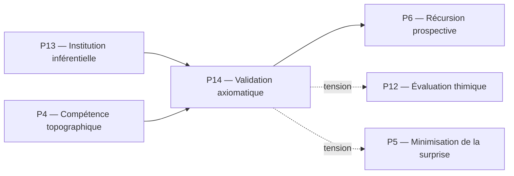

# P14 — Validation axiomatique (Vuillemin)
## 0. Identification
 * **Numéro :** P14
 * **Nom :** Validation axiomatique
 * **Famille :** Métathéorique
 * **Type :** Régime de couplage
 * **Statut :** Irréductible / localement valide
## 1. Définition
Ce régime exécute le contrôle réflexif global de Protokin cOS en se chargeant de l'audit métathéorique des compatibilités et des tensions irréductibles entre les différents systèmes d'axiomes et doctrines descriptives du noyau. Plutôt que de postuler une ontologie unifiée ou de forcer une cohérence plate, la validation axiomatique cartographie formellement les architectures de choix dogmatiques et les structures de règles que le système adopte pour se décrire lui-même et découper son environnement. P14 s'établit comme un régime cybernétique de second ordre (l'assimilation de l'ordre de l'observateur par l'observateur lui-même), opérant un tri rigoureux sur la révisabilité des cadres normatifs sans jamais se transformer en un fondement ultime ou une vérité finale métaphysique.
## 2. Invariants opératoires
 * **La matrice de compatibilité doctrinale :** Stabilité de l'espace métathéorique formalisant le degré de friction ou de recouvrement logique entre les systèmes d'axiomes des 13 autres piliers.
 * **L'invariant réflexif de second ordre :** Persistance de la distinction par laquelle le système appréhende ses propres protocoles de correction comme des objets d'audit calculables.
 * **La signature dogmatique du cadre :** Structure stable identifiant les postulats primitifs irréductibles sous-jacents à une description (ex. option réaliste, conceptualiste ou intuitionniste).
 * **Le graphe global de tension (W_t) :** Clôture formelle stabilisant l'évaluation de l'asymétrie des flux de rupture et de transition sur l'ensemble de la console système.
## 3. Mode de couplage observateur–système
Ce pilier définit un mode spécifique de :
 * perception métathéorique
 * découpage du réel par l'analyse des systèmes d'axiomes
 * sélection d’invariants doctrinaux
 * stabilisation des distinctions réflexives globales
### Caractéristiques :
 * **Cybernétique de l'entendement :** Le couplage ne s'effectue plus avec des objets physiques ou des énoncés discursifs isolés, mais avec la grammaire interne et les limites de validité des théories elles-mêmes.
 * **Découpage par l'asymétrie des théories :** Le réel est cartographié selon la structure logique des choix axiomatiques fondamentaux, isolant les points de divergence irréductibles entre registres.
 * **Stabilisation de la corrigibilité :** P14 stabilise le système en évaluant la profondeur à laquelle il peut réviser ses critères de correction sans détruire son runtime opératoire.
### Angle mort structurel :
 * **L'application pragmatique locale (L'Action immédiate) :** Ce régime est structurellement incapable d'intervenir directement dans le couplage somatique, métabolique ou discursif en temps réel. Il observe la structure des règles mais ne peut pas exécuter l'ajustement allostatique (P3) ou le scorekeeping pragmatique immédiat d'un engagement (P13), constituant un pur miroir formel déconnecté de l'urgence motrice.
## 4. Domaine de validité
Ce pilier est valide lorsque :
 * L'Espace des Raisons (P11, P13) est stabilisé et fournit des structures inferentielles explicites prêtes à l'audit.
 * Le coût computationnel de l'analyse réflexive globale ne sature pas la réserve cinétique résiduelle (K_{\text{res}}) indispensable au maintien des piliers biophysiques.
 * Le système est confronté à des conflits de règles ou à des dérives de corrigibilité (P13) nécessitant un arbitrage de second ordre.
### Limites :
 * S'effondre dans la régression à l'infini (boucle récursive sans point fixe) s'il tente de valider ses propres axiomes de validation sans accepter d'interruption éditoriale ou de choix dogmatique premier.
 * Produit une instabilité descriptive majeure s'il traite les chocs cinétiques bruts ou les flux protoniques (P1) à l'aide de critères d'incompatibilité doctrinale métathéorique.
## 5. Point de rupture
Ce pilier devient insuffisant lorsque :
 * **Somatic Collapse :** L'hyper-réflexivité computationnelle de P14 consomme l'intégralité du budget énergétique du système, entraînant la faillite par inanition des régimes de dissipation structurée de base.
 * **Interruption Éditioriale Absolue :** Le système atteint la limite structurelle de sa capacité d'auto-description et doit suspendre l'audit pour basculer de force dans l'action immanente ou la pure décision thymique (P12) afin de préserver sa viabilité.
### Type de transition déclenchée :
 * [X] Réinterprétation  *(Réallocation des ressources vers l'infrastructure dissipative)*
 * [ ] Émergence
 * [ ] Rupture normative
## 6. Relations avec les autres piliers
### Compatibilités partielles :
 * **P13 — Institution inférentielle :** Zone d'articulation supérieure. P13 gère la comptabilité quotidienne des engagements discursifs, tandis que P14 audite la structure axiomatique globale qui rend ce scorekeeping possible et légitime.
 * **P4 — Compétence topographique :** Alignement cybernétique profond. P14 applique à l'espace des doctrines la thèse de P4 selon laquelle les objets de description sont des jetons pour des comportements propres (\text{Eigen-behaviors}) de l'appareil d'observation.
### Tensions :
 * **P12 — Évaluation thimique :** Tension maximale. P14 exige une neutralité axiomatique et formelle absolue, suspendue au-dessus des préférences, alors que P12 pousse constamment à la surpondération asymétrique sous la pression des urgences affectives primitives.
 * **P5 — Minimisation de la surprise :** La minimisation de l'erreur prédictive de P5 cherche une adéquation statistique avec le milieu, tandis que P14 tolère et formalise l'incompatibilité logique et la surprise épistémique comme des propriétés inhérentes à la dérive des descriptions.
### Incompatibilités structurelles :
 * **P1 — Cinétique protonique :** Incompatibilité radicale et totale de famille. Les flux ioniques de bas niveau s'exécutent de manière purement immanente et déterministe, sans aucune relation possible avec l'audit des choix dogmatiques supérieurs.
## 7. Traductions (lecture depuis d’autres régimes)
### Vu depuis P4 (Compétence topographique) :
La validation axiomatique est lue comme un méta-comportement propre (\text{Eigen-behavior} de second ordre). Les théories et doctrines auditées par P14 ne sont pas des représentations d'une réalité métathéorique objective, mais les *tokens* stables issus de la récursion des procédures d'observation du système sur lui-même.
### Vu depuis P13 (Institution inférentielle) :
P14 est interprété comme la limite supérieure du registre des engagements. C'est l'instance d'audit qui examine non pas un énoncé spécifique, mais le droit global du système à utiliser un réseau inférentiel entier, requalifiant les conflits discursifs en incompatibilités axiomatiques formelles.
## 8. Micro-graphe local

## 9. Résumé opératoire
 * **Ce pilier capture :** L'audit métathéorique global des systèmes d'axiomes, des choix dogmatiques et des compatibilités de régimes au sein du noyau.
 * **Il observe via :** L'analyse des structures de règles, la cartographie des tensions asymétriques inter-piliers et la cybernétique de second ordre.
 * **Il ignore structurellement :** Les urgences somatiques directes, le scorekeeping discursif en temps réel et l'adéquation statistique immédiate avec le milieu physique.
 * **Il devient instable lorsque :** Sa récursion infinie ne rencontre aucun point fixe dogmatique ou épuise la réserve énergétique somatique de secours.
## 10. Notes épistémologiques
 * **Statut ontologique :** Non requis. Les architectures axiomatiques sont des structures de stabilisation descriptive et non des substances ou des fondements métaphysiques ultimes.
 * **Statut épistémique :** Radicalement local et relatif au graphe de couplage ; il consacre l'inachèvement stabilisé comme condition de la rationalité.
 * **Statut relationnel :** Strictement métathéorique et réflexif (bouclage récursif de l'appareil de description sur ses propres conditions de correction).
## 11. Métadonnées (GitHub / navigation)
 * **Fichier :** P14_validation_axiomatique_vuillemin.md
 * **Connexions principales :** P4, P5, P6, P11, P12, P13
 * **Niveau de transition :** Critique