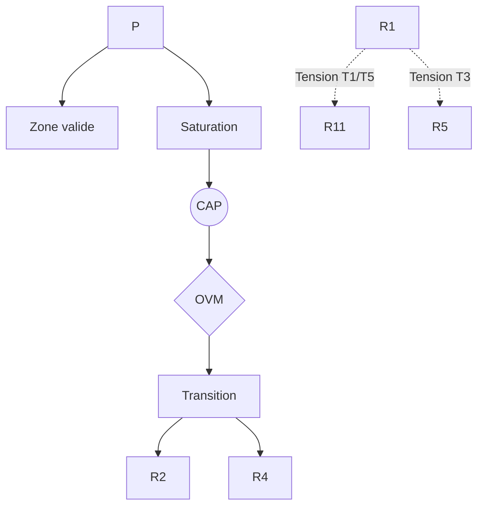

R1 — Cinétique Protonique

0. Identification

- Numéro : R1
- Nom : Cinétique Protonique
- Famille : physico-dynamique
- Type : Régime de couplage
- Statut : Irréductible / localement valide

---

1. Définition

Ce régime formalise la stabilisation de différences élémentaires à travers des dynamiques de circulation à l'échelle micro-physique, telles qu'elles sont sélectionnées comme invariants sous un mode d'observation physico-dynamique. Il s'applique au niveau où s'opèrent les échanges primordiaux entre le continu énergétique et le discontinu structurel. Ce régime ne décrit pas des objets physiques constitués en soi ou des substances inertes, mais se concentre sur les régularités de transformation, de transduction et de maintien de gradients sous des contraintes locales de viabilité matérielle. 

Ce régime constitue un mode spécifique de stabilisation descriptive.

Il ne décrit pas une substance, un objet ou une région ontologique du réel, mais une manière particulière de sélectionner des invariants et de maintenir des distinctions opératoires.

Contraintes de rédaction

- ne pas réduire ce régime à un autre ;
- ne pas introduire de hiérarchie implicite ;
- ne pas présupposer une causalité globale ;
- éviter les formulations ontologiquement inflationnistes.

---

1.bis. Ancrages théoriques

Ce régime est stabilisé, documenté ou audité par les références suivantes.

📚 Stabilisateurs principaux

Gilbert Simondon

- Référence : references/simondon.md
- Statut : Stabilisateur de régime
- Apport opératoire :
  Formalisation de l'individuation physique comme opération transductive. Simondon démontre que la genèse de l'individu physique (comme le cristal) intègre l'opération commune du continu (le milieu amorphe, l'énergie potentielle) et du discontinu (le germe structural, la particule), créant une résonance interne fondamentale.
- Tensions associées :
  T1 (Tension de réduction), T3 (Tension d'échelle).

Erwin Schrödinger

- Référence : references/schrodinger.md
- Statut : Frontière inter-régime / Générateur de tension
- Apport opératoire :
  Incarne, à travers la mécanique ondulatoire, le contre-modèle du "paquet d'ondes" au sein des dynamiques microphysiques. Il illustre l'anomalie épistémologique consistant à tenter de résoudre la dualité onde-corpuscule en éliminant le pôle discontinu (le corpuscule) au profit exclusif du continu (l'onde).
- Tensions associées :
  T1 (Tension de réduction).

---

1.ter. Fonction architecturale

Ce régime existe afin de rendre descriptibles les dynamiques de transition micro-physiques qui disparaîtraient si l'analyse commençait directement aux niveaux d'individuation (macroscopiques) ou de cognition. 

Sans ce régime, l'architecture perdrait la possibilité d'auditer les tentatives de réduction des niveaux supérieurs vers les seules dynamiques élémentaires.

Contribution principale à Protokin :

- Stabilisation des transitions élémentaires.
- Cartographie des limites du réductionnisme microphysique.
- Point d'origine des tensions T1 et T3.

---

1.quater. Contrat de non-réification

Ce régime ne doit jamais être interprété comme :

- une entité ontologique autonome
- un niveau réel du monde
- une substance causale
- une explication ultime

Il constitue uniquement :

- un dispositif de sélection d’invariants
- une grille de stabilisation descriptive
- un mode local de lecture

Toute réification constitue une violation OVM (T1 / T11).

---

🛡 Garde-fous épistémologiques

Erwin Schrödinger (et son traitement critique par l'allagmatique simondienne)

- Fonction : Garde-fou
- Règle de vigilance :
  Empêcher la dissolution de l'individu physique en réduisant purement et simplement le corpuscule (la singularité structurale discontinue) au train d'ondes continu. La véritable individuation exige de maintenir la relation transductive sans écrasement mutuel (Prévention de la Tension T1).

---

2. Invariants opératoires

Le régime sélectionne préférentiellement les stabilités suivantes :

- Stabilisation de contrastes énergétiques locaux.
- Persistance de différenciations dynamiques sous contrainte.
- Régularités de transition entre états micro-physiques (ex: transferts, sauts quantiques).
- Maintien de structures directionnelles de circulation sous dissipation.

Définition

Un invariant est une stabilité relationnelle reproductible à l'intérieur du régime.

Exemples :

- régularité de transition
- boucle de rétroaction
- norme instituée
- engagement déontique
- structure dissipative

---

3. Mode de couplage observateur–système

Ce régime définit une manière particulière de :

- percevoir le primat des micro-transitions sur les états macroscopiques identitaires.
- découper le réel comme un espace immanent d'échanges énergétiques.
- sélectionner des invariants par leur régularité de transformation plutôt que par une identité d'objet.
- stabiliser des distinctions par la seule régularité de circulation et de gradient.

Caractéristiques

- Le régime est centré sur la dynamique plutôt que sur l'entité préexistante.
- Stabilisation par continuité des flux sous contrainte.
- Maintien de la cohérence par transduction entre ordres de grandeur.

Angle mort structurel

Pour fonctionner, ce régime doit nécessairement ignorer :

- La sélection des objets macroscopiques comme invariants primitifs indépendants des dynamiques de transition qui les supportent.
- Toute forme d'intentionnalité, de téléologie ou de norme justificative.

---

4. Domaine de validité

Le régime est pertinent lorsque :

- Les observations et modélisations privilégient des dynamiques de transformation à l'échelle micro-physique.
- Les invariants pertinents peuvent être stabilisés à partir de pures régularités de transition locale.
- L'analyse porte sur les conditions de matérialité les plus élémentaires (ex: physique statistique).

Frontières descriptives

Le régime devient insuffisant lorsque :

- Le système d'observation est confronté à des régimes macroscopiques émergents sans référence directe aux flux élémentaires (R4).
- Les dynamiques font appel à des registres symboliques, sémantiques ou normatifs autonomes (R11, R13).

Violations typiques détectées par l'OVM :

- Réductionnisme physicaliste naïf (T1).
- Écrasement des registres sociétaux sur les flux physiques purs (T11).
- Confusion d'échelle modélisatrice (T3).

---

4.bis. Conditions d’illégitimité (OVM)

Le régime devient illégitime si :

- un invariant est transformé en entité ontologique absolue.
- une corrélation est interprétée comme causalité globale de l'esprit humain.
- un niveau supérieur (cognitif ou social) est réduit à ce régime sans perte.
- une norme logique est dérivée d’un fait causal sans médiation.

Violations associées :

- T1 — Réduction
- T3 — Saut d’échelle
- T11 — Compression inter-régime
- T13 — Collapsus normatif (Dérive téléologique)

---

5. Conditions de saturation

Le régime devient instable lorsque :

- L'observateur tente de modéliser une identité physique maintenue dans la durée au-delà des simples transitions immédiates (ex: la dispersion spatiale indéfinie du paquet d'ondes).
- Les invariants sélectionnés par d'autres régimes supérieurs ne peuvent plus être re-décrits à partir de simples régularités de transition micro-physiques.

Symptômes observables :

- perte de pouvoir explicatif
- multiplication des exceptions (ex: apparition de propriétés non linéaires intraitables)
- apparition de tensions non résolues entre le calcul formel et l'observation macroscopique
- nécessité de nouveaux invariants (comme l'objet perceptif ou la structure dissipée)

Tensions fréquemment associées :

- T1 (Tension de réduction)
- T3 (Tension d'échelle)
- T5 (Tension de rupture vers R11)

---

5.bis. Matrice de saturation

Indicateurs de saturation :

- augmentation des exceptions descriptives
- instabilité des invariants sélectionnés
- besoin d’un niveau explicatif supérieur
- incohérences multi-échelles

Seuil critique :

≥ 2 indicateurs actifs → déclenchement CAP

---

6. Relations avec les autres régimes

Compatibilités partielles

- R2 — Dissipation structurée : Partage explicite de la notion de stabilisation hors équilibre et de la dynamique des flux.
- R3 — Ajustement allostatique : Régulation et orchestration des dynamiques de transition sous contrainte physiologique de survie.

Traductions stables

- R1 ↔ R2 (Articulation physique entre le niveau micro-protonique et les structures macro-dissipatives).

Frictions cartographiées

- R4 — Tension T3/T4 : Changement de statut de l'invariant (la transition de l'onde/flux microphysique vers la constitution de l'objet macroscopique topographique stabilisé).
- R5 — Tension T2 : Conflit entre la modélisation probabiliste inférentielle de l'erreur (R5) et la dynamique purement immanente de la régularité matérielle (R1).

Incompatibilités structurelles

- R11 — Rupture épistémologique : Changement absolu de régime de justification. R1 opère dans l'immanence stricte des causes, où la notion de "justification" rationnelle est caduque et irrecevable.
- R13 — Institution inférentielle : Incompatibilité de famille. La physique fondamentale ignore structurellement le droit, le devoir sémantique et la tenue des scores déontiques sociaux.

---

6.bis. Tensions constitutives

Ce régime existe parce qu’il rend visibles certaines tensions fondamentales.

Sans elles, il perd sa nécessité descriptive.

Tensions constitutives

- T1 (Tension de réduction)
- T3 (Tension d'échelle)

Fonction de ces tensions

La tension de réduction (T1) assure l'utilité du régime R1 : ce dernier cartographie précisément l'échelle pure de la cinétique physique et met ainsi en évidence, par contraste, tout ce qui *ne peut pas* y être réduit sans perte (la vie, l'esprit, la norme). Elle signale la limite infranchissable du réductionnisme mécaniste.

---

7. Traductions inter-régimes

Vu depuis R4 (Compétence topographique)

Les flux élémentaires constitutifs de la cinétique protonique sont reconstitués pragmatiquement comme les supports sous-jacents, mais directement inobservables, des objets macroscopiques stables avec lesquels l'agent interagit.

Vu depuis R5 (Minimisation de la surprise)

Les transitions protoniques aléatoires ou déterministes deviennent des régularités statistiques, compressées et anticipées au sein d'un modèle génératif prédictif afin d'en optimiser la survie.

Important

- ne sont pas des équivalences
- ne sont pas des réductions
- ne permettent pas de fusion des régimes

---

8. Dynamique d’audit (CAP + OVM)

Lorsqu’une saturation est détectée, le Cycle d’Audit Protokin (CAP) est déclenché.

Diagnostic possible

- Tension principale : T1 (Réduction)
- Tension secondaire : T3 (Échelle) ou T5 (Rupture normative)

Transitions fréquemment observées

- R1 → R2 par réinterprétation (passage à l'échelle des structures dissipatives émergentes).
- R1 → R4 par émergence (stabilisation des objets comportementaux sur la base des flux).
- Blocage OVM si tentative de saut direct R1 → R11.

Hiérarchie des transitions autorisées

- Niveau 1 : Réinterprétation
- Niveau 2 : Émergence
- Niveau 3 : Rupture
- Niveau 4 : Blocage OVM

Rôle de l’OVM

L’OVM ne crée pas les limites du régime.

Il détecte les violations de frontières descriptives. L'OVM interviendra formellement (Axis II) si l'observateur tente de fonder la "vérité" ou la "conscience" directement sur un état quantique ou un flux ionique (T1), exigeant que le saut conceptuel soit rigoureusement médiatisé par les paliers de l'émergence biologique et sociale.

---

9. Micro-graphe local

---

10. Résumé opératoire

Ce régime capture : Les régularités de transition à l'échelle micro-physique.

Il sélectionne : La continuité des dynamiques de circulation, de transduction et de transformation sous contrainte matérielle.

Il observe via : Le primat des flux causaux sur les états macroscopiques identitaires fermés.

Il ignore structurellement : Les objets macroscopiques autonomes, la cognition symbolique, l'intentionnalité partagée, et toute forme de justification éthico-logique.

Il devient instable lorsque : L'observateur tente de modéliser une identité prolongée et autonome par l'écrasement sur le seul flux continu, provoquant des Tensions d'échelle ou de réduction (ex: le paquet d'ondes).

Les tensions dominantes sont : T1, T3, T5.

---

11. Notes épistémologiques

Statut ontologique

Non requis.

Le régime n’est pas une substance ni un niveau du réel.

Statut épistémique

Local.

Contextuel.

Révisable.

Statut relationnel

Déterminé par le couplage observateur–système.

Principe fondamental

Un régime ne décrit pas le monde.

Il décrit une manière stable de décrire le monde.

---

12. Métadonnées

Fichier : R1_cinetique_protonique.md

Connexions principales : R2, R3, R4, R5, R11

Tensions dominantes : T1, T3, T5

Niveau de transition : Critique

Dernière révision : 2026-06-13

---

13. Validation récursive (CAP ↔ OVM)

Chaque régime est valide uniquement si :

ses transitions CAP sont cohérentes

ses tensions OVM ne sont pas court-circuitées

ses invariants restent stables sous changement d’échelle

aucune réduction illégitime n’est effectuée

Toute incohérence déclenche :

requalification du régime

ou révision des tensions associées
