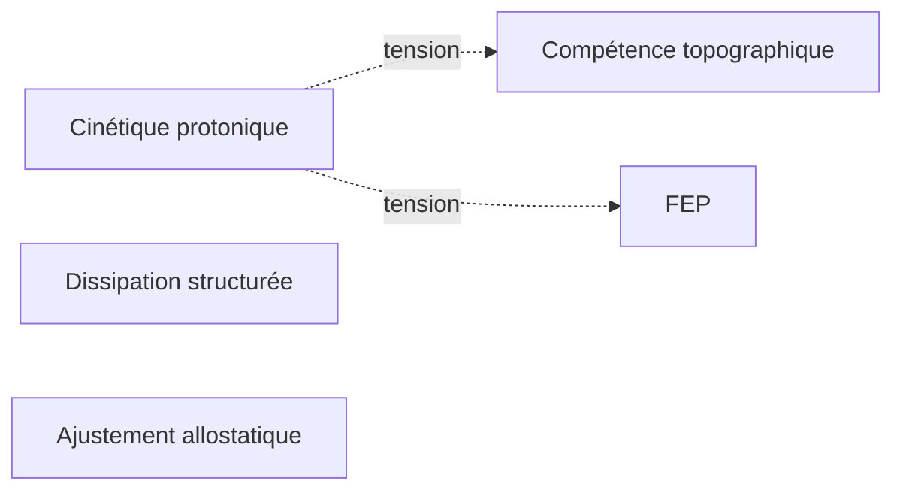

# P1 — Cinétique Protonique

## 0. Identification

- **Numéro :** P1  
- **Nom :** Cinétique Protonique  
- **Famille :** physico-dynamique  
- **Type :** Régime de couplage  
- **Statut :** irréductible / localement valide  

---

## 1. Définition

Ce régime formalise la stabilisation de différences élémentaires à travers des dynamiques de circulation à l’échelle micro-physique, telles qu’elles sont sélectionnées comme invariants sous un mode d’observation physico-dynamique. Il ne décrit pas des objets physiques en soi, mais des régularités de transformation et de maintien de gradients sous contraintes locales.

👉 Cette section doit :
- décrire le régime sans le réduire à un autre
- éviter toute hiérarchie implicite
- ne pas introduire de causalité globale

---

## 2. Invariants opératoires

Liste des stabilités capturées par ce régime :

- Stabilisation de contrastes énergétiques locaux
- Persistance de différenciations dynamiques sous contrainte
- Régularités de transition entre états micro-physiques
- Maintien de structures directionnelles de circulation sous dissipation

👉 Un invariant = une stabilité relationnelle produite dans ce régime.

---

## 3. Mode de couplage observateur–système

Ce pilier définit un mode spécifique de :

- perception  
- découpage du réel  
- sélection d’invariants  
- stabilisation des distinctions  

### Caractéristiques :
- Primat des micro-transitions sur les états macroscopiques  
- Lecture du domaine physico-dynamique comme espace de stabilisation de transitions locales, où les invariants sont définis par régularité de transformation plutôt que par identité d’objet
- Stabilisation par régularité de circulation plutôt que par identité  

### Angle mort structurel :

Ce régime ne sélectionne pas les objets macroscopiques comme invariants primitifs indépendants des dynamiques de transition qui les supportent.

---

## 4. Domaine de validité

Ce régime devient pertinent lorsque les observations privilégient des dynamiques de transformation à l’échelle micro-physique, et que les invariants pertinents peuvent être stabilisés à partir de régularités de transition locale.

### Limites :
- Régimes macroscopiques émergents sans référence directe aux flux élémentaires  
- Régimes symboliques ou normatifs autonomes  

👉 Toute extension hors de ce domaine produit une instabilité descriptive.

---

## 5. Point de rupture

Ce pilier devient insuffisant lorsque :
Ce régime entre en zone de tension forte lorsque les invariants sélectionnés par d’autres régimes ne peuvent plus être re-décrits à partir de simples régularités de transition micro-physiques.

### Type de transition déclenchée :
- ☑ Réinterprétation  
- ☐ Émergence  
- ☐ Rupture normative  

---

## 6. Relations avec les autres piliers

### Compatibilités partielles :
- P2 : partage de la notion de stabilisation hors équilibre
- P3 — P3 : régulation des dynamiques de transition sous contrainte

### Tensions :
- P4 : changement de statut des invariants (transition objet / invariant sélectionné) 
- P5 : modélisation probabiliste des régularités de transition

Zone de rupture :
- P11 : changement de régime de justification (causal → normatif)

---

## 7. Traductions (lecture depuis d’autres régimes)

### Vu depuis P4 :
Les flux élémentaires sont reconstitués comme supports sous-jacents d’objets stables.

### Vu depuis P5 :
Les transitions protoniques deviennent des régularités compressées en modèle prédictif.

👉 Important : il ne s’agit pas d’équivalences, mais de relectures partielles.

---

## 8. Micro-graphe local

---

9. Résumé opératoire

Ce régime stabilise des descriptions centrées sur des régularités de transition à l’échelle micro-physique, en sélectionnant des invariants liés à la continuité des dynamiques de circulation et de transformation.

---

10. Notes épistémologiques (optionnel)

Statut ontologique : non requis
Statut épistémique : local et relatif au régime
Statut relationnel : défini par couplage observateur–système

---

11. Métadonnées (GitHub / navigation)

Fichier : P1_cinetique_protonique.md

Connexions principales : P2, P3, P4, P5, P11

Niveau de transition : critique