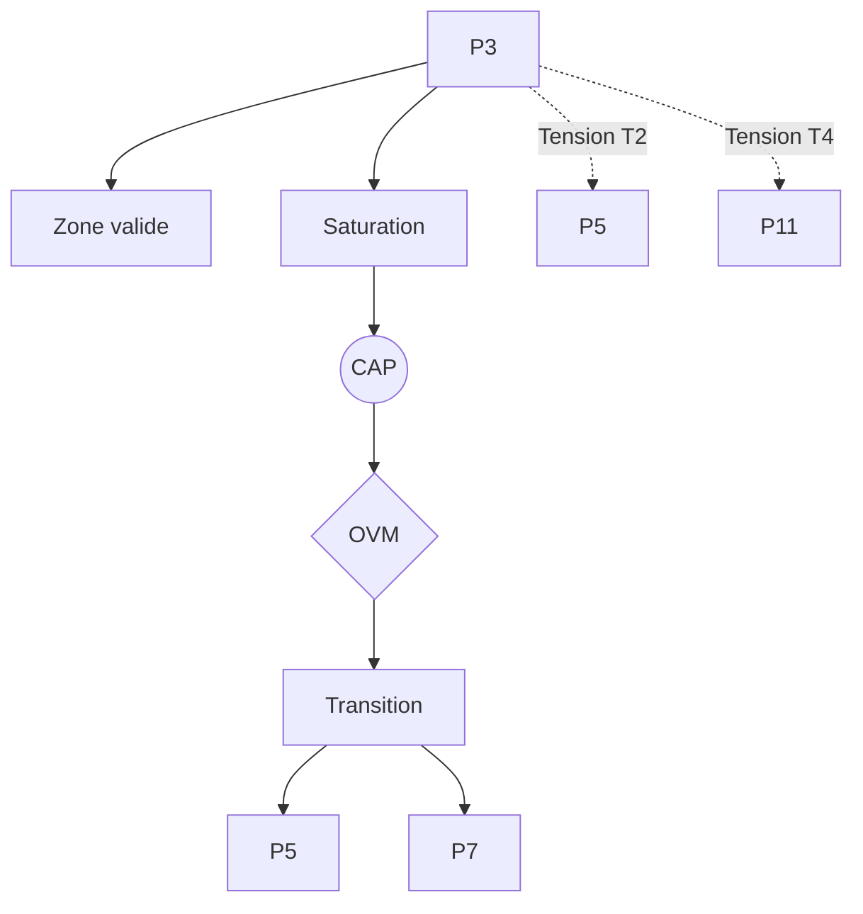

# 📌 P3 — Ajustement Allostatique (Damasio / Sterling)

---

## 0. Identification

- Numéro : P3
- Nom : Ajustement Allostatique (Damasio / Sterling)
- Famille : physico-dynamique
- Type : Régime de couplage
- Statut : Irréductible / localement valide

---

## 1. Définition

Ce régime formalise la régulation des systèmes biologiques ou cybernétiques adaptatifs non pas comme un retour réactif à un équilibre fixe (homéostasie), mais comme une anticipation dynamique et proactive des déséquilibres internes. La stabilité y est maintenue par un ajustement continu des seuils physiologiques et des paramètres internes en fonction des trajectoires futures attendues, permettant au système de conserver des marges de viabilité variables face aux perturbations. 

Ce régime constitue un mode spécifique de stabilisation descriptive.

Il ne décrit pas une substance, un objet ou une région ontologique du réel, mais une manière particulière de sélectionner des invariants et de maintenir des distinctions opératoires.

Contraintes de rédaction

- ne pas réduire ce régime à un autre ;
- ne pas introduire de hiérarchie implicite ;
- ne pas présupposer une causalité globale ;
- éviter les formulations ontologiquement inflationnistes.

---

## 1.bis. Ancrages théoriques

Ce régime est stabilisé, documenté ou audité par les références suivantes.

📚 Stabilisateurs principaux

Peter Sterling & Antonio Damasio

- Référence : references/damasio_sterling.md
- Statut : Stabilisateurs de régime
- Apport opératoire :
  Introduction du concept d'allostasie (Sterling) pour dépasser l'homéostasie réactive, et formulation de l'hypothèse des marqueurs somatiques (Damasio) démontrant que l'anticipation des trajectoires d'action repose sur des ajustements corporels préalables dictés par la survie.
- Tensions associées :
  Tension de traduction (T2), Tension de réduction (T1).

---

## 1.ter. Fonction interne du régime

Ce régime existe afin de rendre descriptibles les dynamiques de transition micro-physiques qui disparaîtraient si l'analyse commençait directement aux niveaux d'individuation ou de cognition.

Sans ce régime, l'architecture perdrait la possibilité d'auditer les tentatives de réduction des niveaux supérieurs vers les seules dynamiques élémentaires.

Contribution principale à Protokin :

- Stabilisation de la viabilité par l'anticipation matérielle.
- Cartographie des limites du réductionnisme statique (homéostatique) et fondation des capacités d'adaptation prospectives.
- Point d'origine des tensions T2 (avec P5) et T4 (avec P11).

---

## 1.quater. Contrat de non-réification

Ce régime ne doit jamais être interprété comme :

- une entité ontologique autonome
- un niveau réel du monde
- une substance causale
- une explication ultime

Il constitue uniquement :

- un dispositif de sélection d’invariants
- une grille de stabilisation descriptive
- un mode local de lecture

Toute réification constitue une violation OVM (T1 / T11).

---

🛡 Garde-fous épistémologiques

Antonio Damasio

- Fonction : Garde-fou
- Règle de vigilance :
  L'OVM s'appuie sur la critique du dualisme (l'erreur de Descartes) pour interdire toute séparation absolue entre la rationalité (Kin) et l'ajustement corporel. Il est formellement bloqué de modéliser une intentionnalité ou une évaluation morale qui serait totalement indépendante des boucles de régulation allostatique qui assurent la viabilité de l'organisme, sous peine de Tension de réduction (T1).

---

## 2. Invariants opératoires

Le régime sélectionne préférentiellement les stabilités suivantes :

- Régulation anticipée des paramètres internes.
- Ajustement dynamique des seuils physiologiques.
- Maintien de marges de viabilité variables.
- Organisation des réponses selon les trajectoires futures attendues.

Définition

Un invariant est une stabilité relationnelle reproductible à l'intérieur du régime.

Exemples :

- régularité de transition
- boucle de rétroaction
- norme instituée
- engagement déontique
- structure dissipative

---

## 3. Mode de couplage observateur–système

Ce régime définit une manière particulière de :

- percevoir le présent comme une fonction des perturbations futures.
- découper le réel en accordant la priorité aux trajectoires possibles plutôt qu'aux états actuels.
- sélectionner des invariants organiques anticipatifs.
- stabiliser des distinctions par l'anticipation des déséquilibres.

Caractéristiques

- Lecture de l'environnement comme un espace d'écarts à compenser proactivement.
- Temporalité vectorisée vers le futur immédiat.
- Primauté de la flexibilité paramétrique sur la constance absolue.

Angle mort structurel

Pour fonctionner, ce régime doit nécessairement ignorer :

- Les descriptions indépendantes du futur anticipé, car il ne peut traiter des unités descriptives totalement autonomes ou neutres.
- L'Espace formel des raisons et des justifications logiques.

---

## 4. Domaine de validité

Le régime est pertinent lorsque :

- Le système possède une organisation biologique ou cybernétique adaptative.
- Les perturbations peuvent être anticipées et intégrées dans la régulation interne.
- Les paramètres du système sont ajustables de manière continue.

Frontières descriptives

Le régime devient insuffisant lorsque :

- L'observateur est confronté à des régimes purement physiques et fermés, sans capacité de modulation interne.
- L'analyse porte sur des régimes normatifs fonctionnant indépendamment des dynamiques biologiques et des impératifs de viabilité (ex. règles mathématiques ou discursives).

Violations typiques détectées par l'OVM :

- Réduction abusive (T1) : affirmer que toute décision humaine complexe se résume à un simple ajustement métabolique.
- Erreur modale : postuler l'allostasie sans substrat dissipatif ouvert (P2).

---

## 4.bis. Conditions d’illégitimité (OVM)

Le régime devient illégitime si :

- un invariant est transformé en entité ontologique
- une corrélation est interprétée comme causalité globale
- un niveau supérieur est réduit à ce régime sans perte
- une norme est dérivée d’un fait causal sans médiation

Violations associées :

- T1 — Réduction
- T3 — Saut d’échelle
- T11 — Compression inter-régime
- T13 — Collapsus normatif

---

## 5. Conditions de saturation

Le régime devient instable lorsque :

- L'anticipation devient non pertinente ou impossible face à un environnement trop chaotique.
- Les ajustements internes ne suffisent plus à maintenir la viabilité.
- Les perturbations excèdent massivement la capacité de modulation du système.

Symptômes observables :

- perte de pouvoir explicatif
- multiplication des exceptions
- apparition de tensions non résolues
- nécessité de nouveaux invariants

Tensions fréquemment associées :

- T2 (Traduction)
- T4 (Tension normative)
- T11 (Compression multi-régime)

---

## 5.bis. Matrice de saturation

Indicateurs de saturation :

- augmentation des exceptions descriptives
- instabilité des invariants sélectionnés
- besoin d’un niveau explicatif supérieur
- incohérences multi-échelles

Seuil critique :

≥ 2 indicateurs actifs → déclenchement CAP

---

## 6. Relations avec les autres régimes

Compatibilités partielles

- P2 — Dissipation structurée : P3 hérite du cadre énergétique des flux hors équilibre modélisé par P2.
- P7 — Préconditions du comportement : P3 offre les mécanismes de modulation à la stabilisation biologique globale de P7.
- P10 — Couplage structurel : P3 présente un recouvrement majeur en fournissant les processus biologiques de régulation proactive qui modifient la structure interne de l'agent pour maintenir la dérive viable.

Traductions stables

- P3 ↔ P12 : L'ajustement allostatique fournit les paramètres somatiques concrets dont l'Évaluation thimique (P12) traduit les variations en gradients de valeur affective pour guider le comportement.

Frictions cartographiées

- P5 — Minimisation de la surprise : Tension T2 (Traduction), liée au risque de réduire le régime allostatique matériel à une pure optimisation informationnelle et computationnelle abstraite.
- P6 — Récursion prospective : Friction autour de l'extension cognitive de l'anticipation, dépassant la simple physiologie.
- P9 — Effet cliquet culturel : Tension T10/T11, car l'inertie des innovations culturelles figées par le cliquet (P9) entre souvent en contradiction directe avec les besoins urgents de flexibilité et de modulation rapide des paramètres allostatiques de survie (P3).

Incompatibilités structurelles

- P11 — Rupture épistémologique : Incompatibilité radicale marquant le passage au domaine normatif qui est indépendant de la régulation biologique causale. Une tension fonctionnelle constante s'y observe : les exigences de cohérence logique (P11) peuvent pousser le système à maintenir des engagements symboliques au détriment de l'optimisation proactive de ses paramètres vitaux.

---

## 6.bis. Tensions constitutives

Ce régime existe parce qu’il rend visibles certaines tensions fondamentales.

Sans elles, il perd sa nécessité descriptive.

Tensions constitutives

- T2 (Tension de traduction)
- T4 (Tension normative)

Fonction de ces tensions

Ces tensions délimitent l'espace propre de P3 : il prouve que la simple thermodynamique réactive (P2) ne suffit pas à définir le vivant, qui est avant tout anticipatif. Parallèlement, P3, en tant que régime causal d'ajustement, met en lumière (T4) qu'une anticipation physiologique de survie n'est pas encore une justification rationnelle ou une norme intellectuelle.

---

## 7. Traductions inter-régimes

Vu depuis P5 (Minimisation de la surprise)

L'ajustement allostatique est intégralement reconstitué dans un formalisme bayésien comme une minimisation de l'erreur prédictive sur l'état interne de l'organisme.

Vu depuis P8 (Intentionnalité partagée)

Les ajustements physiologiques et moteurs prospectifs de P3 deviennent des conditions matérielles de possibilité pour asseoir l'attention partagée et l'intentionnalité collective.

Vu depuis P12 (Évaluation thimique)

Le régime P3 est relu comme la grammaire neurobiologique fondamentale documentant les états de déviation ou d'adéquation physiologique ; ces états seront ensuite convertis par P12 en valences affectives et en urgences d'action.

Important

- ne sont pas des équivalences
- ne sont pas des réductions
- ne permettent pas de fusion des régimes

---

## 8. Dynamique d’audit (CAP + OVM)

Lorsqu’une saturation est détectée, le Cycle d’Audit Protokin (CAP) est déclenché.

Diagnostic possible

- Tension principale : T2 (Traduction, face à P5)
- Tension secondaire : T4 (Normative, face à P11)

Transitions fréquemment observées

- P3 → P5 par émergence (passage du réglage paramétrique à l'inférence prédictive formelle).
- P3 → P12 par réinterprétation (traduction de l'écart physiologique en valence thimique primitive).
- Blocage OVM si la transition prétend sauter directement de l'allostasie (P3) à l'Institution inférentielle normative (P13).

Hiérarchie des transitions autorisées

- Niveau 1 : Réinterprétation
- Niveau 2 : Émergence
- Niveau 3 : Rupture
- Niveau 4 : Blocage OVM

Rôle de l’OVM

L’OVM ne crée pas les limites du régime.

Il détecte les violations de frontières descriptives. Il s'assure par exemple que les modèles cognitifs (P5) ne s'approprient pas la dimension purement matérielle et organique de l'allostasie en la réduisant abusivement à du calcul abstrait, garantissant ainsi l'intégrité de l'infrastructure Proto.

---

## 9. Micro-graphe local

---

## 10. Résumé opératoire

Ce régime capture : La régulation proactive et l'anticipation matérielle des déséquilibres dans les systèmes adaptatifs.

Il sélectionne : L'ajustement dynamique des seuils physiologiques et le maintien de marges de viabilité.

Il observe via : La lecture du présent comme fonction stricte des perturbations futures.

Il ignore structurellement : Les états indépendants du futur anticipé (l'objet neutre) et l'espace logique des raisons normatives.

Il devient instable lorsque : L'anticipation devient caduque, ou que les perturbations environnementales excèdent massivement la capacité interne de modulation continue.

Les tensions dominantes sont : T1, T2, T4.

---

## 11. Notes épistémologiques

Statut ontologique

Non requis.

Le régime n’est pas une substance ni un niveau du réel.

Statut épistémique

Local

Contextuel

Révisable

Statut relationnel

Déterminé par le couplage observateur–système

Principe fondamental

Un régime ne décrit pas le monde.

Il décrit une manière stable de décrire le monde.

---

## 12. Métadonnées

Fichier : P3_ajustement_allostatique_damasio_sterling.md

Connexions principales : P2, P5, P6, P7, P10, P11, P12

Tensions dominantes : T1, T2, T4

Niveau de transition : Moyen

Dernière révision : 2026-06-13

---

## 13. Validation récursive (CAP ↔ OVM)

Chaque régime est valide uniquement si :

ses transitions CAP sont cohérentes

ses tensions OVM ne sont pas court-circuitées

ses invariants restent stables sous changement d’échelle

aucune réduction illégitime n’est effectuée

Toute incohérence déclenche :

requalification du régime

ou révision des tensions associées