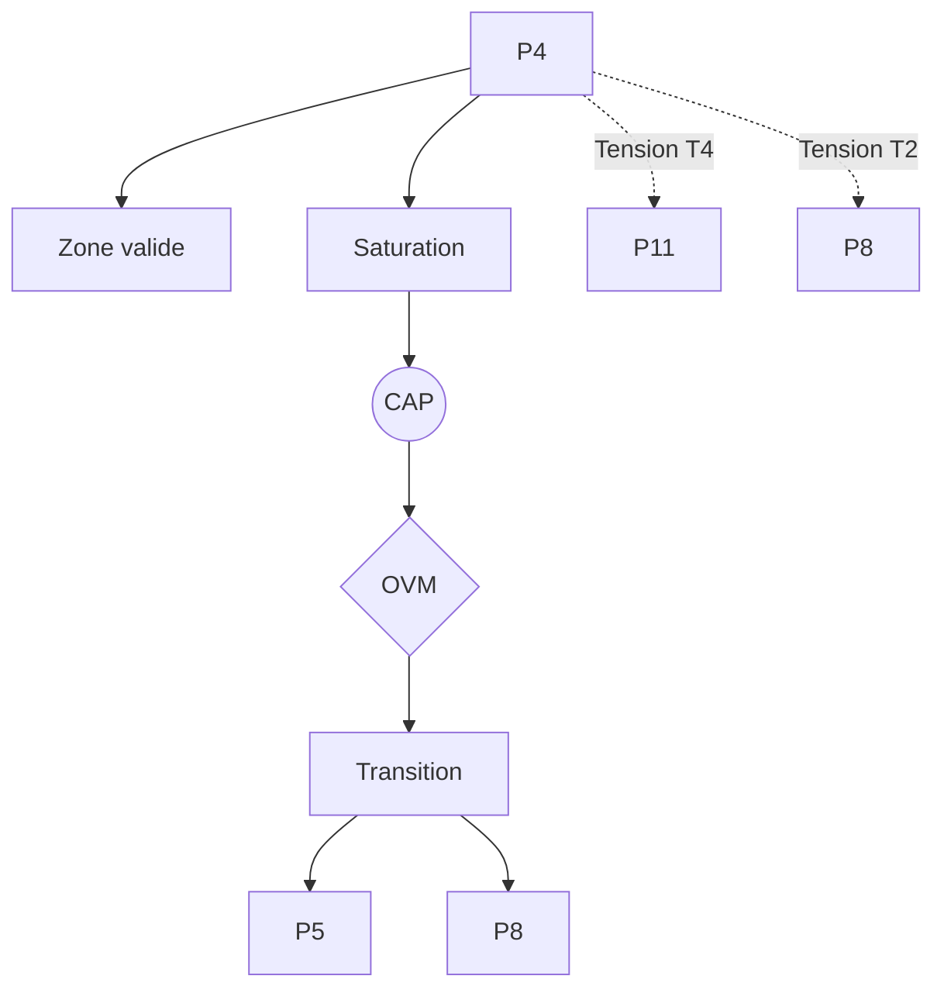

P4 — Compétence topographique (von Foerster)

0. Identification

- Numéro : P4
- Nom : Compétence topographique (von Foerster)
- Famille : cognitif
- Type : Régime de couplage
- Statut : Irréductible / localement valide

---

1. Définition

Ce régime formalise la construction du réel non pas comme une donnée objective préexistante, mais comme un espace de stabilités comportementales issues de l'interaction continue entre un agent et son environnement. Les objets n'y préexistent pas, mais émergent sous la forme d'invariants opératoires et perceptivo-moteurs stabilisés par le couplage actif. Il décrit la manière dont un organisme organise un filtrage de perturbations pour maintenir une cohérence locale (la compétence topographique), produisant des régularités sans pour autant les interpréter comme des entités normatives.

Ce régime constitue un mode spécifique de stabilisation descriptive.

Il ne décrit pas une substance, un objet ou une région ontologique du réel, mais une manière particulière de sélectionner des invariants et de maintenir des distinctions opératoires.

Contraintes de rédaction

- ne pas réduire ce régime à un autre ;
- ne pas introduire de hiérarchie implicite ;
- ne pas présupposer une causalité globale ;
- éviter les formulations ontologiquement inflationnistes.

---

1.bis. Ancrages théoriques

Ce régime est stabilisé, documenté ou audité par les références suivantes.

📚 Stabilisateurs principaux

Heinz von Foerster

- Référence : references/von_foerster.md
- Statut : Stabilisateur de régime
- Apport opératoire :
  Formalise la notion d'objet non pas comme une entité existant en soi, mais comme un jeton (token) pour des comportements propres (eigen-behaviors) continuellement itérés par l'observateur. L'objet est la stabilisation d'une dynamique de coordination inférentielle de l'action du sujet.
- Tensions associées :
  Tension de traduction (T2), Tension normative (T4).

Le Démon de von Foerster

- Référence : references/demon_von_foerster.md
- Statut : Frontière inter-régime / Générateur de tension
- Apport opératoire :
  Le « démon » cybernétique agit comme une abstraction fonctionnelle d'un régime de stabilisation par filtrage des perturbations environnementales sous de strictes contraintes de cohérence locale.
- Tensions associées :
  Tension de traduction (T2), Tension normative (T4).

---

1.ter. Fonction interne du régime

Ce régime existe afin de rendre descriptibles les dynamiques de transition micro-physiques qui disparaîtraient si l'analyse commençait directement aux niveaux d'individuation ou de cognition.

Sans ce régime, l'architecture perdrait la possibilité d'auditer les tentatives de réduction des niveaux supérieurs vers les seules dynamiques élémentaires.

Contribution principale à Protokin :

- Stabilisation de la perception comme cartographie active et située.
- Cartographie des limites du réductionnisme microphysique (l'objet émerge de l'interaction et non d'une simple sommation causale).
- Point d'origine des tensions T2 et T4 face à l'émergence des normes et des raisons (P11).

---

1.quater. Contrat de non-réification

Ce régime ne doit jamais être interprété comme :

- une entité ontologique autonome
- un niveau réel du monde
- une substance causale
- une explication ultime

Il constitue uniquement :

- un dispositif de sélection d’invariants
- une grille de stabilisation descriptive
- un mode local de lecture

Toute réification constitue une violation OVM (T1 / T11).

---

🛡 Garde-fous épistémologiques

Heinz von Foerster (Cybernétique de second ordre)

- Fonction : Garde-fou
- Règle de vigilance :
  Le système doit empêcher l'assimilation d'un invariant comportemental (l'objet perçu) à une réalité ontologique en soi indépendante de l'observation. La réification de la compétence topographique en "monde objectif" viole la fermeture opérationnelle relative du système et déclenche un diagnostic OVM de tension d'auto-inclusion (T8) ou de réification (T14).

---

2. Invariants opératoires

Le régime sélectionne préférentiellement les stabilités suivantes :

- Invariants comportementaux issus de l'interaction directe.
- Régularités perceptivo-motrices stabilisées par boucles récursives.
- Cartographie fonctionnelle de l'environnement (espaces de navigation).
- Stabilisation d'objets comme simples effets d'action (« tokens for eigen-behaviors »).

Définition

Un invariant est une stabilité relationnelle reproductible à l'intérieur du régime.

Exemples :

- régularité de transition
- boucle de rétroaction
- norme instituée
- engagement déontique
- structure dissipative

---

3. Mode de couplage observateur–système

Ce régime définit une manière particulière de :

- percevoir le monde non pas comme donnée d'entrée, mais comme contrainte d'action.
- découper le réel en tant qu'espace de navigation opératoire.
- sélectionner des invariants qui sont dérivés de régularités d'action stabilisées.
- stabiliser des distinctions via un processus de cartographie active et de filtrage continu.

Caractéristiques

- Le monde est construit comme un réseau d'opportunités et d'obstacles comportementaux.
- Les objets ne précèdent pas la cognition, ils sont l'aboutissement stabilisé d'une boucle sensorimotrice.
- La fermeture opérationnelle relative fonde la cohérence locale.

Angle mort structurel

Pour fonctionner, ce régime doit nécessairement ignorer :

- Les entités postulées comme indépendantes du couplage action-perception.
- Les structures purement symboliques ou discursives détachées de toute opération incarnée (normes, raisons).

---

4. Domaine de validité

Le régime est pertinent lorsque :

- L'agent est engagé dans un couplage actif avec un environnement spatial.
- Les régularités étudiées émergent de l'interaction répétée de l'organisme.
- La cognition peut être décrite de façon exhaustive par des contraintes d'action située.

Frontières descriptives

Le régime devient insuffisant lorsque :

- L'analyse porte sur des régimes symboliques autonomes sans ancrage interactionnel immédiat.
- Les règles qui gouvernent le système relèvent de justifications normatives indépendantes de la réussite motrice (ex: la logique, la morale).

Violations typiques détectées par l'OVM :

- Réduction abusive (T1) : affirmer que l'intentionnalité collective (P8) ou le langage (P13) ne sont que de simples prolongements de la motricité spatiale.
- Compression inter-régime (T11) : superposer la fermeture sensorimotrice de von Foerster et le modèle du *scorekeeping* sémantique sans médiation.

---

4.bis. Conditions d’illégitimité (OVM)

Le régime devient illégitime si :

- un invariant est transformé en entité ontologique
- une corrélation est interprétée comme causalité globale
- un niveau supérieur est réduit à ce régime sans perte
- une norme est dérivée d’un fait causal sans médiation

Violations associées :

- T1 — Réduction
- T3 — Saut d’échelle
- T11 — Compression inter-régime
- T13 — Collapsus normatif

---

5. Conditions de saturation

Le régime devient instable lorsque :

- Les invariants ne dépendent plus de l'action directe pour être maintenus (ex: transmission culturelle, sédimentation).
- La représentation symbolique s'émancipe et devient autonome.
- La cartographie opératoire ne suffit plus à stabiliser des distinctions purement sémantiques ou normatives.

Symptômes observables :

- perte de pouvoir explicatif
- multiplication des exceptions
- apparition de tensions non résolues
- nécessité de nouveaux invariants

Tensions fréquemment associées :

- T2 (Traduction)
- T4 (Tension normative)
- T8 (Auto-inclusion)

---

5.bis. Matrice de saturation

Indicateurs de saturation :

- augmentation des exceptions descriptives
- instabilité des invariants sélectionnés
- besoin d’un niveau explicatif supérieur
- incohérences multi-échelles

Seuil critique :

≥ 2 indicateurs actifs → déclenchement CAP

---

6. Relations avec les autres régimes

Compatibilités partielles

- P3 — Ajustement allostatique : Fournit le support biologique continu et l'anticipation viscérale nécessaires aux capacités d'action.
- P5 — Minimisation de la surprise : Offre une formalisation probabiliste (FEP) des invariants stabilisés par la boucle sensorimotrice.

Traductions stables

- P4 ↔ P7 : Le couplage structurel (Varela) opère au niveau biologique global, P4 spécifie l'émergence de la cartographie environnementale cognitive.

Frictions cartographiées

- P6 — Récursion prospective : Tension issue du déplacement d'une régulation située vers une simulation abstraite (indépendante de l'action immédiate).
- P8 — Intentionnalité partagée : Tension de traduction (T2) et d'échelle face à la nécessité de décentrer l'invariant du sujet pour le placer dans l'intersubjectivité.

Incompatibilités structurelles

- P11 — Rupture épistémologique : Incompatibilité radicale. L'entrée dans l'espace des raisons (justifications normatives) exige de s'arracher à l'immanence de l'action située, ce qui induit une tension normative (T4) majeure.

---

6.bis. Tensions constitutives

Ce régime existe parce qu’il rend visibles certaines tensions fondamentales.

Sans elles, il perd sa nécessité descriptive.

Tensions constitutives

- T2 (Tension de traduction)
- T4 (Tension normative)

Fonction de ces tensions

La tension normative (T4) entre P4 et P11 rend saillante la différence fondamentale entre stabiliser une perception par le filtrage réussi de l'environnement (P4) et stabiliser une proposition par l'engagement dans le jeu des raisons (P11). Elle empêche l'illusion d'une continuité lisse entre la réaction sensorimotrice et la pensée abstraite justificative.

---

7. Traductions inter-régimes

Vu depuis P5 (Minimisation de la surprise)

La compétence topographique et l'itération des *eigen-behaviors* sont intégralement reconstituées comme l'optimisation inférentielle de la prédiction sensorimotrice destinée à abaisser l'énergie libre de l'agent.

Vu depuis P8 (Intentionnalité partagée)

Les invariants strictement sensorimoteurs deviennent les objets référentiels partagés autour desquels la triade attentionnelle (agent, partenaire, objet) se stabilise dans un espace public intersubjectif.

Important

- ne sont pas des équivalences
- ne sont pas des réductions
- ne permettent pas de fusion des régimes

---

8. Dynamique d’audit (CAP + OVM)

Lorsqu’une saturation est détectée, le Cycle d’Audit Protokin (CAP) est déclenché.

Diagnostic possible

- Tension principale : T4 (Tension normative face aux registres justificatifs)
- Tension secondaire : T2 (Tension de traduction face à la coopération P8)

Transitions fréquemment observées

- P4 → P5 par réinterprétation (formalisation statistique bayésienne).
- P4 → P8 par émergence (ouverture au référencement social et à l'attention conjointe).

Hiérarchie des transitions autorisées

- Niveau 1 : Réinterprétation
- Niveau 2 : Émergence
- Niveau 3 : Rupture
- Niveau 4 : Blocage OVM (Le passage P4 → P13 direct est formellement bloqué par la tension T5, exigeant l'étape socio-développementale P8/P9).

Rôle de l’OVM

L’OVM ne crée pas les limites du régime.

Il détecte les violations de frontières descriptives. L'OVM bloque fermement la dérive consistant à traiter le "démon de von Foerster" comme la genèse causale directe de la normativité, forçant l'observateur à assumer la reconfiguration de cadre qu'exige la rupture sellarsienne (P11).

---

9. Micro-graphe local

---

10. Résumé opératoire

Ce régime capture : La construction du monde comme espace de navigation et d'action située.

Il sélectionne : Les régularités perceptivo-motrices et les invariants comportementaux (eigen-behaviors).

Il observe via : Le filtrage des perturbations environnementales et la clôture opérationnelle relative de l'agent.

Il ignore structurellement : Les entités préexistantes à l'interaction, et toute norme ou raison indépendante de la viabilité sensorimotrice.

Il devient instable lorsque : L'invariant doit exister indépendamment de l'action directe de l'agent, ou lorsqu'il entre dans l'espace abstrait de la représentation autonome.

Les tensions dominantes sont : T2, T3, T4.

---

11. Notes épistémologiques

Statut ontologique

Non requis.

Le régime n’est pas une substance ni un niveau du réel.

Statut épistémique

Local.

Contextuel.

Révisable.

Statut relationnel

Déterminé par le couplage observateur–système (les objets sont les jetons des comportements propres de l'observateur).

Principe fondamental

Un régime ne décrit pas le monde.

Il décrit une manière stable de décrire le monde.

---

12. Métadonnées

Fichier : P4_competence_topographique_von_foerster.md

Connexions principales : P3, P5, P6, P8, P11

Tensions dominantes : T2, T3, T4

Niveau de transition : Moyen

Dernière révision : 2026-06-13

---

13. Validation récursive (CAP ↔ OVM)

Chaque régime est valide uniquement si :

ses transitions CAP sont cohérentes

ses tensions OVM ne sont pas court-circuitées

ses invariants restent stables sous changement d’échelle

aucune réduction illégitime n’est effectuée

Toute incohérence déclenche :

requalification du régime

ou révision des tensions associées