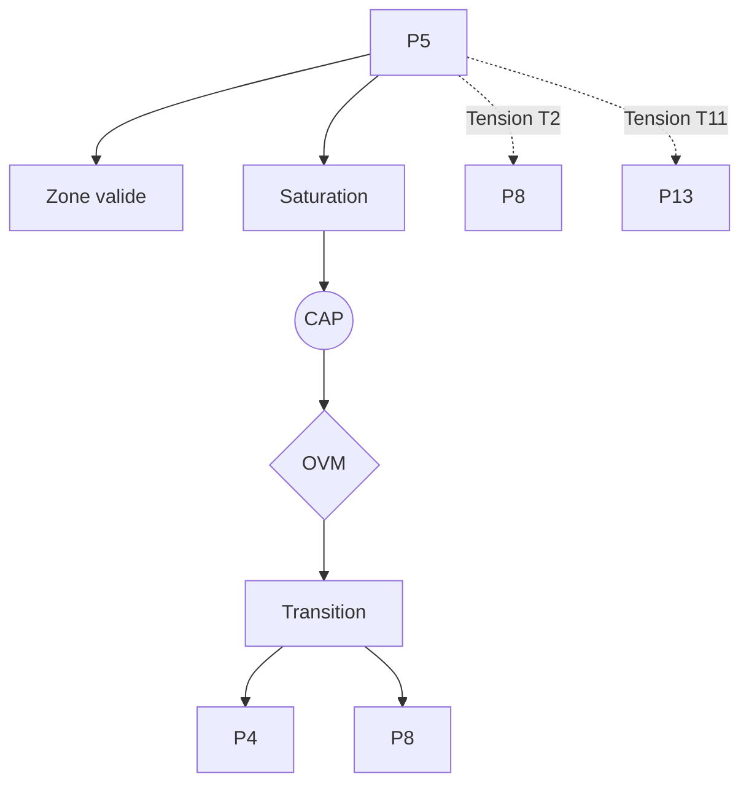

P5 — Minimisation de la Surprise (FEP / Friston)

0. Identification

- Numéro : P5
- Nom : Minimisation de la Surprise (Free Energy Principle / Friston)
- Famille : cognitif
- Type : Régime de couplage
- Statut : Irréductible / localement valide

---

1. Définition

Ce régime formalise la stabilisation des systèmes adaptatifs par réduction des écarts entre les états attendus et les états effectivement rencontrés. La cohérence du système est décrite comme la minimisation d'une quantité de surprise ou d'incertitude (énergie libre), et non comme l'atteinte d'un équilibre statique. Les agents sont modélisés comme des systèmes inférentiels produisant des modèles internes continuellement ajustés par l'erreur de prédiction. La perception et l'action sont intégrées dans un même processus de réduction de l'incertitude, postulant qu'aucun accès direct au réel n'est possible en dehors de ces dynamiques d'inférence probabiliste.

Ce régime constitue un mode spécifique de stabilisation descriptive.

Il ne décrit pas une substance, un objet ou une région ontologique du réel, mais une manière particulière de sélectionner des invariants et de maintenir des distinctions opératoires.

Contraintes de rédaction

- ne pas réduire ce régime à un autre ;
- ne pas introduire de hiérarchie implicite ;
- ne pas présupposer une causalité globale ;
- éviter les formulations ontologiquement inflationnistes.

---

1.bis. Ancrages théoriques

Ce régime est stabilisé, documenté ou audité par les références suivantes.

📚 Stabilisateurs principaux

Karl Friston

- Référence : references/friston.md
- Statut : Stabilisateur de régime / Générateur de tension
- Apport opératoire :
  Le Principe de l'Énergie Libre (Free Energy Principle) fournit un cadre formel bayésien où l'agent maintient sa viabilité en minimisant la surprise variationnelle face à son environnement.
- Tensions associées :
  Tension de traduction (T2), Tension de compression multi-régime (T11).

---

1.ter. Fonction interne du régime

Ce régime existe afin de rendre descriptibles les dynamiques de transition micro-physiques qui disparaîtraient si l'analyse commençait directement aux niveaux d'individuation ou de cognition.

Sans ce régime, l'architecture perdrait la possibilité d'auditer les tentatives de réduction des niveaux supérieurs vers les seules dynamiques élémentaires.

Contribution principale à Protokin :

- Stabilisation des processus inférentiels et de l'adaptation cognitive.
- Cartographie des limites de l'explication purement thermodynamique ou biologique en y ajoutant la dimension prédictive.
- Point d'origine des tensions T2 et T11 face aux émergences intersubjectives et normatives.

---

1.quater. Contrat de non-réification

Ce régime ne doit jamais être interprété comme :

- une entité ontologique autonome
- un niveau réel du monde
- une substance causale
- une explication ultime

Il constitue uniquement :

- un dispositif de sélection d’invariants
- une grille de stabilisation descriptive
- un mode local de lecture

Toute réification constitue une violation OVM (T1 / T11).

---

🛡 Garde-fous épistémologiques

Karl Friston (et la critique Protokin du pan-computationnalisme)

- Fonction : Garde-fou
- Règle de vigilance :
  L'OVM bloque fermement l'extension excessive du FEP comme méta-théorie universelle. Il interdit de réduire la normativité, l'intersubjectivité ou l'espace des raisons (P11, P13) à une simple optimisation statistique de l'erreur prédictive (violation T1 / T11).

---

2. Invariants opératoires

Le régime sélectionne préférentiellement les stabilités suivantes :

- Réduction de l'erreur de prédiction
- Cohérence dynamique modèle–environnement
- Ajustement inférentiel continu
- Stabilisation probabiliste des états attendus

Définition

Un invariant est une stabilité relationnelle reproductible à l'intérieur du régime.

Exemples :

- régularité de transition
- boucle de rétroaction
- norme instituée
- engagement déontique
- structure dissipative

---

3. Mode de couplage observateur–système

Ce régime définit une manière particulière de :

- percevoir le réel comme accessible exclusivement via une inférence probabiliste.
- découper le réel en l'envisageant comme une source d'incertitude à réduire.
- sélectionner des invariants comme des hypothèses actives sur l'état du monde.
- stabiliser des distinctions par le couplage de la perception et de l'action pour corriger le modèle interne.

Caractéristiques

- Le réel est accessible via inférence probabiliste
- La perception est une hypothèse active sur l'état du monde
- L'action sert à réduire l'incertitude sensorielle

Angle mort structurel

Pour fonctionner, ce régime doit nécessairement ignorer :

- Les phénomènes qui ne sont pas traduisibles en termes d'erreur, de probabilité ou de modèle inférentiel (les flux purement immanents ou la normativité sémantique publique).

---

4. Domaine de validité

Le régime est pertinent lorsque :

- Le système possède une capacité de modélisation interne
- Les interactions peuvent être formulées en termes probabilistes
- La dynamique du système est orientée vers la stabilisation prédictive

Frontières descriptives

Le régime devient insuffisant lorsque :

- L'analyse porte sur des régimes purement physiques sans capacité d'inférence (P1, P2).
- Le phénomène relève de régimes normatifs irréductibles à la simple prédiction (P11, P13).

Violations typiques détectées par l'OVM :

- Réduction abusive (T1) : vouloir expliquer la genèse d'un engagement moral ou social par un simple ajustement bayésien.
- Compression inter-régime (T11) : fusionner la thermodynamique, la modélisation probabiliste et les pratiques sociales en un seul méta-modèle indistinct.
- Erreur modale de traduction (T2) avec l'intentionnalité partagée.

---

4.bis. Conditions d’illégitimité (OVM)

Le régime devient illégitime si :

- un invariant est transformé en entité ontologique
- une corrélation est interprétée comme causalité globale
- un niveau supérieur est réduit à ce régime sans perte
- une norme est dérivée d’un fait causal sans médiation

Violations associées :

- T1 — Réduction
- T3 — Saut d’échelle
- T11 — Compression inter-régime
- T13 — Collapsus normatif

---

5. Conditions de saturation

Le régime devient instable lorsque :

- Les écarts ne sont plus quantifiables comme erreurs de prédiction
- Les modèles internes deviennent inopérants ou indéfinis
- L'environnement devient trop volatil et ne peut plus être inféré de manière stable

Symptômes observables :

- perte de pouvoir explicatif
- multiplication des exceptions
- apparition de tensions non résolues
- nécessité de nouveaux invariants

Tensions fréquemment associées :

- T2 (Tension de traduction) face aux régimes relationnels
- T11 (Compression multi-régime)
- T4 (Tension normative)

---

5.bis. Matrice de saturation

Indicateurs de saturation :

- augmentation des exceptions descriptives
- instabilité des invariants sélectionnés
- besoin d’un niveau explicatif supérieur
- incohérences multi-échelles

Seuil critique :

≥ 2 indicateurs actifs → déclenchement CAP

---

6. Relations avec les autres régimes

Compatibilités partielles

- P4 — Compétence topographique : ancrage de la construction d'objets et des modèles dans l'action située.
- P6 — Récursion prospective : extension temporelle de la modélisation inférentielle vers des états futurs.

Traductions stables

- P4 ↔ P5 (formulation probabiliste de la boucle sensorimotrice).
- P2 ↔ P5 (structuration locale loin de l'équilibre interprétée informationnellement).

Frictions cartographiées

- P2 — Dissipation structurée : Tension de traduction (T2) ou de réduction, opposant la thermodynamique irréversible brute à l'interprétation purement informationnelle.
- P3 — Ajustement allostatique : Risque de réduire la matérialité de l'anticipation viscérale au calcul formel de l'erreur.
- P8 — Intentionnalité partagée : Tension de traduction (T2) face à la coordination fondée sur la reconnaissance mutuelle et le *mode-Nous*.

Incompatibilités structurelles

- P11 / P13 — Rupture épistémologique et Institution inférentielle : Incompatibilité radicale. Le passage au domaine normatif et logico-discursif est irréductible à l'optimisation statistique individuelle. Le normatif ne se déduit pas du causal ou du probabiliste.

---

6.bis. Tensions constitutives

Ce régime existe parce qu’il rend visibles certaines tensions fondamentales.

Sans elles, il perd sa nécessité descriptive.

Tensions constitutives

- T2 (Tension de traduction)
- T11 (Tension de compression multi-régime)

Fonction de ces tensions

Ces tensions garantissent l'autonomie de P5 tout en le limitant : la Tension T2 démontre l'écart entre un comportement optimisé pour la survie et un comportement justifié devant autrui. La Tension T11 protège le système en rappelant que le formalisme bayésien du cerveau n'est pas le métalangage universel de la thermodynamique (P2) ni celui de la sociologie (P13).

---

7. Traductions inter-régimes

Vu depuis P4 (Compétence topographique)

La minimisation de la surprise est reconstituée pragmatiquement comme la simple stabilisation des régularités comportementales et la réussite de la boucle sensorimotrice dans l'espace.

Vu depuis P8 (Intentionnalité partagée)

Les erreurs de prédiction deviennent des indices et des ajustements permettant de réguler l'attention conjointe et de valider l'intentionnalité commune avec le partenaire de l'interaction.

Important

- ne sont pas des équivalences
- ne sont pas des réductions
- ne permettent pas de fusion des régimes

---

8. Dynamique d’audit (CAP + OVM)

Lorsqu’une saturation est détectée, le Cycle d’Audit Protokin (CAP) est déclenché.

Diagnostic possible

- Tension principale : T2 (Traduction)
- Tension secondaire : T11 (Compression) ou T4 (Normative)

Transitions fréquemment observées

- P5 → P8 par émergence (ouverture des boucles prédictives à l'attention mutuelle intersubjective).
- P5 → P11 par rupture (reconfiguration exigeant le passage de l'inférence causale à la justification logique explicite).

Hiérarchie des transitions autorisées

- Niveau 1 : Réinterprétation
- Niveau 2 : Émergence
- Niveau 3 : Rupture
- Niveau 4 : Blocage OVM (interdiction de dériver les normes de P13 par simple calcul d'erreur).

Rôle de l’OVM

L’OVM ne crée pas les limites du régime.

Il détecte les violations de frontières descriptives. L'OVM s'assure par exemple que les modèles prédictifs (P5) ne s'approprient pas la dimension purement logico-discursive (P13) en la réduisant abusivement à du calcul neuronal abstrait, forçant la reconnaissance d'une rupture normative justifiée (T5).

---

9. Micro-graphe local

---

10. Résumé opératoire

Ce régime capture : L'ajustement adaptatif par réduction des écarts entre attentes et observations.

Il sélectionne : La cohérence dynamique du couplage inférentiel modèle-environnement.

Il observe via : La modélisation prédictive probabiliste et la minimisation de la surprise.

Il ignore structurellement : Les processus inquantifiables en erreurs de prédiction et la logique des normes et justifications désintéressées (Espace des raisons).

Il devient instable lorsque : Le système fait face à un environnement in-inférable, saturant les modèles et empêchant la réduction de l'incertitude.

Les tensions dominantes sont : T2, T4, T11.

---

11. Notes épistémologiques

Statut ontologique

Non requis.

Le régime n’est pas une substance ni un niveau du réel.

Statut épistémique

Local

Contextuel

Révisable

Statut relationnel

Déterminé par le couplage observateur–système

Principe fondamental

Un régime ne décrit pas le monde.

Il décrit une manière stable de décrire le monde.

---

12. Métadonnées

Fichier : P5_minimisation_surprise_fep_friston.md

Connexions principales : P2, P3, P4, P6, P8, P11

Tensions dominantes : T2, T4, T11

Niveau de transition : Moyen

Dernière révision : 2026-06-13

---

13. Validation récursive (CAP ↔ OVM)

Chaque régime est valide uniquement si :

ses transitions CAP sont cohérentes

ses tensions OVM ne sont pas court-circuitées

ses invariants restent stables sous changement d’échelle

aucune réduction illégitime n’est effectuée

Toute incohérence déclenche :

requalification du régime

ou révision des tensions associées