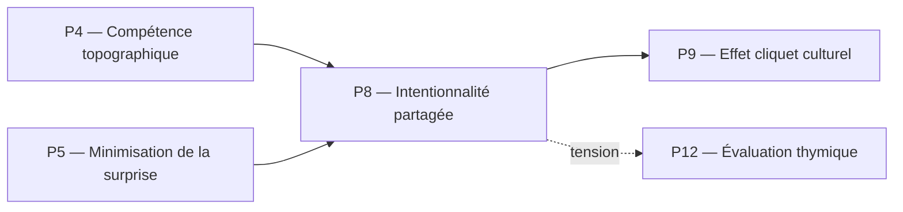

# P8 — Intentionnalité partagée (Tomasello)
## 0. Identification
 * **Numéro :** P8
 * **Nom :** Intentionnalité partagée
 * **Famille :** Socio-développemental
 * **Type :** Régime de couplage
 * **Statut :** Irréductible / localement valide
## 1. Définition
Ce régime formalise l'émergence d'une structure opératoire intersubjective où au moins deux agents alignent simultanément leurs vecteurs attentionnels sur un tiers objet ou une tâche commune. Rompant avec l'immédiateté des boucles sensori-motrices individuelles, l'intentionnalité partagée institue le « Nous » comme une instance de coordination pré-linguistique stable. Elle permet la transition d'une simple juxtaposition d'actions individuelles à des activités collaboratives guidées par des fins conjointes et des rôles complémentaires interchangeables. Ce pilier capture la racine cybernétique de la cognition sociale où les objets cessent d'être de purs tokens de comportements égo-centrés pour devenir des repères attentionnels validés de manière croisée.
## 2. Invariants opératoires
 * **Le triangle attentionnel conjoint :** Stabilité de la focalisation croisée (Agent A, Agent B, Objet X) maintenant un couplage informationnel synchrone.
 * **L'interchangeabilité des rôles :** Persistance de la structure de l'action conjointe lorsque les agents permutent leurs fonctions complémentaires au sein d'une même tâche.
 * **Les fins partagées (Joint Goals) :** Représentations pré-discursives d'un état final du système vers lequel convergent les ajustements dynamiques des deux agents.
 * **Le repère attentionnel partagé :** L'objet commun stabilisé non plus comme simple stimulus physique, mais comme référent invariant validé par la reconnaissance mutuelle de l'attention de l'autre.
## 3. Mode de couplage observateur–système
Ce pilier définit un mode spécifique de **perception conjointe**, de **découpage du réel par l'attention partagée**, de **sélection d'invariants intersubjectifs basaux** et de **stabilisation des distinctions triadiques**.
### Caractéristiques :
 * **Référencement social direct :** Le découpage du réel s'effectue en lisant les indices attentionnels d'autrui (regard, pointage) pour indexer l'environnement.
 * **Coordination perspective :** Capacité à stabiliser le même invariant physique tout en intégrant le fait qu'il est perçu depuis des coordonnées topographiques distinctes par le partenaire.
 * **Rétroaction coopérative :** Les corrections d'erreurs ne dépendent plus uniquement du feedback de l'objet, mais de la conformité du comportement de l'autre par rapport à l'intention conjointe.
### Angle mort structurel :
 * **L'abstraction propositionnelle (L'Espace des Raisons) :** Ce régime est incapable de formuler ou de valider des justifications logiques décontextualisées. Il perçoit l'alignement des actions et des intentions, mais ne peut pas auditer la validité d'un droit ou d'un engagement normatif abstrait (P13), ni traiter des concepts détachés de l'interaction pragmatique immédiate.
## 4. Domaine de validité
Ce pilier est valide lorsque :
 * Le système est composé d'au moins deux agents dotés d'une compétence topographique (P4) et d'un système de valence fonctionnel (P12).
 * Les canaux de communication pré-linguistiques (coordination oculaire, gestes déictiques) sont actifs et non saturés par du bruit.
 * L'environnement offre des opportunités de rétroaction immédiate permettant de valider l'alignement des buts.
### Limites :
 * S'effondre en deçà d'un certain seuil de proximité physique ou informationnelle empêchant la lecture réciproque des états attentionnels.
 * Devient inopérant si l'un des agents subit une faillite prédictive majeure (P5) qui détruit sa capacité à modéliser le comportement d'autrui comme un agent intentionnel.
## 5. Point de rupture
Ce pilier devient insuffisant lorsque :
 * **Explosion de complexité des interactions :** Le nombre d'agents coordonnés ou l'éloignement spatiotemporel des tâches excède les capacités de la synchronisation attentionnelle directe en face à face.
 * **Conflit de perspectives non résoluble :** Les agents font face à des divergences d'interprétation sur l'objet commun qui ne peuvent être arbitrées par de simples ajustements sensorimoteurs ou déictiques.
 * **Besoin de sédimentation historique :** Les pratiques de coordination ont besoin d'être stabilisées au-delà de la durée de l'interaction présente, exigeant des structures permanentes qui dépassent la présence physique des participants.
### Type de transition déclenchée :
 * **Émergence** (Bascule vers le cliquet culturel P9 pour pérenniser les innovations de coordination, puis vers l'Espace des Raisons P11).
## 6. Relations avec les autres piliers
### Compatibilités partielles :
 * **P4 — Compétence topographique :** L'intentionnalité partagée s'appuie sur la capacité individuelle à stabiliser des invariants par l'action, mais elle étend cette compétence en faisant de l'objet un invariant pour *deux* observateurs simultanés.
 * **P5 — Minimisation de la surprise :** La présence de l'autre est intégrée au modèle génératif de l'agent. Le couplage triadique réduit mutuellement l'erreur prédictive en rendant le comportement du partenaire hautement saillant et anticipable.
### Tensions :
 * **P10 — Couplage structurel :** Le couplage biologique strict avec l'environnement peut entrer en tension avec les exigences de l'alignement attentionnel social, notamment lorsque les gradients de survie immédiats d'un organisme divergent du but partagé avec le partenaire.
 * **P12 — Évaluation thymique :** Les priorités affectives et les gradients de valeur individuels (survie, peur, faim) peuvent perturber ou briser la stabilité du triangle attentionnel conjoint.
### Incompatibilités structurelles :
 * **P1 — Cinétique protonique :** Incompatibilité d'échelle et de registre. La dynamique des flux ioniques fondamentaux ignore structurellement la notion d'agent, d'attention ou d'intentionnalité, n'offrant aucun ancrage sémantique pour la triade socio-développementale.
## 7. Traductions (lecture depuis d'autres régimes)
 * **Vu depuis P4 (Compétence topographique) :** L'intentionnalité partagée n'est pas une fusion d'esprits, mais un cas particulier d'Eigbehavior récursif complexe, où le comportement d'un autre observateur est traité comme une perturbation réglée que le système doit stabiliser pour maintenir ses propres invariants.
 * **Vu depuis P13 (Institution inférentielle) :** Le triangle attentionnel de P8 est relu comme la matrice pré-cursive et purement comportementale des engagements implicites. Le "but commun" est la version embryonnaire, non conceptualisée, d'une responsabilité partagée qui n'a pas encore accès au statut de proposition logiquement révisable.
## 8. Micro-graphe local

## 9. Résumé opératoire
 * **Ce pilier capture :** La stabilisation triadique de l'attention et des buts communs entre plusieurs agents pré-linguistiques.
 * **Il observe via :** Un couplage attentionnel croisé, la lecture d'indices déictiques et la synchronisation comportementale sur un tiers objet.
 * **Il ignore structurellement :** Les propositions logiques décontextualisées, les justifications normatives abstraites et les cadres légitimes de révisabilité conceptuelle.
 * **Il devient instable lorsque :** La coordination doit s'étendre à des échelles de temps et d'espace qui dépassent l'interaction physique directe et synchrone des agents.
## 10. Notes épistémologiques
 * **Statut ontologique :** Non requis. L'intersubjectivité n'est pas une substance, mais une propriété géométrique de la dérive coordonnée des descriptions.
 * **Statut épistémique :** Local, relatif au régime d'interaction triadique et dépendant de la viabilité des couplages cognitifs inférieurs.
 * **Statut relationnel :** Défini par le double couplage observateur–observateur–système (co-construction de la première strate de réalité publique).
## 11. Métadonnées (GitHub / navigation)
 * **Fichier :** P8_intentionnalite_partagee_tomasello.md
 * **Connexions principales :** P4, P5, P9, P11, P13
 * **Niveau de transition :** Moyen
