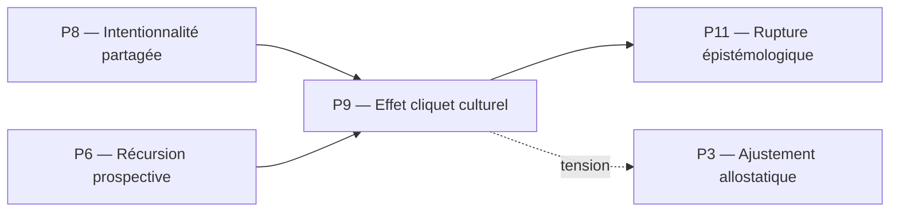

# P9 — Effet cliquet culturel (Tomasello)
## 0. Identification
 * **Numéro :** P9
 * **Nom :** Effet cliquet culturel
 * **Famille :** Socio-développemental
 * **Type :** Régime de couplage
 * **Statut :** Irréductible / localement valide
## 1. Définition
Ce régime formalise l'accumulation non réversible et la sédimentation historique des innovations comportementales, techniques et sémiotiques au sein d'une population d'agents. L'effet cliquet empêche le glissement ou la dégradation descriptive des invariants partagés face aux fluctuations de l'environnement ou à la disparition des inventeurs initiaux. Contrairement au simple apprentissage social par transmission instable, ce pilier introduit un mécanisme cybernétique de cliquet où une pratique modifiée ou optimisée est stabilisée par le groupe, devenant la nouvelle ligne de base inchangée pour les générations d'observateurs futures. Il constitue l'appareil de mémoire collective et d'irréversibilité temporelle indispensable avant l'accès formel aux édifices normatifs.
## 2. Invariants opératoires
 * **L'artefact culturel sédimenté :** Stabilité d'un objet matériel ou comportemental dont la forme incorpore, de manière irréversible, des modifications historiques cumulées.
 * **La transmission trans-générationnelle fidèle :** Persistance de la reproduction d'une pratique complexe sans perte de ses fonctions ou de sa structure géométrique d'origine.
 * **Le point de non-retour technique (Cliquet) :** Seuil dynamique interdisant au groupe de régresser vers des formes de couplage moins efficaces une fois qu'une innovation a été intégrée comme base commune.
 * **Le répertoire de pratiques standardisées :** Invariant sous forme de catalogue partagé de comportements ritualisés, reproductibles par mimétisme et reconnus par la collectivité.
## 3. Mode de couplage observateur–système
Ce pilier définit un mode spécifique de **perception historique**, de **découpage du réel par les artefacts**, de **sélection d'invariants sédimentés** et de **stabilisation des distinctions générationnelles**.
### Caractéristiques :
 * **Perception instrumentée :** Le réel n'est plus découpé par des organes biologiques bruts, mais à travers le filtre de techniques et d'outils légués qui dictent ce qui est saillant.
 * **Récursion de l'apprentissage :** L'imitation ne vise pas seulement le comportement de l'autre agent (P8), mais la fidélité de la reproduction de la forme stabilisée de l'artefact.
 * **Irradiation temporelle :** Les invariants du système acquièrent une durée de vie autonome qui dépasse largement le cycle de vie somatique d'un agent individuel.
### Angle mort structurel :
 * **L'arbitrage de la validité rationnelle (L'Espace des Raisons) :** Ce régime accumule et stabilise les pratiques parce qu'elles *fonctionnent* et sont *reproduites*, mais il ne peut pas en auditer la légitimité logique. Il est incapable de distinguer une coutume superstitieuse ou un biais dogmatique pétrifié d'une règle conceptuelle logiquement justifiée (P13).
## 4. Domaine de validité
Ce pilier est valide lorsque :
 * Le système s'appuie préalablement sur les mécanismes d'attention conjointe et d'intentionnalité partagée (P8).
 * Les taux de fidélité dans la transmission et l'imitation sociale sont supérieurs au taux d'oubli ou de dérive descriptive du groupe.
 * Le milieu offre une relative stabilité permettant aux artefacts accumulés de conserver leur pertinence adaptative.
### Limites :
 * S'effondre en cas de dispersion ou de chute critique de la masse démographique des agents, entraînant la perte des savoir-faire (rupture du cliquet).
 * Devient obsolète lors de bouleversements environnementaux radicaux où le répertoire accumulé se transforme en charge rigide et inadaptée.
## 5. Point de rupture
Ce pilier devient insuffisant lorsque :
 * **Pétrification dogmatique de la coutume :** L'accumulation cumulative sature le système de pratiques contradictoires ou inefficaces que le mécanisme de cliquet maintient sans possibilité de tri rationnel.
 * **Explosion de complexité sémantique :** Les artefacts accumulés deviennent si abstraits ou interconnectés (ex. proto-signes, monnaies, rituels) que leur stabilisation nécessite l'arbitrage de principes de non-contradiction logique, intraitables par simple reproduction mimétique.
### Type de transition déclenchée :
 * **Rupture normative** (Bascule vers la rupture épistémologique P11 pour requalifier les habitudes culturelles en raisons logiques révisables).
## 6. Relations avec les autres piliers
### Compatibilités partielles :
 * **P8 — Intentionnalité partagée :** Zone de recouvrement essentielle. P8 fournit le triangle attentionnel nécessaire pour apprendre l'utilisation d'un outil, et P9 verrouille cet apprentissage en l'empêchant de se dissoudre au fil du temps.
 * **P6 — Récursion prospective :** La mémoire comme moteur d'anticipation s'étend ici à l'échelle collective : le groupe utilise le passé accumulé par le cliquet pour simuler et outiller ses interactions futures.
### Tensions :
 * **P3 — Ajustement allostatique :** L'inertie des innovations culturelles figées par le cliquet (P9) peut entrer en tension directe avec les besoins de flexibilité et de modulation rapide des paramètres biologiques de survie (P3).
 * **P5 — Minimisation de la surprise :** Si une pratique culturelle héritée génère une erreur prédictive face à un nouvel état du monde, le cliquet peut forcer sa réplication, augmentant temporairement la surprise variationnelle au lieu de la réduire.
### Incompatibilités structurelles :
 * **P1 — Cinétique protonique :** Incompatibilité absolue. La dérive historique des artefacts sédimentés n'a aucun sens ni prise sur la physique immanente des gradients matériels et des flux ioniques fondamentaux.
## 7. Traductions (lecture depuis d'autres régimes)
 * **Vu depuis P5 (Minimisation de la surprise) :** L'effet cliquet culturel est traduit comme un mécanisme macroscopique de réduction de la surprise. En standardisant les comportements et les outils à travers les générations, le système stabilise des *priors* (hypothèses a priori) collectifs hautement fiables qui rendent l'environnement social et matériel prédictible.
 * **Vu depuis P11 (Rupture épistémologique) :** P9 n'est vu que comme un catalogue de causes anthropologiques complexes. L'accumulation culturelle est une sédimentation d'habitudes causales performantes, mais elle reste une forme de « Donné » tant qu'elle n'a pas été brisée et justifiée dans l'Espace des Raisons.
## 8. Micro-graphe local

## 9. Résumé opératoire
 * **Ce pilier capture :** L'accumulation cumulative et irréversible des innovations et des pratiques au sein d'une lignée d'observateurs.
 * **Il observe via :** La transmission mimétique fidèle, l'usage d'artefacts sédimentés et la stabilisation de standards comportementaux trans-générationnels.
 * **Il ignore structurellement :** Les critères de vérité logique, le droit à la contradiction conceptuelle et la révisabilité rationnelle des croyances.
 * **Il devient instable lorsque :** Les coutumes accumulées entrent en conflit interne ou deviennent trop complexes pour être arbitrées sans lois de validation logique.
## 10. Notes épistémologiques
 * **Statut ontologique :** Non requis. La culture n'est pas un substrat, mais l'irréversibilité géométrique d'une dérive descriptive partagée.
 * **Statut épistémique :** Local et relatif au groupe d'agents ; sa validité dépend de la fidélité des boucles de transmission informationnelle.
 * **Statut relationnel :** Défini par le couplage historique entre la mémoire des artefacts et la plasticité de la population.
## 11. Métadonnées (GitHub / navigation)
 * **Fichier :** P9_effet_cliquet_culturel_tomasello.md
 * **Connexions principales :** P6, P8, P10, P11, P13
 * **Niveau de transition :** Moyen
