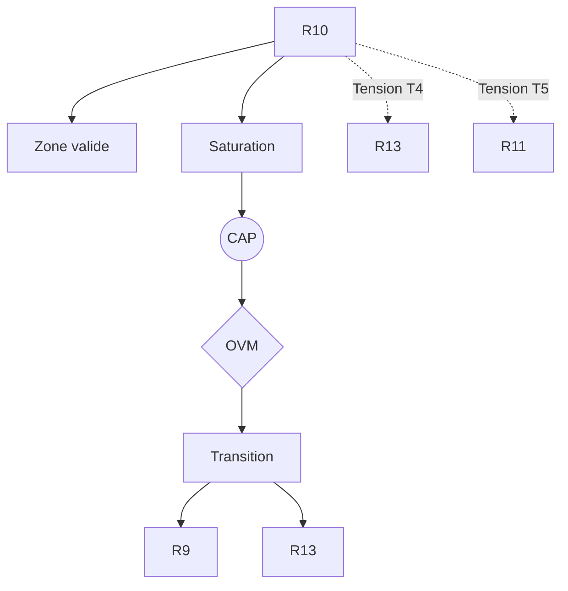

R10 — Couplage structurel des pratiques

0. Identification

- Numéro : R10
- Nom : Couplage structurel des pratiques (Girard / Maturana / Varela)
- Famille : normatif
- Type : Régime de couplage
- Statut : Irréductible / localement valide

---

1. Définition

Ce régime formalise l'émergence et la stabilisation des pratiques sociales et de l'ordre collectif brut à partir de dynamiques interactionnelles causales et de l'auto-organisation face aux crises. Il décrit la morphogenèse sociale où les comportements réguliers se sédimentent par l'itération du couplage avec le milieu (Maturana/Varela) et où les règles, mythes et rites naissent de la résolution de la violence mimétique paroxystique (le mécanisme du bouc émissaire de Girard). Il constitue ainsi le fondement causal, pré-institutionnel et souvent opaque, des futures structures normatives.

Ce régime constitue un mode spécifique de stabilisation descriptive.

Il ne décrit pas une substance, un objet ou une région ontologique du réel, mais une manière particulière de sélectionner des invariants et de maintenir des distinctions opératoires.

Contraintes de rédaction

- ne pas réduire ce régime à un autre ;
- ne pas introduire de hiérarchie implicite ;
- ne pas présupposer une causalité globale ;
- éviter les formulations ontologiquement inflationnistes.

---

1.bis. Ancrages théoriques

Ce régime est stabilisé, documenté ou audité par les références suivantes.

📚 Stabilisateurs principaux

René Girard

- Référence : references/girard.md
- Statut : Stabilisateur de régime
- Apport opératoire :
  Fournit le modèle de l'interaction mimétique brute comme dynamique de base de la socialité. Il formalise la résolution de la crise mimétique par le mécanisme victimaire (le sacré), expliquant comment un ordre social et des règles originelles peuvent émerger de la violence pure de manière auto-organisée.
- Tensions associées :
  Tension de rupture (T5), Tension de réduction (T1).

Francisco J. Varela (et Humberto Maturana)

- Référence : references/varela.md
- Statut : Frontière inter-régime / Générateur de tension
- Apport opératoire :
  Modélise la dimension strictement biologique du couplage structurel et de la dérive des pratiques (R7). Dans R10, ce concept est étendu pour décrire comment la récurrence des interactions sédimente des régularités comportementales sans transfert direct d'information prescriptive.
- Tensions associées :
  Tension normative (T4).

---

1.ter. Fonction interne du régime

Ce régime existe afin de rendre descriptibles les dynamiques de transition micro-physiques qui disparaîtraient si l'analyse commençait directement aux niveaux d'individuation ou de cognition.

Sans ce régime, l'architecture perdrait la possibilité d'auditer les tentatives de réduction des niveaux supérieurs vers les seules dynamiques élémentaires.

Contribution principale à Protokin :

- Stabilisation de la genèse causale de l'ordre social brut et des pratiques itérées.
- Cartographie du pont morphogénétique reliant les interactions pures (le versant Proto) à la normativité légitime (le versant Kin).
- Point d'origine des tensions T4 (Normative) et T5 (Rupture).

---

1.quater. Contrat de non-réification

Ce régime ne doit jamais être interprété comme :

- une entité ontologique autonome
- un niveau réel du monde
- une substance causale
- une explication ultime

Il constitue uniquement :

- un dispositif de sélection d’invariants
- une grille de stabilisation descriptive
- un mode local de lecture

Toute réification constitue une violation OVM (T1 / T11).

---

🛡 Garde-fous épistémologiques

Jean-Pierre Dupuy

- Fonction : Garde-fou
- Règle de vigilance :
  L'OVM interdit d'assimiler la création d'ordre par le bruit (la morphogenèse issue de la crise mimétique) à un projet rationnel, téléologique ou moral délibéré. L'émergence des pratiques dans ce régime opère par méconnaissance. Justifier rationnellement cette genèse ou la confondre avec la légitimité des raisons (R13) déclenche une violation modale (T1/T11).

---

2. Invariants opératoires

Le régime sélectionne préférentiellement les stabilités suivantes :

- Résolution de la crise mimétique par le mécanisme victimaire
- Régularités comportementales sédimentées par l'itération des couplages
- Émergence d'un ordre social brut (interdits, rites, mythes)
- Stabilisation de la violence réciproque

Définition

Un invariant est une stabilité relationnelle reproductible à l'intérieur du régime.

Exemples :

- régularité de transition
- boucle de rétroaction
- norme instituée
- engagement déontique
- structure dissipative

---

3. Mode de couplage observateur–système

Ce régime définit une manière particulière de :

- percevoir les dynamiques de foule et les polarisations
- découper le réel en crises paroxystiques et résolutions
- sélectionner des invariants comme traces de conflits résolus
- stabiliser des distinctions par des frontières d'exclusion et des interdits

Caractéristiques

- Primat de l'interaction mimétique et de la dérive sur l'intention individuelle.
- Lecture de l'ordre social comme une émergence auto-organisée.
- L'opacité (ou méconnaissance) est fonctionnelle et nécessaire au maintien de la stabilité.

Angle mort structurel

Pour fonctionner, ce régime doit nécessairement ignorer :

- L'intentionnalité rationnelle et transparente des acteurs.
- L'espace des justifications logiques et la révisabilité critique des croyances (R11).

---

4. Domaine de validité

Le régime est pertinent lorsque :

- L'étude porte sur la morphogenèse des institutions, des rites et de l'ordre pré-formel.
- Le système social est traversé par des crises, des polarisations mimétiques ou des phénomènes de foule.
- Les pratiques se stabilisent par l'itération répétée sans contrat social explicite.

Frontières descriptives

Le régime devient insuffisant lorsque :

- Les pratiques doivent être requalifiées en normes explicites, justifiées et révisables (R11, R13).
- L'analyse exige de traiter la valeur de vérité logique d'une proposition indépendamment de son origine.

Violations typiques détectées par l'OVM :

- Réduction abusive (T1) : affirmer que le droit constitutionnel n'est *rien d'autre* qu'un lynchage ritualisé.
- Compression inter-régime (T11) : superposer la biologie autopoïétique (R7) et le rite sacré (R10) en un tout indifférencié.
- Erreur modale : rabattre la genèse violente d'une règle sur sa validité normative.

---

4.bis. Conditions d’illégitimité (OVM)

Le régime devient illégitime si :

- un invariant est transformé en entité ontologique
- une corrélation est interprétée comme causalité globale
- un niveau supérieur est réduit à ce régime sans perte
- une norme est dérivée d’un fait causal sans médiation

Violations associées :

- T1 — Réduction
- T3 — Saut d’échelle
- T11 — Compression inter-régime
- T13 — Collapsus normatif

---

5. Conditions de saturation

Le régime devient instable lorsque :

- La communauté atteint une complexité exigeant des justifications transparentes et logiques plutôt que des mythes.
- Le mécanisme victimaire perd de son efficacité régulatrice (révélation du processus, par exemple dans la lecture évangélique de Girard).
- La simple dérive causale des pratiques ne suffit plus à résoudre un différend sémantique.

Symptômes observables :

- perte de pouvoir explicatif (crise sacrificielle)
- multiplication des exceptions et de la violence intestine
- apparition de tensions non résolues nécessitant un droit formel
- nécessité de nouveaux invariants (normes, scorekeeping déontique)

Tensions fréquemment associées :

- T4 (Tension normative)
- T5 (Tension de rupture)
- T1 (Tension de réduction)

---

5.bis. Matrice de saturation

Indicateurs de saturation :

- augmentation des exceptions descriptives
- instabilité des invariants sélectionnés
- besoin d’un niveau explicatif supérieur
- incohérences multi-échelles

Seuil critique :

≥ 2 indicateurs actifs → déclenchement CAP

---

6. Relations avec les autres régimes

Compatibilités partielles

- R7 — Couplage structurel : R7 fournit l'ancrage matériel et biologique vital au sein duquel les pratiques sédimentées de R10 émergent.
- R8 — Intentionnalité partagée : R8 fournit la structure d'attention conjointe qui permet la polarisation d'un groupe sur une cible commune (objet de désir ou bouc émissaire).

Traductions stables

- R10 ↔ R9 (Effet cliquet culturel) : La pratique résolutive issue de l'interaction (le rite, l'interdit) se fige et est transmise fidèlement comme artefact sédimenté aux générations suivantes.

Frictions cartographiées

- R13 — Tension T4 (Normative) : Conflit entre l'apparition causale et souvent aveugle d'une pratique (R10) et sa justification explicite dans un réseau de droits et d'obligations (R13).
- R11 — Tension T5 (Rupture) : L'incommensurabilité entre l'ordre né du bruit mimétique et l'entrée dans l'Espace des raisons.

Incompatibilités structurelles

- R1 — Cinétique protonique : Les dynamiques ioniques et thermodynamiques n'ont aucune accroche avec la polarisation mimétique ou la sédimentation d'une pratique collective.

---

6.bis. Tensions constitutives

Ce régime existe parce qu’il rend visibles certaines tensions fondamentales.

Sans elles, il perd sa nécessité descriptive.

Tensions constitutives

- T4 (Tension normative)
- T5 (Tension de rupture)

Fonction de ces tensions

Ces tensions garantissent l'architecture duale de Protokin. Elles existent pour marquer la différence indépassable entre la genèse causale d'une règle (R10, ordre par le bruit et l'interaction) et la validité justificative d'une règle (R13, espace des raisons). Sans elles, R10 absorberait toute l'épistémologie dans un relativisme anthropologique effaçant l'autonomie de la rationalité.

---

7. Traductions inter-régimes

Vu depuis R13 (Institution inférentielle)

Le couplage des pratiques est perçu comme l'infrastructure historique et la genèse matérielle opaque qui a structuré les communautés avant que celles-ci n'instituent un système de tenue des scores déontiques explicite et transparent.

Vu depuis R5 (Minimisation de la surprise)

Le mécanisme victimaire et les pratiques rituelles sont traduits comme des réducteurs collectifs drastiques de surprise. Face à l'entropie sociale d'une crise mimétique, le groupe génère un *prior* comportemental massif (le sacré) pour rétablir violemment la prédictibilité de son milieu.

Important

- ne sont pas des équivalences
- ne sont pas des réductions
- ne permettent pas de fusion des régimes

---

8. Dynamique d’audit (CAP + OVM)

Lorsqu’une saturation est détectée, le Cycle d’Audit Protokin (CAP) est déclenché.

Diagnostic possible

- Tension principale : T4 (Tension normative)
- Tension secondaire : T5 (Rupture face à R11)

Transitions fréquemment observées

- R10 → R13 par rupture (saut du mythe aveugle à la justification formelle et institutionnelle).
- R10 → R9 par émergence (cristallisation d'une pratique résolutive en artefact sédimenté).

Hiérarchie des transitions autorisées

- Niveau 1 : Réinterprétation
- Niveau 2 : Émergence
- Niveau 3 : Rupture
- Niveau 4 : Blocage OVM

Rôle de l’OVM

L’OVM ne crée pas les limites du régime.

Il détecte les violations de frontières descriptives. Ici, l'OVM bloque les tentatives (T1) de justifier la pertinence d'une institution démocratique ou logique uniquement par ses origines sacrificielles, forçant l'observateur à traiter le saut qualitatif (T5) vers la raison.

---

9. Micro-graphe local

---

10. Résumé opératoire

Ce régime capture : L'émergence des pratiques et de l'ordre social brut via l'interaction et la résolution mimétique.

Il sélectionne : Les régularités comportementales itérées, les mécanismes victimaires et les rites de fondation.

Il observe via : La dynamique des foules, l'auto-organisation par le bruit/la crise et la méconnaissance.

Il ignore structurellement : L'Espace des raisons, la rationalité délibérative et la transparence des justifications logiques.

Il devient instable lorsque : Le groupe exige des normes transparentes ou que le mécanisme victimaire perd son pouvoir de résolution opaque.

Les tensions dominantes sont : T1, T4, T5.

---

11. Notes épistémologiques

Statut ontologique

Non requis.

Le régime n’est pas une substance ni un niveau du réel.

Statut épistémique

Local

Contextuel

Révisable

Statut relationnel

Déterminé par le couplage observateur–système

Principe fondamental

Un régime ne décrit pas le monde.

Il décrit une manière stable de décrire le monde.

---

12. Métadonnées

Fichier : R10_couplage_structurel_des_pratiques.md

Connexions principales : R7, R8, R9, R11, R13

Tensions dominantes : T1, T4, T5

Niveau de transition : Moyen / Critique

Dernière révision : 2026-06-13

---

13. Validation récursive (CAP ↔ OVM)

Chaque régime est valide uniquement si :

ses transitions CAP sont cohérentes

ses tensions OVM ne sont pas court-circuitées

ses invariants restent stables sous changement d’échelle

aucune réduction illégitime n’est effectuée

Toute incohérence déclenche :

requalification du régime

ou révision des tensions associées
