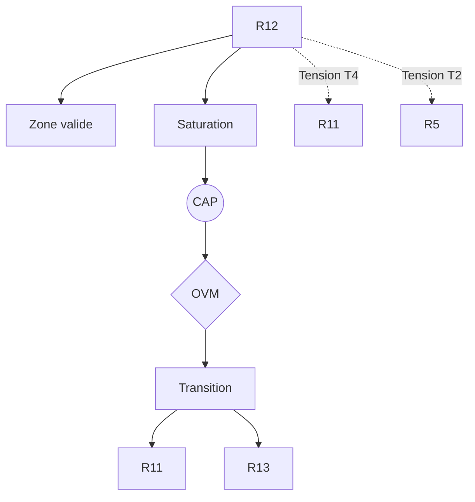

R12 — Évaluation thimique

0. Identification

- Numéro : R12
- Nom : Évaluation thimique
- Famille : normatif
- Type : Régime de couplage
- Statut : Irréductible / localement valide

---

1. Définition

Ce régime formalise la génération de gradients internes de valeur, de priorités opératoires et d'intensités affectives primordiales au sein du système. Fidèle à sa racine étymologique grecque (*Timê* / *Thymos*), il se concentre sur l'évaluation de la valeur, de la dignité et de la reconnaissance des forces somatiques, agissant comme la boussole affective et motivationnelle de la stabilisation. L'évaluation thimique ne dérive d'aucune fonction globale de *fitness*, mais exécute une pondération immédiate des tensions internes, traduisant l'urgence biologique en pressions sémiotiques et en directions d'action avant toute médiation propositionnelle.

Ce régime constitue un mode spécifique de stabilisation descriptive.

Il ne décrit pas une substance, un objet ou une région ontologique du réel, mais une manière particulière de sélectionner des invariants et de maintenir des distinctions opératoires.

Contraintes de rédaction

- ne pas réduire ce régime à un autre ;
- ne pas introduire de hiérarchie implicite ;
- ne pas présupposer une causalité globale ;
- éviter les formulations ontologiquement inflationnistes.

---

1.bis. Ancrages théoriques

Ce régime est stabilisé, documenté ou audité par les références suivantes.

📚 Stabilisateurs principaux

Héritage philosophique (Timê / Thymos)

- Référence : references/thymos.md (implicite)
- Statut : Stabilisateur de régime
- Apport opératoire :
  Fournit la racine conceptuelle permettant d'isoler l'évaluation de la valeur (la valence thimique) des simples fluctuations de l'humeur psychologique, ancrant la normativité dans les asymétries de la force somatique primitive.
- Tensions associées :
  Tension normative (T4), face à l'impartialité de l'Espace des raisons.

Wilfrid Sellars / John McDowell (Garde-fous depuis R11)

- Référence : references/sellars.md / references/mcdowell.md
- Statut : Frontière inter-régime / Générateur de tension
- Apport opératoire :
  Permettent de délimiter l'évaluation thimique en prouvant que l'urgence affective ou somatique ne constitue pas en elle-même une justification logique.
- Tensions associées :
  Tension de rupture (T5), Tension de réduction (T1).

---

1.ter. Fonction interne du régime

Ce régime existe afin de rendre descriptibles les dynamiques de transition micro-physiques qui disparaîtraient si l'analyse commençait directement aux niveaux d'individuation ou de cognition.

Sans ce régime, l'architecture perdrait la possibilité d'auditer les tentatives de réduction des niveaux supérieurs vers les seules dynamiques élémentaires.

Contribution principale à Protokin :
- Stabilisation de la pondération affective pré-rationnelle.
- Cartographie des intensités somatiques asymétriques guidant le couplage.
- Point d'origine des tensions normatives face à l'impartialité logique abstraite (T4/T11).

---

1.quater. Contrat de non-réification

Ce régime ne doit jamais être interprété comme :

- une entité ontologique autonome
- un niveau réel du monde
- une substance causale
- une explication ultime

Il constitue uniquement :

- un dispositif de sélection d’invariants
- une grille de stabilisation descriptive
- un mode local de lecture

Toute réification constitue une violation OVM (T1 / T11).

---

🛡 Garde-fous épistémologiques

John McDowell

- Fonction : Garde-fou
- Règle de vigilance :
  L'OVM s'assure qu'aucune évaluation thimique (une urgence affective ou un tiraillement somatique) ne soit abusivement promue au statut de justification morale ou de vérité propositionnelle sans passer par la rupture de la requalification sémantique (R11).

---

2. Invariants opératoires

Le régime sélectionne préférentiellement les stabilités suivantes :

- Le gradient de valence thimique : stabilité des polarités internes (attraction/répulsion) surdéterminant l'allocation des ressources.
- Le seuil d'assignation de valeur (Timê) : persistance du critère attribuant un poids somatique à une perturbation.
- La résonance somato-normative : couplage d'une tension biophysique brute à une inclinaison motivationnelle stable.
- La signature thimique de l'invariant : encodage de la valeur affective d'un objet topographique ou artefact.

Définition

Un invariant est une stabilité relationnelle reproductible à l'intérieur du régime.

Exemples :

- régularité de transition
- boucle de rétroaction
- norme instituée
- engagement déontique
- structure dissipative

---

3. Mode de couplage observateur–système

Ce régime définit une manière particulière de :

- percevoir le réel par la perception affective
- découper le réel par la saillance thimique
- sélectionner des invariants de valeur
- stabiliser des distinctions pré-rationnelles

Caractéristiques

- L'environnement est perçu comme une topographie de potentiels thimiques (menaces, opportunités).
- Les distinctions sont stabilisées par leur intensité affective plutôt que par leur cohérence logique.
- Le couplage opère par lecture continue des variations d'états internes, transformant les chocs en indices de viabilité.

Angle mort structurel

Pour fonctionner, ce régime doit nécessairement ignorer :

- L'impartialité logique : il est incapable de formuler des syllogismes ou d'auditer la validité d'une inférence propositionnelle.
- La symétrie conceptuelle, restant prisonnier de ses propres gradients d'urgence.

---

4. Domaine de validité

Le régime est pertinent lorsque :

- Le système dispose d'un couplage structurel fonctionnel (R10) et de boucles allostatiques actives (R3).
- Les fluctuations d'intensités somatiques restent dans les limites de tolérance.
- Les indices environnementaux sont corrélés à des conséquences adaptatives réelles.

Frontières descriptives

Le régime devient insuffisant lorsque :

- L'impartialité et la cohérence propositionnelle formelle sont requises (Espace des raisons).
- Les tiraillements somatiques doivent être traduits en normes intersubsidiaires publiques.

Violations typiques détectées par l'OVM :

- Réduction de l'espace normatif (R13) à une simple pulsion affective (T1).
- Écrasement d'une obligation logique sur un déterminisme émotionnel.

---

4.bis. Conditions d’illégitimité (OVM)

Le régime devient illégitime si :

- un invariant est transformé en entité ontologique
- une corrélation est interprétée comme causalité globale
- un niveau supérieur est réduit à ce régime sans perte
- une norme est dérivée d’un fait causal sans médiation

Violations associées :

- T1 — Réduction
- T3 — Saut d’échelle
- T11 — Compression inter-régime
- T13 — Collapsus normatif

---

5. Conditions de saturation

Le régime devient instable lorsque :

- Les urgences affectives entrent en contradiction insoluble.
- La dynamique du système exige une médiation par des normes intersubsidiaires publiques et logiques (R13).

Symptômes observables :

- perte de pouvoir explicatif
- multiplication des exceptions
- apparition de tensions non résolues
- nécessité de nouveaux invariants (normes publiques)

Tensions fréquemment associées :

- T4 (Tension normative)
- T5 (Tension de rupture)
- T11 (Compression multi-régime)

---

5.bis. Matrice de saturation

Indicateurs de saturation :

- augmentation des exceptions descriptives
- instabilité des invariants sélectionnés
- besoin d’un niveau explicatif supérieur
- incohérences multi-échelles

Seuil critique :

≥ 2 indicateurs actifs → déclenchement CAP

---

6. Relations avec les autres régimes

Compatibilités partielles

- R3 — Ajustement allostatique : L'allostasie fournit les paramètres somatiques que R12 traduit en gradients de valeur affective.
- R4 — Compétence topographique : R12 habille les invariants de R4 d'une valence émotionnelle (objets désirables ou évitables).

Traductions stables

- R3 ↔ R12 : L'écart physiologique de R3 devient une valence thimique dans R12.
- R4 ↔ R12 : Le *token* d'action devient un objet de désir/répulsion.

Frictions cartographiées

- R11 — Tension T4/T5 : L'Espace des Raisons exige la suspension des biais thimiques, créant une tension critique permanente avec l'urgence asymétrique de R12.
- R5 — Tension T2 : La minimisation de l'erreur prédictive est entravée par la surcharge thimique qui surpondère certaines hypothèses a priori.

Incompatibilités structurelles

- R14 — Validation axiomatique : L'audit métathéorique s'exécute dans un espace de non-contradiction pure, totalement étranger à la force thimique primitive.

---

6.bis. Tensions constitutives

Ce régime existe parce qu’il rend visibles certaines tensions fondamentales.
Sans elles, il perd sa nécessité descriptive.

Tensions constitutives

- T4 (Tension normative)
- T2 (Tension de traduction)

Fonction de ces tensions

Ces tensions délimitent l'espace propre de R12 : elles démontrent qu'il existe un registre de valorisation asymétrique, ancré dans l'urgence corporelle, qui n'est ni purement mécanique et probabiliste (R5), ni pleinement impartial et logiquement justifié (R11). La tension normative (T4) marque précisément la nécessité de surmonter la thimie pour accéder à la raison décontextualisée.

---

7. Traductions inter-régimes

Vu depuis R3 (Ajustement allostatique)

L'évaluation thimique est relue comme la traduction neurobiologique et computationnelle des états de déviation ou d'adéquation des variables physiologiques par rapport à leurs trajectoires prédictives de viabilité.

Vu depuis R11 (Rupture épistémologique)

Le régime R12 est appréhendé comme une forme sophistiquée de l'Espace des Causes : les valences thimiques y apparaissent comme des déterminismes biophysiques incarnés et des chocs motivationnels nécessitant d'être requalifiés en concepts logiques pour devenir de véritables raisons.

Important

- ne sont pas des équivalences
- ne sont pas des réductions
- ne permettent pas de fusion des régimes

---

8. Dynamique d’audit (CAP + OVM)

Lorsqu’une saturation est détectée, le Cycle d’Audit Protokin (CAP) est déclenché.

Diagnostic possible

- Tension principale : T4 (Normative)
- Tension secondaire : T2 (Traduction) ou T5 (Rupture)

Transitions fréquemment observées

- R12 → R11 par Rupture normative.
- R12 → R13 par institutionnalisation des urgences en normes partagées.

Hiérarchie des transitions autorisées

- Niveau 1 : Réinterprétation
- Niveau 2 : Émergence
- Niveau 3 : Rupture
- Niveau 4 : Blocage OVM

Rôle de l’OVM

L’OVM ne crée pas les limites du régime.

Il détecte les violations de frontières descriptives. Il s'assure par exemple qu'une théorie n'utilise pas la seule intensité affective d'une réaction thimique (R12) pour justifier rationnellement une posture épistémologique (R11), exigeant une rupture formelle.

---

9. Micro-graphe local

---

10. Résumé opératoire

Ce régime capture : La pondération affective pré-rationnelle, l'attribution de valeur (*Timê*) et la hiérarchisation des urgences d'action du système.

Il sélectionne : Le gradient de valence thimique et les polarités internes.

Il observe via : Les gradients de saillance affective, la valence des stimuli et l'intensité des tiraillements somatiques.

Il ignore structurellement : La cohérence propositionnelle formelle, les principes de non-contradiction logique et les règles d'inférence discursive.

Il devient instable lorsque : Les urgences affectives entrent en contradiction insoluble ou exigent une médiation par des normes intersubsidiaires publiques.

Les tensions dominantes sont : T1, T4, T5.

---

11. Notes épistémologiques

Statut ontologique

Non requis.

Le régime n’est pas une substance ni un niveau du réel. La thimie n'est pas une substance psychique isolée, mais une propriété géométrique des asymétries de la stabilisation sous contraintes.

Statut épistémique

Local.
Contextuel.
Révisable.
Relatif au régime somatique de l'organisme ; elle ancre la normativité dans le corps vivant avant son émancipation logique.

Statut relationnel

Déterminé par le couplage récursif entre l'état des réserves cinétiques et la sélection des axes prioritaires d'interaction.

Principe fondamental

Un régime ne décrit pas le monde.

Il décrit une manière stable de décrire le monde.

---

12. Métadonnées

Fichier : R12_evaluation_thymique.md

Connexions principales : R3, R4, R5, R8, R11

Tensions dominantes : T1, T2, T4, T5

Niveau de transition : Moyen

Dernière révision : 2026-06-13

---

13. Validation récursive (CAP ↔ OVM)

Chaque régime est valide uniquement si :

ses transitions CAP sont cohérentes

ses tensions OVM ne sont pas court-circuitées

ses invariants restent stables sous changement d’échelle

aucune réduction illégitime n’est effectuée

Toute incohérence déclenche :

requalification du régime

ou révision des tensions associées
