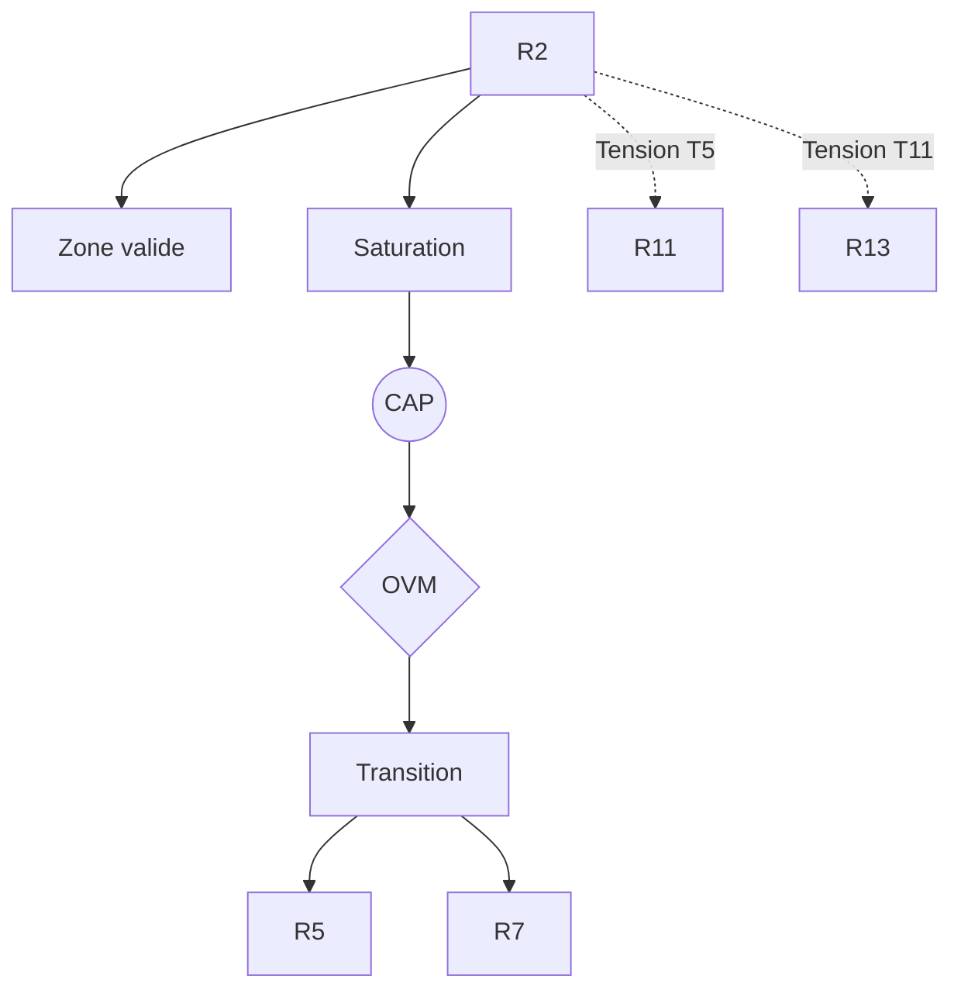

R2 — Dissipation Structurée (Prigogine)

0. Identification

- Numéro : R2
- Nom : Dissipation Structurée (Prigogine)
- Famille : physico-dynamique
- Type : Régime de couplage
- Statut : Irréductible / localement valide

---

1. Définition

Ce régime formalise la stabilisation des systèmes ouverts maintenus loin de l'équilibre thermodynamique, modélisant l'émergence d'un ordre indissociable de la perte et soutenu par des flux énergétiques continus et irréversibles. Il décrit la création d'ordre par l'échange avec le milieu, transformant la production d'entropie en structures dissipatives auto-organisées.

Ce régime constitue un mode spécifique de stabilisation descriptive.

Il ne décrit pas une substance, un objet ou une région ontologique du réel, mais une manière particulière de sélectionner des invariants et de maintenir des distinctions opératoires.

Contraintes de rédaction
- ne pas réduire ce régime à un autre ;
- ne pas introduire de hiérarchie implicite ;
- ne pas présupposer une causalité globale ;
- éviter les formulations ontologiquement inflationnistes.

---

1.bis. Ancrages théoriques

Ce régime est stabilisé, documenté ou audité par les références suivantes.

📚 Stabilisateurs principaux

Ilya Prigogine (et Isabelle Stengers)

- Référence : references/prigogine.md
- Statut : Stabilisateur de régime
- Apport opératoire : 
  Fournit le cadre explicatif permettant de stabiliser des invariants physiques complexes loin de l'équilibre thermodynamique. Il démontre que la genèse de l'organisation matérielle peut exister par pure dissipation d'énergie, sans aucun recours à une téléologie, à la cognition (R5) ou à l'autopoïèse biologique stricte (R7).
- Tensions associées : 
  Tension de rupture (T5), Tension de compression multi-régime (T11).

Henri Atlan

- Référence : references/atlan.md
- Statut : Frontière inter-régime / Générateur de tension
- Apport opératoire : 
  Prolonge la thermodynamique des processus irréversibles vers les théories de l'auto-organisation en formalisant le principe de "complexité par le bruit", établissant le pont épistémologique entre les systèmes dissipatifs (R2) et la compétence du vivant (R4, R7).
- Tensions associées : 
  Tension de réduction (T1), Tension de rupture (T5).

---

1.ter. Fonction interne du régime

Ce régime existe afin de rendre descriptibles les dynamiques de transition micro-physiques qui disparaîtraient si l'analyse commençait directement aux niveaux d'individuation ou de cognition.

Sans ce régime, l'architecture perdrait la possibilité d'auditer les tentatives de réduction des niveaux supérieurs vers les seules dynamiques élémentaires.

Contribution principale à Protokin :
- Infrastructure causale du versant Proto au niveau purement matériel.
- Cartographie des régularités émergentes de non-équilibre et des limites du réductionnisme statique.
- Point d'origine des tensions T5 et T11 face aux émergences cognitives et sociales.

---

1.quater. Contrat de non-réification

Ce régime ne doit jamais être interprété comme :
- une entité ontologique autonome
- un niveau réel du monde
- une substance causale
- une explication ultime

Il constitue uniquement :
- un dispositif de sélection d’invariants
- une grille de stabilisation descriptive
- un mode local de lecture

Toute réification constitue une violation OVM (T1 / T11).

---

🛡 Garde-fous épistémologiques

Jean-Pierre Dupuy

- Fonction : Garde-fou
- Règle de vigilance : 
  L'OVM s'appuie sur la critique de Dupuy pour interdire le détournement idéologique de la théorie de "l'ordre par fluctuations". Il est formellement bloqué de transposer la dissipation structurée pour légitimer naïvement un "laissez-faire" sociologique sans contraintes ou une planification libérale de la société (Tension de compression multi-régime T11).

---

2. Invariants opératoires

Le régime sélectionne préférentiellement les stabilités suivantes :
- Structures dissipatives auto-organisées
- Flux énergétiques stationnaires hors équilibre
- Production continue d'entropie structurée
- Régularités émergentes de non-équilibre

Définition
Un invariant est une stabilité relationnelle reproductible à l'intérieur du régime.

Exemples :
- régularité de transition
- boucle de rétroaction
- norme instituée
- engagement déontique
- structure dissipative

---

3. Mode de couplage observateur–système

Ce régime définit une manière particulière de :
- percevoir
- découper le réel
- sélectionner des invariants
- stabiliser des distinctions

Caractéristiques
- Lecture des structures comme effets de flux persistants
- Priorité à la dynamique irréversible plutôt qu'aux états statiques
- Stabilisation par production continue plutôt que par conservation

Angle mort structurel
Pour fonctionner, ce régime doit nécessairement ignorer :
- Les objets comme entités indépendantes des processus de dissipation qui les génèrent
- L'intentionnalité, la téléologie et l'espace logique des justifications humaines

---

4. Domaine de validité

Le régime est pertinent lorsque :
- Le système étudié est ouvert et échange continuellement de la matière et de l'énergie avec son environnement.
- L'apparition d'un ordre matériel s'opère par dissipation thermique sans clôture opérationnelle stricte.

Frontières descriptives
Le régime devient insuffisant lorsque :
- L'organisation exige une autopoïèse biologique et une clôture de réseau (R7).
- Le maintien du système repose sur la modélisation probabiliste ou l'anticipation d'une erreur (R5).

Violations typiques détectées par l'OVM :
- Réduction abusive (T1) de la biologie à la simple thermodynamique.
- Compression inter-régime (T11) : fusionner abusivement la thermodynamique, la prédiction et l'empathie sociale pour décrire un phénomène sans règle d'articulation.

---

4.bis. Conditions d’illégitimité (OVM)

Le régime devient illégitime si :
- un invariant est transformé en entité ontologique
- une corrélation est interprétée comme causalité globale
- un niveau supérieur est réduit à ce régime sans perte
- une norme est dérivée d’un fait causal sans médiation

Violations associées :
- T1 — Réduction
- T3 — Saut d’échelle
- T11 — Compression inter-régime
- T13 — Collapsus normatif

---

5. Conditions de saturation

Le régime devient instable lorsque :
- Le maintien du couplage nécessite un traitement de l'information sémantique ou une régulation par apprentissage cognitif actif.
- L'émergence d'institutions logiques ou de normes culturelles apparaît dans le champ de l'observateur.

Symptômes observables :
- perte de pouvoir explicatif
- multiplication des exceptions
- apparition de tensions non résolues
- nécessité de nouveaux invariants

Tensions fréquemment associées :
- T2 (Traduction) avec l'optimisation cognitive (R5)
- T5 (Rupture) avec les régimes normatifs
- T11 (Compression multi-régime)

---

5.bis. Matrice de saturation

Indicateurs de saturation :
- augmentation des exceptions descriptives
- instabilité des invariants sélectionnés
- besoin d’un niveau explicatif supérieur
- incohérences multi-échelles

Seuil critique :
≥ 2 indicateurs actifs → déclenchement CAP

---

6. Relations avec les autres régimes

Compatibilités partielles
- R1 — Cinétique protonique (recouvrement physique assurant la micro-fondation des flux).
- R3 — Ajustement allostatique (régulation interne des déséquilibres).

Traductions stables
- R1 ↔ R2 (intégration transductive des flux dans les structures).

Frictions cartographiées
- R5 — Tension T2 (différence de formalismes entre l'optimisation bayésienne et la thermodynamique hors équilibre, malgré leur finalité de stabilisation).
- R7 — Tension de frontière (la stabilisation thermodynamique n'équivaut pas à la clôture autopoïétique biologique).

Incompatibilités structurelles
- R11 / R13 — Tension T5 (Rupture absolue : on ne peut déduire une institution logique, un devoir sémantique ou le lien social à partir d'un flux dissipatif sans écrasement ontologique et saut d'échelle T3/T5).

---

6.bis. Tensions constitutives

Ce régime existe parce qu’il rend visibles certaines tensions fondamentales.
Sans elles, il perd sa nécessité descriptive.

Tensions constitutives
- T5 (Tension de rupture)
- T11 (Tension de compression multi-régime)

Fonction de ces tensions
La Tension T5 protège l'incommensurabilité entre l'ordre de la matière dissipée et l'ordre des raisons. La Tension T11 garantit que ce régime reste formellement circonscrit à la thermodynamique et empêche la "Pensée complexe" de s'en servir comme métalangage universel pour expliquer la société.

---

7. Traductions inter-régimes

Vu depuis R5 (Minimisation de la surprise)
La dissipation structurée est reconstituée comme la dynamique physique sous-tendant la minimisation locale de l'erreur prédictive face à l'environnement.

Vu depuis R8 (Intentionnalité partagée)
Les structures dissipatives deviennent les substrats matériels porteurs et les supports physiques sur lesquels l'attention et l'intentionnalité collective peuvent se focaliser.

Important
- ne sont pas des équivalences
- ne sont pas des réductions
- ne permettent pas de fusion des régimes

---

8. Dynamique d’audit (CAP + OVM)

Lorsqu’une saturation est détectée, le Cycle d’Audit Protokin (CAP) est déclenché.

Diagnostic possible
- Tension principale : T5 (Rupture)
- Tension secondaire : T11 (Compression multi-régime)

Transitions fréquemment observées
- R2 → R5 par émergence (apparition de modèles prédictifs).
- R2 → R7 par émergence (clôture opérationnelle du vivant).
- Blocage OVM strict : toute tentative de saut direct R2 → R11 ou R2 → R13 est invalidée (T5/T11).

Hiérarchie des transitions autorisées
- Niveau 1 : Réinterprétation
- Niveau 2 : Émergence
- Niveau 3 : Rupture
- Niveau 4 : Blocage OVM

Rôle de l’OVM
L’OVM ne crée pas les limites du régime.
Il détecte les violations de frontières descriptives, s'assurant formellement qu'aucun observateur n'utilise les concepts de "bruit" ou de "fluctuations dissipatives" pour naturaliser des choix politiques, éthiques ou institutionnels relevant de R13.

---

9. Micro-graphe local

---

10. Résumé opératoire

Ce régime capture : L'émergence d'ordre par la dissipation d'énergie loin de l'équilibre.

Il sélectionne : Les structures dissipatives auto-organisées et les flux stationnaires.

Il observe via : La primauté des dynamiques irréversibles et productrices d'entropie sur les états conservatifs statiques.

Il ignore structurellement : La clôture biologique (autopoïèse), l'intentionnalité, les modèles cognitifs et les normes logico-sociales.

Il devient instable lorsque : L'observateur cherche à déduire de cette seule thermodynamique le comportement d'un organisme clos ou la nature d'une institution humaine.

Les tensions dominantes sont : T2, T5, T11.

---

11. Notes épistémologiques

Statut ontologique
Non requis.
Le régime n’est pas une substance ni un niveau du réel.

Statut épistémique
Local
Contextuel
Révisable

Statut relationnel
Déterminé par le couplage observateur–système

Principe fondamental
Un régime ne décrit pas le monde.
Il décrit une manière stable de décrire le monde.

---

12. Métadonnées

Fichier : R2_dissipation_structuree_prigogine.md

Connexions principales : R1, R3, R5, R7

Tensions dominantes : T2, T5, T11

Niveau de transition : Moyen

Dernière révision : 2026-06-13

---

13. Validation récursive (CAP ↔ OVM)

Chaque régime est valide uniquement si :
ses transitions CAP sont cohérentes
ses tensions OVM ne sont pas court-circuitées
ses invariants restent stables sous changement d’échelle
aucune réduction illégitime n’est effectuée

Toute incohérence déclenche :
requalification du régime
ou révision des tensions associées
