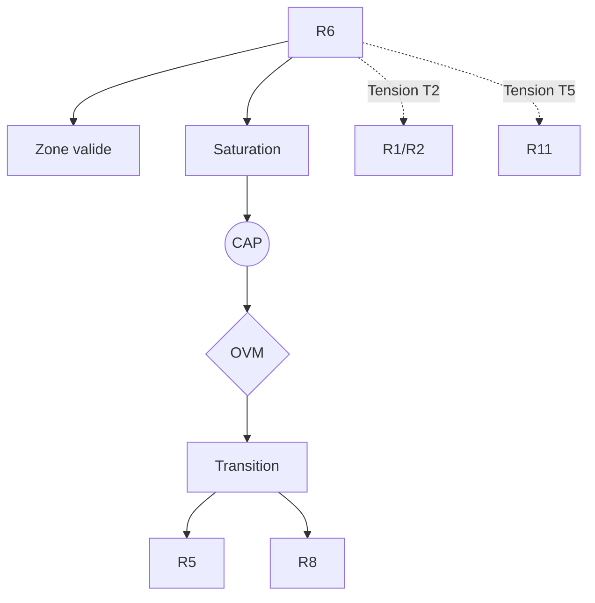

R6 — Récursion Prospective (von Foerster)

0. Identification

- Numéro : R6
- Nom : Récursion Prospective (von Foerster)
- Famille : cognitif
- Type : Régime de couplage
- Statut : Irréductible / localement valide

---

1. Définition

Ce régime formalise la production du présent comme effet de boucles récursives orientées vers des états futurs possibles. La cognition n'y est pas comprise comme un simple traitement d'information, mais comme un système de rétroaction anticipatrice où les futurs possibles rétroagissent sur la structuration du présent. Le passé est mobilisé comme matériau de simulation, et le présent comme interface de sélection entre trajectoires futures concurrentes. La stabilité du système dépend de la cohérence des projections récursives plutôt que de la fidélité à un état donné du monde.

Ce régime constitue un mode spécifique de stabilisation descriptive.

Il ne décrit pas une substance, un objet ou une région ontologique du réel, mais une manière particulière de sélectionner des invariants et de maintenir des distinctions opératoires.

Contraintes de rédaction

- ne pas réduire ce régime à un autre ;
- ne pas introduire de hiérarchie implicite ;
- ne pas présupposer une causalité globale ;
- éviter les formulations ontologiquement inflationnistes.

---

1.bis. Ancrages théoriques

Ce régime est stabilisé, documenté ou audité par les références suivantes.

📚 Stabilisateurs principaux

Heinz von Foerster

- Référence : references/von_foerster.md
- Statut : Stabilisateur de régime
- Apport opératoire :
  Formalise les processus cybernétiques où la causalité circulaire et la récursion permettent à un système de calculer ses propres états futurs pour déterminer son comportement présent. 
- Tensions associées :
  Tension de traduction (T2), Tension de compression multi-régime (T11).

---

1.ter. Fonction interne du régime

Ce régime existe afin de rendre descriptibles les dynamiques d'anticipation et de récursion temporelle qui disparaîtraient si l'analyse se limitait aux régimes purement réactifs ou strictement physiques.

Sans ce régime, l'architecture perdrait la possibilité d'auditer les tentatives de réduction des niveaux supérieurs vers les seules dynamiques élémentaires.

Contribution principale à Protokin :

- Stabilisation des trajectoires par simulation anticipée.
- Cartographie des limites du modèle purement causal ou réactif.
- Point d'origine des tensions T2 et T13 face aux temporalités physiques et normatives.

---

1.quater. Contrat de non-réification

Ce régime ne doit jamais être interprété comme :

- une entité ontologique autonome
- un niveau réel du monde
- une substance causale
- une explication ultime

Il constitue uniquement :

- un dispositif de sélection d’invariants
- une grille de stabilisation descriptive
- un mode local de lecture

Toute réification constitue une violation OVM (T1 / T11).

---

🛡 Garde-fous épistémologiques

Heinz von Foerster (Cybernétique de second ordre)

- Fonction : Garde-fou
- Règle de vigilance :
  L'OVM s'assure que le "futur" mobilisé dans ce régime ne soit jamais réifié en une cause transcendante ou métaphysique tirant le système vers un destin (ce qui constituerait une dérive téléologique, T13). Le futur doit toujours être strictement modélisé comme une *simulation interne itérée* au présent.

---

2. Invariants opératoires

Le régime sélectionne préférentiellement les stabilités suivantes :

- Boucles récursives orientées vers le futur.
- Stabilisation par sélection de trajectoires possibles.
- Réorganisation du présent par simulation anticipée.
- Continuité temporelle reconstruite par rétroaction.

Définition

Un invariant est une stabilité relationnelle reproductible à l'intérieur du régime.

Exemples :

- régularité de transition
- boucle de rétroaction
- norme instituée
- engagement déontique
- structure dissipative

---

3. Mode de couplage observateur–système

Ce régime définit une manière particulière de :

- percevoir le temps non pas comme un écoulement linéaire, mais comme une boucle d'anticipation.
- découper le réel comme un champ de trajectoires virtuelles sélectionnables.
- sélectionner des invariants projectifs (des scénarios ou anticipations).
- stabiliser des distinctions par la cohérence récursive des projections.

Caractéristiques

- Le futur agit comme contrainte structurelle du présent.
- Le passé est un espace de recomposition simulationnelle.
- Le système se stabilise par cohérence récursive des projections.

Angle mort structurel

Pour fonctionner, ce régime doit nécessairement ignorer :

- Un présent indépendant des projections futures ni des boucles récursives de simulation.
- Les normes sociales et justifications logiques déconnectées de l'anticipation de la survie de l'agent.

---

4. Domaine de validité

Le régime est pertinent lorsque :

- Le système possède une capacité de simulation interne.
- Les états futurs possibles influencent la structuration actuelle.
- La temporalité est accessible comme espace récursif.

Frontières descriptives

Le régime devient insuffisant lorsque :

- L'analyse porte sur des régimes purement réactifs sans anticipation.
- L'étude concerne des régimes strictement physiques sans boucle rétroactive temporelle.
- Les actions relèvent d'institutions sémantiques ou morales pures (R11, R13).

Violations typiques détectées par l'OVM :

- Réduction abusive (T1) : vouloir ramener l'espace des raisons (R11) à une simple boucle de rétroaction cybernétique.
- Compression inter-régime (T11) : fusionner le temps thermodynamique et le temps récursif dans le même langage.
- Dérive téléologique (T13) : attribuer à la récursion anticipatrice une finalité métaphysique.

---

4.bis. Conditions d’illégitimité (OVM)

Le régime devient illégitime si :

- un invariant est transformé en entité ontologique
- une corrélation est interprétée comme causalité globale
- un niveau supérieur est réduit à ce régime sans perte
- une norme est dérivée d’un fait causal sans médiation

Violations associées :

- T1 — Réduction
- T3 — Saut d’échelle
- T11 — Compression inter-régime
- T13 — Collapsus normatif (Dérive téléologique)

---

5. Conditions de saturation

Le régime devient instable lorsque :

- Les projections futures ne structurent plus le présent.
- Les boucles récursives deviennent incohérentes ou non convergentes.
- La simulation ne permet plus de stabiliser les distinctions.

Symptômes observables :

- perte de pouvoir explicatif
- multiplication des exceptions
- apparition de tensions non résolues
- nécessité de nouveaux invariants

Tensions fréquemment associées :

- T2 (Tension de traduction)
- T13 (Dérive téléologique)
- T5 (Tension de rupture)

---

5.bis. Matrice de saturation

Indicateurs de saturation :

- augmentation des exceptions descriptives
- instabilité des invariants sélectionnés
- besoin d’un niveau explicatif supérieur
- incohérences multi-échelles

Seuil critique :

≥ 2 indicateurs actifs → déclenchement CAP

---

6. Relations avec les autres régimes

Compatibilités partielles

- R4 — Compétence topographique : ancrage des simulations dans l'action située.
- R5 — Minimisation de la surprise : ajustement des trajectoires anticipées.

Traductions stables

- R6 ↔ R5 (formulation probabiliste de la rétroaction sous forme de modèle génératif temporel).

Frictions cartographiées

- R1 — Cinétique protonique : Tension d'échelle et de traduction, opposant l'irréversibilité locale à la récursion temporelle.
- R2 — Dissipation structurée : Friction entre le temps thermodynamique (entropie) et le temps récursif.

Incompatibilités structurelles

- R11 — Rupture épistémologique : Le passage au domaine normatif est irréductible à la récursion temporelle. L'espace des raisons exige de s'arracher à la seule évaluation par rétroaction de survie.

---

6.bis. Tensions constitutives

Ce régime existe parce qu’il rend visibles certaines tensions fondamentales.

Sans elles, il perd sa nécessité descriptive.

Tensions constitutives

- T2 (Tension de traduction)
- T13 (Dérive téléologique)

Fonction de ces tensions

Ces tensions garantissent l'autonomie de la cognition récursive : la Tension T2 protège l'écart entre le temps purement matériel de la physique (R2) et le temps construit de la boucle anticipatrice. La Tension T13 empêche de confondre l'anticipation calculée avec un destin imposé par l'univers.

---

7. Traductions inter-régimes

Vu depuis R5 (Minimisation de la surprise)

La récursion prospective est reconstituée comme l'extension temporelle de la minimisation de l'erreur. L'anticipation devient la mise à jour continue d'une inférence bayésienne sur les trajectoires d'états à venir.

Vu depuis R8 (Intentionnalité partagée)

Les projections futures deviennent des espaces d'intentionnalité partagée et coordonnée, permettant aux agents d'aligner leurs attentes et de planifier une attention conjointe dans le temps.

Important

- ne sont pas des équivalences
- ne sont pas des réductions
- ne permettent pas de fusion des régimes

---

8. Dynamique d’audit (CAP + OVM)

Lorsqu’une saturation est détectée, le Cycle d’Audit Protokin (CAP) est déclenché.

Diagnostic possible

- Tension principale : T2 (Traduction, face au temps physique)
- Tension secondaire : T5 (Rupture normative, face aux registres logiques)

Transitions fréquemment observées

- R6 → R5 par émergence (optimisation formelle de l'anticipation par un calcul d'erreur).
- R6 → R8 par émergence (socialisation des scénarios virtuels anticipés).
- Blocage OVM strict si une téléologie universelle ou des devoirs inférentiels purs tentent d'être déduits de la seule boucle récursive.

Hiérarchie des transitions autorisées

- Niveau 1 : Réinterprétation
- Niveau 2 : Émergence
- Niveau 3 : Rupture
- Niveau 4 : Blocage OVM

Rôle de l’OVM

L’OVM ne crée pas les limites du régime.

Il détecte les violations de frontières descriptives. Il s'assure notamment que les simulations anticipatives (R6) ne soient pas réifiées comme ayant une ontologie externe ou qu'elles ne soient pas confondues de force avec les normes légitimes intersubjectives (R13).

---

9. Micro-graphe local

---

10. Résumé opératoire

Ce régime capture : La production du présent comme effet de boucles récursives orientées vers des états futurs possibles.

Il sélectionne : Les trajectoires possibles, les simulations anticipées et la rétroaction temporelle.

Il observe via : L'orientation de l'action par les futurs simulés en tant que contraintes structurelles.

Il ignore structurellement : Un présent indépendant des projections futures ni des boucles récursives de simulation, ainsi que l'espace normatif abstrait.

Il devient instable lorsque : Les projections futures ne structurent plus le présent, ou que les boucles récursives deviennent incohérentes ou non convergentes.

Les tensions dominantes sont : T2, T5, T13.

---

11. Notes épistémologiques

Statut ontologique

Non requis.

Le régime n’est pas une substance ni un niveau du réel.

Statut épistémique

Local

Contextuel

Révisable

Statut relationnel

Déterminé par le couplage observateur–système

Principe fondamental

Un régime ne décrit pas le monde.

Il décrit une manière stable de décrire le monde.

---

12. Métadonnées

Fichier : R6_recursion_prospective_von_foerster.md

Connexions principales : R1, R2, R4, R5, R8, R11

Tensions dominantes : T1, T2, T5, T11, T13

Niveau de transition : Moyen

Dernière révision : 2026-06-13

---

13. Validation récursive (CAP ↔ OVM)

Chaque régime est valide uniquement si :

ses transitions CAP sont cohérentes

ses tensions OVM ne sont pas court-circuitées

ses invariants restent stables sous changement d’échelle

aucune réduction illégitime n’est effectuée

Toute incohérence déclenche :

requalification du régime

ou révision des tensions associées
