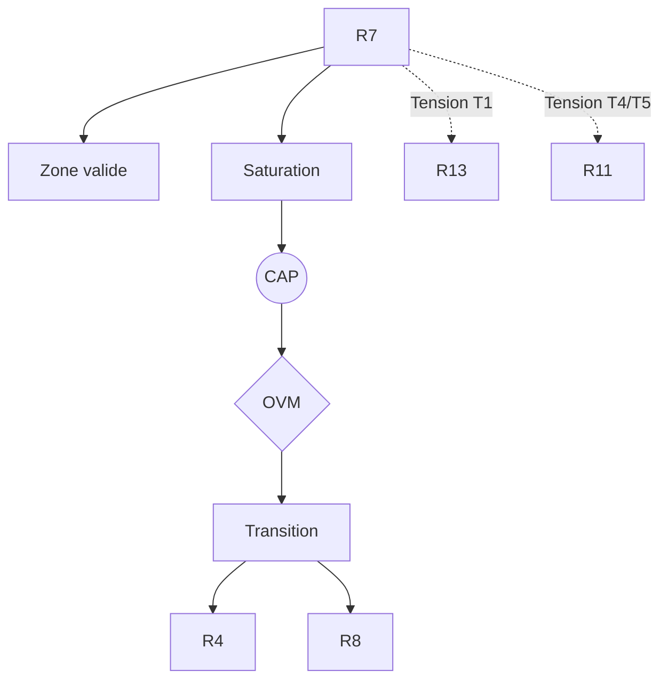

R7 — Préconditions du comportement (Maturana / Varela)

0. Identification

- Numéro : R7
- Nom : Préconditions du comportement / Couplage structurel
- Famille : biologique
- Type : Régime de couplage
- Statut : Irréductible / localement valide

---

1. Définition

Ce régime formalise l'infrastructure matérielle, l'intégrité métabolique et la clôture opérationnelle (autopoïèse) indispensables à toute activité organisée et à tout comportement. Il capture le mode d'existence du vivant où l'organisme et le milieu co-dérivent mutuellement, les perturbations externes agissant comme de simples déclencheurs des dynamiques internes sans transfert d'information instructive directe. 

Ce régime constitue un mode spécifique de stabilisation descriptive.

Il ne décrit pas une substance, un objet ou une région ontologique du réel, mais une manière particulière de sélectionner des invariants et de maintenir des distinctions opératoires.

Contraintes de rédaction

- ne pas réduire ce régime à un autre ;
- ne pas introduire de hiérarchie implicite ;
- ne pas présupposer une causalité globale ;
- éviter les formulations ontologiquement inflationnistes.

---

1.bis. Ancrages théoriques

Ce régime est stabilisé, documenté ou audité par les références suivantes.

📚 Stabilisateurs principaux

Francisco J. Varela (avec Humberto Maturana)

- Référence : references/varela.md
- Statut : Stabilisateur de régime
- Apport opératoire :
  Introduction des concepts d'autopoïèse, d'énaction et de clôture opérationnelle. Varela fournit l'infrastructure théorique fondamentale du versant *Proto* (l'Espace des causes). Sa théorie permet de stabiliser des invariants purement biologiques et comportementaux, expliquant comment une unité maintient sa viabilité homéostatique sans recourir à un métalangage normatif ou représentationnel.
- Tensions associées :
  T3 (Tension d'échelle), T4 (Tension normative), T8 (Tension d'auto-inclusion).

---

1.ter. Fonction interne du régime

Ce régime existe afin de rendre descriptibles les dynamiques de transition micro-physiques qui disparaîtraient si l'analyse commençait directement aux niveaux d'individuation cognitive supérieure ou au niveau institutionnel.

Sans ce régime, l'architecture perdrait la possibilité d'auditer les tentatives de réduction des niveaux supérieurs vers les seules dynamiques élémentaires.

Contribution principale à Protokin :

- Stabilisation de la clôture biologique et des conditions de viabilité.
- Cartographie des fondations matérielles causales (*Proto*) sur lesquelles s'élaborent les futurs couplages cognitifs.
- Point d'origine des tensions d'échelle (T3) et normatives (T4) face à l'émergence des codes symboliques et de la justification.

---

1.quater. Contrat de non-réification

Ce régime ne doit jamais être interprété comme :

- une entité ontologique autonome
- un niveau réel du monde
- une substance causale
- une explication ultime

Il constitue uniquement :

- un dispositif de sélection d’invariants
- une grille de stabilisation descriptive
- un mode local de lecture

Toute réification constitue une violation OVM (T1 / T11).

---

🛡 Garde-fous épistémologiques

Francisco J. Varela (L'inscription corporelle de l'esprit)

- Fonction : Garde-fou
- Règle de vigilance :
  L'OVM bloque toute tentative du cognitivisme symbolique classique ou de l'IA représentationnelle forte de nier l'enracinement corporel (embodiment). Les comportements ne sont pas des calculs décontextualisés, mais relèvent de la préservation d'une intégrité autopoïétique. Symétriquement, l'OVM interdit le réductionnisme physicaliste naïf (T1) qui nierait la clôture organisationnelle propre à l'unité vivante.

---

2. Invariants opératoires

Le régime sélectionne préférentiellement les stabilités suivantes :

- Maintien de l'intégrité métabolique minimale
- Conservation des gradients énergétiques exploitables
- Cohérence fonctionnelle et clôture opérationnelle des systèmes biologiques
- Stabilisation des conditions de viabilité

Définition

Un invariant est une stabilité relationnelle reproductible à l'intérieur du régime.

Exemples :

- régularité de transition
- boucle de rétroaction
- norme instituée
- engagement déontique
- structure dissipative

---

3. Mode de couplage observateur–système

Ce régime définit une manière particulière de :

- percevoir l'autonomie biologique par la clôture opérationnelle
- découper le réel en termes d'unités autopoïétiques et de perturbations déclenchantes
- sélectionner des invariants comme étant des seuils de viabilité plutôt que des actions finalisées
- stabiliser des distinctions par le maintien de la capacité même à agir et à exister

Caractéristiques

- Le comportement est dérivé de conditions de possibilité biologiques.
- Les invariants sont identifiés à des limites de survie/viabilité.
- La stabilité est définie comme l'évitement de la désintégration de l'unité.

Angle mort structurel

Pour fonctionner, ce régime doit nécessairement ignorer :

- Les comportements eux-mêmes perçus comme des objets cognitifs autonomes doués de sens abstrait.
- Les dimensions normatives, logiques ou discursives associées à la justification de ces comportements.

---

4. Domaine de validité

Le régime est pertinent lorsque :

- Le système observé est un organisme vivant ou une structure bio-assimilable (autopoïétique).
- Les conditions de viabilité sont fortement contraintes par des flux matériels et des gradients énergétiques.
- Les processus internes sont strictement nécessaires à la possibilité d'action et d'interaction physique.

Frontières descriptives

Le régime devient insuffisant lorsque :

- L'observation s'oriente vers des régimes cognitifs autonomes nécessitant l'émergence d'un monde d'objets (R4–R6).
- L'analyse porte sur des justifications et des régimes normatifs fonctionnant indépendamment de la pure stricte viabilité biologique (R11, R13).

Violations typiques détectées par l'OVM :

- Réduction abusive (T1) : vouloir épuiser l'explication des règles sociales humaines par la seule théorie évolutive et autopoïétique.
- Erreur modale d'échelle (T3) : lier directement un réseau moléculaire à un code symbolique sans médiation.

---

4.bis. Conditions d’illégitimité (OVM)

Le régime devient illégitime si :

- un invariant est transformé en entité ontologique
- une corrélation est interprétée comme causalité globale
- un niveau supérieur est réduit à ce régime sans perte
- une norme est dérivée d’un fait causal sans médiation

Violations associées :

- T1 — Réduction
- T3 — Saut d’échelle
- T11 — Compression inter-régime
- T13 — Collapsus normatif

---

5. Conditions de saturation

Le régime devient instable lorsque :

- Les pures conditions de viabilité ne suffisent plus à expliquer la structuration complexe du comportement ou de la cognition.
- L'activité de l'organisme dépasse les contraintes de simple survie pour intégrer l'intersubjectivité et la culture.
- Les dynamiques relationnelles deviennent essentiellement symboliques ou normatives.

Symptômes observables :

- perte de pouvoir explicatif
- multiplication des exceptions
- apparition de tensions non résolues
- nécessité de nouveaux invariants

Tensions fréquemment associées :

- T3 (Tension d'échelle)
- T4 (Tension normative)
- T8 (Tension d'auto-inclusion liée aux paradoxes de la clôture)

---

5.bis. Matrice de saturation

Indicateurs de saturation :

- augmentation des exceptions descriptives
- instabilité des invariants sélectionnés
- besoin d’un niveau explicatif supérieur
- incohérences multi-échelles

Seuil critique :

≥ 2 indicateurs actifs → déclenchement CAP

---

6. Relations avec les autres régimes

Compatibilités partielles

- R2 — Dissipation structurée : Support thermodynamique, les gradients énergétiques (R2) rendent matériellement possible le maintien de la clôture biologique (R7).
- R3 — Ajustement allostatique : Modélise la régulation dynamique proactive qui sauvegarde concrètement les conditions de viabilité de R7.

Traductions stables

- R7 ↔ R10 : Le couplage biologique d'une unité à son milieu forme la racine matérielle de la dérive des pratiques et des comportements itérés (Maturana).

Frictions cartographiées

- R4 — Compétence topographique : L'émergence d'invariants comportementaux stabilisés comme objets n'est pas intégralement réductible aux préconditions métaboliques.
- R5 — Minimisation de la surprise : Reformulation purement informationnelle et bayésienne des conditions de viabilité de la biologie.

Incompatibilités structurelles

- R11 — Rupture épistémologique : Le déplacement vers l'espace des raisons (justifications et propositions normatives) est rigoureusement incommensurable avec la simple viabilité causale (T4).

---

6.bis. Tensions constitutives

Ce régime existe parce qu’il rend visibles certaines tensions fondamentales.

Sans elles, il perd sa nécessité descriptive.

Tensions constitutives

- T1 (Tension de réduction)
- T4 (Tension normative)

Fonction de ces tensions

Ces tensions garantissent l'architecture duale de Protokin. Le régime R7 s'ancre si solidement dans l'ordre causal (le maintien métabolique) qu'il fait jaillir par contraste (via T4) l'impossibilité de déduire la norme morale ou la raison logique du seul impératif de survie cellulaire.

---

7. Traductions inter-régimes

Vu depuis R4 (Compétence topographique)

Les préconditions biologiques de viabilité deviennent les contraintes invisibles et structurelles sous-jacentes à la libre construction d'une cartographie sensorimotrice et d'objets perceptifs.

Vu depuis R5 (Minimisation de la surprise)

La persistance de la clôture autopoïétique et des seuils de viabilité de R7 est intégralement reformulée comme une série de contraintes forçant l'organisme à minimiser l'erreur prédictive par rapport à son milieu.

Important

- ne sont pas des équivalences
- ne sont pas des réductions
- ne permettent pas de fusion des régimes

---

8. Dynamique d’audit (CAP + OVM)

Lorsqu’une saturation est détectée, le Cycle d’Audit Protokin (CAP) est déclenché.

Diagnostic possible

- Tension principale : T4 (Normative)
- Tension secondaire : T3 (Échelle) ou T1 (Réduction)

Transitions fréquemment observées

- R7 → R4 par émergence (formation d'objets topographiques hors de la pure réactivité vitale).
- R7 → R8 par émergence (bascule de la viabilité biologique isolée vers l'intentionnalité partagée pré-linguistique, nécessitant un nouveau régime d'attention conjointe).

Hiérarchie des transitions autorisées

- Niveau 1 : Réinterprétation
- Niveau 2 : Émergence
- Niveau 3 : Rupture
- Niveau 4 : Blocage OVM

Rôle de l’OVM

L’OVM ne crée pas les limites du régime.

Il détecte les violations de frontières descriptives. Ici, il s'assure par le "Garde-fou G8" que des modèles purement normatifs (R13) ne viennent pas être justifiés, sans médiation, par l'évolution autopoïétique de R7, marquant une barrière stricte contre le naturalisme béhavioriste radical.

---

9. Micro-graphe local

---

10. Résumé opératoire

Ce régime capture : L'infrastructure biologique, la clôture opérationnelle (autopoïèse) et les préconditions métaboliques de l'action.

Il sélectionne : Le maintien de l'intégrité minimale et l'exploitation des gradients énergétiques viables.

Il observe via : La co-dérive réactive avec le milieu et la stabilisation des seuils de survie.

Il ignore structurellement : Les comportements intentionnels comme objets abstraits, la représentation symbolique forte, et les raisons logico-normatives (le pôle Kin).

Il devient instable lorsque : L'explication du couplage exige des invariants d'interaction symboliques, sociaux ou normatifs qui transcendent les limites de la seule survie cellulaire.

Les tensions dominantes sont : T1, T3, T4, T8.

---

11. Notes épistémologiques

Statut ontologique

Non requis.

Le régime n’est pas une substance ni un niveau du réel.

Statut épistémique

Local

Contextuel

Révisable

Statut relationnel

Déterminé par le couplage observateur–système (clôture opérationnelle).

Principe fondamental

Un régime ne décrit pas le monde.

Il décrit une manière stable de décrire le monde.

---

12. Métadonnées

Fichier : R7_preconditions_comportement.md

Connexions principales : R2, R3, R4, R5, R8, R11

Tensions dominantes : T1, T3, T4, T5, T8

Niveau de transition : Moyen

Dernière révision : 2026-06-13

---

13. Validation récursive (CAP ↔ OVM)

Chaque régime est valide uniquement si :

ses transitions CAP sont cohérentes

ses tensions OVM ne sont pas court-circuitées

ses invariants restent stables sous changement d’échelle

aucune réduction illégitime n’est effectuée

Toute incohérence déclenche :

requalification du régime

ou révision des tensions associées
