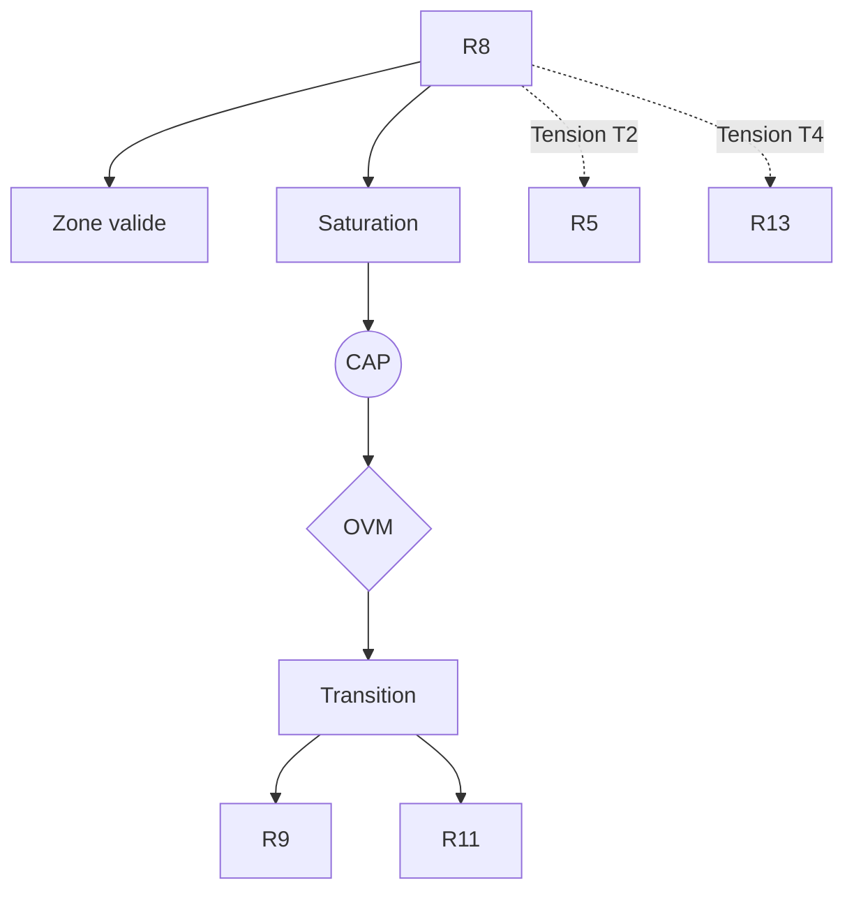

R8 — Intentionnalité partagée (Tomasello)

0. Identification

- Numéro : R8
- Nom : Intentionnalité partagée
- Famille : socio-développemental
- Type : Régime de couplage
- Statut : Irréductible / localement valide

---

1. Définition

Ce régime formalise l'infrastructure dyadique et la coordination pré-verbale entre plusieurs agents, théorisée sous le concept d'« intentionnalité partagée » ou de « mode-Nous » (*We-mode*). Il décrit la manière dont les individus stabilisent une focalisation croisée sur un objet ou un but commun, constituant le maillon évolutif et ontogénétique essentiel qui fait passer l'organisme d'une sentience causale à la matrice de la sapience humaine. La coopération y est modélisée non pas comme une simple agrégation d'intérêts individuels, mais comme une action conjointe où les rôles sont interchangeables et l'attention mutuellement reconnue.

Ce régime constitue un mode spécifique de stabilisation descriptive.

Il ne décrit pas une substance, un objet ou une région ontologique du réel, mais une manière particulière de sélectionner des invariants et de maintenir des distinctions opératoires.

Contraintes de rédaction

- ne pas réduire ce régime à un autre ;
- ne pas introduire de hiérarchie implicite ;
- ne pas présupposer une causalité globale ;
- éviter les formulations ontologiquement inflationnistes.

---

1.bis. Ancrages théoriques

Ce régime est stabilisé, documenté ou audité par les références suivantes.

📚 Stabilisateurs principaux

Michael Tomasello

- Référence : references/tomasello.md
- Statut : Stabilisateur de régime
- Apport opératoire :
  Introduction des concepts d'attention conjointe et d'intentionnalité partagée. Démontre que la coopération humaine repose sur la formation d'un "mode-Nous" pré-linguistique orienté vers des buts partagés, fournissant ainsi l'infrastructure développementale nécessaire pour l'émergence de la culture et du langage.
- Tensions associées :
  Tension de traduction (T2), Tension d'échelle (T3), Tension de dérive inter-temporelle (T10).

Michael Bratman (approches cognitivistes classiques)

- Référence : references/bratman.md
- Statut : Frontière inter-régime / Générateur de tension
- Apport opératoire :
  Les modèles hyper-intellectualistes de l'intention collective (comme la version de Bratman appliquée au développement) servent de contre-modèle, car ils supposent des capacités de méta-représentation récursive trop lourdes pour de jeunes enfants, soulignant la nécessité d'une modélisation ancrée dans l'action (Tomasello).
- Tensions associées :
  Tension de rétroprojection (T6).

---

1.ter. Fonction interne du régime

Ce régime existe afin de rendre descriptibles les dynamiques de transition micro-physiques qui disparaîtraient si l'analyse commençait directement aux niveaux d'individuation ou de cognition.

Sans ce régime, l'architecture perdrait la possibilité d'auditer les tentatives de réduction des niveaux supérieurs vers les seules dynamiques élémentaires.

Contribution principale à Protokin :

- Stabilisation de la coordination sociale et du triangle attentionnel.
- Cartographie du pont évolutif et développemental fondamental entre la pure biologie (R7) et la normativité culturelle et linguistique (R9, R11, R13).
- Point d'origine des tensions T2 et T4 face à l'optimisation individuelle ou aux normes abstraites.

---

1.quater. Contrat de non-réification

Ce régime ne doit jamais être interprété comme :

- une entité ontologique autonome
- un niveau réel du monde
- une substance causale
- une explication ultime

Il constitue uniquement :

- un dispositif de sélection d’invariants
- une grille de stabilisation descriptive
- un mode local de lecture

Toute réification constitue une violation OVM (T1 / T11).

---

🛡 Garde-fous épistémologiques

Michael Tomasello (Contre l'hyper-intellectualisme)

- Fonction : Garde-fou
- Règle de vigilance :
  L'OVM bloque toute tentative de projeter des capacités de méta-représentation logique récursive (propres aux adultes maîtrisant le langage, R11/R13) sur la simple attention conjointe des enfants pré-verbaux ou sur les fondations de l'interaction (violation T6). L'intentionnalité partagée doit être strictement modélisée comme une coordination de l'action située.

---

2. Invariants opératoires

Le régime sélectionne préférentiellement les stabilités suivantes :

- Le triangle attentionnel conjoint (Agent A, Agent B, Objet X) maintenant un couplage informationnel synchrone.
- L'interchangeabilité des rôles (persistance de la structure de l'action conjointe lorsque les agents permutent leurs fonctions).
- Les fins partagées (*Joint Goals*) (représentations pré-discursives d'un état final du système).
- Le repère attentionnel partagé (l'objet commun stabilisé comme référent invariant validé par la reconnaissance mutuelle).

Définition

Un invariant est une stabilité relationnelle reproductible à l'intérieur du régime.

Exemples :

- régularité de transition
- boucle de rétroaction
- norme instituée
- engagement déontique
- structure dissipative

---

3. Mode de couplage observateur–système

Ce régime définit une manière particulière de :

- percevoir l'autre agent comme un partenaire coopératif, et non comme un simple élément de l'environnement physique.
- découper le réel en opportunités d'action conjointe et en référents partagés.
- sélectionner des invariants fondés sur la validation croisée et la reconnaissance mutuelle de l'attention.
- stabiliser des distinctions par la convergence des ajustements dynamiques vers un but commun.

Caractéristiques

- Couplage triadique synchrone (Agent-Agent-Objet).
- Émergence du "mode-Nous" (*We-mode*).
- Transformation du regard d'autrui en indice déictique partagé.

Angle mort structurel

Pour fonctionner, ce régime doit nécessairement ignorer :

- L'abstraction propositionnelle (L'Espace des Raisons) : Il est incapable de formuler ou de valider des justifications logiques décontextualisées.
- Les concepts détachés de l'interaction pragmatique et physique immédiate.

---

4. Domaine de validité

Le régime est pertinent lorsque :

- Le système est composé d'au moins deux agents dotés d'une compétence topographique (R4) et d'un système de valence fonctionnel (R12).
- Les canaux de communication pré-linguistiques (coordination oculaire, gestes déictiques) sont actifs et non saturés par du bruit.
- L'environnement offre des opportunités de rétroaction immédiate permettant de valider l'alignement des buts.

Frontières descriptives

Le régime devient insuffisant lorsque :

- La coordination doit s'étendre à des échelles de temps et d'espace qui dépassent l'interaction physique directe et synchrone.
- L'interaction nécessite la formulation de lois de validation logique ou d'engagements sémantiques révisables (R11, R13).

Violations typiques détectées par l'OVM :

- Réduction abusive (T1) : affirmer que la coopération n'est qu'un calcul d'optimisation égoïste dicté par la génétique (écrasement sur R7).
- Compression inter-régime (T11) : fusionner l'attention conjointe enfantine (R8) et l'institution inférentielle adulte (R13) sans transition explicite.
- Erreur modale d'intellectualisation (T6).

---

4.bis. Conditions d’illégitimité (OVM)

Le régime devient illégitime si :

- un invariant est transformé en entité ontologique
- une corrélation est interprétée comme causalité globale
- un niveau supérieur est réduit à ce régime sans perte
- une norme est dérivée d’un fait causal sans médiation

Violations associées :

- T1 — Réduction
- T3 — Saut d’échelle
- T11 — Compression inter-régime
- T13 — Collapsus normatif

---

5. Conditions de saturation

Le régime devient instable lorsque :

- L'activité commune requiert une pérennisation qui survit à la séparation physique des agents (nécessité d'une mémoire cumulative).
- Les interactions font face à des défaillances de coordination nécessitant l'arbitrage de règles publiques impersonnelles.
- Le groupe dépasse la taille où la synchronisation dyadique ou triadique directe est soutenable.

Symptômes observables :

- perte de pouvoir explicatif
- multiplication des exceptions
- apparition de tensions non résolues
- nécessité de nouveaux invariants (tels que les artefacts culturels ou les mots)

Tensions fréquemment associées :

- T2 (Traduction avec l'optimisation bayésienne R5)
- T10 (Dérive inter-temporelle vers R9)
- T4 (Tension normative face à R13)

---

5.bis. Matrice de saturation

Indicateurs de saturation :

- augmentation des exceptions descriptives
- instabilité des invariants sélectionnés
- besoin d’un niveau explicatif supérieur
- incohérences multi-échelles

Seuil critique :

≥ 2 indicateurs actifs → déclenchement CAP

---

6. Relations avec les autres régimes

Compatibilités partielles

- R4 — Compétence topographique : L'intentionnalité partagée s'appuie sur la capacité à stabiliser des invariants par l'action, en l'étendant pour en faire un invariant pour *deux* observateurs.
- R5 — Minimisation de la surprise : Le couplage triadique réduit mutuellement l'erreur prédictive en rendant le comportement du partenaire hautement saillant.

Traductions stables

- R8 ↔ R9 : L'attention conjointe permet l'apprentissage mimétique fidèle qui sédimente les artefacts (le cliquet culturel R9).

Frictions cartographiées

- R10 — Couplage structurel : Le couplage biologique avec l'environnement immédiat peut entrer en conflit avec les exigences de l'alignement attentionnel social (gradients de survie vs but partagé).
- R12 — Évaluation thimique : Les urgences affectives primitives peuvent perturber ou briser brutalement la stabilité du triangle attentionnel.

Incompatibilités structurelles

- R1 — Cinétique protonique : Incompatibilité d'échelle et de registre. La dynamique des flux ioniques fondamentaux ignore structurellement la notion d'agent, d'attention ou de "Nous".

---

6.bis. Tensions constitutives

Ce régime existe parce qu’il rend visibles certaines tensions fondamentales.

Sans elles, il perd sa nécessité descriptive.

Tensions constitutives

- T2 (Tension de traduction)
- T3 (Tension d'échelle)

Fonction de ces tensions

Ces tensions garantissent l'autonomie du pôle socio-développemental. La T2 démontre l'écart qualitatif entre un comportement optimisé pour minimiser la surprise individuelle (R5) et l'établissement d'une véritable cible d'attention conjointe. La T3 prouve que le "mode-Nous" ne se déduit pas organiquement d'un métabolisme cellulaire (R7), nécessitant un régime descriptif propre.

---

7. Traductions inter-régimes

Vu depuis R4 (Compétence topographique)

L'intentionnalité partagée n'est pas une "fusion d'esprits", mais un cas particulier d'*Eigen-behavior* récursif complexe, où le comportement d'un autre observateur est traité comme une perturbation réglée que le système doit stabiliser pour maintenir ses propres invariants.

Vu depuis R13 (Institution inférentielle)

Le triangle attentionnel est relu comme la matrice pré-cursive et purement comportementale des engagements implicites. Le "but commun" est la version embryonnaire d'une responsabilité partagée qui n'a pas encore accès au statut de proposition logiquement révisable et contestable.

Important

- ne sont pas des équivalences
- ne sont pas des réductions
- ne permettent pas de fusion des régimes

---

8. Dynamique d’audit (CAP + OVM)

Lorsqu’une saturation est détectée, le Cycle d’Audit Protokin (CAP) est déclenché.

Diagnostic possible

- Tension principale : T2 (Traduction, face à R5)
- Tension secondaire : T10 (Dérive temporelle, face à R9)

Transitions fréquemment observées

- R8 → R9 par émergence (bascule vers le cliquet culturel pour pérenniser les innovations de coordination au-delà de l'interaction immédiate).
- R8 → R11 par rupture (saut sémantique vers l'espace des raisons par l'acquisition du langage propositionnel).

Hiérarchie des transitions autorisées

- Niveau 1 : Réinterprétation
- Niveau 2 : Émergence
- Niveau 3 : Rupture
- Niveau 4 : Blocage OVM

Rôle de l’OVM

L’OVM ne crée pas les limites du régime.

Il détecte les violations de frontières descriptives. L'OVM s'assure fermement que les notions d'engagements logiques et d'obligations normatives propres aux adultes (R13) ne soient pas rétroprojetées (T6) sur la dynamique d'attention conjointe pré-linguistique, imposant le respect des conditions matérielles et locales du couplage R8.

---

9. Micro-graphe local

---

10. Résumé opératoire

Ce régime capture : La stabilisation triadique de l'attention et des buts communs entre plusieurs agents pré-linguistiques.

Il sélectionne : Le triangle attentionnel, l'interchangeabilité des rôles et le repère attentionnel partagé.

Il observe via : Le couplage attentionnel croisé, la lecture d'indices déictiques et la synchronisation comportementale sur un tiers objet.

Il ignore structurellement : L'abstraction propositionnelle, les justifications normatives abstraites et les cadres légitimes de révisabilité conceptuelle (l'Espace des raisons).

Il devient instable lorsque : La coordination doit s'étendre à des échelles de temps et d'espace qui dépassent l'interaction physique directe et synchrone des agents.

Les tensions dominantes sont : T2, T3, T4, T10.

---

11. Notes épistémologiques

Statut ontologique

Non requis.

Le régime n’est pas une substance ni un niveau du réel. L'intersubjectivité n'est pas une substance, mais une propriété géométrique de la dérive coordonnée des descriptions.

Statut épistémique

Local.

Contextuel.

Révisable.

Statut relationnel

Défini par le double couplage observateur–observateur–système (co-construction de la première strate de réalité publique).

Principe fondamental

Un régime ne décrit pas le monde.

Il décrit une manière stable de décrire le monde.

---

12. Métadonnées

Fichier : R8_intentionnalite_partagee_tomasello.md

Connexions principales : R4, R5, R7, R9, R11, R13

Tensions dominantes : T2, T3, T4, T6, T10

Niveau de transition : Moyen

Dernière révision : 2026-06-13

---

13. Validation récursive (CAP ↔ OVM)

Chaque régime est valide uniquement si :

ses transitions CAP sont cohérentes

ses tensions OVM ne sont pas court-circuitées

ses invariants restent stables sous changement d’échelle

aucune réduction illégitime n’est effectuée

Toute incohérence déclenche :

requalification du régime

ou révision des tensions associées
