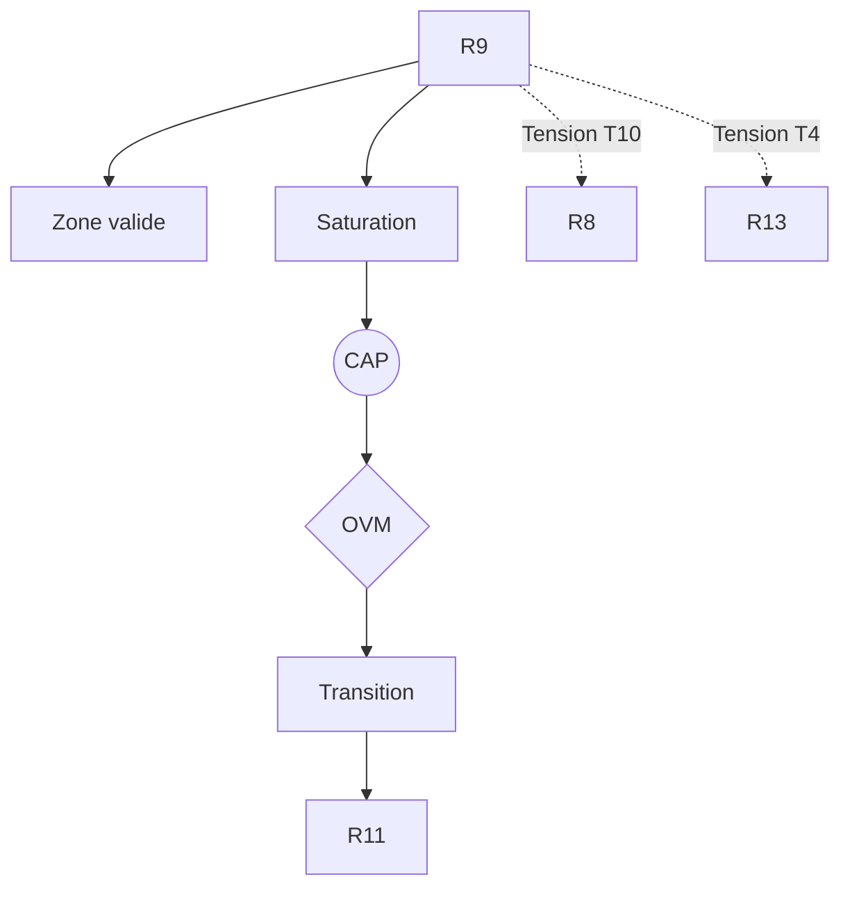

R9 — Effet cliquet culturel

0. Identification

- Numéro : R9
- Nom : Effet cliquet culturel (Tomasello)
- Famille : socio-développemental
- Type : Régime de couplage
- Statut : Irréductible / localement valide

---

1. Définition

Ce régime formalise l'accumulation non réversible et la sédimentation historique des innovations comportementales, techniques et sémiotiques au sein d'une population d'agents. L'effet cliquet empêche le glissement ou la dégradation descriptive des invariants partagés face aux fluctuations de l'environnement ou à la disparition des inventeurs initiaux. Il introduit un mécanisme cybernétique où une pratique modifiée ou optimisée est stabilisée par le groupe, devenant la nouvelle ligne de base inchangée pour les générations d'observateurs futures. Il constitue l'appareil de mémoire collective et d'irréversibilité temporelle indispensable avant l'accès formel aux édifices normatifs.

Ce régime constitue un mode spécifique de stabilisation descriptive.

Il ne décrit pas une substance, un objet ou une région ontologique du réel, mais une manière particulière de sélectionner des invariants et de maintenir des distinctions opératoires.

Contraintes de rédaction

- ne pas réduire ce régime à un autre ;
- ne pas introduire de hiérarchie implicite ;
- ne pas présupposer une causalité globale ;
- éviter les formulations ontologiquement inflationnistes.

---

1.bis. Ancrages théoriques

Ce régime est stabilisé, documenté ou audité par les références suivantes.

📚 Stabilisateurs principaux

Michael Tomasello

- Référence : references/tomasello.md
- Statut : Stabilisateur de régime
- Apport opératoire :
  Introduction de l'effet cliquet culturel comme mécanisme d'accumulation socio-historique empêchant la dégradation de l'information. Il démontre que la coopération humaine et l'imitation fidèle permettent la sédimentation des pratiques, constituant le pont entre la pure biologie (R7) et la normativité culturelle (R11, R13).
- Tensions associées :
  T10 (Dérive inter-temporelle), T3 (Tension d'échelle).

Michael Bratman

- Référence : references/bratman.md
- Statut : Frontière inter-régime / Générateur de tension
- Apport opératoire :
  Fournit le contre-modèle hyper-intellectualiste de l'intention collective, postulant des capacités de méta-représentation récursive trop lourdes, soulignant par contraste la nécessité du modèle d'apprentissage culturel situé et incrémental de Tomasello.
- Tensions associées :
  T6 (Rétroprojection).

---

1.ter. Fonction interne du régime

Ce régime existe afin de rendre descriptibles les dynamiques de transition micro-physiques qui disparaîtraient si l'analyse commençait directement aux niveaux d'individuation ou de cognition.

Sans ce régime, l'architecture perdrait la possibilité d'auditer les tentatives de réduction des niveaux supérieurs vers les seules dynamiques élémentaires.

Contribution principale à Protokin :

- Stabilisation de la mémoire collective et des artefacts sédimentés.
- Cartographie du pont évolutif et historique fondamental empêchant le recul des innovations.
- Point d'origine des tensions T10 (dérive inter-temporelle) et T3 (échelle).

---

1.quater. Contrat de non-réification

Ce régime ne doit jamais être interprété comme :

- une entité ontologique autonome
- un niveau réel du monde
- une substance causale
- une explication ultime

Il constitue uniquement :

- un dispositif de sélection d’invariants
- une grille de stabilisation descriptive
- un mode local de lecture

Toute réification constitue une violation OVM (T1 / T11).

---

🛡 Garde-fous épistémologiques

Michael Tomasello

- Fonction : Garde-fou
- Règle de vigilance :
  L'OVM bloque toute tentative d'expliquer les institutions complexes humaines (R13) directement par une adaptation biologique (R7) sans passer par l'étape de l'accumulation lente et de l'apprentissage par reproduction fidèle qui caractérise le cliquet culturel.

---

2. Invariants opératoires

Le régime sélectionne préférentiellement les stabilités suivantes :

- La transmission mimétique fidèle et non réversible.
- Les artefacts sédimentés légués par les générations antérieures.
- Les standards comportementaux trans-générationnels.
- L'irréversibilité temporelle des innovations techniques et sémiotiques.

Définition

Un invariant est une stabilité relationnelle reproductible à l'intérieur du régime.

Exemples :

- régularité de transition
- boucle de rétroaction
- norme instituée
- engagement déontique
- structure dissipative

---

3. Mode de couplage observateur–système

Ce régime définit une manière particulière de :

- percevoir historiquement
- découper le réel par les artefacts
- sélectionner des invariants sédimentés
- stabiliser des distinctions générationnelles

Caractéristiques

- Perception instrumentée : le réel est découpé à travers le filtre de techniques et d'outils légués.
- Récursion de l'apprentissage : l'imitation vise la fidélité de la reproduction de la forme stabilisée de l'artefact.
- Irradiation temporelle : les invariants acquièrent une durée de vie autonome dépassant le cycle de vie somatique de l'agent.

Angle mort structurel

Pour fonctionner, ce régime doit nécessairement ignorer :

- Les critères de vérité logique, le droit à la contradiction conceptuelle et la révisabilité rationnelle des croyances formelles.
- L'innovation instantanée déconnectée de la base héritée.

---

4. Domaine de validité

Le régime est pertinent lorsque :

- Une population d'agents dispose de l'intentionnalité partagée (R8) permettant l'imitation fidèle.
- Le système accumule des outils, pratiques et sémiotiques conservés au-delà des inventeurs initiaux.
- L'apprentissage social ne souffre pas d'une perte d'information excessive (glissement de la ligne de base).

Frontières descriptives

Le régime devient insuffisant lorsque :

- Les coutumes accumulées entrent en conflit interne nécessitant une justification rationnelle ou logique.
- Les pratiques culturelles doivent être requalifiées en raisons explicites (R11) pour fonder un espace de droit.

Violations typiques détectées par l'OVM :

- Réduction abusive (T1) de la culture historique à la pure cinétique ou génétique.
- Compression inter-régime (T11) : confondre le comportement hérité du cliquet avec l'engagement sémantique volontaire (R13).
- Erreur modale d'échelle (T3) : écraser le développement de l'enfant (ontogenèse) sur la très longue sédimentation historique (phylogenèse) sans précaution.

---

4.bis. Conditions d’illégitimité (OVM)

Le régime devient illégitime si :

- un invariant est transformé en entité ontologique
- une corrélation est interprétée comme causalité globale
- un niveau supérieur est réduit à ce régime sans perte
- une norme est dérivée d’un fait causal sans médiation

Violations associées :

- T1 — Réduction
- T3 — Saut d’échelle
- T11 — Compression inter-régime
- T13 — Collapsus normatif

---

5. Conditions de saturation

Le régime devient instable lorsque :

- Les coutumes accumulées deviennent trop complexes pour être arbitrées sans lois de validation logique.
- Les artefacts ou pratiques hérités génèrent massivement des erreurs prédictives (R5) face à de nouveaux états environnementaux.
- Les conflits générationnels exigent une révisabilité rationnelle des croyances.

Symptômes observables :

- perte de pouvoir explicatif
- multiplication des exceptions
- apparition de tensions non résolues
- nécessité de nouveaux invariants (normes explicites, institutions logiques)

Tensions fréquemment associées :

- T10 (Dérive inter-temporelle)
- T3 (Tension d'échelle)
- T4 (Tension normative face à R13)

---

5.bis. Matrice de saturation

Indicateurs de saturation :

- augmentation des exceptions descriptives
- instabilité des invariants sélectionnés
- besoin d’un niveau explicatif supérieur
- incohérences multi-échelles

Seuil critique :

≥ 2 indicateurs actifs → déclenchement CAP

---

6. Relations avec les autres régimes

Compatibilités partielles

- R8 — Intentionnalité partagée : Zone de recouvrement essentielle. R8 fournit le triangle attentionnel nécessaire pour apprendre l'utilisation d'un outil, et R9 verrouille cet apprentissage dans le temps.
- R6 — Récursion prospective : Le groupe utilise le passé accumulé par le cliquet pour simuler et outiller ses interactions futures.

Traductions stables

- R8 ↔ R9 : L'attention conjointe permet l'apprentissage mimétique fidèle qui sédimente les artefacts.
- R9 ↔ R13 : Le catalogue d'artefacts culturels fournit la matière pré-réflexive de la structure discursive.

Frictions cartographiées

- R3 — Ajustement allostatique : L'inertie des innovations culturelles figées par le cliquet entre en tension avec la flexibilité rapide exigée par les paramètres biologiques de survie.
- R5 — Minimisation de la surprise : Le cliquet peut forcer la réplication d'une pratique désuète, augmentant la surprise variationnelle au lieu de la réduire.

Incompatibilités structurelles

- R1 — Cinétique protonique : Incompatibilité absolue. La dérive historique n'a aucun sens sur la physique des gradients matériels.

---

6.bis. Tensions constitutives

Ce régime existe parce qu’il rend visibles certaines tensions fondamentales.

Sans elles, il perd sa nécessité descriptive.

Tensions constitutives

- T10 (Dérive inter-temporelle)
- T3 (Tension d'échelle)

Fonction de ces tensions

Ces tensions garantissent l'autonomie du pôle socio-développemental en montrant la progression temporelle cumulative. La Tension T10 met en évidence que l'évolution des outils et de la culture (R9) est une sédimentation historique qui s'arrache à la pure coordination instantanée de R8 sans pour autant constituer immédiatement une institution logique (R13). 

---

7. Traductions inter-régimes

Vu depuis R5 (Minimisation de la surprise)

L'effet cliquet culturel est traduit comme un mécanisme macroscopique de réduction de la surprise. En standardisant les comportements à travers les générations, le système stabilise des *priors* (hypothèses a priori) collectifs hautement fiables qui rendent l'environnement social prédictible.

Vu depuis R11 (Rupture épistémologique)

L'accumulation culturelle est vue comme une sédimentation d'habitudes causales performantes, mais elle reste une forme de « Donné » tant qu'elle n'a pas été brisée et justifiée normativement dans l'Espace des Raisons.

Important

- ne sont pas des équivalences
- ne sont pas des réductions
- ne permettent pas de fusion des régimes

---

8. Dynamique d’audit (CAP + OVM)

Lorsqu’une saturation est détectée, le Cycle d’Audit Protokin (CAP) est déclenché.

Diagnostic possible

- Tension principale : T10 (Dérive temporelle, face à R8)
- Tension secondaire : T4 (Normative, face aux régimes logiques R11/R13)

Transitions fréquemment observées

- R9 → R11 par rupture normative : Bascule vers la rupture épistémologique pour requalifier les habitudes culturelles en raisons logiques révisables.
- R8 → R9 par émergence : Bascule de l'interaction immédiate vers la sédimentation historique pour pérenniser l'innovation.

Hiérarchie des transitions autorisées

- Niveau 1 : Réinterprétation
- Niveau 2 : Émergence
- Niveau 3 : Rupture
- Niveau 4 : Blocage OVM

Rôle de l’OVM

L’OVM ne crée pas les limites du régime.

Il détecte les violations de frontières descriptives. Il intervient pour empêcher la réduction de la justice ou des vérités logiques (R13/R14) à un pur "effet de cliquet" historique, forçant le chercheur à diagnostiquer la rupture nécessaire (T5/T4) entre une habitude culturelle robuste et un véritable engagement sémantique.

---

9. Micro-graphe local

---

10. Résumé opératoire

Ce régime capture : L'accumulation cumulative et irréversible des innovations et des pratiques au sein d'une lignée d'observateurs.

Il sélectionne : Les artefacts sédimentés, les normes d'usage transmises mimétiquement et les standards comportementaux trans-générationnels.

Il observe via : La transmission mimétique fidèle et l'apprentissage des formes stabilisées.

Il ignore structurellement : Les critères de vérité logique, le droit à la contradiction conceptuelle et la révisabilité rationnelle des croyances.

Il devient instable lorsque : Les coutumes accumulées entrent en conflit interne ou deviennent trop complexes pour être arbitrées sans lois de validation logique.

Les tensions dominantes sont : T3, T4, T10.

---

11. Notes épistémologiques

Statut ontologique

Non requis.

Le régime n’est pas une substance ni un niveau du réel. La culture n'est pas un substrat, mais l'irréversibilité géométrique d'une dérive descriptive partagée.

Statut épistémique

Local

Contextuel

Révisable

Statut relationnel

Déterminé par le couplage historique entre la mémoire des artefacts et la plasticité de la population.

Principe fondamental

Un régime ne décrit pas le monde.

Il décrit une manière stable de décrire le monde.

---

12. Métadonnées

Fichier : R9_effet_cliquet_culturel_tomasello.md

Connexions principales : R6, R8, R10, R11, R13

Tensions dominantes : T3, T4, T10

Niveau de transition : Moyen

Dernière révision : 2026-06-13

---

13. Validation récursive (CAP ↔ OVM)

Chaque régime est valide uniquement si :

ses transitions CAP sont cohérentes

ses tensions OVM ne sont pas court-circuitées

ses invariants restent stables sous changement d’échelle

aucune réduction illégitime n’est effectuée

Toute incohérence déclenche :

requalification du régime

ou révision des tensions associées
